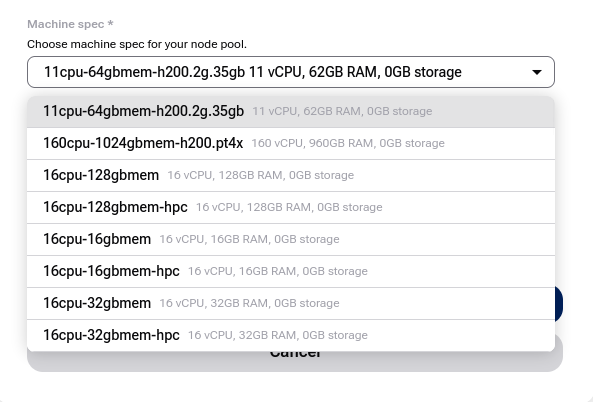

Upgrade Managed Kubernetes cluster on |brand-name|
==================================================

You can upgrade your |MK8s| cluster to the next available minor Kubernetes version. The upgrade is performed in a rolling manner, which helps keep applications and services available while cluster components are being updated.

Before upgrading, review application compatibility with the target Kubernetes version, confirm that backups are in place, and make sure that the cluster is healthy.

.. raw:: html

   <h2>What we are going to cover</h2>

.. contents::
   :depth: 2
   :local:
   :backlinks: none

Prerequisites
-------------

.. jinja:: brand_names

   **1. Hosting account on {{ brand_name }}**

   To use |MK8s|, you need:

   * your general {{ brand_name }} account {{ brand_name_site_auth_link }}
   * access to the |MK8s| dashboard at https://{{ mk8s_url }}

.. jinja:: brand_names

   No. 2 **Supported {{ MK8s }} region**

Upgrade availability is checked in the region where the cluster is running. Make sure that you are working with the correct region in the |MK8s| dashboard.

.. jinja:: mk8s_regions

   

   Available |MK8s| regions for {{ brand_name }}:

   

   * **{{ region.display_name }}**

   

   

.. jinja:: brand_names

   **3. Backup**

   Create or verify a backup before upgrading. See :doc:`/kubernetes/Managed-Kubernetes-backups`.

**4. Application compatibility**

Review the target Kubernetes version before upgrading. Check whether your workloads, manifests, Helm charts, operators, CRDs, admission webhooks, storage integrations, and ingress configuration are compatible with the target version.

..
  .. jinja:: brand_names
..
  For more information about version availability and the Service-Active window, see :doc:`/kubernetes/Managed-Kubernetes-Version-Support-Model`.

Upgrading to a newer version of Managed Kubernetes
--------------------------------------------------

First, check whether a newer Kubernetes version is available for your cluster. If your cluster is already on the highest available version, the upgrade option is not offered.

.. jinja:: mk8s_images

   .. figure:: {{ mk8s074 }}
      :class: image-with-border

If an upgrade is available, open the cluster details page.

.. jinja:: mk8s_images

   .. figure:: {{ mk8s075 }}
      :class: image-with-border

Click **Upgrade to <version>** and confirm in the modal window.

.. jinja:: mk8s_images

   .. figure:: {{ mk8s076 }}
      :class: image-with-border

While the upgrade runs, the cluster status changes to |UPGRADING|.

.. jinja:: mk8s_images

   .. figure:: {{ mk8s077 }}
      :class: image-with-border

When the upgrade completes, the cluster returns to |RUNNING| and the Kubernetes version is updated in the cluster details.

.. jinja:: mk8s_images

   .. figure:: {{ mk8s078 }}
      :class: image-with-border

.. note::

   The **Upgrade** button remains active only if an even newer version is available.

   The downloaded **kubeconfig** remains valid across upgrades.

After the upgrade
-----------------

After the cluster returns to |RUNNING|, verify that the cluster and workloads are healthy.

Check the nodes:

.. code-block:: bash

   kubectl get nodes -o wide

All nodes should be in the **Ready** state and should report the expected Kubernetes version.

Check system workloads:

.. code-block:: bash

   kubectl get pods -A

Verify in particular that DNS, networking, storage-related components, ingress controllers, monitoring agents, and application workloads are running as expected.

Also verify:

* key applications and ingress endpoints work,
* persistent volumes are attached and available,
* application logs do not show new errors,
* monitoring and backup tools still work,
* autoscaling and node pools behave as expected.

Troubleshooting
---------------

If a workload does not behave as expected after the upgrade:

* check pod status with **kubectl get pods -A**,
* inspect failing pods with **kubectl describe pod**,
* review logs with **kubectl logs**,
* verify that CRDs, operators, admission webhooks, and Helm releases are compatible with the target Kubernetes version,
* compare the result with your pre-upgrade backup and application checks.

If the cluster itself does not return to a healthy state, contact Support and provide the cluster name, region, cluster ID, and the time when the upgrade was started.

What To Do Next
---------------

After a successful upgrade, keep monitoring the cluster for some time and review your backup policy.

.. jinja:: brand_names

   To understand the version lifecycle, see :doc:`/kubernetes/Managed-Kubernetes-Version-Support-Model`.

   To review responsibilities before future upgrades, see :doc:`/kubernetes/Managed-Kubernetes-Shared-Responsibility-Model`.

   To manage backups, see :doc:`/kubernetes/Managed-Kubernetes-backups`.