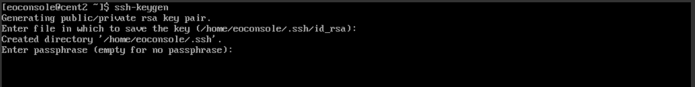
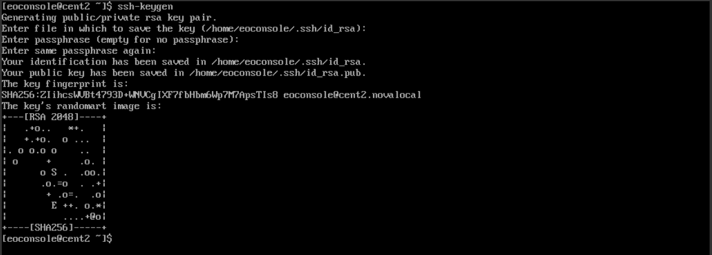

Generating an SSH keypair in Linux on |brand-name|
==================================================

In order to generate an SSH keypair in Linux, we recommend using the command **ssh-keygen**.

If system does not see this packet installed, install the latest updates:

Ubuntu and Debian family
   .. code::

      sudo apt-get update && apt-get install openssh-client

CentOS and Red Hat
   .. code::

      sudo yum install openssh-clients

After that, use the following command in terminal:

.. code::

   ssh-keygen

with additional flags:

-t
   rsa authentication key type
-b
   4096 bit length, 2048 if not specified. Available values: 1024, 2048, 4096.
   The greater the value, the more complicated the key will be.
-C
   *user@server* name for identification at the end of the file
-f
   ~/.ssh/keys/keylocation location of folder with ssh keys
-N
   passphrase, can be omitted if user prefers connecting without additional key security

Application will ask for the name of the key. Press **Enter** for defaults:

 * **id_rsa** for private and
 * **id_rsa.pub** for public key and passphrase (pressing **Enter** ignores it).

Next, **ssh-keygen** will show

 * location, where the keys are saved,
 * fingerprint of keypair and certain
 * semi-graphic image as expression of randomness in generating unique key.

To avoid problem with rejecting files due to too open permissions, navigate to the folder containing both keys and enter command:

.. code::

   chmod 600 id_rsa && chmod 600 id_rsa.pub

