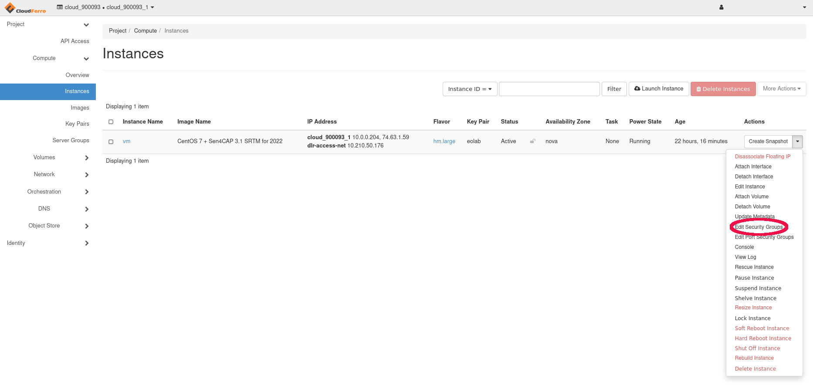

How can I open new ports for http for my service or instance on |brand-name|
============================================================================

To open a new port for a service on an instance, click Project -> Network -> Security Groups and click "Create Security Group".

By default, in the newly created group there will two Egress (outgoing) rules - for IPv4 and IPv6.

You need to create a new Ingress (incoming) rule that should look like this:

::

   Ingress IPv4 TCP 80 (HTTP) 0.0.0.0/0

After creating a new Security Group you have to add it to your instance.

To do so, simply click Project -> Compute -> Instances, then select "Edit Security Groups" and add it by clicking the "+" button.

