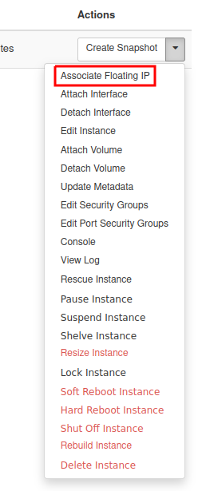
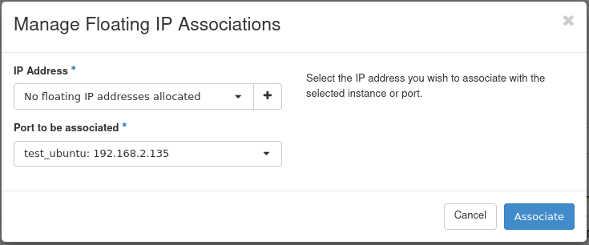
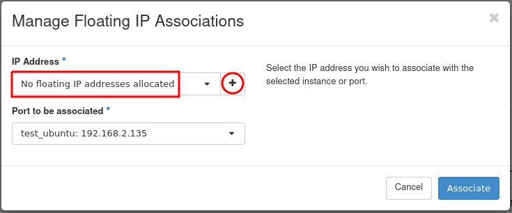
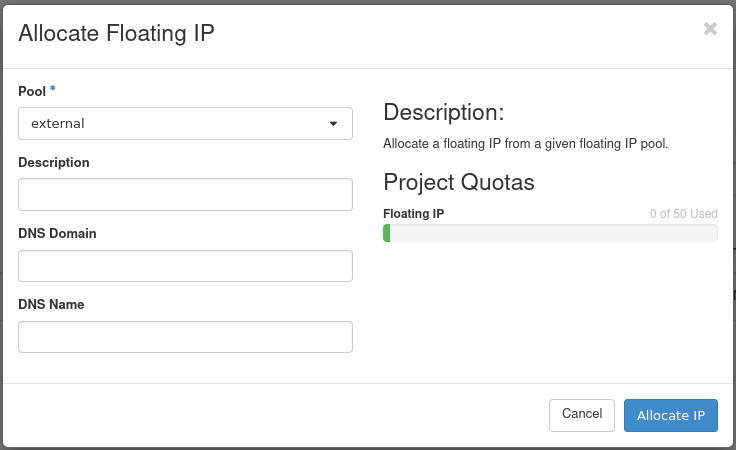
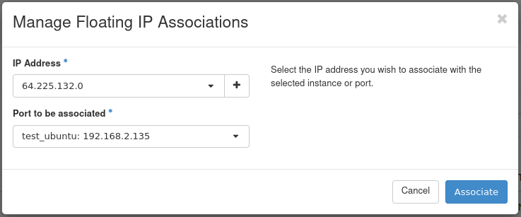
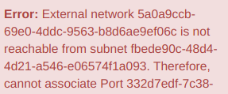
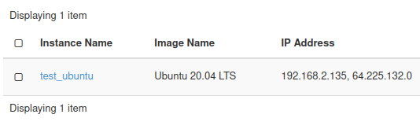
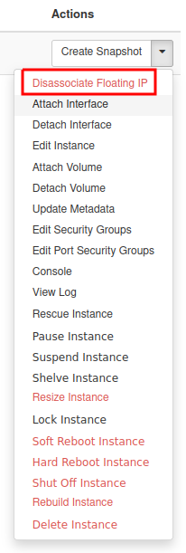
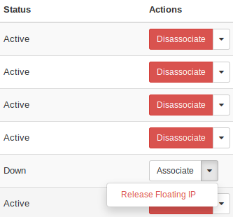

How to Add or Remove Floating IP’s to your VM on |brand-name|
=============================================================

In order to make your VM accessible from the Internet, you need to use Floating IPs. Floating IPs in OpenStack are public IP addresses assigned to your Virtual Machines. Assignment of a Floating IP allows you (if you have your Security Groups set properly) to host services like SSH or HTTP over the Internet.

How to assign a Floating IP to your VM?
---------------------------------------

In the Instances tab in Horizon, click the dropdown menu next to your VM and choose **Associate Floating IP**.

You will be shown a window like this:

You may choose an address from the dropdown menu, but if it's empty, you need to allocate an address first. Click the **+** icon on the right.

Click **Allocate IP**.

.. warning::

   Please always choose the *external* network!

Select your newly allocated IP address and click **Associate**.

.. note::

   The IP address should be associated with a local address from the **192.168.x.x** subnet. If you have a **10.x.x.x** address change it to an **192.168.x.x** address.

Click **Associate**.

.. note::

   The VM's communicate between themselves trough an internal network **192.168.x.x** so if you are connecting from one Virtual Machine to another
   you should use private addresses. If you try to connect your VM to the wrong network you will be notified by the following message:

You now have a public IP assigned to your instance. It is visible in the Instances menu:

You can now connect to your Virtual Machine trough SSH or RDP from the Internet.

How to disassociate a Floating IP?
----------------------------------

If you no longer need a public IP address you may disassociate it from your VM. Click **Dissasociate Floating IP** from the dropdown menu:

How to release a Floating IP (return it to the pool)?
-----------------------------------------------------

Floating IPs (just like any other OpenStack resource) have their cost when kept reserved and not used.

If you don't want to keep your Floating IP’s reserved for your project you may release them to the OpenStack pool for other users which will also reduce the costs of your project.

Go to Project → Network → Floating IPs

For the address that is not in use, the **Release Floating IP** option will be available. Click it to release the IP address.