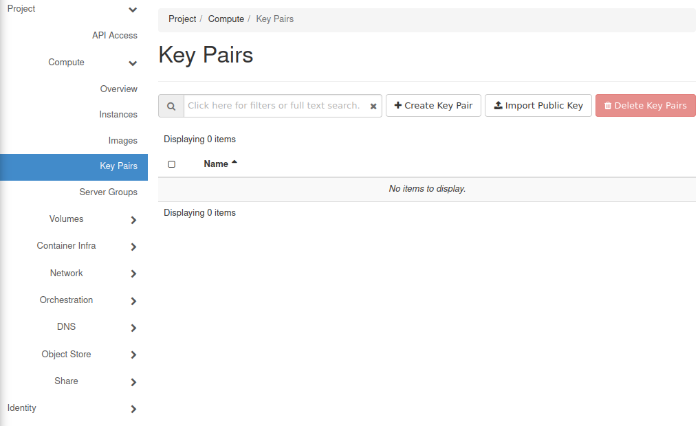
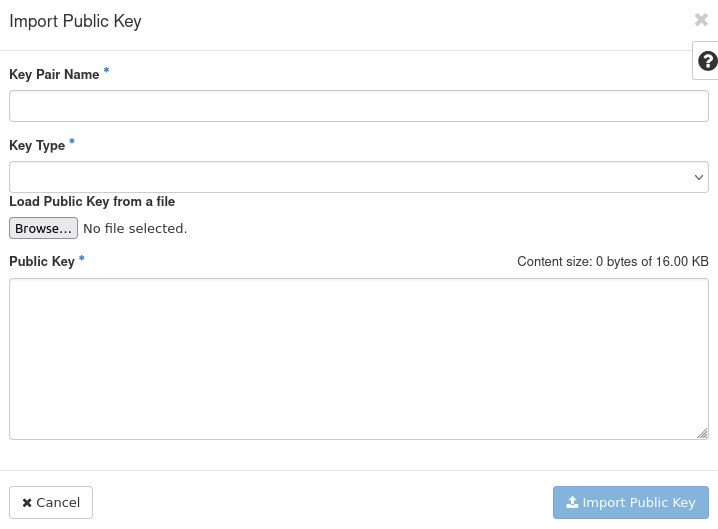
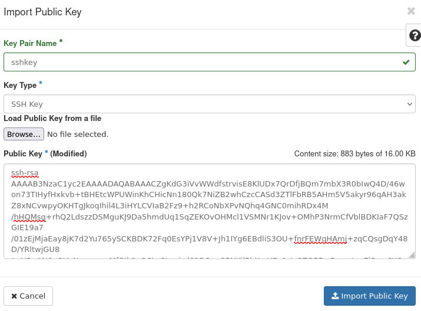
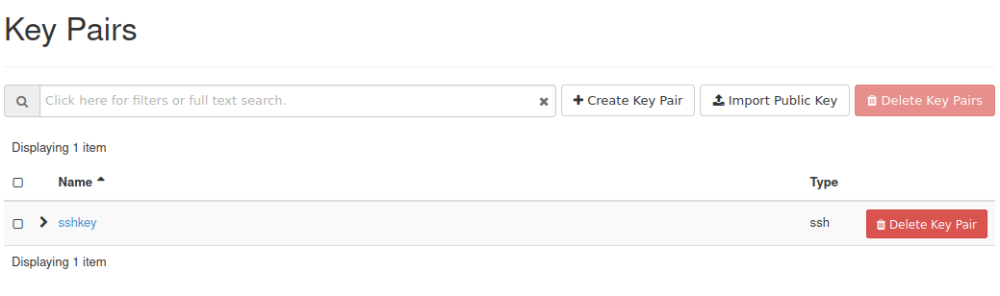

How to import SSH public key to OpenStack Horizon on |brand-name|
=================================================================

If you already have an SSH key pair on your computer, you can import your public key to the Horizon dashboard. Then, you will be able to use that imported key when launching a new instance.

By importing it directly to Horizon, you will eliminate the need to use tools like **ssh-copy-id** or manually edit the **authorized_keys** file. Also, your key will be available in OpenStack CLI.

.. jinja:: brand_names

   .. warning::

      After uploading your public key, you will not be able to apply it to an already created virtual machine. If you need to add a key to an existing VM, please follow this article instead: :doc:`/networking/How-to-add-SSH-key-from-Horizon-web-console-on-{{ brand_name_hyphen }}/How-to-add-SSH-key-from-Horizon-web-console-on-{{ brand_name_hyphen }}`.

.. note::

   You can have multiple SSH keys uploaded to your Horizon dashboard. You can then use them for different tasks.

What We Are Going To Cover
--------------------------

 * Preparation
 * Importing a Key

Prerequisites
-------------

No. 1 **Account**

You need a |brand-name| hosting account with access to the Horizon interface: |brand-name-site-link|.

No. 2 **Generated SSH key pair**

You need a generated SSH key pair on your computer. If you do not have one yet, you can create it by following one of these articles:

.. jinja:: brand_names

    * :doc:`/windows/How-To-Create-SSH-Key-Pair-In-Windows-On-{{ brand_name_hyphen }}/How-To-Create-SSH-Key-Pair-In-Windows-On-{{ brand_name_hyphen }}`

.. jinja:: brand_names

    * :doc:`/networking/Generating-a-SSH-keypair-in-Linux-on-{{ brand_name_hyphen }}/Generating-a-SSH-keypair-in-Linux-on-{{ brand_name_hyphen }}`

Step 1 Preparation
------------------

Make sure that your public key is available to you. If you have not yet generated it, please follow Prerequisite No. 2.

Login to the Horizon dashboard: |brand-name-site-link|.

Go to **Compute** -> **Key Pairs**. You should see the following screen:

Step 2 Importing a Key
----------------------

Click **Import Public Key**. The following window should appear:

Choose a name for that key and enter it in the **Key Pair Name** text field. In this example, we will call it **sshkey**.

From the drop-down menu **Key Type** choose **SSH Key**.

Click **Browse...**.

A file selector should appear. Its look will vary depending on your operating system and graphical environment. Choose your **public** key file there.

It should now appear in the **Public Key** text field:

Click **Import Public Key**.

The key should now be visible in the Horizon dashboard:

What To Do Next
---------------

Now that you have imported your key, it is time to use it for creation of virtual machines. Please check one of the following articles:

.. jinja:: brand_names

    * :doc:`/cloud/How-to-create-a-Linux-VM-and-access-it-from-Windows-desktop-on-{{ brand_name_hyphen }}/How-to-create-a-Linux-VM-and-access-it-from-Windows-desktop-on-{{ brand_name_hyphen }}`.

.. jinja:: brand_names

    * :doc:`/cloud/How-to-create-a-Linux-VM-and-access-it-from-Linux-command-line-on-{{ brand_name_hyphen }}/How-to-create-a-Linux-VM-and-access-it-from-Linux-command-line-on-{{ brand_name_hyphen }}`.

You can also use your key in the OpenStack CLI (for example during the creation of virtual machines). Please follow one of the following articles to get started:

.. jinja:: brand_names

    * :doc:`/openstackcli/How-to-install-OpenStackClient-for-Linux-on-{{ brand_name_hyphen }}/How-to-install-OpenStackClient-for-Linux-on-{{ brand_name_hyphen }}`

    * :doc:`/openstackcli/How-to-install-OpenStackClient-GitBash-or-Cygwin-for-Windows-on-{{ brand_name_hyphen }}/How-to-install-OpenStackClient-GitBash-or-Cygwin-for-Windows-on-{{ brand_name_hyphen }}`

    * :doc:`/openstackcli/How-to-install-OpenStackClient-on-Windows-using-Windows-Subsystem-for-Linux-on-{{ brand_name_hyphen }}-OpenStack-Hosting/How-to-install-OpenStackClient-on-Windows-using-Windows-Subsystem-for-Linux-on-{{ brand_name_hyphen }}-OpenStack-Hosting`