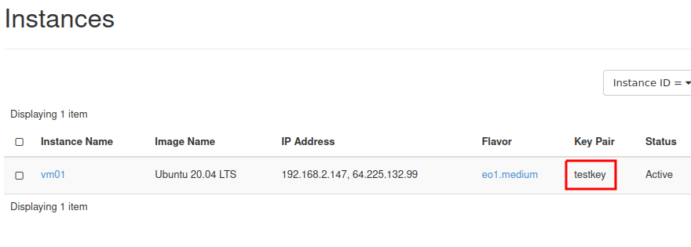
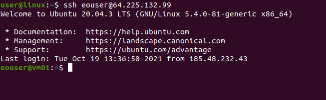

How to connect to your virtual machine via SSH in Linux on |brand-name|
=======================================================================

**1. Prerequisites:**

1.1. Private and public keys have been created. The key files were saved on the local disk of the VM you wish to connect to. It is recommended to put the keys in the **~/.ssh** folder.

1.2. During the VM setup, the generated key we want to use was assigned.

For example, when you create an SSH key named “**testkey**” in the Horizon dashboard, its name will appear next to your VM.

**2. Connecting to a virtual machine via SSH:**

.. jinja:: brand_names

   2.1. If your virtual machine has already been assigned a Floating IP (the instances menu next to your virtual machine lists the IP address) you can proceed to the next step. If not, please follow the guide: :doc:`/networking/How-to-Add-or-Remove-Floating-IPs-to-your-VM-on-{{ brand_name_hyphen }}/How-to-Add-or-Remove-Floating-IPs-to-your-VM-on-{{ brand_name_hyphen }}`.

2.2. Go to the **~/.ssh** folder where your SSH keys were saved to. Start your terminal (right click and click “Open in Terminal”).

2.3. Change the permissions of the private key file. In the case of the file named **id_rsa**, type:

.. code::

   sudo chmod 600 id_rsa

Enter your password and confirm.

2.4. Once you have completed all of the steps above, you can log in. Let us assume that your generated and assigned Floating IP address in this case is **64.225.132.99**. Execute the following command in the terminal:

.. code::

   ssh eouser@64.225.132.99

2.5. The username in the terminal will change to **eouser**. This means that the SSH connection was successful.

