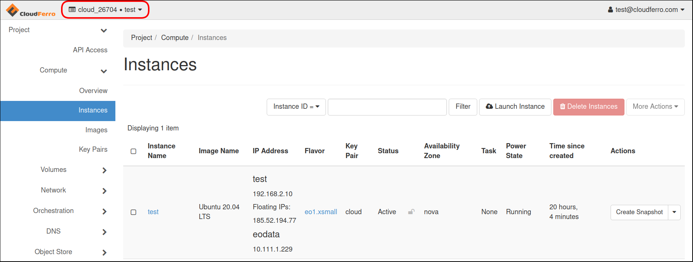
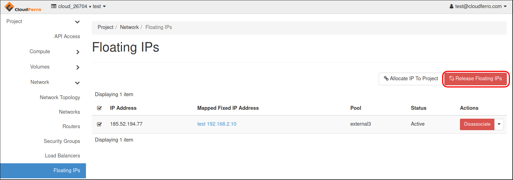
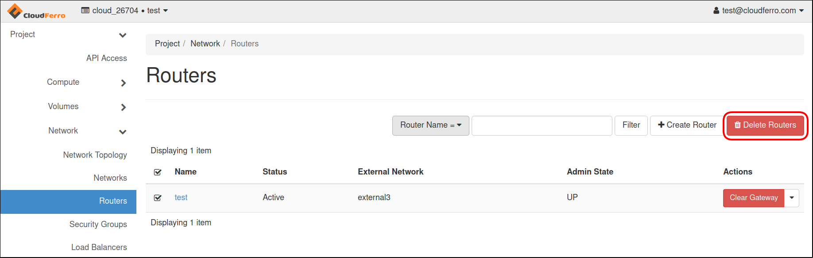
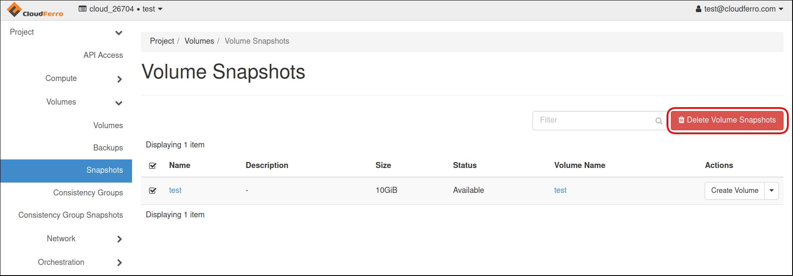
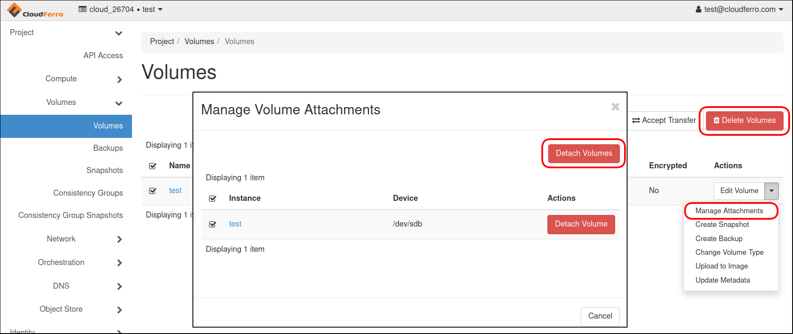
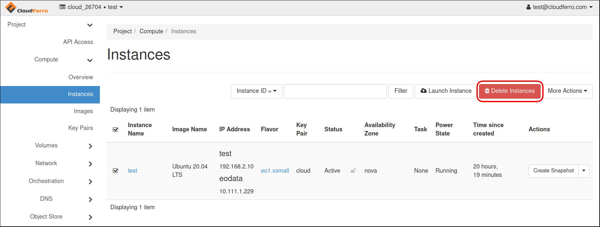
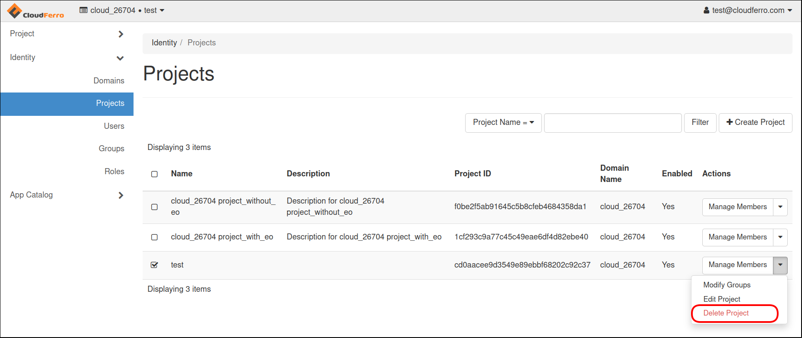

How to correctly delete all project resources via Horizon Dashboard on |brand-name|
===============================================================================================

The billing system on |brand-name| hosting will charge you for all the resources present in the system, regardless of you using them or not. You should delete the resources you are not going to use any more. Deleting the project before deleting its resources makes them *orphaned*. You will not be able to delete orphaned resources on your own but will continue paying for them.

.. warning::

   To correctly delete the resources and the project, **delete the resources first** and only then the project itself.

.. jinja:: brand_names

   This article describes how to delete resources via **OpenStack Horizon**. To delete them through OpenStack CLI commands, see :doc:`/networking/How-to-correctly-delete-all-the-resources-in-the-project-via-OpenStack-commandline-Clients-on-{{ brand_name_hyphen }}/How-to-correctly-delete-all-the-resources-in-the-project-via-OpenStack-commandline-Clients-on-{{ brand_name_hyphen }}`.

Choose the right project first
-------------------------------------

To start, enter the cloud environment as usual, via the link |brand-name-site-link|.

Note the name of the project in the left upper corner and switch to the right project, if needed.

1.Select **Network** → **Floating IPs** →  mark Floating IP and press **Release Floating IPs**.

2. Go to **Network** → **Router** → mark Router and press **Delete Routers**.

3. On the **Project** tab, open **Volumes** → **Snapshots** and delete all snapshots by marking and pressing **Delete Volumes Snapshots**.

4. Switch to **Volumes** and from drop-down list select **Manage Attachments**. Then press **Detach Volume**. Finally mark volumes and delete by pressing **Delete Volumes** at the right side.

5. Go to **Compute** → **Instances**. Select all instances and click **Delete Instances**.

6. At the end, select **Identity** → **Projects** and from the drop-down list select **Delete Project**.

