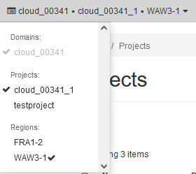
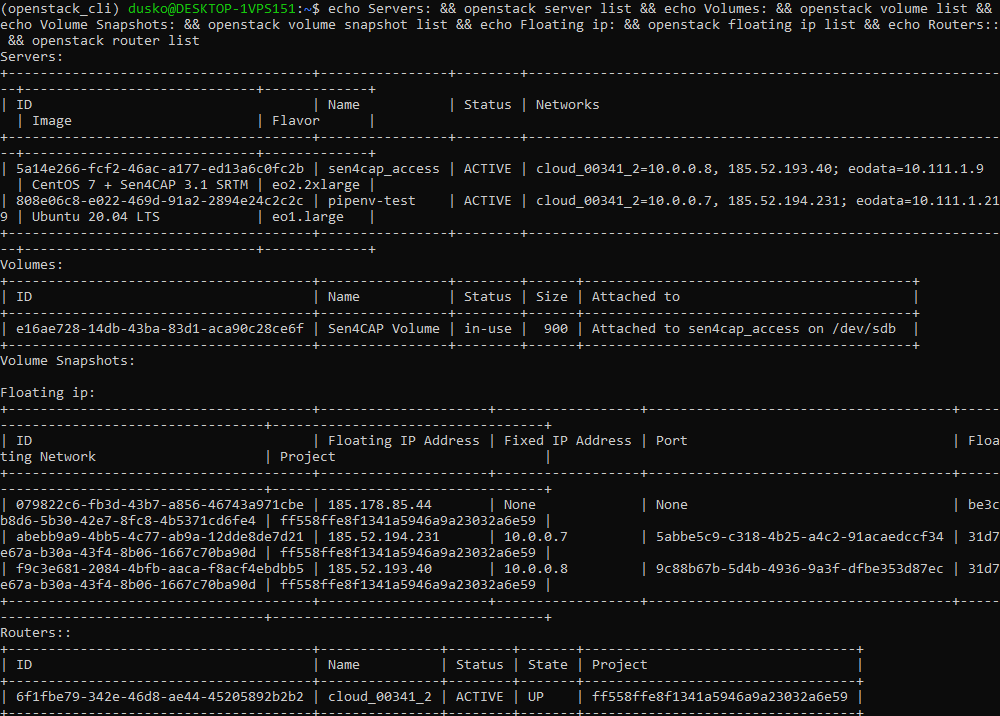
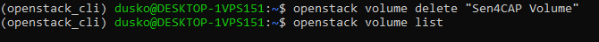
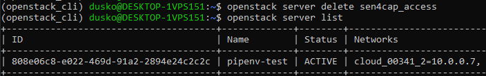
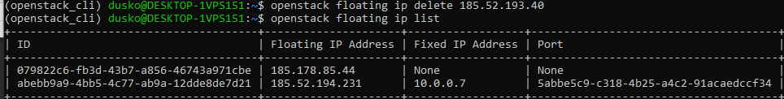
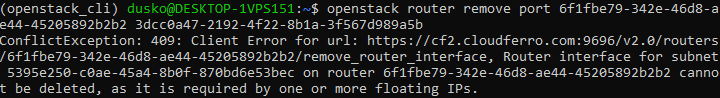
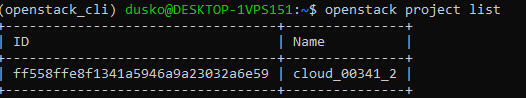
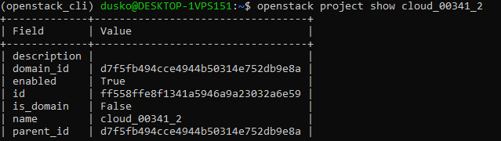
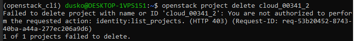

How to correctly delete all project resources using OpenStack command line clients on |brand-name|
========================================================================================================================

The billing system on |brand-name| hosting will charge you for all the resources present in the system, regardless of you using them or not. You should delete the resources you are not going to use any more. Deleting the project before deleting its resources makes them *orphaned*. You will not be able to delete orphaned resources on your own but will continue paying for them.

.. warning::

   To correctly delete the resources and the project, **delete the resources first** and only then the project itself.

.. jinja:: brand_names

   This article describes how to delete resources via **command line clients**. To delete them through Horizon commands, see :doc:`/networking/How-to-correctly-delete-all-the-resources-in-the-project-via-Horizon-Dashboard-on-{{ brand_name_hyphen }}/How-to-correctly-delete-all-the-resources-in-the-project-via-Horizon-Dashboard-on-{{ brand_name_hyphen }}`.

Choose the right project first
-------------------------------------

To start, enter the cloud environment as usual, via the link |brand-name-site-link|.

Note the name of the project in the left upper corner and switch to the right project, if needed. This is what it might look like:

If needed, prepare command line environment
-------------------------------------------------------

You may have the command line already up and running, but if not, prepare it as per one of this articles:

Windows
   .. jinja:: brand_names

       :doc:`/openstackcli/How-to-install-OpenStackClient-GitBash-or-Cygwin-for-Windows-on-{{ brand_name_hyphen }}/How-to-install-OpenStackClient-GitBash-or-Cygwin-for-Windows-on-{{ brand_name_hyphen }}`

       :doc:`/openstackcli/How-to-install-OpenStackClient-on-Windows-using-Windows-Subsystem-for-Linux-on-{{ brand_name_hyphen }}-OpenStack-Hosting/How-to-install-OpenStackClient-on-Windows-using-Windows-Subsystem-for-Linux-on-{{ brand_name_hyphen }}-OpenStack-Hosting`

Linux
   .. jinja:: brand_names

      :doc:`/openstackcli/How-to-install-OpenStackClient-for-Linux-on-{{ brand_name_hyphen }}/How-to-install-OpenStackClient-for-Linux-on-{{ brand_name_hyphen }}`

Gain access to the cloud
----------------------------------

To gain access to the cloud, see this:

.. ifconfig:: brand_name in two_fa_activated

    .. jinja:: brand_names

       .. jinja:: doc_links

     :doc:`{{ openstack_cli_auth }}`

.. ifconfig:: brand_name not in two_fa_activated

    .. ifconfig:: brand_name != 'WEkEO'

       .. jinja:: brand_names

           :doc:`/accountmanagement/How-to-activate-OpenStack-CLI-access-to-{{ brand_name_hyphen }}-cloud/How-to-activate-OpenStack-CLI-access-to-{{ brand_name_hyphen }}-cloud`

    .. ifconfig:: brand_name == 'WEkEO'

       :doc:`/accountmanagement/How-to-activate-OpenStack-CLI-access-to-WEkEO-cloud-using-Federated-IDP-authorization-and-application-credentials`

List all the resources in a project
--------------------------------------------

The project will most often contain:

 * servers
 * volumes
 * floating IPs and
 * routers.

List those resources in the project by entering the commands below:

.. code::

    echo Servers: && openstack server list && echo Volumes: && openstack volume list && echo Volume Snapshots: && openstack volume snapshot list && echo Floating ip: && openstack floating ip list && echo Routers:: && openstack router list

Here is the result:

We see that there are two servers, **sen4cap_access** and **pipenv-test**. The former has a volume **Sen4CAP Volume** attached to it so the first step is to delete that (and any other) volume.

Detach volume from servers
--------------------------------------

First detach volumes from servers. The general command would be:

.. code::

    openstack server remove volume <server_id> <volume_id>

and, in our case:

.. code::

   openstack server remove volume 5a14e266-fcf2-46ac-a177-ed13a6c0fc2b e16ae728-14db-43ba-83d1-aca90c28ce6f

Make sure, that your volume does not have any volume snapshots -- list them using the command:

.. code::

   openstack volume snapshot list

Otherwise type command and delete the snapshot as well:

.. code::

    openstack volume delete snapshot <volume_snapshot_id>

Delete the volume
---------------------------

Now you can delete the volume.

.. code::

    openstack volume delete <volume_id>

An empty row after the list command shows that there are no more volumes left:

After that you are able to delete the server.

.. code::

    openstack server delete <server_id>

Delete the floating IP
---------------------------------

Then delete the floating IP.

.. code::

    openstack floating ip delete <floating_ip_id>

Delete the router
----------------------

Finally you can delete the router. First show its basic information with the command:

.. code::

   openstack router show 6f1fbe79-342e-46d8-ae44-45205892b2b2 -f json

Due to parameter **-f json**, the output will be in JSON form, for easier orientation:

.. code::

    {
      "admin_state_up": true,
      "availability_zone_hints": null,
      "availability_zones": null,
      "created_at": "2022-04-27T07:05:57Z",
      "description": "",
      "enable_ndp_proxy": null,
      "external_gateway_info": {
        "network_id": "31d7e67a-b30a-43f4-8b06-1667c70ba90d",
        "enable_snat": true,
        "external_fixed_ips": [
          {
            "subnet_id": "bfb8ab78-0208-4e0c-8b66-9421b70ee798",
            "ip_address": "185.52.195.234"
          }
        ]
      },
      "flavor_id": null,
      "id": "6f1fbe79-342e-46d8-ae44-45205892b2b2",
      "interfaces_info": [
        {
          "port_id": "3dcc0a47-2192-4f22-8b1a-3f567d989a5b",
          "ip_address": "10.0.0.1",
          "subnet_id": "5395e250-c0ae-45a4-8b0f-870bd6e53bec"
        }
      ],
      "name": "cloud_00341_2",
      "project_id": "ff558ffe8f1341a5946a9a23032a6e59",
      "revision_number": 3,
      "routes": [],
      "status": "ACTIVE",
      "tags": [],
      "tenant_id": "ff558ffe8f1341a5946a9a23032a6e59",
      "updated_at": "2022-04-27T07:06:07Z"
    }

Now remove the port, the subnet and, finally, the router itself:

.. code::

    openstack router remove port <router_id> <port_id>
    openstack router remove subnet <router_id> <subnet_id>
    openstack router delete <router_id>

It will often not be possible to delete the resources if they are a part of the several networks or subnets. In particular, port may belong to several networks at once, preventing you from deleting *all* of the resources of a project. In this example, a router cannot be deleted as "it is required by one or more floating IPs":

To overcome that will require some detective work; only after all the connections are broken, will OpenStack let you delete a resource. However and as mentioned in the beginning of this article, the command to delete a project will work on its own and it may leave the system with resources without a parent and you will not be able to remove them on your own.

How to remove orphaned resources
------------------------------------------

If you need help in removing orphaned resources:

 * use commands **Project** --> **API Access** --> **User Credentials Details** and
 * copy the User Name, User ID, Project Name, as well as Project ID, then
 * send a request to the Support: :doc:`/accountmanagement/Help-Desk-And-Support/Help-Desk-And-Support`.

List and delete projects
--------------------------------

The command to list the projects is:

.. code::

   openstack project list

To list one particular project, the command is:

.. code::

   openstack project show cloud_00341_2

It looks like this:

After having deleted all the resources, you can try to delete the project with the command

.. code::

   openstack project delete cloud_00341_2

If not successful, you either do not have proper permissions or there still are several parts of a project that are not deleted yet. If there is only one project in the domain, you will also not be able to delete it:

