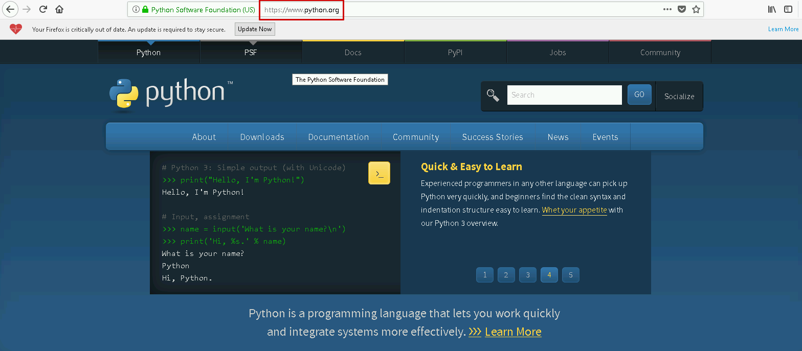
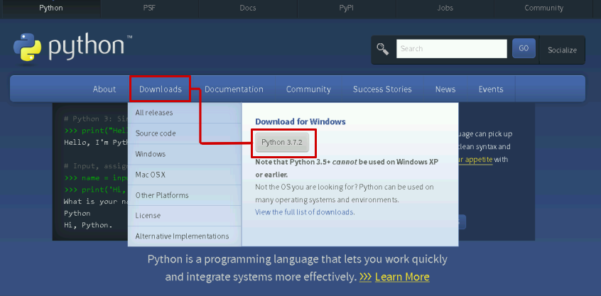
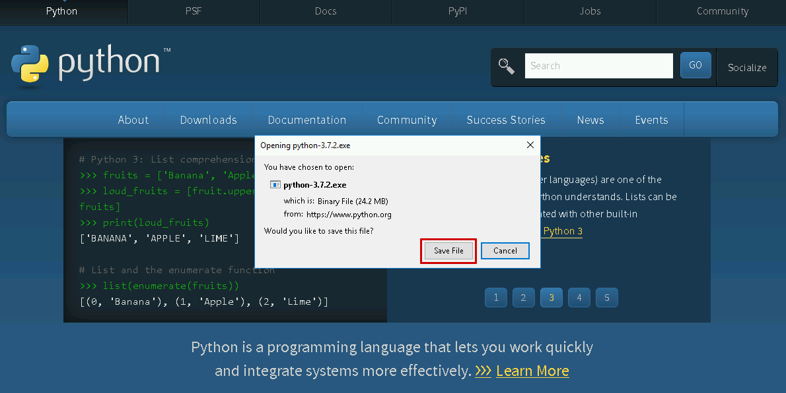
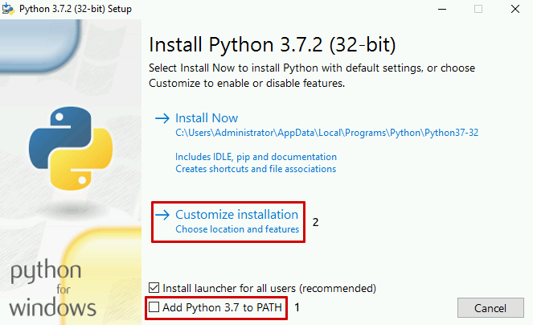
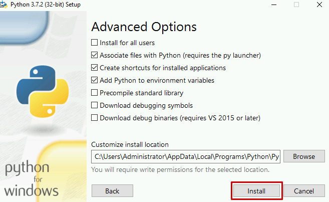
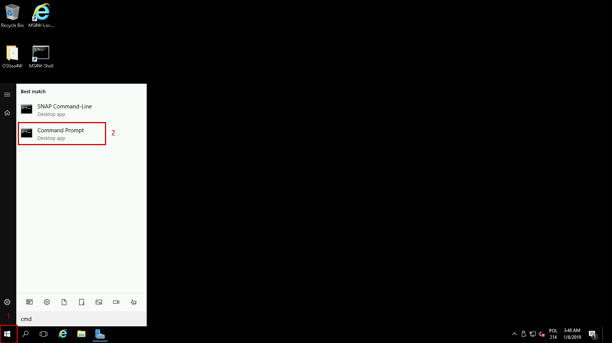
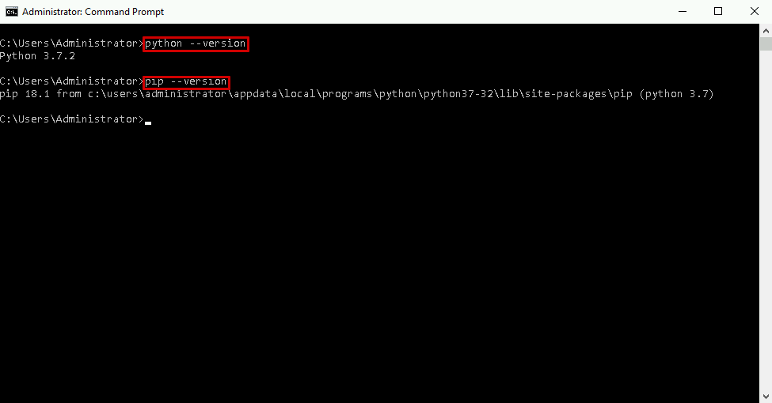

How to install Python in Windows on |brand-name|
==============================================================

Python installation is necessary in order to use **boto3** library.

In order to proceed a Python installation on Windows machine, please follow those steps:

1. Type in the https://www.python.org address in your browser.

2. Navigate to “Downloads” button at then choose the latest version of software. (Currently it is Python 3.7.2)

3. Save the exe file that consists of installation packages.

4. Open previously saved file and look at the prompt window. It is strongly recommended to tick **Add Python 3.7 to PATH**. This option provides new environment variables.

To obtain more control over installation choose “Customize installation”

5. In **Advances** options tab you may deliver more specific values such as debug libraries. After that, click on the **Install**.

6. Open the Command prompt by clicking on the “Start” button and typing in **cmd**.

To verify installation, use **python –version** and **pip --version** commands in order to check the current version of software.

