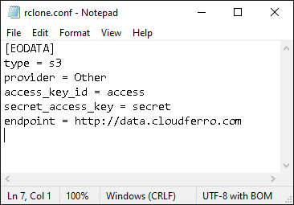
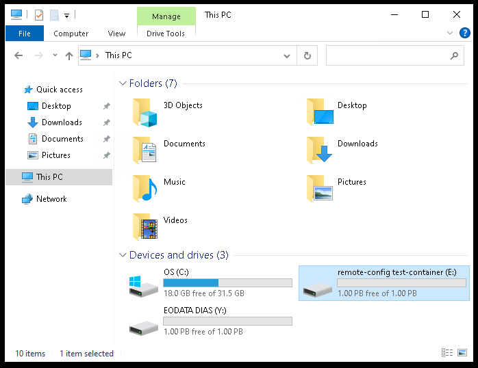
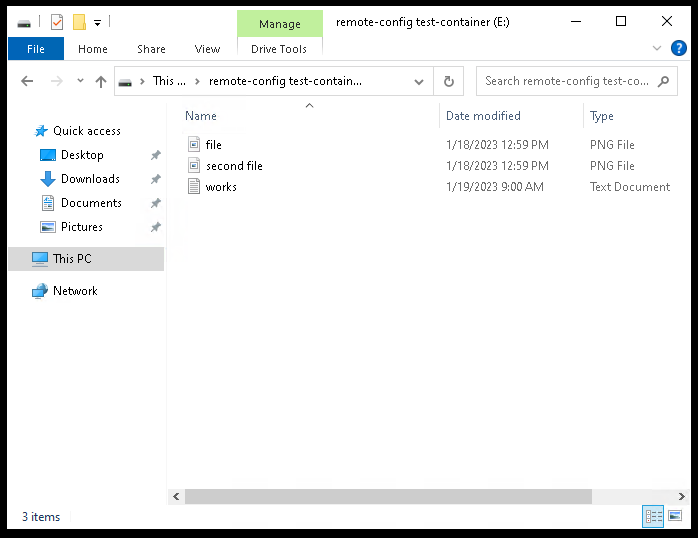
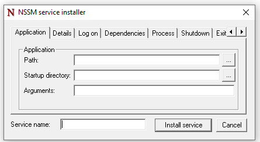
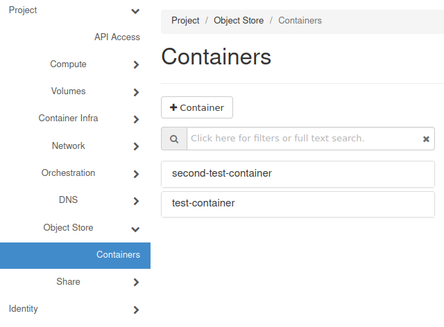

How To Mount Object Storage Container as File System on Windows VM on |brand-name|
==============================================================================================

This article covers configuring automatic mounting of object storage containers on Windows virtual machines running on |brand-name| |cloud-name| cloud. Your object storage containers will be automatically mounted to your Windows VM and you will be able to access them from **This PC** window of the **Administrator** user on that VM.

What We Are Going To Cover
-------------------------------

 * Entering the connection data
 * Performing a test mount
 * Finding the appropriate time to cache directory entries for
 * Setting automatic mounting for a container
 * Disabling the automatic mounting of a container

Prerequisites
--------------

No. 1 **Account**

You need a |brand-name| hosting account with access to the Horizon interface: |brand-name-site-link|.

No. 2. **Object storage container**

.. jinja:: brand_names

   You need at least one object storage container on the |brand-name| |cloud-name| cloud. If you do not have one yet, please follow this article: :doc:`/s3/How-to-use-Object-Storage-on-{{ brand_name_hyphen }}`

No. 3. **Generated EC2 Credentials**

.. jinja:: brand_names

   You need to generate EC2 credentials for your account. If you haven't done that yet, please follow this article: :doc:`/cloud/How-to-generate-ec2-credentials-on-{{ brand_name_hyphen }}/How-to-generate-ec2-credentials-on-{{ brand_name_hyphen }}`.

You will need to use the OpenStack CLI client to do that. The article linked above covers its installation on Linux. If you are a Windows user, please follow one of the articles linked below to install the OpenStack CLI client on Windows:

.. jinja:: brand_names

    * :doc:`/openstackcli/How-to-install-OpenStackClient-GitBash-or-Cygwin-for-Windows-on-{{ brand_name_hyphen }}/How-to-install-OpenStackClient-GitBash-or-Cygwin-for-Windows-on-{{ brand_name_hyphen }}`

.. jinja:: brand_names

    * :doc:`/openstackcli/How-to-install-OpenStackClient-on-Windows-using-Windows-Subsystem-for-Linux-on-{{ brand_name_hyphen }}-OpenStack-Hosting/How-to-install-OpenStackClient-on-Windows-using-Windows-Subsystem-for-Linux-on-{{ brand_name_hyphen }}-OpenStack-Hosting`

.. jinja:: brand_names

   Then, adjust the instructions from the article :doc:`/cloud/How-to-generate-ec2-credentials-on-{{ brand_name_hyphen }}/How-to-generate-ec2-credentials-on-{{ brand_name_hyphen }}` accordingly.

No. 4 **Virtual machine with Windows**

You need a Windows VM on |brand-name| |cloud-name| cloud with Rclone, WinFSP and NSSM configured.

There are three methods of fulfilling this prerequisite:

**Method 1: Create a new Windows virtual machine**
   Currently available Windows images have appropriate software (Rclone, WinFSP, NSSM) already preinstalled.

   .. jinja:: brand_names

      Use article :doc:`/cloud/How-to-create-new-Linux-VM-in-OpenStack-Dashboard-Horizon-on-{{ brand_name_hyphen }}/How-to-create-new-Linux-VM-in-OpenStack-Dashboard-Horizon-on-{{ brand_name_hyphen }}` as the basic blueprint for creation of an instance.

   Apply the following changes to the procedure in that article:

   For **Source**, use a Windows image.

   For **Networks**, be sure to add two networks, one starting with **cloud_** and the other starting with **eodata_**.

   If you do not want to access your instance outside of the Horizon dashboard, you may omit the following from the workflow described in that article:

    * creation of a floating IP,

    * using the **allow_ping_ssh_icmp_rdp security** group as well as

    * the instructions regarding the SSH connection.

   .. jinja:: brand_names

      The instructions regarding SSH connection from that article do not apply to Windows VMs. Virtual machines with Windows are typically controlled using RDP. If you choose this method, you might want to consider using bastion host forwarding to secure your connection: :doc:`/windows/Connecting-to-a-Windows-VM-via-RDP-through-a-Linux-bastion-host-port-forwarding-on-{{ brand_name_hyphen }}/Connecting-to-a-Windows-VM-via-RDP-through-a-Linux-bastion-host-port-forwarding-on-{{ brand_name_hyphen }}`

**Method 2: Use a virtual machine created using an image published on or after 20th of December 2022**
   If you already have a virtual machine created using an image published **on or after** 20th of December 2022, you should have appropriate software installed (unless a user later removed it). Therefore, you should be able to use one such machine for this article.

**Method 3: Use a machine created using an older image and install required software manually**
   .. jinja:: brand_names

      If you have a virtual machine created using an image published **before** 20th of December 2022, you will need to install and configure appropriate software manually. Information on how to do it can be found in **Method 1** of this article: :doc:`/eodata/How-to-mount-eodata-on-Windows-virtual-machine-on-{{ brand_name_hyphen }}-hosting`. If you do not want to have access to the **EODATA** repository on your virtual machine, you can finish following that article after having created **Rclone** configuration file in the **Mounting EODATA** section of that text (you do not need to add any content to it).

Software tools used in this article: Rclone, WinFSP, and NSSM
-------------------------------------------------------------

All the software used in this article comes preinstalled on |brand-name| |cloud-name| virtual machines created using default Windows images.

`Rclone <https://rclone.org/>`_ has multiple functions such as managing files in cloud storage and syncing between file systems. In this article, you will use its `rclone mount <https://rclone.org/commands/rclone_mount/>`__ command to mount object storage on your Windows VM.

`WinFSP <https://winfsp.dev/>`_ enables accessing custom file systems on Microsoft Windows. In this workflow, it will allow Rclone to mount the S3 storage.

`NSSM <https://nssm.cc/>`_ is a service manager. Here, it will be used for configuring automatic mounting of object storage. You will enter its GUI it from the `command line <https://nssm.cc/commands>`_.

How the Rclone configuration file will be used in this article
-------------------------------------------------------------------------------

Virtual machines created using default Windows running on |brand-name| |cloud-name| cloud have automatic mounting of the **EODATA** repository configured. This process is done using a script which creates the appropriate configuration file if it doesn't exist and mounts the repository.

In this article, you will add the appropriate login credentials for your object storage containers to that configuration file. After that, using provided program called NSSM, you will create services which will automatically mount those object storage containers.

In the end, less than a minute after each login you should see the **EODATA** repository and your configured object storage containers ready to use in your **This PC** window.

Step 1: Enter the connection data
-----------------------------------

Login to the **Administrator** account on your virtual machine.

Navigate to the **C:\\Users\\Administrator\\.config\\rclone** folder using the Windows file manager. Open the file **rclone.conf** in that folder using Notepad or other plain text editor like Notepad++. If you do not see that file there, wait up to a couple of minutes and try again.

The file should already contain section used for accessing the **EODATA** repository:

If you did not configure anything there yet, it will be empty.

Each section containing the object storage connection data starts with a line containing its name written in square brackets. In this case, such section will be used for connecting to all object storage containers stored in the same place using the same pair of EC2 credentials. If you intend to use object storage containers which have different credentials, each key pair will, however, need its own section similar to the one below.

Add the following section to the end of this file:

.. jinja:: s3_login

   .. code::

             [remote-config]
             type = s3
             provider = Other
             access_key_id = 1234
             secret_access_key = 4321
             endpoint = {{ s3_login }}

In the above block, replace **1234** and **4321** with the access and secret key you obtained while following Prerequisite No. 3, respectively.

If you want to use a different name for your connection than **remote-config**, replace it in the code above. This name does not have to be the same as the name of one of your containers.

If you want to use object storage containers from more than one key pair, create a separate section for each of them. Each section has to have a different name written in square brackets.

As stated previously, you do not need multiple sections for different object storage containers using the same key pair.

Save the file and close Notepad.

Step 2: Perform a test mount
-------------------------------------------------

You can now test the connection to your object storage container. Open PowerShell and navigate to the folder containing Rclone by executing the following command:

.. code::

   cd C:\rclone

In order to test the connection you configured, execute the command below. Replace **remote-config** with the name of the connection you just configured.

.. code::

   .\rclone.exe lsd remote-config:

You should see the list of object storage containers associated with your credentials, for example:

.. code::

             -1 2023-01-18 12:53:14        -1 second-test-container
             -1 2023-01-16 13:23:03        -1 test-container

To test the mounting of one of your containers, execute the command below without leaving the PowerShell. Replace **remote-config** with the name of your connection, **test-container** with the name of your container and **E:** with the drive letter under which you wish to mount it.

.. code::

   .\rclone.exe mount remote-config:test-container E: --vfs-cache-mode full --dir-cache-time 1m0s

.. warning::

   By default, EODATA repository is mounted on disk Y: so be sure to use some other letter for your drive.

The option in this command **--vfs-cache-mode full** should make the mount support standard file system operations.

The option **--dir-cache-time 1m0s** will be explained in the next step.

You should now get the following output:

.. code::

   The service rclone has been started.

Go to **This PC** window. You should see the mounted container there:

Enter it and you should see its content there:

To stop the test mount, press CTRL+C in the PowerShell. You should get the following output:

.. code::

   The service rclone has been stopped.

The container should no longer be visible in **This PC** window.

If pressing CTRL+C does not stop the test mount, make sure that the PowerShell window is focused by left-clicking it. Press a letter on your keyboard, for example **A**, and try pressing CTRL+C again.

You can perform test mounts for all object storage containers you wish to access on your virtual machine.

Do **not** close PowerShell yet.

Step 3: Tweak the --dir-cache-time option
------------------------------------------------------------------------

In Step 2, you performed a test mount of your object storage container using the following command:

.. code::

   .\rclone.exe mount remote-config:test-container E: --vfs-cache-mode full --dir-cache-time 1m0s

Tweaking the option **--dir-cache-time** is important especially if you intend to use your container on multiple physical and/or virtual machines. This includes using the container on your virtual machine and the Horizon dashboard. You might discover that the changes made to the bucket on another computer do not appear on your Windows VM. Using the **Refresh** option of the Windows File Explorer might not synchronize that change either.

That is because the **Refresh** option in this case does not pull the changes directly from the container, but from the cache. If the option **--dir-cache-time** is not specified during mounting, the cache is automatically synchronized every 5 minutes. Therefore, if you for example change a name of the folder on your other device, you will be able to pull that change after up to about 5 minutes.

Specifying this option overwrites this default value of 5 minutes. In this example, the automatic refresh of cache was set to 1 minute (**1m0s**). It is also possible to set this value to for example 1 second (**0m1s**). You can replace **1m0s** in the command above with the value of your choice.

You can now perform a few test mounts as explained in Step 2 and find the **--dir-cache-time** value that suits you.

Step 4: Configuring automatic mounting of your container
----------------------------------------------------------

To configure automatic mounting of your drive after logging in to Windows, return to PowerShell.

While still in **C:\\rclone** folder, execute the command below.

.. code::

   .\nssm.exe install

You should get the following window:

Click the **...** button next to the **Path:** text field.

Choose the location of Rclone. If you followed this tutorial, this location is as follows:

.. code::

   C:\rclone\rclone.exe

In the **Arguments** text field enter the following code. Replace **remote-config** with the name of your connection, **test-container** with the name of your container, **E:** with the drive letter under which you wish to mount it and **1m0s** with the value you chose in Step 3.

.. code::

   mount remote-config:test-container E: --vfs-cache-mode full --dir-cache-time 1m0s

.. warning::

   By default, EODATA repository is mounted on disk Y: so be sure to use some other letter for your drive.

In the text field **Service name:** enter the name for your mounting service. It can be different than the name of your connection you set in Step 1 and the name of your S3 container. In this example, the name **mounting-service** will be used.

Navigate to the **Log on**. Select the option **This account:**. In the text field next to that option enter **Administrator**. Enter the password for your Administrator account in the **Password:** and **Confirm:** text fields.

Click **Install service**.

Repeat the process for each object storage container you wish to have automatically mounted.

Restart your VM and check whether the drives gets automatically mounted in the **This PC** window. If it is, the service works as intended.

You should now be able to work with your files.

If you find yourself unable to delete files or folders on the object storage, you can remove them from the **Object Store -> Containers** option in the Horizon dashboard:

Disabling automatic mounting of a container
-------------------------------------------------

If you no longer wish to access a private object storage container on a particular virtual machine, you need to disable its mounting. Open **PowerShell** and execute the following command there to navigate to the **C:\\rclone** directory:

.. code::

   cd C:\rclone

To check the status of your automatic mounting service, execute the command below. Replace **mounting-service** with the name of your automatic mounting service you set in Step 4.

.. code::

   .\nssm.exe status mounting-service

You should get the following output:

.. code::

   SERVICE_RUNNING

To stop the automatic mounting of your container, execute the command below. Replace **mounting-service** as previously.

.. code::

   .\nssm.exe stop mounting-service

Delete the service by executing the command below. Replace **mounting-service** as previously.

.. code::

   .\nssm.exe remove mounting-service confirm

You should now get the output similar to this:

.. code::

   Service "mounting-service" removed successfully!

Repeat the process for each container you no longer wish to be mounted.

Open the **C:\\Users\\Administrator\\.config\\rclone.conf** file using Notepad or other plain text editor and remove the lines responsible for mounting of object storage you no longer wish to be mounted.

.. jinja:: brand_names

   .. important::

      The instructions for stopping of automatic mounting of the **EODATA** repository can be found here: :doc:`/eodata/How-to-mount-eodata-on-Windows-virtual-machine-on-{{ brand_name_hyphen }}-hosting`.

What To Do Next
------------------

Object storage containers on the |brand-name| |cloud-name| cloud can be mounted both on physical and virtual machines running Windows and Linux. To mount the object storage container on a different platform, please follow one of the articles below:

.. jinja:: brand_names

   :doc:`/s3/How-to-mount-object-storage-container-from-{{ brand_name_hyphen }}-as-file-system-on-local-Windows-computer/How-to-mount-object-storage-container-from-{{ brand_name_hyphen }}-as-file-system-on-local-Windows-computer`

.. jinja:: brand_names

   :doc:`/s3/How-to-mount-object-storage-container-as-a-file-system-in-Linux-using-s3fs-on-{{ brand_name_hyphen }}/How-to-mount-object-storage-container-as-a-file-system-in-Linux-using-s3fs-on-{{ brand_name_hyphen }}`

.. jinja:: brand_names

   :doc:`/s3/How-to-access-private-object-storage-using-S3cmd-or-boto3-on-{{ brand_name_hyphen }}`
