How to run and configure Firewall as a service and VPN as a service on |brand-name|
===================================================================================

This guide provides a sample process for configuring VPN as a service. It should not be considered the only way to configure this solution.

.. note::

   The solution presented in this article is only suitable for low network traffic use cases involving achievable bandwidth of approximately 200 megabits per second. This is sufficient for managing your servers via the Command Line Interface (CLI), but *not* suitable for high-traffic use cases involving gigabits per second.

.. raw:: html

   <h2>What We Are Going To Cover</h2>

.. contents::
   :depth: 2
   :local:
   :backlinks: none

Prerequisites
-------------

No. 1 **Account**

You need a |brand-name| hosting account with access to the Horizon interface: |brand-name-site-link|.

No. 2 **Create and access a VM in the cloud**

The following articles explains how to create a new Linux VM using Horizon and access with SSH:

.. jinja:: brand_names

   :doc:`/cloud/How-to-create-a-Linux-VM-and-access-it-from-Windows-desktop-on-{{ brand_name_hyphen }}/How-to-create-a-Linux-VM-and-access-it-from-Windows-desktop-on-{{ brand_name_hyphen }}`

   :doc:`/cloud/How-to-create-a-Linux-VM-and-access-it-from-Linux-command-line-on-{{ brand_name_hyphen }}/How-to-create-a-Linux-VM-and-access-it-from-Linux-command-line-on-{{ brand_name_hyphen }}`

   To access it via SSH, see :doc:`/networking/How-to-Add-or-Remove-Floating-IPs-to-your-VM-on-{{ brand_name_hyphen }}/How-to-Add-or-Remove-Floating-IPs-to-your-VM-on-{{ brand_name_hyphen }}`

   If you forgot to enter a key pair during the installation, see :doc:`/networking/How-to-add-SSH-key-from-Horizon-web-console-on-{{ brand_name_hyphen }}/How-to-add-SSH-key-from-Horizon-web-console-on-{{ brand_name_hyphen }}`

No. 3 **Graphical user interface for a VM**

Click here for instructions on how to install a GUI on an Ubuntu 20.04 VM:

.. ifconfig:: brand_name in special_eodata

   .. jinja:: brand_names

      :doc:`/cloud/cloud/How-to-use-GUI-in-VM-with-Linux-on-{{ brand_name_hyphen }}`.

.. ifconfig:: brand_name not in special_eodata

   .. jinja:: brand_names

      :doc:`/cloud/How-to-use-GUI-in-Linux-VM-on-{{ brand_name_hyphen }}-and-access-it-from-local-Linux-computer/How-to-use-GUI-in-Linux-VM-on-{{ brand_name_hyphen }}-and-access-it-from-local-Linux-computer`.

Depending on your local operating system, the installation of **X2GO** may vary in difficulty. If you are not using a Debian/Ubuntu-based Linux, consider creating a local VM with Ubuntu 22.04 and connecting to **Test_Ubuntu** from there.

Create FWAAS Infrastructure
---------------------------

To start VPN as a service, you first need to configure and start Firewall as a Service (FWAAS).

Creating a network called Gateway
^^^^^^^^^^^^^^^^^^^^^^^^^^^^^^^^^

Log in to the OpenStack dashboard and go to **Network** → **Networks** and click on **Create Network** button.

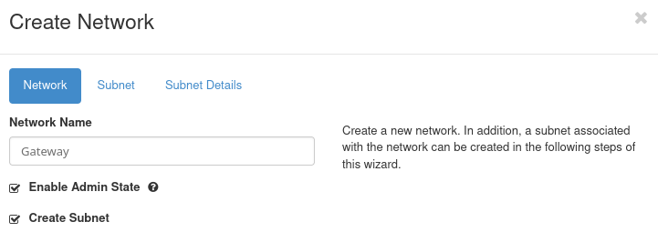

Set the Network Name to **Gateway** and go to the **Subnet** tab.

.. figure:: screen3_ds.png
   :class: image-with-border

Set the Subnet Name to **Gateway_subnet**. Use the following settings:

* Network address: **10.100.100.0/24**
* Gateway IP: **10.100.100.1**

Click on Next to get to **Subnet Details** screen. There, ensure **Enable DHCP** is checked, leave other fields blank and click on **Create**.

.. figure:: screen4_ds.png
   :class: image-with-border

The **Gateway** network is created.

Creating a network called Internal
^^^^^^^^^^^^^^^^^^^^^^^^^^^^^^^^^^

Repeat the previous steps with different details:

* Network Name: **Internal**
* Subnet Name: **Internal_subnet**
* Network Address: **10.200.200.0/24**
* Internal IP: **10.200.200.1**

The result that these two networks are visible in **Network** → **Networks** menu:

.. figure:: screen44_ds.png
   :class: image-with-border

.. note::

   Depending on the state of the other networks in the system, it may not always be possible to achieve the same values as in this article. For instance, instead as **10.200.200.1** as above, you may have **10.200.200.2** or some other value. Note them down and replace accordingly while working through the article.

Create a router
^^^^^^^^^^^^^^^

Click the **Create Router** button.

.. figure:: screen5_ds.png
   :class: image-with-border

Name the router (e.g., **Router_Fwaas**). Select the **external** network in the **External Network** tab and click **Create Router**.

.. figure:: screen6_ds.png
   :class: image-with-border

Click the name of your new router.

.. figure:: screen7.png
   :class: image-with-border

Go to the **Interfaces** tab and click **Add Interface**.

.. figure:: screen8_ds.png
   :class: image-with-border

From the **Subnet** dropdown, select **Gateway_subnet** and click **Submit**.

.. figure:: screen9_ds.png
   :class: image-with-border

To view the network layout, go to **Network** → **Network Topology**.

.. figure:: scrn10_ds.png
   :class: image-with-border

.. note::

   The above image shows a very simplified topology of the network; in real life situation, and especially if you are creating Kubernetes clusters and such, this graph would be much more complicated.

We have created two networks and a corresponding router with ports, therefore, we are now able to create a virtual machine on which OPNsense software will run.

Creating and configuring the VM with OPNsense
---------------------------------------------

Prerequisite No. 2 shows how to create a new virtual machine under OpenStack. In this article, we will be using much the same procedure and the only unusual option we will use is adding a script to customize the OPNsense IP with the VM's IP.

Navigate to **Compute** → **Instances** and click **Launch Instance**.

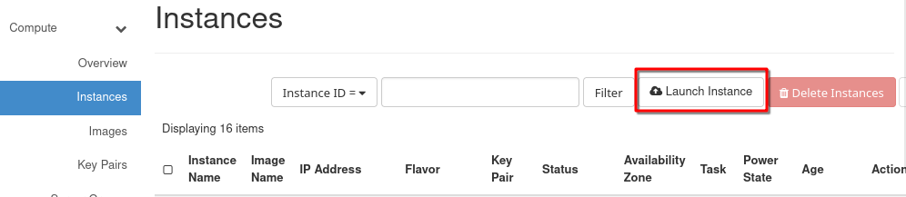

Enter a name, e.g., **Firewall_VM**, and go to the **Source** tab.

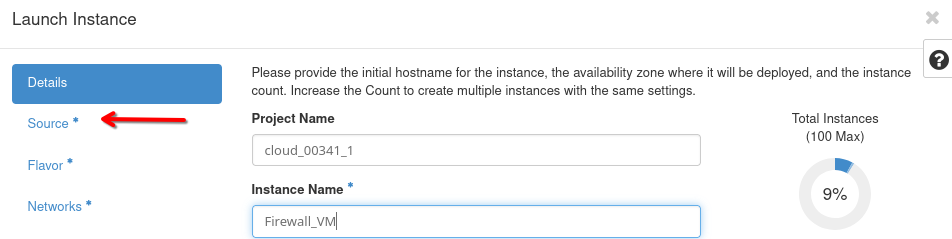

Choose the **opnsense** image and move it to the allocated side. Then go to the **Flavor** tab.

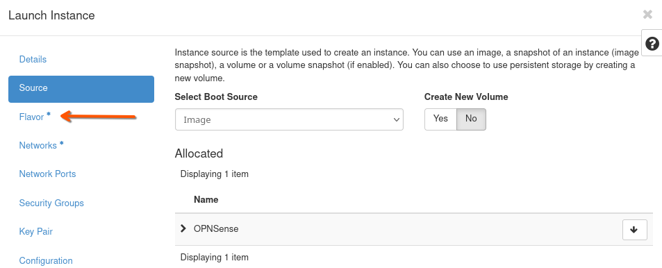

Use appropriate flavors for OPNsense
^^^^^^^^^^^^^^^^^^^^^^^^^^^^^^^^^^^^

Minimum requirements:

* CPU: 1 Core
* RAM: 2 GB
* Disk: 8 GB SSD
* Suggested flavor: **eo1.xmedium**

Optimal setup:

* CPU: 2 Core
* RAM: 4 GB
* Disk: 16 GB SSD
* Suggested flavor: **eo1.medium**

Insert networks
^^^^^^^^^^^^^^^

Go to the **Networks** tab.

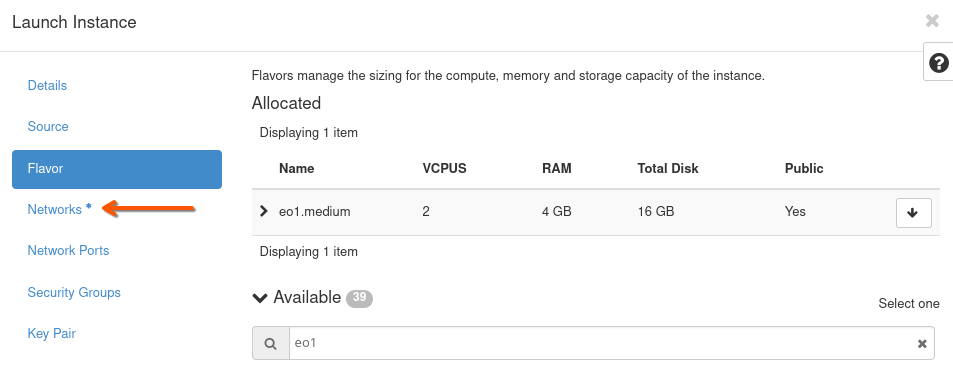

Add the created networks in this order:

1. **Internal** network
2. **Gateway** network

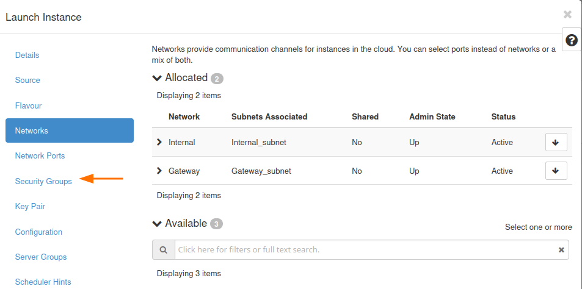

Clear security groups
^^^^^^^^^^^^^^^^^^^^^

Navigate to **Security Groups** and remove all attached security groups by clicking the arrow on the right of each row.

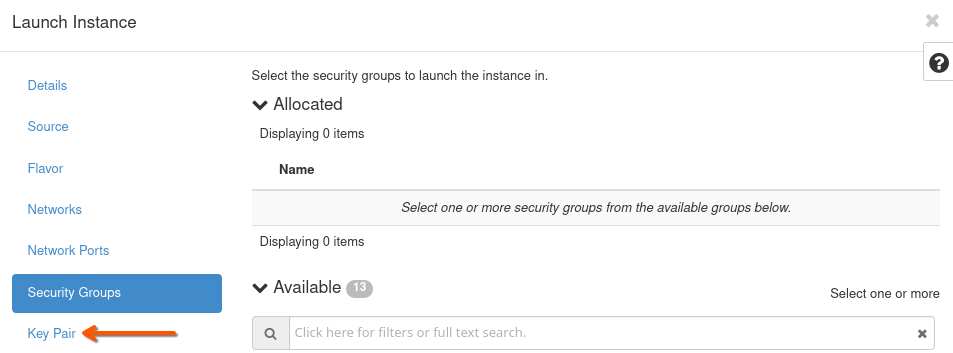

.. note::

   We remove all security groups from the VM because firewall filtering will be handled entirely by the OPNsense server. Make sure **Port Security** is disabled on all ports connected to the firewall VM, or traffic may be blocked by OpenStack’s default filters.

Key Pair
^^^^^^^^

Define or use an existing SSH key pair to access the VM later. See Prerequisite No. 2 for guidance.

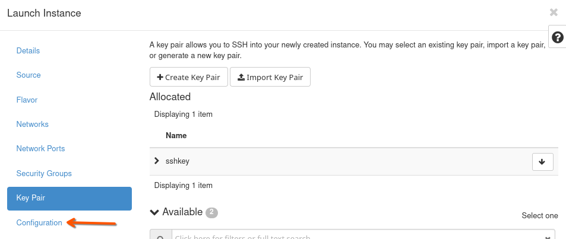

.. note::

   It is the OPNsense image that we are here dealing with, so the usual rules for opening an SSH connection for Linux-based VMs do not apply here. If you need to use SSH on OPNsense server, you will have to alter its parameters via OPNsense GUI first.

Customize the VM using a script
^^^^^^^^^^^^^^^^^^^^^^^^^^^^^^^

Open the **Configuration** tab.

Paste the following script into the **Customization Script** box:

.. code-block:: bash

    # This script replaces the default OPNsense IP with the VM's IP
    runcmd:
      - |
        address=$(curl -s http://169.254.169.254/latest/meta-data/local-ipv4)
        first=$(echo "$address" | cut -d'.' -f1)
        second=$(echo "$address" | cut -d'.' -f2)
        third=$(echo "$address" | cut -d'.' -f3)
        sed -i "s|<ipaddr>192\.168\.[0-9]\+\.[0-9]\+</ipaddr>|<ipaddr>$first.$second.$third.1</ipaddr>|" /conf/config.xml
        sed -i "/<disablefilter>enabled<\/disablefilter>/d" /conf/config.xml
        reboot

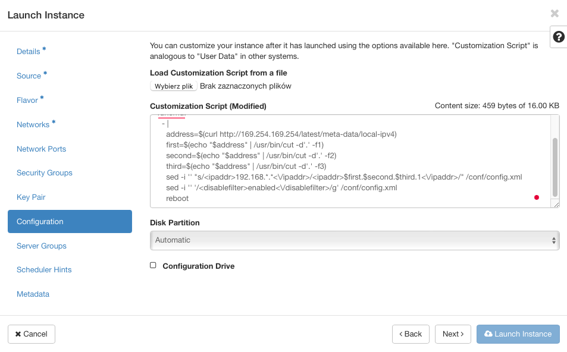

Launch the VM
^^^^^^^^^^^^^

Click **Launch Instance** and wait for the VM to spawn.

If everything is in order, you should see at least two IP addresses for **Firewall_FM**, like this:

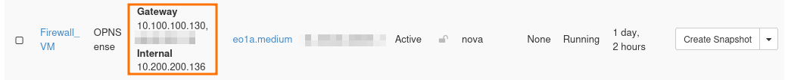

If one of these ports is missing, add them with option **Attach interface** from the action menu on the right side.

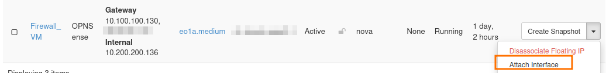

.. note::

   Once again, while working through the article, use IP addresses as shown in command **Compute** -> **Instances** instead of those you see in the screenshots above.

Add port for Interfaces
^^^^^^^^^^^^^^^^^^^^^^^

Once the VM is created, click on its name in the **Instances** tab.

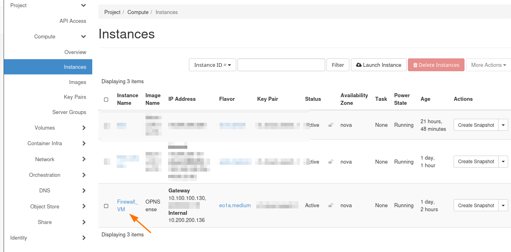

Go to the **Interfaces** tab and click on **Edit Port** on each port.

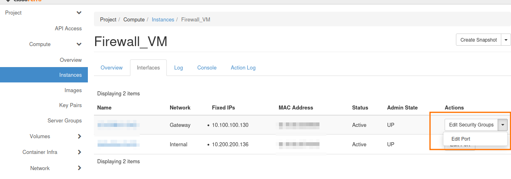

Disable **Port Security** and click on **Update**.

Allocate Floating IP
^^^^^^^^^^^^^^^^^^^^

Go to **Network** → **Floating IPs** and click on button **Allocate IP to Project**.

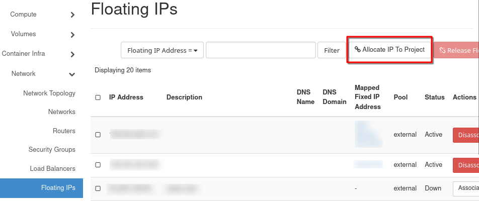

Click on button **Allocate IP** without entering anything else.

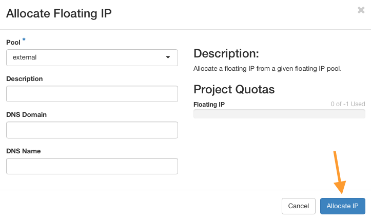

Click on **Associate** next to the new Floating IP and attach it to the **Firewall_VM** port connected to the **Gateway** network (**10.100.100.130** in our case).

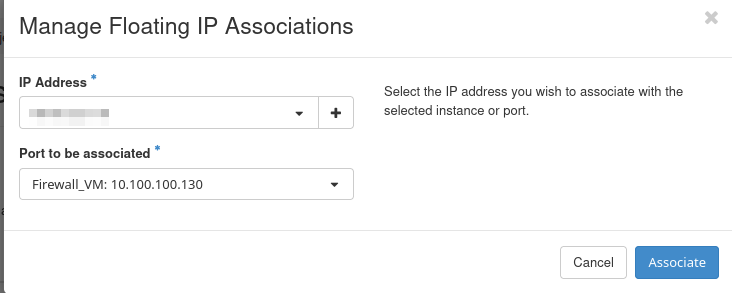

Using this **Gateway** network interface will enable the OPNsense server to access the Internet.

Using dashboard to set up the OPNsense server
---------------------------------------------

Speaking in more technical terms, the LAN address for **Firewall_VM** instance is called **vtnet0** and its value should be the address of Internal's network Gateway IP, which is **10.200.200.1**. You can check it by clicking on **Compute** --> **Instances** --> **Firewall_VM** --> **Console** to open console in Horizon. To enter, use the following credentials:

 * User: **root**
 * Password: **opnsense**

and you should see a screen like this:

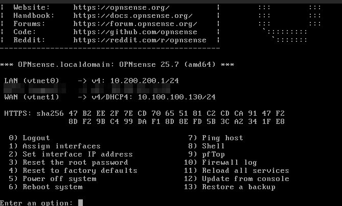

The **Firewall_VM** LAN address **vtnet0** should be identical to that you see in Horizon (Network->Networks->Internal->Subnets->Gateway IP), that is, **10.200.200.1**. If the LAN address is different, you will configure it in next steps.

Add or set up the existing interfaces
^^^^^^^^^^^^^^^^^^^^^^^^^^^^^^^^^^^^^

At the bottom of the screen, there is a prompt **Enter an option** so type **1** and press Enter on the keyboard.

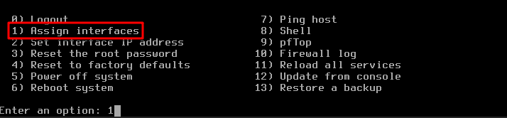

Entering **1** will execute command **Assign interfaces** as shown in the red rectangle in the image above. With this, we are going to set up the interfaces, which are called **vtnet0** and **vtnet1** on OpenVPN server.

After pressing **Enter**, a new question will appear:

Pressing Enter in this kind of interface will execute the option that is represented as a capital letter. Here it is **N**, so by pressing Enter you have effectively negated the option to configure **LAGGS**. Since that acronym stands for **Link Aggregation Group Interface** and we are not interested in that here, **N** means skipping it.

The next question is to set up **VLANs** now; again, press Enter to skip it. The screen changes to:

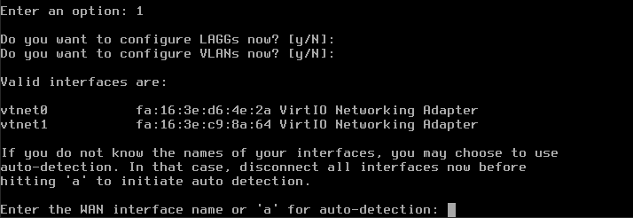

WAN stands for Wide Area Network and the corresponding interface is **vtnet1** so enter that.

For question **Enter the LAN interface name or 'a' for auto-detection NOTE...** enter **vtnet0**.

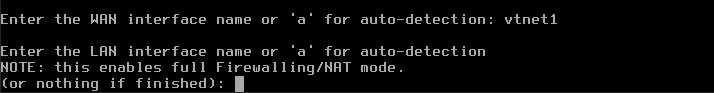

The next question is **Optional interface 1** -- leave it blank and press Enter. Those steps are captured on the following picture:

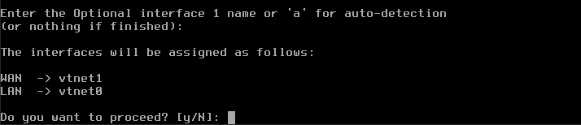

You will see prompt **The interfaces will be assigned as follows: WAN -> vtnet1 LAN -> vtnet0** -- nothing to do here, as it is correct. Next, **y** for **Do you want to proceed?** and click enter to save your changes.

Setting the address of vtnet0 manually
^^^^^^^^^^^^^^^^^^^^^^^^^^^^^^^^^^^^^^

We are now back to the main menu for OpenVPN. We will set up the IP address for **vtnet0** manually, by entering **2** for **Enter an option:**. That activates option **Set interface IP address** from the main menu.

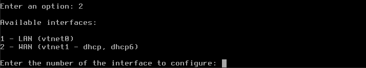

Enter **1** to set up LAN and you will see this question:

**Configure IPv4 address LAN interface via DHCP**

Press Enter for **N** and get another question:

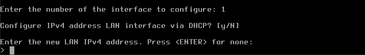

Type your internal IP address, which in this case is **10.200.200.1**.

.. warning::

   Instead of **10.200.200.1** enter the actual value you got in option **Compute** -> **Instances** for the **Internal** network.

Then follows the question how many bits should be taken into account:

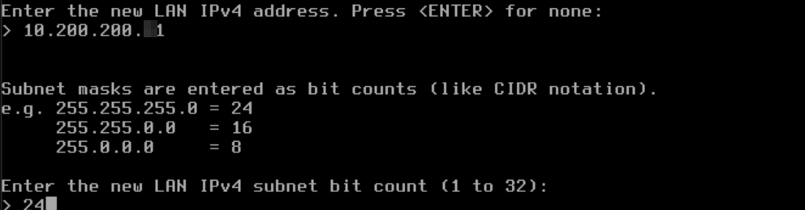

Enter **24** (CIDR notation: 255.255.255.0/24).

The result of all these entries is that the interfaces for LAN static IP address and WAN DHCP4 address are now configured.

Now another series of questions will follow, but keep on pressing Enter to confirm the default values. You will end up with the following screen, which will now contain correct values for LAN and WAN interfaces:

If you made a mistake in any of the steps, please repeat procedure from the beginning, starting from **1** for **Enter an option:** in the main menu.

The procedure of using web console from Horizon is finished.

Checking the console log
^^^^^^^^^^^^^^^^^^^^^^^^

Now make sure that the changes are visible in the console logs. Since you are still in web console interface, click on back arrow of your browser and get to the submenu for **Firewall_VM** instance:

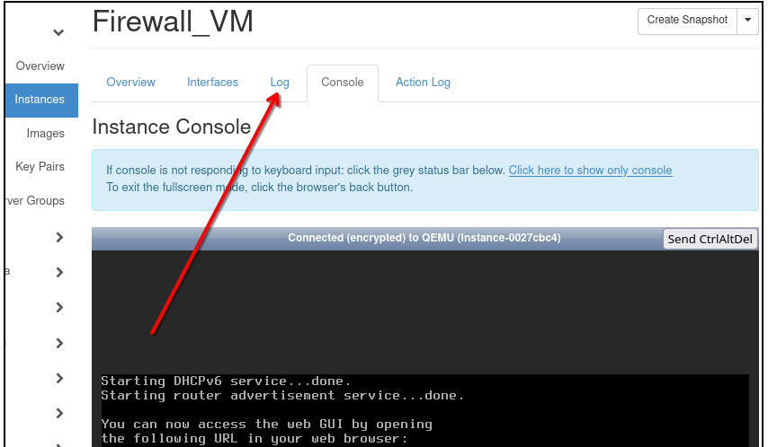

Click on **Log** as shown by the red arrow. The text in the log is shown up, and notice that there the LAN and WAN addresses are shown.

WAN address is probably empty (for now).

Refresh the VM
^^^^^^^^^^^^^^

Now perform **Soft Reboot Instance** in order to refresh Log data:

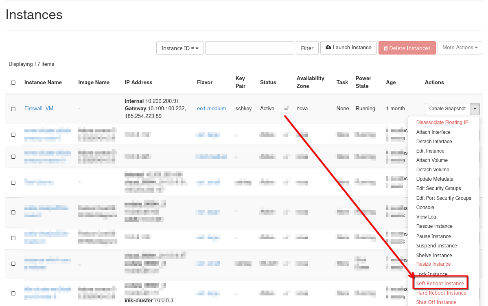

Check the console log once again and verify that both addresses are now correctly filled in:

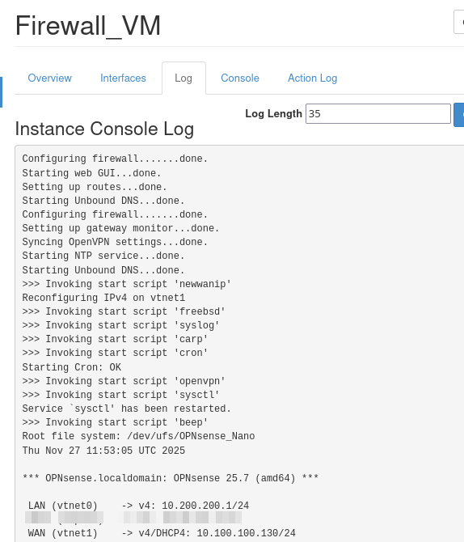

The instance that OpenVPN will run on, **Firewall_VM**, has now been prepared and the next step is to provide parameters to the OpenVPN server.

Use another VM in the same cloud to access Firewall_VM
------------------------------------------------------

**Firewall_VM** is running on FreeBSD and is optimized for fast running of opened connections. It has no special graphical instance of its own, so if we want to use a GUI to make the VPN work, we need to circumvent the problem in the following way:

1. Create **another** instance on OpenStack or use one that you already have. In this article, this auxiliary virtual machine will be called **Test_Ubuntu**. If you are creating it anew, use Ubuntu 20.04 or 22.04 for its image.

2. Next, add access to **Internal** network, **10.200.200.0/24**, so that these two instances can share data. The net result will be that we enter commands through **Test_Ubuntu** and they are executed on **Firewall_VM**.

3. You must also have SSH access to that virtual machine. See Prerequisite No. 2.

Use local Linux/Windows machine to access OPNsense GUI
------------------------------------------------------

You can proceed if **Test_Ubuntu** has defined an

1. Internal IP address (in this article, it is **10.200.200.136**) and a
2. Floating IP attached to it.

In your local terminal, use **ssh** protocol to connect to **Test_Ubuntu** by executing the following command:

.. code::

   ssh -L 8443:10.200.200.136:443 eouser@here_type_floating_IP_of_a_Test_Ubuntu

and click enter. If you want to include the "secure" part of the key pair, use the command like this:

.. code::

   ssh -i your_key.pem -L 8443:10.200.200.136:443 eouser@<floatingIP>

where you have to replace *<floatingIP>* with Floating IP of your **Test_Ubuntu** and click enter.

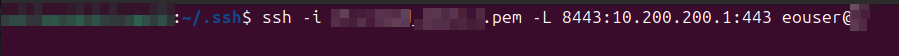

Once you connected, you should see a screen with **eouser**, which in your case should be **eouser@Test_Ubuntu:~$** like this:

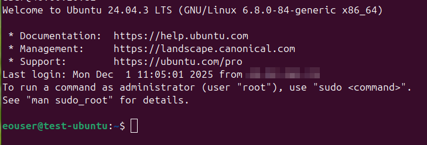

Open local web browser and type: https://localhost:8443

.. note::

   The first time you run it, there will be a warning that the site you want to visit is unsecured. This is normal since there is no security certificate on the OPNSense server at this point. In Firefox, click **Advanced...** on the warning page and then click **Accept the Risk and Continue**. Other browsers will have their own ways of handling this situation.

The credentials to log in are:

- **Username**: **root**
- **Password**: **opnsense**

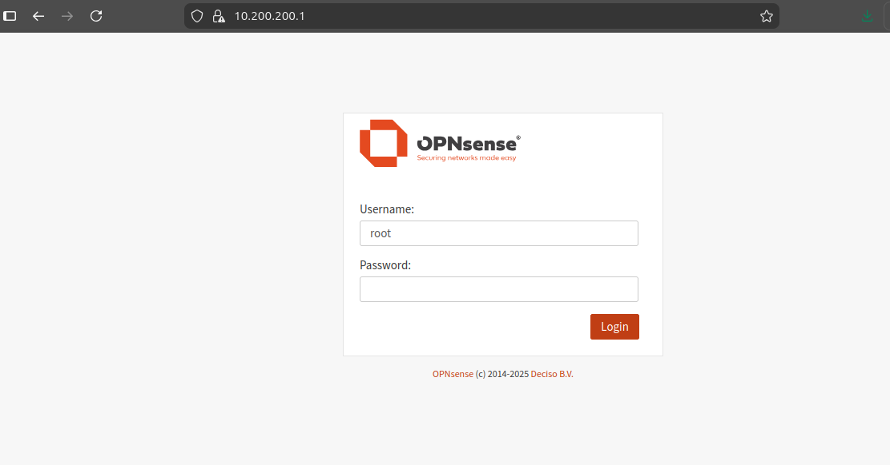

You will be presented with the wizard for the general setup of the OpenVPN server:

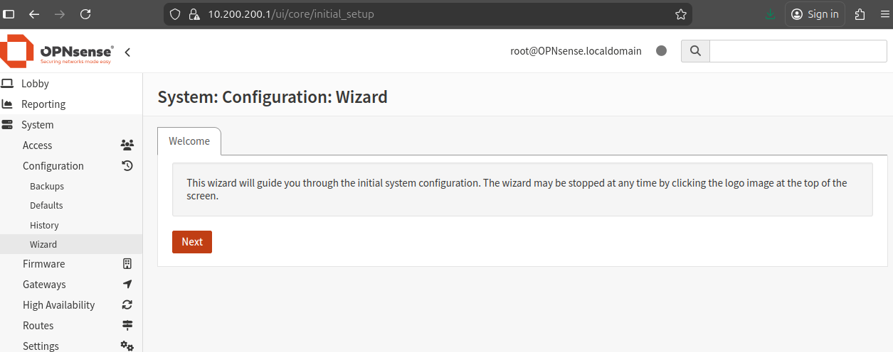

Click **Next**.

Set **DNS Servers** to **10.0.8.1** and click **Next**:

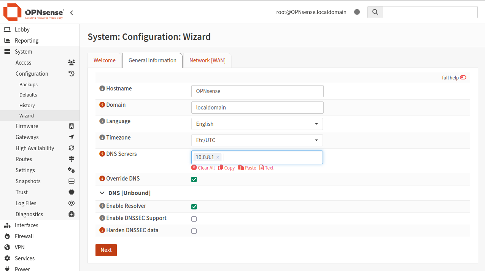

Set up time server information — just click **Next** to use the defaults:

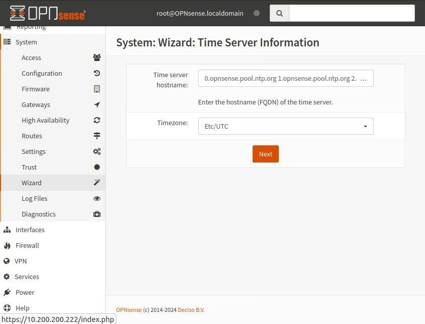

The next screen is to configure the WAN interface:

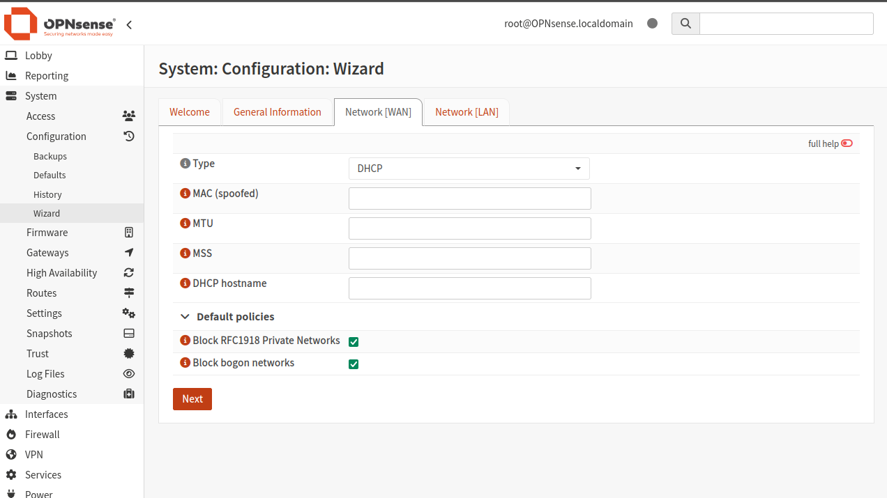

Click **Next** to use the defaults. The next screen is to configure the LAN interface:

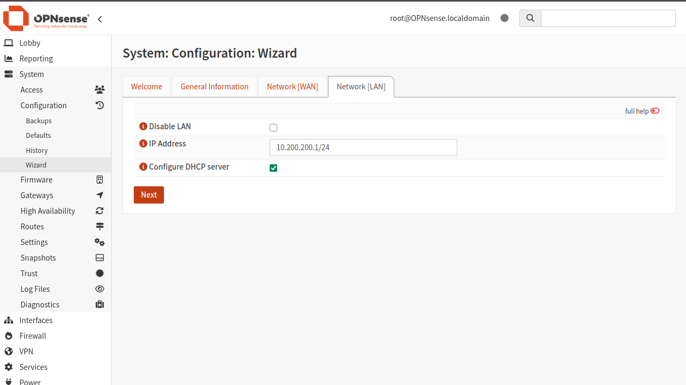

Enter the value of **vtnet0**, starting with **10.200.200.1** — your address will be similar, but different, so be careful!

Click **Next** to set the root password:

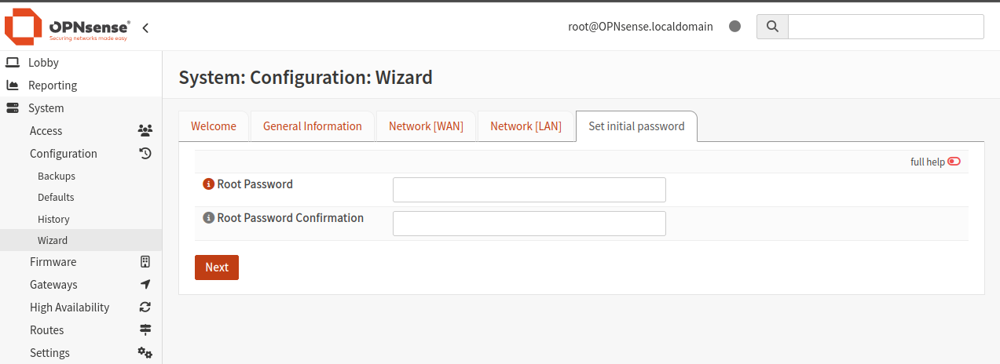

If you want to use the existing password, enter it in the confirmation field. If you're going to use this server seriously, be sure to enter a new and robust root password here.

Once done, click **Next** and click **Reload** on the next screen to apply the changes:

Reloading may take a couple of minutes. Once finished, the wizard will redirect you to the dashboard.

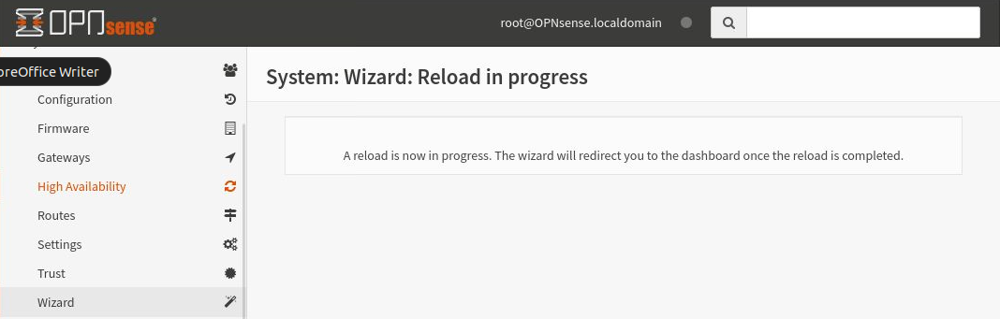

This is the final screen for the setup wizard:

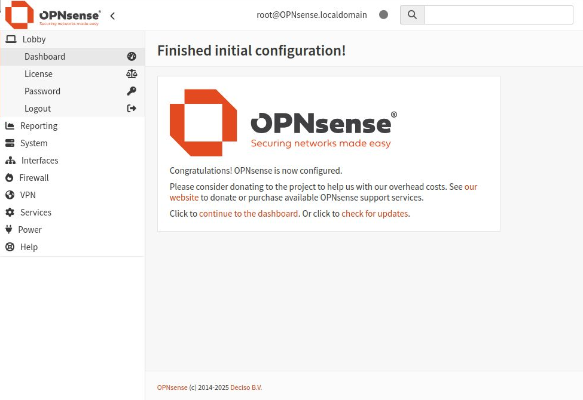

Configure VPN service
---------------------

Once the server has been set up, you can proceed with setting up the VPN service.

Create authority certificate
^^^^^^^^^^^^^^^^^^^^^^^^^^^^

1. Click on **System** -> **Trust** -> **Authorities** to get a list of existing authorities:

   .. figure:: firewall-v3-11_new.png
      :class: image-with-border

2. You can use any of the existing certificates, or click the plus button on the right to add a new one. Enter the following data:

   .. figure:: firewall-v3-12_new.png
      :class: image-with-border

   For **Description**, enter a meaningful certificate name, possibly with a random code like **DS** as a prefix (you can use your initials or any other prefix).

   For **Digest Algorithm**, choose **SHA512**.

   For **Common Name**, enter the same value as **Description**.

   Other fields, such as country code, city, and organization, are not mandatory.

3. Click **Save** to save the entered data.

Add server certificate
^^^^^^^^^^^^^^^^^^^^^^

1. Navigate to **System** -> **Trust** -> **Certificates** and click **Add** (scroll right if necessary to see it).

2. Click **Add new CA** to create a new certificate. Set the following values:

   .. figure:: fwaas-openvpn-v2-5.png
      :class: image-with-border

   Enter **internal-ca** for **Common Name**. Other fields, such as country code and city, are not mandatory.

3. Click **Save** to save the entered data.

Create a user and add a user certificate
^^^^^^^^^^^^^^^^^^^^^^^^^^^^^^^^^^^^^^^^

1. Navigate to **System** -> **Access** -> **Users** and ensure a user named **root** exists. You can create here new user (I have created user "test" earlier).

   .. figure:: firewall-v3-13_new.png
      :class: image-with-border

New user should have privileges:
    .. figure:: create_user.png
       :class: image-with-border

2. Click the icon "Search certificates by username" to the right of the window to edit it and add a certificate. Click **Add**.

   .. figure:: fwaas-openvpn-v2-7_new.png
      :class: image-with-border

3. Enter the data as shown in the image below:

   .. figure:: fwaas-openvpn-v2-8.png
      :class: image-with-border

   The rest of the fields are not mandatory. Click **Save** to save the entered data.

4. You should now see two new certificates in the list:

   .. figure:: fwaas-openvpn-v2-9_new.png
      :class: image-with-border

Create static key
^^^^^^^^^^^^^^^^^

1. To create a static key, navigate to **VPN** -> **OpenVPN** -> **Instances** -> **Static Keys**:

   .. figure:: fwaas-openvpn-v2-10.png
      :class: image-with-border

2. Select **Add** (plus sign icon) and start the process of creating a new static key.

   .. figure:: fwaas-openvpn-v2-11.png
      :class: image-with-border

3. Enter a new name in the **Description** field and for **Mode**, choose **crypt (Encrypt and authenticate...)**. To fill in the **Static Key** field, click the settings icon (orange rectangle in the image).

   The **Static Key** will be generated and filled in automatically.

   .. figure:: fwaas-openvpn-v2-12.png
      :class: image-with-border

4. Click **Save** to save the entered data.

Create an OpenVPN Instance
^^^^^^^^^^^^^^^^^^^^^^^^^^

Now that we have everything ready, let's create a new OpenVPN instance on the OPNsense server.

1. Navigate to the **Instances** tab under **VPN** -> **OpenVPN** -> **Instances**.

    .. figure:: fwaas-openvpn-v2-13.png
       :class: image-with-border

2. Click the orange plus button on the right.

    .. figure:: fwaas-openvpn-v2-14_new.png
       :class: image-with-border

    .. figure:: fwaas-openvpn-v2-16_new.png
       :class: image-with-border

For the **TLS static key**, use the static key you created earlier (if available).

3. On the next screen, click **Save**, then click **Apply**. Without applying, the system will not accept the server configuration.

    .. figure:: fwaas-openvpn-v2-20_new.png
       :class: image-with-border

Assign an Interface to the OpenVPN Server
^^^^^^^^^^^^^^^^^^^^^^^^^^^^^^^^^^^^^^^^^

Next, assign an interface to the OpenVPN server.

1. Navigate to **Interfaces** -> **Assignments**.

    .. figure:: fwaas-openvpn-v2-21.png
       :class: image-with-border

    .. figure:: fwaas-openvpn-v2-22_new.png
       :class: image-with-border

Add a Rule to Connect to the OpenVPN Server
^^^^^^^^^^^^^^^^^^^^^^^^^^^^^^^^^^^^^^^^^^^

The first firewall rule allows clients to connect to the OpenVPN server.

1. Go to **Firewall** -> **Rules** -> **WAN** and add a rule to allow traffic on the port selected when creating the OpenVPN instance.

   After adding the rules, it will look like this:

    .. figure:: fwaas-openvpn-v2-23_new.png
       :class: image-with-border

2. Click **Add** to create a new rule using the values shown in this images:

   The first rule:

    .. figure:: rule1.png
       :class: image-with-border

   The second rule:

    .. figure:: rule2.png
       :class: image-with-border

3. Click **Save**. The new rules will be applied once you click **Apply changes**.

Add a Rule to Allow Access to IPs
^^^^^^^^^^^^^^^^^^^^^^^^^^^^^^^^^

The second rule ensures that clients can access the intended IPs.

1. Navigate to **Firewall** -> **Rules** -> **OPT1** (the interface you just created). For simplicity, we’ll add a rule to allow all traffic.

2. Click **Add New** to create a new rule.

    .. figure:: OPT_interface.png
       :class: image-with-border

    .. figure:: rules_to_OPT.png
       :class: image-with-border

3. Once done, click **Apply changes**.

Add rules to LAN interface
--------------------------

The next step is to add rules to LAN interface. The result will look like this:

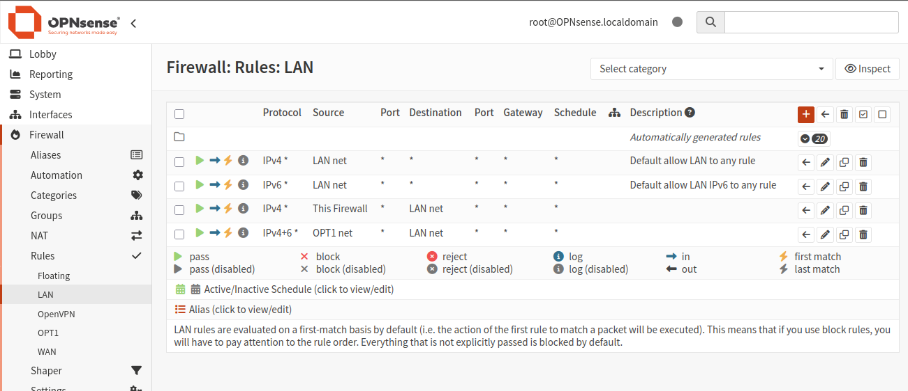

Click plus icon and add 4 rules:

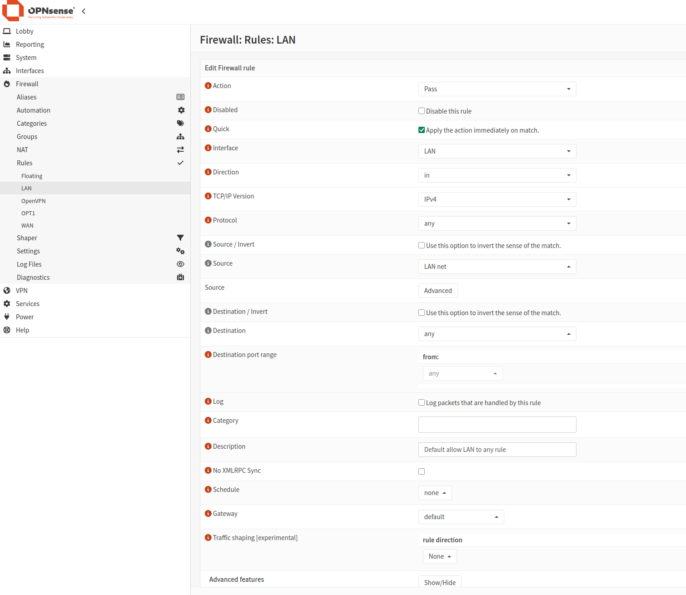

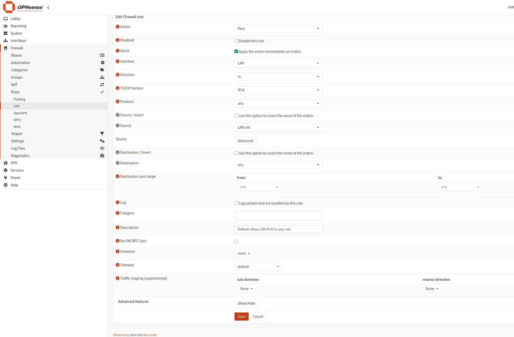

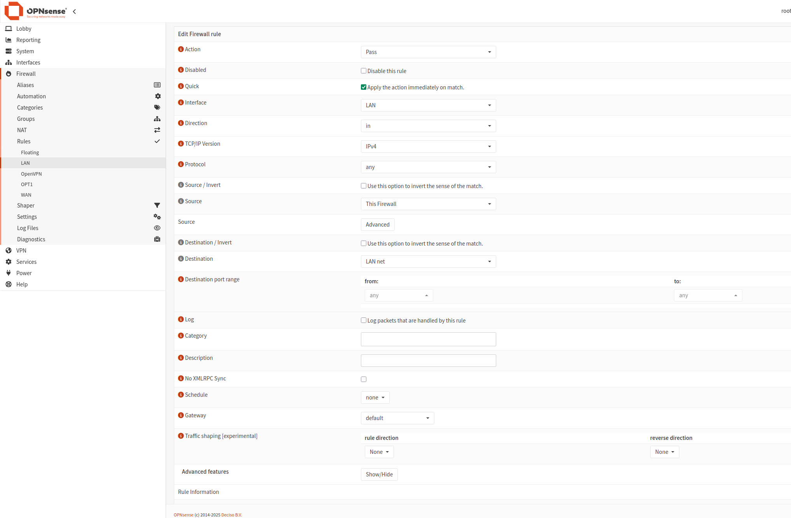

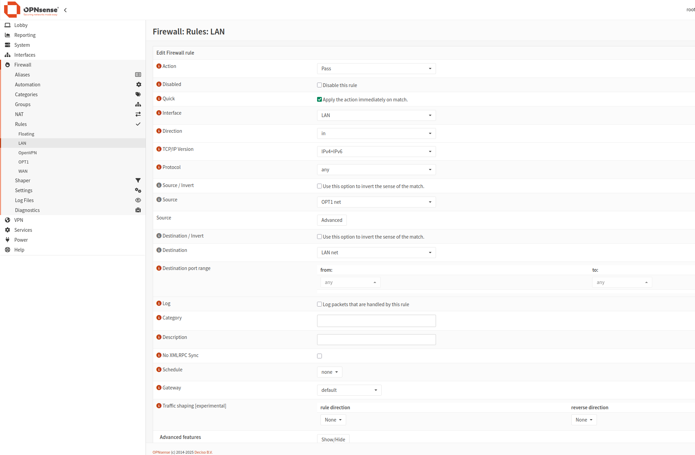

Client Export
-------------

To export the client profile for remote access, follow these steps:

**Remote Access Server:** Select the server created in step 5.

2. **Remote Access Server**: Select the server created in Step 5.

3. **Export Type**: Select **File Only**.

4. **Hostname**: Enter the DDNS Fully Qualified Domain Name (FQDN) or Static Public IP Address of the server. Use the floating IP of **Firewall_VM** here.

5. **Port**: Use the port selected in Step 5.

    .. figure:: clients_export.png
       :class: image-with-border

6. Click the cloud icon to download the Client Certificate for **DS_User1**.
7. The file will be downloaded.

Setting Up the OpenVPN Client
-----------------------------

To connect to your VPN server, you'll need a VPN client. You can use OpenVPN or Viscosity. Below are the instructions for setting up the OpenVPN client on different platforms.

### For Windows PCs:

1. Download and install the latest version of OpenVPN from [here](https://openvpn.net/community-downloads/).

2. Save all configuration files in **C:/Program Files/OpenVPN/config** and try to connect using the pre-configured credentials.

### For Linux (Ubuntu) PCs:

1. Open a terminal in the folder containing the configuration files.

2. Run the following commands:

.. code-block:: bash

   sudo apt update
   sudo nmcli connection import type openvpn file nameofyourovpnconffile.ovpn

You should see the output 'Connection 'nameofyourovpnconffile'successfully added.

3. To connect, use the Ubuntu configuration bar (located at the top-right corner) and enter the appropriate credentials.

.. figure:: top_corner.png
       :class: image-with-border

.. figure:: top_corner2.png
       :class: image-with-border

Enter credentials and connect:

.. figure:: top_corner3.png
       :class: image-with-border

4. If you don't want to use the configuration bar, run this command:

.. code-block:: bash

  sudo openvpn --config nameofyourovpnconffile.ovpn

You will be prompted to enter the **Auth Username** and **Auth Password**. Use the credentials you created during the **Create a user and add a user certificate** step. If you didn't create a new user, use the default:

- **Auth Username**: root
- **Auth Password**: opnsense

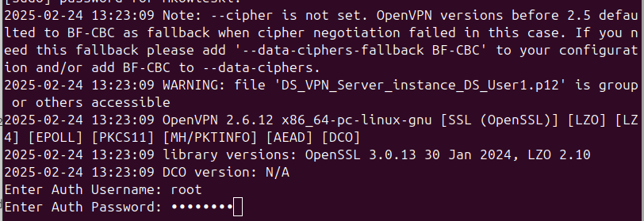

A successful connection should look like the following:

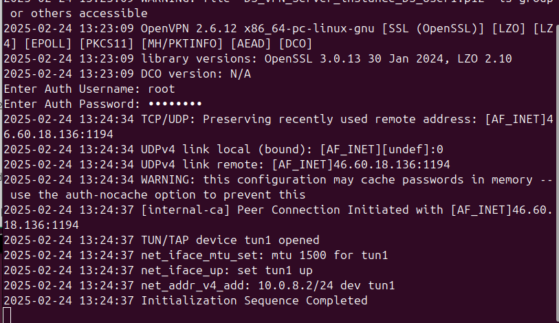

To test the VPN connection, open your local web browser and enter the internal IP address 10.200.200.1 You should be able to connect as shown below:

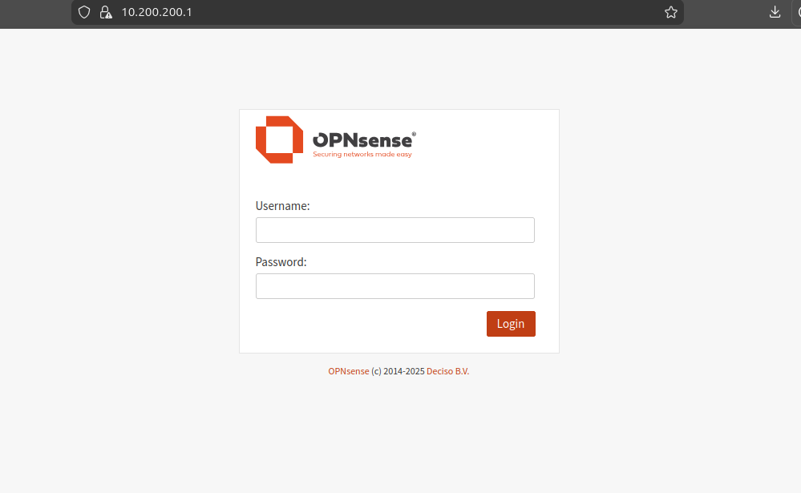

The next step is to navigate to Openstack dashboard and try to ping VM with Internal network attached. You can create new VM.

In this example:

Testing ping from your local machine with VPN enabled:

.. figure:: test_ping_ds.png
   :class: image-with-border