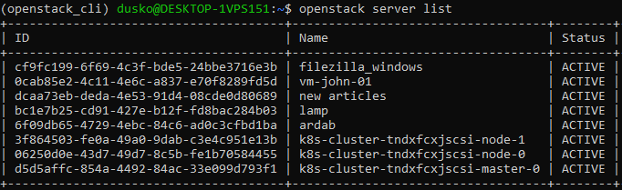
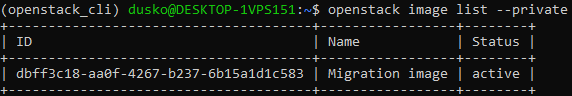

OpenStack instance migration using command line on |brand-name|
============================================================================

This article covers how to migrate an instance from one |brand-name| cloud to another, for example from one region to another.

The workflow involves downloading an image of that instance to your local computer or to a virtual machine on |brand-name| cloud, and then uploading it to a different cloud.

What We Are Going To Do
-----------------------

* Environments in which the operation can be performed.
* Explain types of instance migration on OpenStack cloud.
* Download an instance from the origin cloud.
* Create an image for migration.
* Upload an instance to the destination cloud.

Prerequisites
-------------

No. 1 **Account**

You need a |brand-name| hosting account with access to the Horizon interface: |brand-name-site-link|.

No. 2 **Installed OpenStackClient for Linux**

.. jinja:: brand_names

   Article :doc:`/openstackcli/How-to-install-OpenStackClient-for-Linux-on-{{ brand_name_hyphen }}/How-to-install-OpenStackClient-for-Linux-on-{{ brand_name_hyphen }}` shows how to:

   * install Python,
   * create and activate a virtual environment,
   * connect to the cloud by downloading and activating the proper RC file from |brand-name| cloud.

No. 3 **Credentials for both clouds**

In this article, there are two clouds to consider:

The origin
   The cloud you are downloading the instance from.

The destination
   The cloud you are uploading the image to.

These two clouds may have different authentication procedures. There are four combinations, depending on the number of authentication factors required:

.. jinja:: caption_colors

   .. list-table:: :{{ caption }}:`Authentication combinations for origin and destination clouds`
      :header-rows: 1
      :widths: 15 40 45

      * - :{{ header }}:`No.`
        - :{{ header }}:`Origin`
        - :{{ header }}:`Destination`
      * - **1**
        - One-factor authentication
        - One-factor authentication
      * - **2**
        - One-factor authentication
        - Two-factor authentication
      * - **3**
        - Two-factor authentication
        - One-factor authentication
      * - **4**
        - Two-factor authentication
        - Two-factor authentication

.. jinja:: brand_names

   .. jinja:: doc_links

      Article :doc:`{{ openstack_cli_auth }}` explains both types of authentication. Apply the relevant method for each cloud. Download RC files from both clouds. They will usually have different names. For example, in combination No. 3, the origin file could be named **cloud_00734_1-openrc-2fa.sh**, because it uses two-factor authentication, while the destination file could be named **cloud_00341_3-openrc.sh**, because it uses one-factor authentication.

No. 4 **General instructions for uploading an image using CLI commands**

.. jinja:: brand_names

   The article :doc:`/cloud/How-to-upload-your-custom-image-using-OpenStack-CLI-on-{{ brand_name_hyphen }}/How-to-upload-your-custom-image-using-OpenStack-CLI-on-{{ brand_name_hyphen }}` describes how to download an operating system image to a local computer and upload it to a selected cloud. In this article, you perform a similar operation, except that the image you are migrating originates in your cloud and may contain your own specialized software.

That article is more technical and also explains how to deal with errors that may happen during the process.

.. note::

   Windows images can be migrated in the same way.

Environments in which the operation can be performed
----------------------------------------------------

There are different environments in which the operation can be performed. No matter which environment you choose, make sure that you have enough disk space for the image you will download. You should also have the RC files for both clouds available: the origin cloud and the destination cloud.

Your local computer
^^^^^^^^^^^^^^^^^^^

You can use your local computer to download the instance. The exact amount of data that needs to be transmitted depends on the size of the virtual machine storage. Usually, however, the amount of data is significant.

A virtual machine
^^^^^^^^^^^^^^^^^

You can also use a Linux machine running on |brand-name| cloud. This may be useful if:

* your Internet connection has data limits,
* you do not have enough local storage,
* you do not want to keep your computer running during the whole download process,
* you are concerned that your Internet connection may be interrupted.

**Volume**

If that virtual machine does not have enough storage to perform the migration, you can attach a volume to it:

.. jinja:: brand_names

   * :doc:`/datavolume/How-to-attach-a-volume-to-VM-less-than-2TB-on-Linux-on-{{ brand_name_hyphen }}/How-to-attach-a-volume-to-VM-less-than-2TB-on-Linux-on-{{ brand_name_hyphen }}`
   * :doc:`/datavolume/How-to-attach-a-volume-to-VM-more-than-2TB-on-Linux-on-{{ brand_name_hyphen }}/How-to-attach-a-volume-to-VM-more-than-2TB-on-Linux-on-{{ brand_name_hyphen }}`

**Transfer RC files**

You can transfer the RC files to that virtual machine using **scp**. For example, if:

* your RC file is in your current working directory and is called **cloud_00734_1-openrc-2fa.sh**,
* the floating IP of your virtual machine is **1.2.3.4**,
* you are using a virtual machine created from a default image,

the command could be:

.. code::

   scp cloud_00734_1-openrc-2fa.sh eouser@1.2.3.4:/home/eouser

**tmux**

To keep the download or upload running after you disconnect from your virtual machine, use **tmux**. It keeps your terminal session active as long as the VM remains running.

The instructions below are for Ubuntu. If you use a different distribution, the package installation command may be different.

First, install **tmux**:

.. code::

   sudo apt install tmux

Start **tmux**:

.. code::

   tmux

Execute commands as you normally would. To leave the session without stopping it, press the following sequence:

* Press **CTRL+b** and release the keys.
* Press **d**.

You are returned to the previous command prompt. You can now enter **exit** to disconnect from your virtual machine.

To return to the session, connect to your virtual machine again using SSH and execute:

.. code::

   tmux a

You are returned to the previous session.

You can execute **exit** inside **tmux** to stop the session.

Downloading an instance
-----------------------

Activate the RC file for the origin cloud, for example:

.. code::

   source ./cloud_00734_1-openrc-2fa.sh

List your instances:

.. code::

   openstack server list

The result will be similar to this output:

Assume that the instance you want to migrate has the ID **0cab85e2-4c11-4e6c-a837-e70f8289fd5d**. In your own workflow, read the correct ID from the server list and replace **0cab85e2-4c11-4e6c-a837-e70f8289fd5d** with it in the rest of this article.

Shut off the instance:

.. code::

   openstack server stop 0cab85e2-4c11-4e6c-a837-e70f8289fd5d

There are two ways to check whether it is turned off. One option is to execute **openstack server list** again and check the **Status** column. If the server is stopped, the status should be **SHUTOFF**.

.. image:: instance_shut_off.png

The other option is to show the server and print only its power state:

.. code::

   openstack server show 0cab85e2-4c11-4e6c-a837-e70f8289fd5d | grep power_state

With this command, the status is **Shutdown** instead of **SHUTOFF**, but the meaning is the same.

.. image:: instance_shutoff_twice.png

Create image for the migration
------------------------------

The instance is stopped and you can now create its image in the cloud. The instance currently has the ID **0cab85e2-4c11-4e6c-a837-e70f8289fd5d**, but after migration it will have another ID. To track it on the new cloud, use the **--name** parameter to create a name for the image. In this example, the name is **Migration image**.

Create a named image:

.. code::

   openstack server image create --name "Migration image" 0cab85e2-4c11-4e6c-a837-e70f8289fd5d

Another option is to use the **shelve** command. It creates a proper image and changes the instance status to **Shelved Offloaded**.

.. code::

   openstack server shelve 0cab85e2-4c11-4e6c-a837-e70f8289fd5d

Regardless of which option you use, check whether the new image was created properly.

.. code::

   openstack image list --private

Here is the result in this example:

The image has the ID **1fedb775-deef-4bfd-9ec2-ee67f65a461b**. This ID is used in the following commands.

The size cannot be **0** bytes and should be similar to the size of the instance itself. Check the size with:

.. code::

   openstack image show 1fedb775-deef-4bfd-9ec2-ee67f65a461b | grep min_disk

This is the result:

.. image:: min_disk_instance_migration.png

Download the newly created image to local disk. Its name will be **image.raw**. The download may take from a few minutes to a few hours, depending on the size of the image and the speed of your connection.

.. code::

   openstack image save --file ./image.raw 1fedb775-deef-4bfd-9ec2-ee67f65a461b

The image is ready. To move it to a different cloud, activate the credentials for the destination cloud.

Uploading an instance
---------------------

Open another terminal session and activate access to the destination cloud. Using the example data from Prerequisite No. 3, the activation command could look like this:

.. code::

   source ./cloud_00341_3-openrc.sh

Now all **openstack** commands work on the destination cloud.

Upload the image:

.. code::

   openstack image create --file ./image.raw "Migration image"

This may take a while. You can follow the upload process in Horizon by opening **Compute** → **Images**. Here is the beginning of the upload process:

.. image:: migration_image_upload.png

Once uploaded to the destination cloud, you can use the image like any other image.

Warning: always use the latest value of image ID
------------------------------------------------

From time to time, the default operating system images in |brand-name| cloud are upgraded to new versions. As a consequence, their **image ID** changes. For example, the image ID for Ubuntu 20.04 LTS may have been **574fe1db-8099-4db4-a543-9e89526d20ae** at the time this article was originally written. When working through the article, you should normally use the current value of the image ID instead.

If you automate OpenStack operations with Heat, Terraform, Ansible, or another automation tool, avoid hardcoding an old image ID. Once the default image is upgraded and its ID changes, automation that uses the old ID may stop working.

.. warning::

   Make sure that your automation code uses the **current value** of an OS image ID, not a hardcoded historical value.

What To Do Next
---------------

You can upload a downloaded image through Horizon as well:

.. jinja:: brand_names

   :doc:`/cloud/How-to-upload-custom-image-to-{{ brand_name_hyphen }}-cloud-using-OpenStack-Horizon-dashboard/How-to-upload-custom-image-to-{{ brand_name_hyphen }}-cloud-using-OpenStack-Horizon-dashboard`