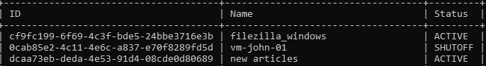
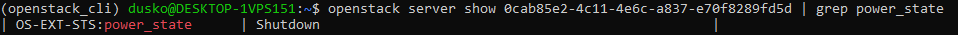
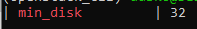

OpenStack instance migration using command line on |brand-name|
===============================================================

This article covers how to migrate an instance from one |brand-name| cloud or region to another.

The workflow involves downloading an image of that instance to your local computer or a virtual machine on |brand-name| cloud and then uploading it to a different cloud.

What We Are Going To Do
-----------------------

 * Environments in which the operation can be performed
 * Explain types of instance migration on OpenStack cloud
 * Download an instance from the origin
 * Create image for migration
 * Upload an instance to the destination

Prerequisites
-------------

No. 1 **Account**

You need a |brand-name| hosting account with access to the Horizon interface: |brand-name-site-link|.

No. 2 **Installed OpenStackClient for Linux**

.. jinja:: brand_names

   Article :doc:`/openstackcli/How-to-install-OpenStackClient-for-Linux-on-{{ brand_name_hyphen }}/How-to-install-OpenStackClient-for-Linux-on-{{ brand_name_hyphen }}` will show you how to

 * install Python,
 * create and activate a virtual environment, and then
 * connect to the cloud by downloading and activating a proper RC file from the |brand-name| cloud.

No. 3 **Have ready credentials for both clouds**

In this article, there are two clouds to consider:

The origin
   The cloud you are downloading the instance *from*.

The destination
   The cloud you are uploading the image *to*.

These two clouds may have different authentication procedures. There are four combinations, depending on the number of factors that need to be supplied:

.. jinja:: caption_colors

   .. list-table:: :{{ caption }}:`Authentication combinations for origin and destination clouds`
      :header-rows: 1
      :widths: 15 40 45

      * - :{{ header }}:`No.`
        - :{{ header }}:`Origin`
        - :{{ header }}:`Destination`
      * - **1**
        - One-factor authentication
        - One-factor authentication
      * - **2**
        - One-factor authentication
        - Two-factor authentication
      * - **3**
        - Two-factor authentication
        - One-factor authentication
      * - **4**
        - Two-factor authentication
        - Two-factor authentication

.. jinja:: brand_names

   .. jinja:: doc_links

      Article :doc:`{{ openstack_cli_auth }}` explains both types of authentication, so apply the relevant method for each cloud. Download RC files from both clouds. They will usually have different names. For example, in combination No. 3, the origin file could be named **cloud_00734_1-openrc-2fa.sh**, because it uses two-factor authentication, while the destination file could be named **cloud_00341_3-openrc.sh**, because it uses one-factor authentication.

No. 4 **General instructions for uploading image using CLI commands**

.. jinja:: brand_names

   The article :doc:`/cloud/How-to-upload-your-custom-image-using-OpenStack-CLI-on-{{ brand_name_hyphen }}/How-to-upload-your-custom-image-using-OpenStack-CLI-on-{{ brand_name_hyphen }}` describes the procedure to download an operating system image to the local computer and upload it to the chosen cloud. In this article, you are going to do the same except that the image you are migrating originates in your cloud and may contain your own specialized software.

That article is also more technical and also explains how to deal with errors that may happen in the process.

.. note::

   Windows images can be migrated in this same fashion.

Environments in which the operation can be performed
----------------------------------------------------

There are different environments in which the operation can be performed. No matter which environment you choose, make sure that you have enough disc space for the image you will be downloading. Also, you should have the RC file for both clouds available to you - the origin cloud and the destination cloud.

Your local computer
^^^^^^^^^^^^^^^^^^^

You can use your local computer to download the instance. The exact amount of data that needs to be transmitted for that purpose will vary depending on the size of storage of your virtual machine. Usually, however, the amount of data will be significant.

A virtual machine
^^^^^^^^^^^^^^^^^

You can also use a Linux machine running on |brand-name| cloud. This might be especially useful under circumstances such as:

 * your Internet connection has data limits
 * you do not have enough storage
 * you don't want to keep your computer running during the whole download process
 * you fear that you might be temporarily disconnected from the Internet

**Volume**

If that virtual machine does not have enough storage to perform a migration, you can attach a volume to it:

.. jinja:: brand_names

    * :doc:`/datavolume/How-to-attach-a-volume-to-VM-less-than-2TB-on-Linux-on-{{ brand_name_hyphen }}/How-to-attach-a-volume-to-VM-less-than-2TB-on-Linux-on-{{ brand_name_hyphen }}`

.. jinja:: brand_names

    * :doc:`/datavolume/How-to-attach-a-volume-to-VM-more-than-2TB-on-Linux-on-{{ brand_name_hyphen }}/How-to-attach-a-volume-to-VM-more-than-2TB-on-Linux-on-{{ brand_name_hyphen }}`

**Transfer RC files**

You can transfer the RC files to that virtual machine using **scp**. For example, if:

 * your RC file is in your current working directory and is called *cloud_00734_1-openrc-2fa.sh*
 * the floating IP of your virtual machine is **1.2.3.4**
 * you are using a virtual machine created using a default image

the command could be:

.. code::

   scp cloud_00734_1-openrc-2fa.sh eouser@1.2.3.4:/home/eouser

**tmux**

If you want to keep the download and/or upload running even after you've disconnected from your virtual machine, you can use **tmux**. It should keep your terminal session if the VM does not get shut down.

Note that instructions below are for Ubuntu. If you are using a different distributions, these commands might require adjustments.

First, install **tmux**:

.. code::

   sudo apt install tmux

Start **tmux**:

.. code::

   tmux

Execute commands like you would normally do. If you want to leave your virtual machine, press the following sequence of keys:

 * Press **CTRL+b** and release the keys
 * Press **d** on your keyboard

You should be returned to the previous command prompt. You can now enter **exit** to disconnect from your virtual machine.

If you want to return to your to the session you left, connect to your virtual machine using SSH again.

After that, execute the following command:

.. code::

   tmux a

You should be returned to the previous session.

You can execute **exit** inside **tmux** to stop the session.

Downloading an instance
-----------------------

Activate the RC file for the origin, for example:

.. code::

   source./cloud_00734_1-openrc-2fa.sh

List your instances:

.. code::

   openstack server list

The result will be similar to this output:

.. image:: migratino_server_list.png

Let's say that the instance you want to migrate has the id equal to **0cab85e2-4c11-4e6c-a837-e70f8289fd5d** and that is what we use in this article. You be sure to read the appropriate ID value from server list and replace **0cab85e2-4c11-4e6c-a837-e70f8289fd5d** with it in the rest of this article.

Shut off the instance:

.. code::

    openstack server stop 0cab85e2-4c11-4e6c-a837-e70f8289fd5d

There are two ways to check whether it is turned off. One is to execute the **openstack server list** command again and see the *Status*. If the server is stopped, the status should be *SHUTOFF*.

The other way is to **show** the server and print only its state:

.. code::

   openstack server show 0cab85e2-4c11-4e6c-a837-e70f8289fd5d | grep power_state

With this command, the status is *Shutdown* instead of *SHUTOFF* but the meaning is the same.

Create image for the migration
------------------------------

The instance is stopped and you are now going to create its image in the cloud. The instance now has the ID of **0cab85e2-4c11-4e6c-a837-e70f8289fd5d** but once it is migrated, it will have another ID. In order to track it on the new server, you will use the **-\-name** parameter to create a name for the instance. That name here is, simply: *Migration image*.

The command to create a named image is

.. code::

    openstack server image create --name "Migration image" 0cab85e2-4c11-4e6c-a837-e70f8289fd5d

Another way is command **shelve**. It creates a

 * proper image and
 * changes instance status to *Shelved Offloaded*.

.. code::

    openstack server shelve 0cab85e2-4c11-4e6c-a837-e70f8289fd5d

Regardless of which option is used, you need to check whether the new image was created properly.

.. code::

    openstack image list --private

Here is the result in this particular case:

.. image:: image_created_for_migration.png

The image has the ID of **1fedb775-deef-4bfd-9ec2-ee67f65a461b** so that is what you are going to use in the forthcoming commands.

The size cannot be **0** bytes and should have a similar size as the instance itself. Here is how to check the size:

.. code::

    openstack image show 1fedb775-deef-4bfd-9ec2-ee67f65a461b | grep min_disk

This is the result:

Download newly created image to local disk. Its name will be *image.raw* and you may wait from a couple if minutes up to a couple of hours for it to download, depending on the speed of your Internet connection.

.. code::

   openstack image save --file./image.raw 1fedb775-deef-4bfd-9ec2-ee67f65a461b

The image is ready. In order to move it to a different cloud, you will have to activate proper credentials for that cloud.

Uploading an instance
---------------------

Open another terminal session and activate access to the destination cloud; using the example data from Prerequisite No. 3, the activate command could look like:

.. code::

   source./cloud_00341_3-openrc.sh

Now all the **openstack** commands will work on the destination cloud.

Upload the image

.. code::

   openstack image create --file./image.raw "Migration image"

This may take a while. You can follow up what is happening if you enter the Horizon environment and list all images with the commands **Compute** --> **Images**. Here is the beginning of the uploading process:

Once in the destination cloud, you can use it just like any other image.

Warning: always use the latest value of image id
------------------------------------------------

From time to time, the default images of operating systems in the |brand-name| cloud are upgraded to the new versions. As a consequence, their **image id** will change. Let's say that the image id for Ubuntu 20.04 LTS was **574fe1db-8099-4db4-a543-9e89526d20ae** at the time of writing of this article. While working through the article, you would normally take the **current** value of image id, and would use it to replace **574fe1db-8099-4db4-a543-9e89526d20ae** throughout the text.

Now, suppose you wanted to automate processes under OpenStack, perhaps using Heat, Terraform, Ansible or any other tool for OpenStack automation; if you use the value of **574fe1db-8099-4db4-a543-9e89526d20ae** for image id, it would remain **hardcoded** and once this value gets changed during the upgrade, the automated process may stop to execute.

.. warning::

   Make sure that your automation code is using the **current value** of an OS image id, not the hardcoded one.

What To Do Next
---------------

You can upload a downloaded image through Horizon as well:

.. jinja:: brand_names

   :doc:`/cloud/How-to-upload-custom-image-to-{{ brand_name_hyphen }}-cloud-using-OpenStack-Horizon-dashboard/How-to-upload-custom-image-to-{{ brand_name_hyphen }}-cloud-using-OpenStack-Horizon-dashboard`
