Create and configure new project
================================

Default elements of the account
-------------------------------

When you first create your account at |brand-name| hosting, default values for the account will be applied. Among others, you will

 * become owner of a *tenant manager* account and

 * have a default project created along with

 * three networks and

 * two security groups.

In OpenStack terminology, the role of **tenant manager** is to be an administrator of the account. As a tenant manager, you can

 * use the account directly but can also

 * create other users od the account.

Before users can start using the account, you have to create project and attach other elements to it: users, groups, roles and so on. Then you invite a user to the organization and they log in with their own login details. There is a catch, though:

  * new project that the tenant manager creates will **not** have automatically generated **external** network while

  * the **allow_ping_ssh_icmp_rdp** security group will not be generated either.

In other words, the users of the account won't have access to the Internet.

In this article you will see how to overcome these problems.

Prerequisites
-------------

No. 1 **Hosting**

You need a |brand-name| hosting account with Horizon interface |brand-name-site-auth-link|.

No. 2 **Introduction to OpenStack Projects**

.. jinja:: brand_names

  The article :doc:`/cloud/What-is-an-OpenStack-project-on-{{ brand_name_hyphen }}/What-is-an-OpenStack-project-on-{{ brand_name_hyphen }}` will define basic elements of an OpenStack project -- groups, projects, roles and so on.

No. 3 **Security groups**

.. jinja:: brand_names

	The article :doc:`/cloud/How-to-use-Security-Groups-in-Horizon-on-{{ brand_name_hyphen }}/How-to-use-Security-Groups-in-Horizon-on-{{ brand_name_hyphen }}` describes how to create and edit security groups. They enable ports through which the virtual machine communicates with other networks, in particular, with the Internet at large.

No. 4 **Create network with router**

Here is how to create a network with router:

.. jinja:: brand_names

	:doc:`/networking/How-to-create-a-network-with-router-in-Horizon-Dashboard-on-{{ brand_name_hyphen }}/How-to-create-a-network-with-router-in-Horizon-Dashboard-on-{{ brand_name_hyphen }}`

Default values in the tenant manager account
--------------------------------------------

Click on **Network** -> **Networks** and verify the presence of the three default networks. Since the cloud contains number **341** in its name, the networks will have it too: **cloud_00341_3** and **eodata_00341_**.

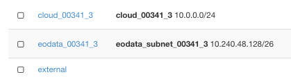

.. note::

   This number, **341**, will vary from cloud to cloud and you can see it in the upper left corner of the browser window.

In particular, two networks that come as default have their names starting with:

  * **cloud_00**, the network for internal communication of all the objects in the account

  * **eodata_00**, the network for accessing the Earth Observation Data (images from satellites for you to use)

  * The third network is called **external** and has access to the outside world -- the Internet, at large.

Click on option **Network** -> **Security Groups** to verify the presence of two default security groups:

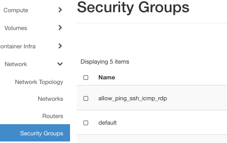

The default security groups are:

  * **default**, the default security group

  * **allow_ping_ssh_icmp_rdp**, to allow access for the usual types of traffic: for the Internet, from Windows to the cloud and so on.

The former shuts down any communication to the virtual machine for security reasons while the latter opens up only the ports for normal use. In this case, it will be for traffic of types **ping**, **ssh**, **icmp** and **rdp**. Please see Prerequisite No. 3 for definition of those terms.

Create a New Project
--------------------

A project can contain users, groups and their roles so the first step is to define a project and later add users, groups and roles.

Step 1 Create Project
---------------------

Choose **Identity** → **Projects** menu on the left side of the screen.

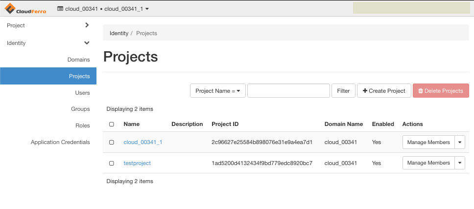

Click on **Create Project** button.

Complete the project name (this is obligatory) and make sure that checkbox **Enable** is ticked on so that your project becomes active.

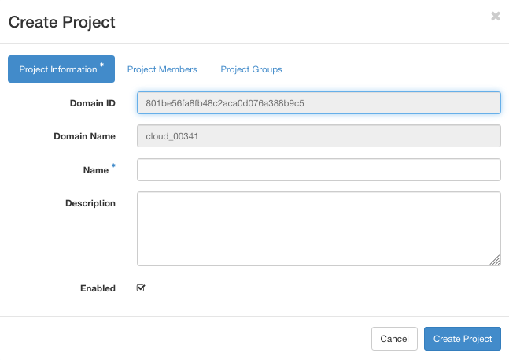

Next switch on the **Project Members** tab.

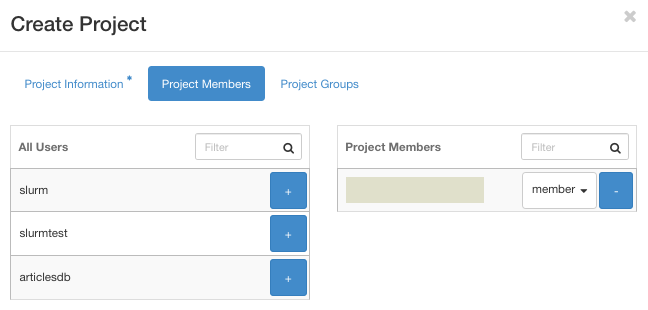

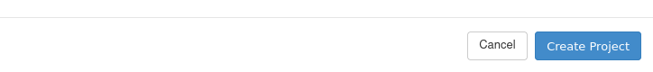

You can add users to project by clicking on "+" icon from the user list.

It is possible to grant privileges to all of the members in project by selecting proper role from the drop-down menu.

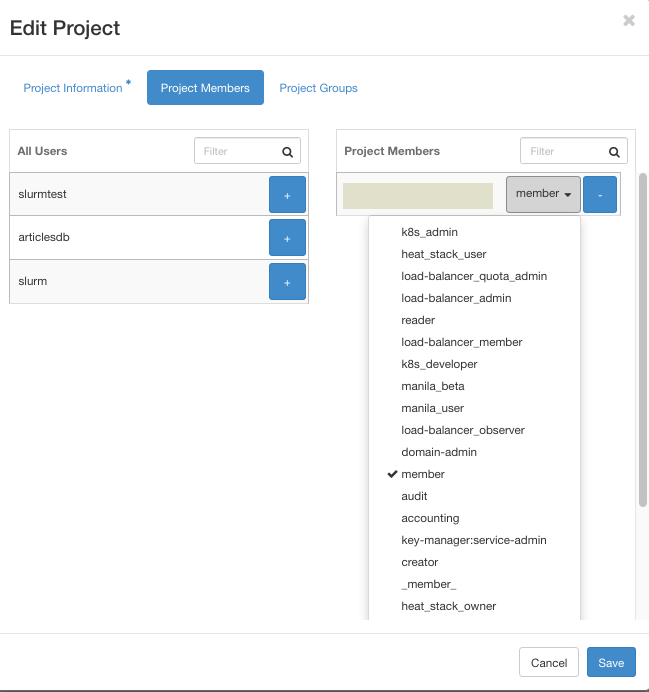

Role **member** is the most basic role which has access to most parts of the cloud. Roles starting with *k8s-* are accessing Kubernetes clusters so disregard them if you are not using Kubernetes clusters in your project. For security reasons user types *heat_stack_user* and *admin* should **not** be used unless you know what you are doing.

The last tab, **Project Groups**, allows you to add groups of users with the same privileges.

To finish setting up a new project, click on the blue **Create Project** button.

If you have set up the configuration properly, new project should appear in the list. Note the **Project ID** column as it will be needed in the next step.

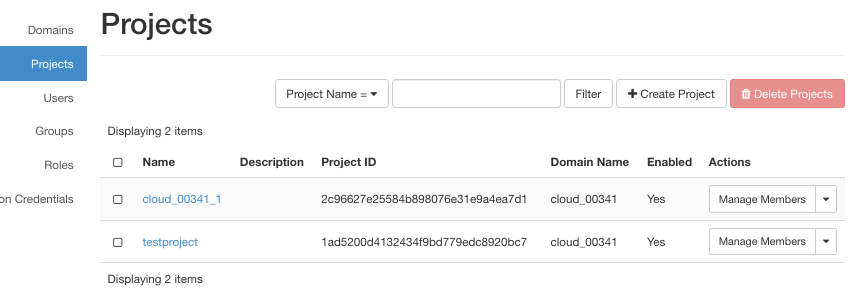

You now have two projects at your disposal:

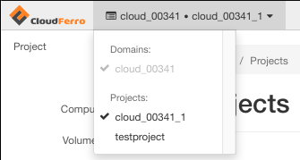

To activate the new project, **testproject**, click on its name. The name of the active project will be available in the upper left corner:

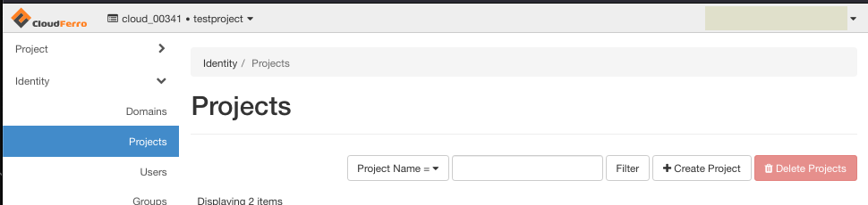

As mentioned earlier, your new project will **not** have access to the external network. To verify, choose project, select **Network** -> **Networks** and you will see that the new project has no networks defined.

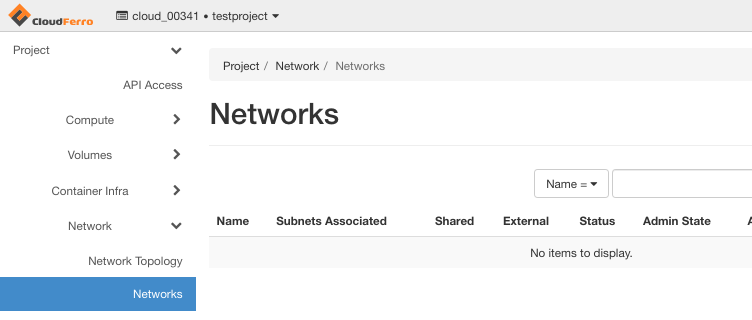

For security groups, the situation is similar: the default one is present, but the **allow_ping_ssh_icmp_rdp** security group is missing.

Step 2 Add external network to the project
------------------------------------------

.. jinja:: brand_names

   To add external network to such project you must contact Customer Support by creating a ticket. Instructions how to do that are in article :doc:`/accountmanagement/Help-Desk-And-Support/Help-Desk-And-Support`. The ticket should include project ID from the Projects list. To get the project ID, click on **Project** -> **API Access**

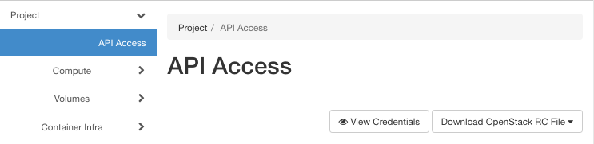

and then on button **View Credentials** on the right side. A window with user name, user ID, project name, project ID and authentication URL will appear.

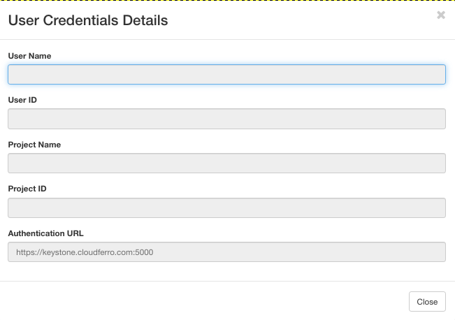

Copy those values and put them into the email message in Helpdesk window. Click on button **Create Request** to send it:

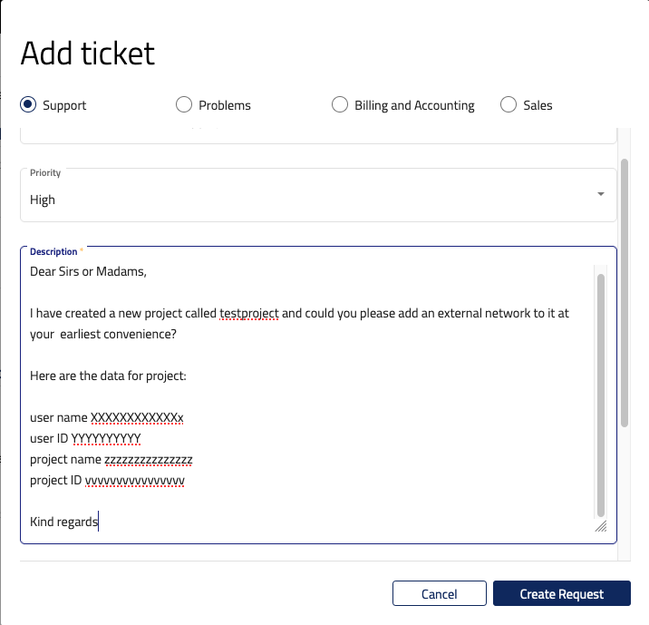

Step 3 Add security group to the project
----------------------------------------

When the support answers, you will see **external** network in the network list. Then create security group and enable ports **22** (SSH) and **3389** (RDP) following the instructions in Prerequisite No. 3. Your security group should look like this:

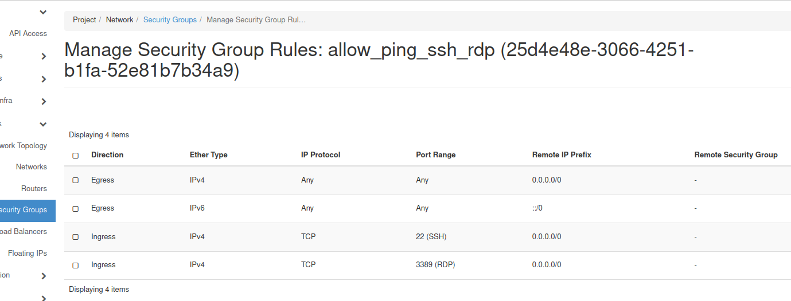

Port 22 will enable SSH access to the instance, while port 3389 will enable access through RDP. SSH and RDP are protocols for accessing a virtual machine from local Linux or Windows machines, respectively.

Step 4 Create network with router
---------------------------------

The last step is to create a network with a router. See Prerequisite No. 4.

What To Do Next
---------------

Your **testproject** is ready for creating new instances. For example, see articles:

.. jinja:: brand_names

   :doc:`/cloud/How-to-create-a-Linux-VM-and-access-it-from-Windows-desktop-on-{{ brand_name_hyphen }}/How-to-create-a-Linux-VM-and-access-it-from-Windows-desktop-on-{{ brand_name_hyphen }}`

.. jinja:: brand_names

   :doc:`/cloud/How-to-create-a-Linux-VM-and-access-it-from-Linux-command-line-on-{{ brand_name_hyphen }}/How-to-create-a-Linux-VM-and-access-it-from-Linux-command-line-on-{{ brand_name_hyphen }}`

If you want a new user to have access to **testproject**, the following articles will come handy:

.. jinja:: brand_names

   :doc:`/accountmanagement/Inviting-New-User`.

   :doc:`/accountmanagement/Removing-User-From-Organization/Removing-User-From-Organization`.

   :doc:`/accountmanagement/Accounts-and-Projects-Management`.

