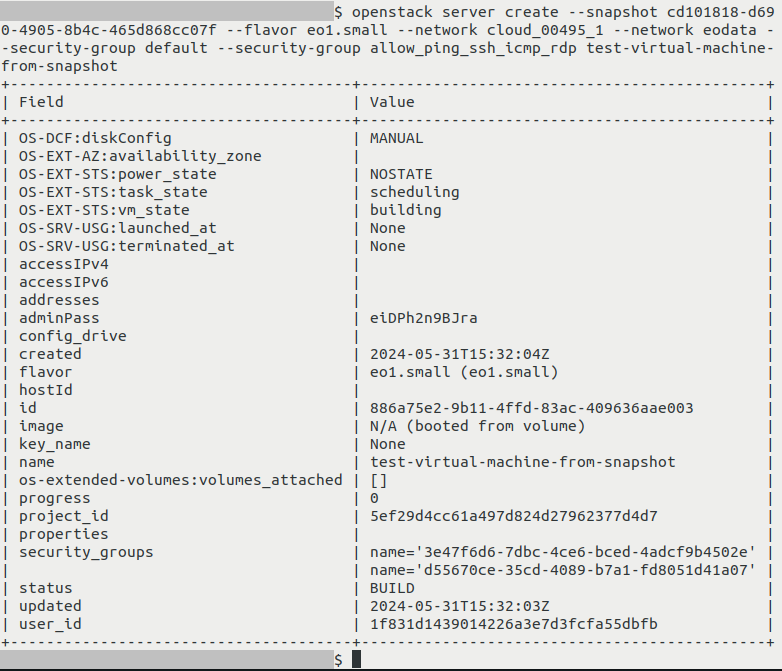

How to create a VM from volume snapshot using OpenStack CLI on |brand-name|
===============================================================================

In this article, you will learn how to create a virtual machine from volume snapshot using OpenStack CLI client.

Prerequisites
------------------------

No. 1 **Account**

You need a |brand-name| hosting account with access to the Horizon interface: |brand-name-site-auth-link|.

No. 2 **Familiarity with the process of creating a virtual machine**

.. jinja:: brand_names

   You need to be familiar with the basics of creating a virtual machine with OpenStack CLI client :doc:`/cloud/How-to-create-a-VM-using-the-OpenStack-CLI-client-on-{{ brand_name_hyphen }}-cloud/How-to-create-a-VM-using-the-OpenStack-CLI-client-on-{{ brand_name_hyphen }}-cloud`.

In this article, we work with above mentioned article but modify some of their steps.

No. 3 **Volume snapshot created from a bootable volume which contains an operating system**

We assume that you not only already have a volume snapshot but that it was also created from a bootable volume in itself.

See the following articles for more information:

.. jinja:: brand_names

    * :doc:`/datavolume/Bootable-versus-non-bootable-volumes-on-{{ brand_name_hyphen }}/Bootable-versus-non-bootable-volumes-on-{{ brand_name_hyphen }}`

    * :doc:`/datavolume/How-to-create-or-delete-volume-snapshot-on-{{ brand_name_hyphen }}/How-to-create-or-delete-volume-snapshot-on-{{ brand_name_hyphen }}`

Of course, if you want your new virtual machine to be operational, that bootable volume needs to have a functional operating system, for example Ubuntu 22.04.

In this article, term *source volume* denotes the volume from which the volume snapshot that we are working with was created.

No. 4 **Access to the virtual machine being created**

There are different methods of accessing virtual machines. This includes SSH and web console.

For SSH, while creating a virtual machine from a volume snapshot, there is an option of "injecting" an SSH key to the machine being created. Some operating systems are compatible with this feature, while others are not.

If for your particular volume snapshot attaching of an SSH key with this method does not work, make sure that your installation of an operating system includes some method of accessing it.

No. 5 **OpenStack CLI client**

To use OpenStack CLI client, you need to have it installed. One of the following three articles should cover your situation:

.. jinja:: doc_links

   * :doc:`{{ openstackclient_linux }}`
   * :doc:`{{ openstackclient_windows }}`
   * :doc:`{{ openstackclient_windows_wsl }}`

Once you have installed the OpenStack CLI client, authenticate before using it:

.. jinja:: doc_links

   * :doc:`{{ openstack_cli_auth }}`

.. jinja:: doc_links

   To use the OpenStack CLI client to control |brand-name| cloud, authenticate first: :doc:`{{ openstack_cli_auth }}`

What We Are Going To Cover
-----------------------------

 * :ref:`example-scenario-in-which-this-article-applies`

 * :ref:`creating-a-vm-from-volume-snapshot-using-the-openstack-cli-client`

   * :ref:`step-1-build-a-command-and-execute-it`

     * :ref:`changes-to-step-choose-an-image`

     * :ref:`changes-to-step-key-pair`

     * :ref:`example-of-creating-a-vm-from-volume-snapshot-using-the-openstack-cli-client`

   * :ref:`step-2-other-operations`

.. _example-scenario-in-which-this-article-applies:

Example scenario in which this article applies
----------------------------------------------------

.. jinja:: brand_names

   You created a virtual machine with Ubuntu 22.04 by following :doc:`/cloud/How-to-create-a-VM-using-the-OpenStack-CLI-client-on-{{ brand_name_hyphen }}-cloud/How-to-create-a-VM-using-the-OpenStack-CLI-client-on-{{ brand_name_hyphen }}-cloud` with slight modifications.

For this example let's assume that we chose:

 * default image named **Ubuntu 22.04 LTS** as the source image
 * **eo1.small** as the flavor of the VM
 * **ssh-key** as the SSH key which is to be injected to the virtual machine during its creation
 * networks: **cloud_00734_1** and **eodata_00734_1**
 * security groups: **default** and **allow_ping_ssh_icmp_rdp**
 * name of the virtual machine: **ubuntu-vm**

In your case, some of these options will be different.

You also added another option to your **openstack server create** command: **\-\-boot-from-volume**

This option creates a volume which will serve as the boot drive of the virtual machine. After this option you specify that size in GB. In our case, we chose volume which has 16 GB.

We named our virtual machine **ubuntu-vm**

In this case, the final command was:

.. code::

   openstack server create --image "Ubuntu 22.04 LTS" --flavor eo1.small --key-name ssh-key --network cloud_00734_1 --network eodata_00734_1 --security-group default --security-group allow_ping_ssh_icmp_rdp --boot-from-volume 16 ubuntu-vm

.. jinja:: brand_names

   After some time, you shut down your virtual machine and deleted it. The volume which was used as boot volume of that VM is still available. You created a snapshot of that volume: :doc:`/datavolume/How-to-create-or-delete-volume-snapshot-on-{{ brand_name_hyphen }}/How-to-create-or-delete-volume-snapshot-on-{{ brand_name_hyphen }}`.

.. _creating-a-vm-from-volume-snapshot-using-the-openstack-cli-client:

Creating a VM from volume snapshot using the OpenStack CLI client
------------------------------------------------------------------------------

.. _step-1-build-a-command-and-execute-it:

Step 1: Build a command and execute it
^^^^^^^^^^^^^^^^^^^^^^^^^^^^^^^^^^^^^^^^^^^^^

.. jinja:: brand_names

   We are modifying the procedure from reference article :doc:`/cloud/How-to-create-a-VM-using-the-OpenStack-CLI-client-on-{{ brand_name_hyphen }}-cloud/How-to-create-a-VM-using-the-OpenStack-CLI-client-on-{{ brand_name_hyphen }}-cloud`.

This procedure involves:

 1. gathering data required for the command used to build the virtual machine
 2. entering that command
 3. executing that command

.. _changes-to-step-choose-an-image:

Changes to step Choose an image
++++++++++++++++++++++++++++++++++++++++++++++

**Do not follow** section **Choose an image** in the reference article. For CLI, that means not attaching parameter **\-\-image** to the final command which you will use to create the virtual machine.

.. jinja:: brand_names

   Instead, add to the final command the parameter **\-\-snapshot**, proceeded by the ID of the volume snapshot. Check article :doc:`/cloud/Bootable-versus-non-bootable-volumes-on-{{ brand_name_hyphen }}` mentioned in Prerequisite No. 3 to learn how to obtain that ID.

For example, if the ID is **cd101818-d690-4905-8b4c-465d868cc07f**, this is what you should add:

.. code::

   --snapshot cd101818-d690-4905-8b4c-465d868cc07f

.. _changes-to-step-key-pair:

Changes to step Key Pair
++++++++++++++++++++++++++++++++++

If your particular installation of an operating system supports "injecting" of an SSH key this way, you can perform this step just like it was done in the reference article.

If, however, it does not support this process, omit parameter **\-\-key-name** in your final command.

.. We assume that for your particular volume snapshot uploading of an SSH key during volume creation does not work. Your snapshot should already contain the key pair if it is needed.

.. Therefore, omit parameter **\-\-key-name** which is used to pass the name of the SSH key pair. This means that no SSH key will be uploaded to the virtual machine during its creation.

.. _example-of-creating-a-vm-from-volume-snapshot-using-the-openstack-cli-client:

Example of creating a VM from volume snapshot using the OpenStack CLI client
^^^^^^^^^^^^^^^^^^^^^^^^^^^^^^^^^^^^^^^^^^^^^^^^^^^^^^^^^^^^^^^^^^^^^^^^^^^^^^^^^^^^^^

Let's assume that we want to create a virtual machine based on the following parameters:

 * Source: volume snapshot which has the following ID: **cd101818-d690-4905-8b4c-465d868cc07f**
 * Flavor: **eo1.small**
 * Networks: **cloud_00495_1** and **eodata**
 * Security groups: **default** and **allow_ping_ssh_icmp_rdp**
 * Name: **test-virtual-machine-from-snapshot**

In this case, this is how the command used to create your virtual machine would look like:

.. code::

   openstack server create \
   --snapshot cd101818-d690-4905-8b4c-465d868cc07f \
   --flavor eo1.small \
   --network cloud_00495_1 \
   --network eodata_00495_1 \
   --security-group default \
   --security-group allow_ping_ssh_icmp_rdp \
   test-virtual-machine-from-snapshot

The output:

.. _step-2-other-operations:

Step 2: Other operations
^^^^^^^^^^^^^^^^^^^^^^^^^

You should be able to attach a floating IP to a virtual machine created in this way just like to any other virtual machine.

See appropriate section of the reference article.

The floating IP will almost certainly be different from the value given in that article so adjust where needed.

Virtual machines are controlled using different methods, for example SSH or web console. Whatever methods are available on the operating system stored on the volume snapshot should be available on your new virtual machine, since this is the assumption of this article. However, the commands used might be different, for example if the floating IP changed, the SSH command used to access the virtual machine might also change.

.. _what-to-do-next:

What To Do Next
--------------------

.. jinja:: brand_names

   Now that you have created a virtual machine from your volume snapshot, the need may arise in the future to delete that volume snapshot. To that end, see :doc:`/datavolume/How-to-create-or-delete-volume-snapshot-on-{{ brand_name_hyphen }}/How-to-create-or-delete-volume-snapshot-on-{{ brand_name_hyphen }}`

.. jinja:: brand_names

   If you want to create a virtual machine from a volume snapshot using the Horizon dashboard instead of the OpenStack CLI client, see: :doc:`/cloud/How-to-create-a-VM-from-volume-snapshot-using-Horizon-dashboard-on-{{ brand_name_hyphen }}/How-to-create-a-VM-from-volume-snapshot-using-Horizon-dashboard-on-{{ brand_name_hyphen }}`
