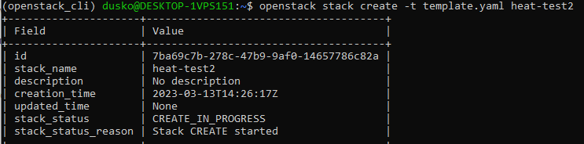
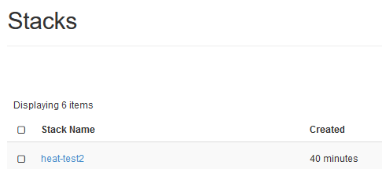
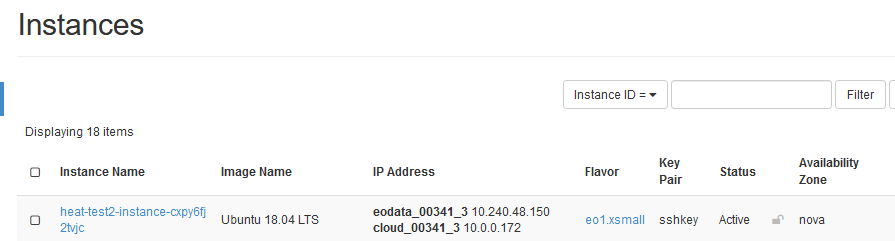
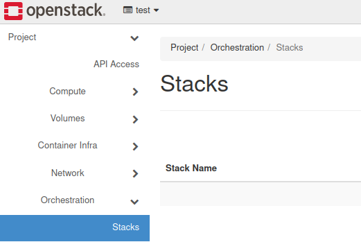
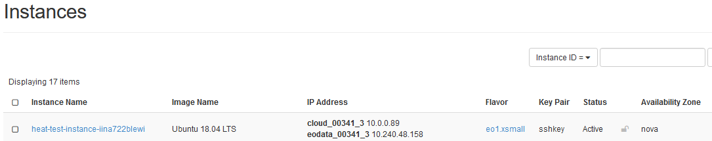
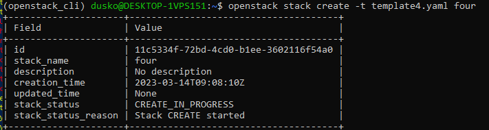
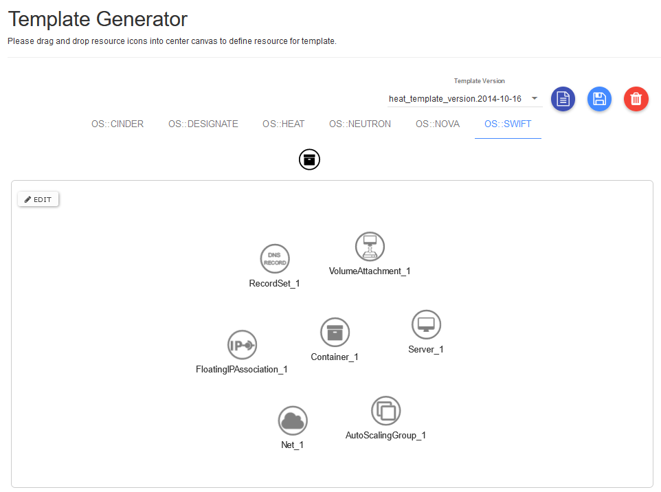

How to create a set of VMs using OpenStack Heat Orchestration on |brand-name|
=============================================================================

Heat is an OpenStack component responsible for orchestration. Its purpose is to provide an automation engine and optimize deployment processes.

Heat receives commands through templates, which are text files in **YAML** format. A template describes the infrastructure that you want to deploy. The deployed environment is called a **stack** and can consist of different OpenStack resources.

What We Are Going To Cover
--------------------------

* Typical parts of a Heat template.
* Basic template for using Heat.
* How to get data for a Heat template.
* Using Heat with CLI.
* Using Heat with GUI.
* More advanced template for Heat.

Prerequisites
-------------

No. 1 **Account**

You need a |brand-name| hosting account with access to the Horizon interface: |brand-name-site-auth-link|.

No. 2 **Installed Python and its virtualenv**

.. jinja:: brand_names

   If you want to use **Heat** through CLI commands, Python must be installed and its virtual environment activated. See article :doc:`/cloud/How-to-install-Python-virtualenv-or-virtualenvwrapper-on-{{ brand_name_hyphen }}/How-to-install-Python-virtualenv-or-virtualenvwrapper-on-{{ brand_name_hyphen }}`.

   You must also authorize to OpenStack: {{ doc_links.openstack_cli_auth }}

Always use the latest value of image ID
---------------------------------------

From time to time, the default operating system images in |brand-name| cloud are upgraded to new versions. As a consequence, their **image ID** changes. For example, the image ID for Ubuntu 20.04 LTS may have been **574fe1db-8099-4db4-a543-9e89526d20ae** at the time this article was originally written. When working through the article, you should normally use the current value of the image ID instead.

If you automate OpenStack operations with Heat, Terraform, Ansible, or another automation tool, avoid hardcoding an old image ID. Once the default image is upgraded and its ID changes, automation that uses the old ID may stop working.

.. warning::

   Make sure that your automation code uses the **current value** of an OS image ID, not a hardcoded historical value.

Basic template for using Heat
-----------------------------

Using the following snippet, you can create one virtual machine booted from an ephemeral disk. Create a text file called **template.yaml** with your preferred text editor and save it to disk:

.. code::

   heat_template_version: 2015-04-30

   resources:
     instance:
       type: OS::Nova::Server
       properties:
         flavor: eo1.xsmall
         image: Ubuntu 18.04 LTS
         networks:
           - network: <type in your network name here, e.g. cloud_00341_3>
           - network: <type in your network name here, e.g. eodata_00341_3>
         key_name: <type in your ssh key name>
         security_groups:
           - allow_ping_ssh_icmp_rdp
           - default

.. important::

   **YAML** format does not allow tabs. Use spaces instead.

Typical parts of a Heat template
--------------------------------

Here are the basic elements of a Heat template:

**heat_template_version**
   The exact version of the Heat template. Template versions vary in supported modules, parameters, customization options, and other features. You can view template versions in **Orchestration** → **Template Versions**.

**resources**
   Entry that starts the definition of components to be deployed.

**instance**
   Name of the resource. You can choose a different name.

**type**
   Definition of an OpenStack component. A comprehensive list is available in **Orchestration** → **Resource Types**.

**properties**
   Required parameters for deploying a component.

.. note::

   Your account normally has a network starting with **cloud_**, but it may also have other networks. In the following examples, **eodata_** is used as an example of an additional network that can be added while creating and using Heat templates.

How to get data for Heat template
---------------------------------

Templates need data for images, flavors, networks, key pairs, security groups, and other OpenStack resources. You can usually collect this information from the relevant Horizon sections.

.. jinja:: caption_colors

   .. list-table:: :{{ caption }}:`Where to find values for a Heat template`
      :header-rows: 1
      :widths: 30 70

      * - :{{ header }}:`Template value`
        - :{{ header }}:`Where to find it in Horizon`
      * - **flavor**
        - **Compute** → **Instances** → **Launch Instance** → **Flavor**
      * - **image**
        - **Compute** → **Instances** → **Launch Instance** → **Source**
      * - **networks**
        - **Network** → **Networks**, for example **cloud** and **eodata** networks for your domain
      * - **key_name**
        - **Compute** → **Key Pairs**
      * - **security_groups**
        - **Network** → **Security Groups**

You can work with Heat in two ways:

* through Command Line Interface (CLI), with **python-heatclient** installed,
* interactively, through Horizon.

Using Heat with CLI
-------------------

Assuming you have installed Python and activated its working environment, as explained in Prerequisite No. 2, run the **pip** command to install **python-heatclient**:

.. code::

   pip install python-heatclient

To run a prepared template and deploy a stack, use the following general command:

.. code::

   openstack stack create -t template.yaml <stackname>

In this command, **-t** assigns the template for deployment and **<stackname>** defines the name of the stack.

As a result, a new stack is executed and a new instance is created. For example, the command:

.. code::

   openstack stack create -t template.yaml heat-test2

produces output similar to this:

In Horizon, this is what you see under **Orchestration** → **Stacks**:

A new instance is created under **Compute** → **Instances**:

Using Heat with GUI
-------------------

Log in to the Horizon dashboard, choose **Orchestration**, and then open the **Stacks** tab:

.. |click_button_launch_stack| image:: click_button_launch_stack.png

Navigate to the right side of the screen, click the |click_button_launch_stack| button, and open the **Select Template** window.

Open the **Template Source** selector and choose a file, direct input, or URL to your template.

.. figure:: orch4.png
   :class: image-with-border

Enter the text of the template you copied from **template.yaml** directly into the form:

.. figure:: select_template_yaml.png
   :class: image-with-border

Provide a name for your stack and your OpenStack password:

.. figure:: launch_stack.png
   :class: image-with-border

As a result, a new Heat template is created:

.. figure:: create_new_template.png
   :class: image-with-border

By creating a stack in Horizon, you also execute that template. The result is that a new instance is created. You can see it under **Compute** → **Instances**:

At this point, there are two stacks and two new instances: one created by using CLI and the other by using Horizon.

Create four VMs using an advanced Heat template
-----------------------------------------------

In the following example, you will attach parameters and then create a **ResourceGroup** with a counter, a VM booted from Cinder volume, and several predefined outputs. In parameter **count**, you state that you want to generate **4** instances at once. Save the following code as **template4.yaml**:

.. code::

   heat_template_version: 2015-04-30

   parameters:
      key_name:
          type: string
          label: sshkey
          description: SSH key to be used for all instances
          default: <insert your ssh key name here>
      image_id:
          type: string
          description: Image to be used. Check all available options in Horizon dashboard or, with CLI, use openstack image list command.
          default: Ubuntu 18.04 LTS
      private_net_id:
          type: string
          description: ID/Name of private network
          default: <insert your network name here, e.g. cloud_00341_3>

   resources:
          Group_of_VMs:
                  type: OS::Heat::ResourceGroup
                  properties:
                          count: 4
                          resource_def:
                                  type: OS::Nova::Server
                                  properties:
                                          name: my_vm%index%
                                          flavor: eo1.xsmall
                                          image: { get_param: image_id }
                                          networks:
                                                  - network: { get_param: private_net_id }
                                          key_name: { get_param: key_name }
                                          security_groups:
                                                  - allow_ping_ssh_icmp_rdp
                                                  - default

          VOL_FAQ:
                  type: OS::Cinder::Volume
                  properties:
                          name: vol
                          size: 20
                          image: { get_param: image_id }

          With_volume:
                  type: OS::Nova::Server
                  properties:
                          flavor: eo1.xsmall
                          block_device_mapping: [{"volume_size": 20, "volume_id": { get_resource: VOL_FAQ }, "delete_on_termination": False, "device_name": "/dev/vda" }]
                          networks:
                                   - network: { get_param: private_net_id }
                          key_name: { get_param: key_name }
                          security_groups:
                                   - allow_ping_ssh_icmp_rdp
                                   - default
                          image: { get_param: image_id }

   outputs:
          SERVER_DETAILS:
                  description: Shows details of all virtual servers.
                  value: { get_attr: [ Group_of_VMs, show ] }

The first step is to create a real volume called **VOL_FAQ**. The second step is to create a VM called **With_volume**.

**Explanation**

**Parameters**
   Here you provide default values, such as **key_name**, **image_id**, and **private_net_id**, and later inject them into resource definitions. The syntax is:

   .. code::

      { get_param: param_name }

**ResourceGroup**
   Component used for repeated deployment, for example two or more identical VMs.

**Count**
   Defines a variable for iterative operations.

**resource_def**
   Starting statement for defining group resources.

**%index%**
   Adds an iterative number to the VM name, increasing values starting from 0.

**block_device_mapping**
   Property used to define a bootable Cinder volume for an instance.

**outputs**
   Additional information concerning deployed elements of the stack. In this case, it returns a **show** attribute output. You can examine this kind of information by using **openstack stack output list**. Available attributes for every component `can be found here <https://docs.openstack.org/heat/latest/template_guide/openstack.html>`_.

Execute the template with the following command:

.. code::

   openstack stack create -t template4.yaml four

The name of the stack is **four**. This is the result in the CLI window:

Under **Compute** → **Instances**, you see five new instances:

.. figure:: four_created.png
   :class: image-with-border

Four of them have names **my_vm0**, **my_vm1**, **my_vm2**, and **my_vm3**, as defined in line **name: my_vm%index%** in the template. The fifth is called **four-With_volume-lrejw222kfvi**. Its name starts with the stack name, while the rest is generated automatically.

What To Do Next
---------------

You can write your own templates as **YAML** files, or you can use **Orchestration** → **Template Generator** to enter components interactively:

Further explanation of this option is outside the scope of this article.