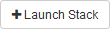
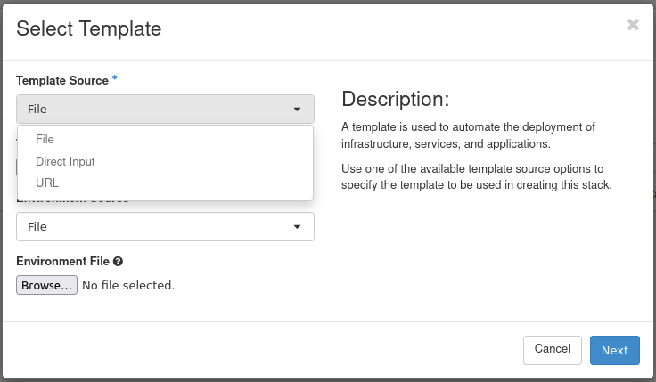
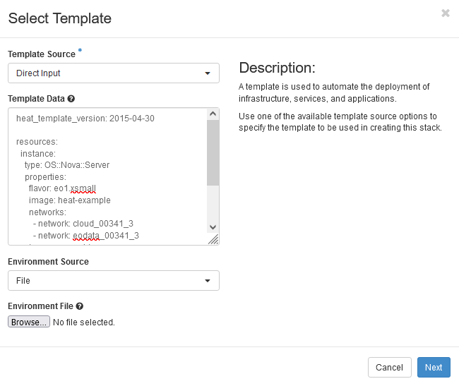
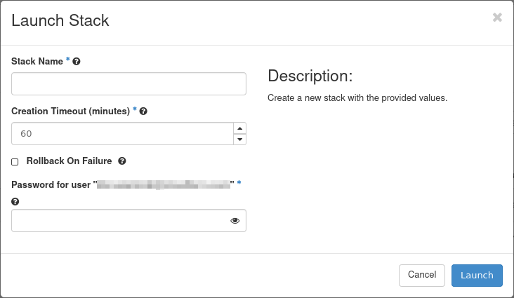
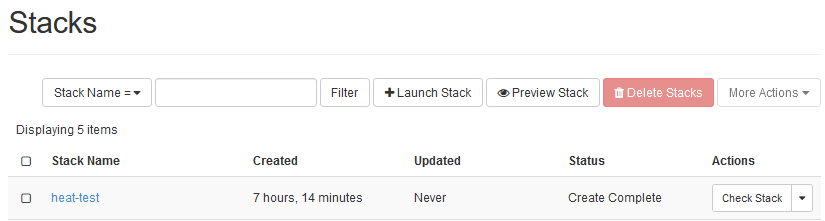
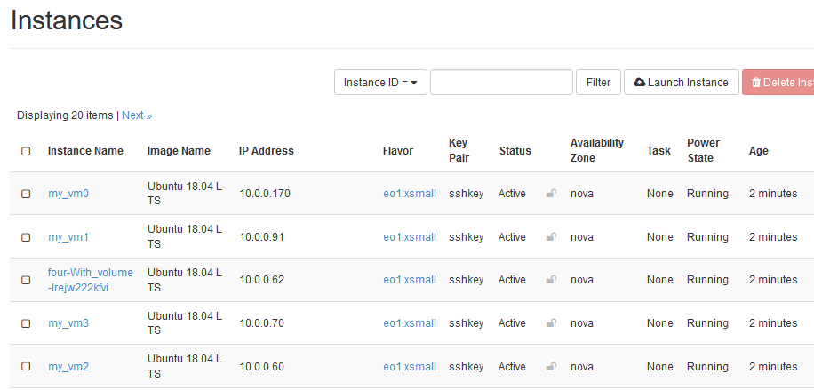

How to create a set of VMs using OpenStack Heat Orchestration on |brand-name|
=============================================================================

Heat is an OpenStack component responsible for Orchestration. Its purpose is to deliver automation engine and optimize processes.

Heat receives commands through templates which are text files in *yaml* format. A template describes the entire infrastructure that you want to deploy. The deployed environment is called a *stack* and can consist of any combination out of the **102** different resources that are available in OpenStack.

What We Are Going To Cover
--------------------------
 * Typical parts of a Heat template
 * Basic template for using Heat
 * How to get data for Heat Template
 * Using Heat with CLI
 * Using Heat with GUI
 * More advanced template for Heat

Prerequisites
-------------

No. 1 **Account**

You need a |brand-name| hosting account with access to the Horizon interface: |brand-name-site-auth-link|.

No. 2 **Installed Python and its virtualenv**

.. jinja:: brand_names

   If you want to use **Heat** through CLI commands, Python must be installed and its virtual environment activated. See article :doc:`/cloud/How-to-install-Python-virtualenv-or-virtualenvwrapper-on-{{ brand_name_hyphen }}/How-to-install-Python-virtualenv-or-virtualenvwrapper-on-{{ brand_name_hyphen }}`.

   You must also authorize to Openstack: {{ doc_links.openstack_cli_auth }}

Always use the latest value of image id
---------------------------------------

From time to time, the default images of operating systems in the |brand-name| cloud are upgraded to the new versions. As a consequence, their **image id** will change. Let's say that the image id for Ubuntu 20.04 LTS was **574fe1db-8099-4db4-a543-9e89526d20ae** at the time of writing of this article. While working through the article, you would normally take the **current** value of image id, and would use it to replace **574fe1db-8099-4db4-a543-9e89526d20ae** throughout the text.

Now, suppose you wanted to automate processes under OpenStack, perhaps using Heat, Terraform, Ansible or any other tool for OpenStack automation; if you use the value of **574fe1db-8099-4db4-a543-9e89526d20ae** for image id, it would remain **hardcoded** and once this value gets changed during the upgrade, the automated process may stop to execute.

.. warning::

   Make sure that your automation code is using the **current value** of an OS image id, not the hardcoded one.

Basic template for using Heat
-----------------------------

Using the following snippet, you can create one virtual machine, booted from ephemeral disk. Create a text file called **template.yaml** with your favorite text editor and save it to disk:

.. code::

    heat_template_version: 2015-04-30

    resources:
      instance:
        type: OS::Nova::Server
        properties:
          flavor: eo1.xsmall
          image: Ubuntu 18.04 LTS
          networks:
            - network: <type in your network name here, e.g. cloud_00341_3>
            - network: <type in your network name here, e.g. eodata_00341_3>
          key_name: <type in your ssh key name>
          security_groups:
            - allow_ping_ssh_icmp_rdp
            - default

.. important::

   *Yaml* format does not allow for tabs, you must enter spaces instead.

Typical parts of a Heat template
--------------------------------

Here are the basic elements of a Heat template:

**heat_template_version**
   The exact version of heat template. Each of them varies in many ways (including support for various modules, additional parameters, customization etc). See **Orchestration** -> **Template Versions**.

**resources**
   Entry to commence providing particular components for deployment.

**instance**
   Name of resource (you can type in anything on your own).

**type**
   Definition of an OpenStack component (a comprehensive list is under **Orchestration** -> **Resource Types**)

**properties**
   Required parameters for deploying a component.

.. note::

   Your account will normally have a network starting with **cloud_** but it may also have other networks. In the following examples, we use network called **eodata_** as an example of an additional network that can be added while creating and using Heat templates.

How to get data for Heat template
---------------------------------

Templates need data for images, flavor networks, key pairs, security groups and so on. You would normally know all these elements in advance, or you could "look around" at various parts of OpenStack environment:

.. jinja:: caption_colors

   .. list-table:: :{{ caption }}:`Where to find values for a Heat template`
      :header-rows: 1
      :widths: 30 70

      * - :{{ header }}:`Template value`
        - :{{ header }}:`Where to find it in Horizon`
      * - **flavor**
        - **Compute** → **Instances** → **Launch Instance** → **Flavor**
      * - **image**
        - **Compute** → **Instances** → **Launch Instance** → **Source**
      * - **networks**
        - **Network** → **Networks**, for example **cloud** and **eodata** networks for your domain
      * - **key_name**
        - **Compute** → **Key Pairs**
      * - **security_groups**
        - **Network** → **Security Groups**

You can work with Heat in two ways:

 * through Command Line Interface (CLI), with **python-heatclient** preinstalled and
 * interactively, through Horizon commands.

Using Heat with CLI
-------------------

Assuming you have

 * installed Python and
 * activated its working environment

as explained in Prerequisite No. 2, run **pip** command to install **python-heatclient**:

.. code::

  pip install python-heatclient

To run a prepared template in order to deploy a stack, this is what a general command would look like:

.. code::

   openstack stack create -t template.yaml <stackname>

where **-t** assigns template for deployment and **<stackname>** defines name for the stack.

As a result, a new Stack would be executed and a new instance would be created. For example, the command

.. code::

   openstack stack create -t template.yaml heat-test2

would produce the following output:

.. figure:: heat-test2.png
   :class: image-with-border

In Horizon, this is what you would see under **Orchestration** -> **Stacks**:

.. figure:: heat_test2_stacks.png
   :class: image-with-border

A new instance would be created under **Compute** -> **Instances**:

.. figure:: heat_test2_instances.png
   :class: image-with-border

Using Heat with GUI
-------------------

Log in to the Horizon dashboard, choose **Orchestration** and then **Stacks** tab:

.. figure:: stacks_menu.png
   :class: image-with-border

Navigate to the right part of the screen, click on button |click_button_launch_stack| and bring **Select Template** window to the screen.

Enroll Template Source selector and choose a particular file, Direct Input or URL to your template.

Enter the text of the template you copied from file **template.yaml** directly into the form:

Provide a name of your stack and your openstack password:

As a result, a new Heat template will have been created:

By creating a stack in Horizon you have also executed that template. The result is that a new instance has been created -- see it under **Compute** -> **Instances**:

.. figure:: heat_instance.png
   :class: image-with-border

We end up with two stacks and two new instances, once using a CLI and the other time, using a GUI.

Create four VMs using an advanced Heat template
-----------------------------------------------

In the following example we will attach parameters and then create ResourceGroup with counter, a VM booted from Cinder Volume and several predefined outputs. In parameter **count** we state that we want to generate **4** instances at once, which will yield us the automation that we wanted in the first place. Save the following code as **template4.yaml**:

.. code::

    heat_template_version: 2015-04-30

    parameters:
       key_name:
           type: string
           label: sshkey
           description: SSH key to be used for all instances
           default: <insert your ssh key name here>
       image_id:
           type: string
           description: Image to be used. Check all available options in Horizon dashboard or, with CLI, use openstack image list command.
           default: Ubuntu 18.04 LTS
       private_net_id:
           type: string
           description: ID/Name of private network
           default: <insert your network name here, e.g. cloud_00341_3>

    resources:
           Group_of_VMs:
                   type: OS::Heat::ResourceGroup
                   properties:
                           count: 4
                           resource_def:
                                   type: OS::Nova::Server
                                   properties:
                                           name: my_vm%index%
                                           flavor: eo1.xsmall
                                           image: {get_param: image_id}
                                           networks:
                                                   - network: {get_param: private_net_id}
                                           key_name: {get_param: key_name}
                                           security_groups:
                                                   - allow_ping_ssh_icmp_rdp
                                                   - default

           VOL_FAQ:
                   type: OS::Cinder::Volume
                   properties:
                           name: vol
                           size: 20
                           image : {get_param: image_id}

           With_volume:
                   type: OS::Nova::Server
                   properties:
                           flavor: eo1.xsmall
                           block_device_mapping: [{"volume_size": 20, "volume_id": {get_resource: VOL_FAQ}, "delete_on_termination": False, "device_name": "/dev/vda"}]
                           networks:
                                    - network: {get_param: private_net_id}
                           key_name: {get_param: key_name}
                           security_groups:
                                    - allow_ping_ssh_icmp_rdp
                                    - default
                           image : {get_param: image_id}

    outputs:
           SERVER_DETAILS:
                   description: Shows details of all virtual servers.
                   value: {get_attr: [Group_of_VMs, show]}

The first step is to create a real volume (called VOL_FAQ) and the second is to create a VM (With_volume).

**Explanation**

**Parameters**
   Here you provide default values (**key_name**, **image_id**, **private_net_id** in this case) and later inject them into resource definitions. The syntax is:

   .. code::

      {get param: param_name}

**ResourceGroup**
   Component being used for repeating deployment, e.g two identical VM’s.

**Count**
   Defines a variable for iterative operations.

**resource_def**
   Starting statement for defining group resources.

**%index%**
   This is how you add iterative number to the VM name, increasing values starting from 0.

**block_device_mapping**
   Property to define a bootable Cinder volume for instance.

**outputs**
   Additional information concerning deployed elements of the stack. In this case it returns a “show” attribute output. You can examine this kind of information by using openstack stack output list. Available attributes for every component `can be found here. <https://docs.openstack.org/heat/latest/template_guide/openstack.html>`_.

Execute the template with the following command:

.. code::

   openstack stack create -t template4.yaml four

The name of the stack will be *four*. This is the result in CLI window:

.. figure:: create_heat_4.png
   :class: image-with-border

Under **Compute** -> **Instance** you would see five new instances created:

Four of them have names *my_vm0*, *my_vm1*, *my_vm1* and *my_vm1*, as defined in line **name: my_vm%index%** in the template. The fifth is called **four-With_volume-lrejw222kfvi**. Its name starts the same as the name of the template itself while the rest is automatically generated.

What To Do Next
---------------

You can write your own templates as *yaml* files or you can use option **Orchestration** -> **Template Generator**, which will enable you to enter components in an interactive way:

.. figure:: template_generator.png
   :class: image-with-border

Further explanation of this option is out of scope of this article.

