How to create an instance snapshot using OpenStack CLI on |brand-name|
======================================================================================

In this article, you will learn how to create an instance snapshot on |brand-name| cloud using OpenStack CLI.

Instance snapshots allow you to archive the state of the virtual machine. You can, then, use them for

 * backup,
 * migration between clouds
 * disaster recovery and/or
 * cloning environments for testing or development.

We cover both types of storage for instances, *ephemeral* and *persistent*.

The plan
-----------------

In reality, you will be using the procedures described in this article with the already existing instances.

However, to get a clear grasp of the process, while following this article you are going to create two new instances, one with *ephemeral* and the other with *persistent* type of storage. Let their names be **instance-which-uses-ephemeral** and **instance-which-uses-volume**. You will create an instance snapshot for each of them.

If you are only interested in one of these types of instances, you can follow its respective section of this text.

It goes without saying that after following a section about one type of virtual machine you can clean up the resources you created to, say, save costs.

Or you can keep them and use them to create an instance out of it using one of articles mentioned in What To Do Next.

What We Are Going To Cover
--------------------------

.. contents::
   :depth: 2
   :local:
   :backlinks: none

Prerequisites
-------------

No. 1 **Account**

You need a |brand-name| hosting account with access to the Horizon interface: |brand-name-site-auth-link|.

No. 2 **Ephemeral storage vs. persistent storage**

Before you create or compare instances, make sure you understand the difference between ephemeral and persistent storage in OpenStack.

.. jinja:: doc_links

   * :doc:`{{ ephemeral_vs_persistent }}`

No. 3 **Instance with ephemeral storage**

You need a virtual machine hosted on |brand-name| cloud. You can create an instance with ephemeral storage by following this article:

.. jinja:: doc_links

   * :doc:`{{ create_vm_cli_cloud }}`

The command below is an example of creating an instance that boots from ephemeral storage:

.. code-block:: console

   openstack server create \
     --image Ubuntu-22.04-LTS \
     --flavor eo1.small \
     --key-name ssh-key \
     --network cloud_00734_1 \
     --network eodata \
     --security-group default \
     --security-group allow_ping_ssh_icmp_rdp \
     Test-Ubuntu

Adjust the image, flavor, key name, network names, security groups, and instance name to match your project. With ephemeral storage, only the instance is created. No separate boot volume is created.

No. 4 **Instance with persistent storage**

You also need an instance that boots from persistent storage. To create it, add the **--boot-from-volume** option to the instance creation command, followed by the desired size of the new boot volume in gigabytes.

For example, to create a 16 GB boot volume, add:

.. code-block:: console

   --boot-from-volume 16

Make sure that the selected boot volume size is sufficient for your operating system and workload. You can use the **openstack flavor list** command and the **Disk** column as guidance, but the persistent boot volume size is controlled by the **--boot-from-volume** value.

The complete command can look like this:

.. code-block:: console

   openstack server create \
     --image Ubuntu-22.04-LTS \
     --flavor eo1.small \
     --key-name ssh-key \
     --network cloud_00734_1 \
     --network eodata_00734_1 \
     --security-group default \
     --security-group allow_ping_ssh_icmp_rdp \
     --boot-from-volume 16 \
     Test-Ubuntu-Volume

With persistent storage, OpenStack creates two resources:

* an instance without local ephemeral boot storage,
* a volume attached to that instance as its boot disk.

The instance boots from the attached volume. You can attach additional volumes later, but only the boot volume created with **--boot-from-volume** is used as the system disk.

No. 5 **How to delete resources**

This article creates and compares several OpenStack resources. Before testing, make sure you know how to delete instances, snapshots, volumes, and other related objects.

.. ifconfig:: brand_name in multi_cloud

   .. jinja:: doc_links

      * :doc:`{{ delete_all_project_resources_cli }}`

.. jinja:: doc_links

   * :doc:`{{ volume_snapshot_create_delete }}`

No. 6 **OpenStack CLI client**

You need the OpenStack CLI client installed. Use one of the following articles, depending on your operating system:

.. jinja:: doc_links

   * :doc:`{{ openstackclient_linux }}`
   * :doc:`{{ openstackclient_windows }}`
   * :doc:`{{ openstackclient_windows_wsl }}`

To use the OpenStack CLI client to control |brand-name| cloud, authenticate first.

.. jinja:: doc_links

   * :doc:`{{ openstack_cli_auth }}`

Creating a snapshot of instance which uses ephemeral storage
------------------------------------------------------------------------------

Create and list an instance using CLI
^^^^^^^^^^^^^^^^^^^^^^^^^^^^^^^^^^^^^^^^^^^

Create an instance named **instance-which-uses-ephemeral**, according to Prerequisite No. 3, for example:

.. code::

   openstack server create \
   --image "Ubuntu-22.04-LTS" \
   --flavor eo1.small \
   --key-name ssh-key \
   --network cloud_00734_1 \
   --network eodata_00734_1 \
   --security-group default \
   --security-group allow_ping_ssh_icmp_rdp \
   instance-which-uses-ephemeral

Be sure to use your own parameters in this command.

List your instances:

.. code::

   openstack server list

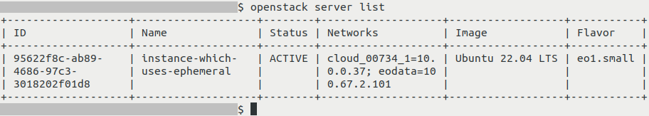

If your instance in column **Status** still has **BUILD**, wait up to a couple of minutes until it has status **ACTIVE**. To refresh the list, execute **openstack server list** again.

The output above includes ID of an instance which can be used to refer to it in other commands. This ID is a string of characters which are all in one line. The OpenStack CLI client might output that as multiple lines for better legibility. If it happens, make sure to enter it as one line regardless of that.

Shut down the VM
^^^^^^^^^^^^^^^^^^^^^^^

Shut down your instance. It is best to do it using the functions of its operating system. If, like here, the image used was **Ubuntu 22.04 LTS**, you could use the Horizon console or SSH access to execute a command such as

.. code::

   sudo shutdown now

The exact command will depend on the type of image, so further explanations are out of scope of this article.

Alternatively, you can use OpenStack CLI command for this purpose. This command will first send the shut down signal and if within a certain time period the instance is not shut down, OpenStack will force this operation. This might lead to data loss. The command is:

.. code::

   openstack server stop <instance-id or instance-name>

After **stop**, you can use either the ID or the instance name.

Using the instance name when referencing it in this command seems to be easier and more natural. However, if there are two or more instances with the same name, the command may return an error. Also, if a name contains special characters like spaces or dollar signs **$**, they will need to be escaped appropriately or this method might not work at all.

That is why using the instance ID is a better choice. In our case, we read that the value of column **ID** in the example above is

**95622f8c-ab89-4686-97c3-3018202f01d8**

and so the command to stop the server becomes

.. code::

   openstack server stop 95622f8c-ab89-4686-97c3-3018202f01d8

You can verify that the instance is shut down by executing **openstack server list** again - the instance should have in column **Status** the following value: **SHUTOFF**

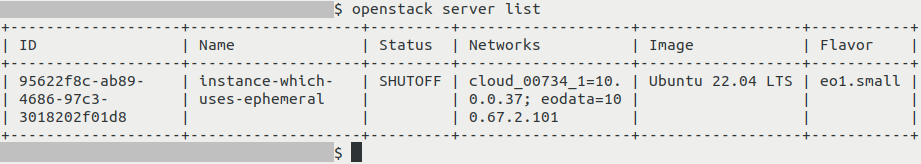

Create a snapshot
^^^^^^^^^^^^^^^^^^^^^^^

To create a snapshot of an instance, use this command:

.. code::

   openstack server image create \
     --name <snapshot-name> \
     --wait \
    <instance-id or instance-name>

Here,

 * **<snapshot-name>** is the name of the snapshot (in this example, we will use **instance_ephemeral_snapshot**)
 * **<instance-id or instance-name>** is ID or name of the instance

A long term approach would be to include into the name of snapshot

 * the date,
 * the time and
 * the version of the snapshot.

Or, it can be anything else that can later remind you which version of the snapshot to use.

.. note::

   Using **--name** parameter here to provide desired name for your snapshot is optional. If you don't provide it, the snapshot should have the same name as your instance. This is how this command would look like without this parameter:

   .. code::

      openstack server image create \
      --wait \
     <instance-id or instance-name>

Parameter **\-\-wait** should cause the OpenStack CLI to return to the command prompt only once your instance snapshot has been created.

If the operation was successful, you should get output similar to this:

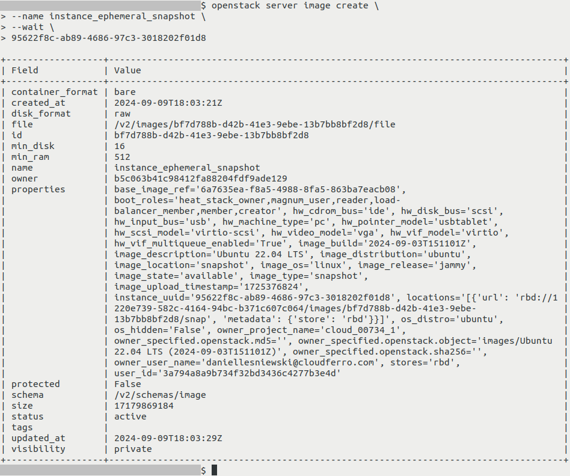

It contains various information about this instance snapshot. Its **size** is equal to **17179869184**, here provided in bytes, and should be the same as the size of boot drive of your virtual machine.

If you now execute

.. code::

   openstack image list

your new instance snapshot should be listed alongside other images, including the ones available on |brand-name| cloud by default. It should have the same name as your instance:

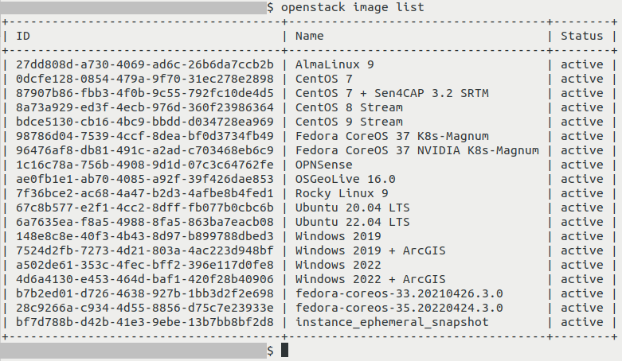

What will the snapshot contain for ephemeral storage
^^^^^^^^^^^^^^^^^^^^^^^^^^^^^^^^^^^^^^^^^^^^^^^^^^^^^^^

This instance snapshot should contain the content of boot drive of your virtual machine. It will not, however, include any content of any volumes which might have been connected to that virtual machine.

:red:`Rule of thumb`: always check whether there are volumes attached to the instance and if you want to preserve their states as well, copy or create snapshot of each of those volumes.

Snapshot of instance which uses persistent storage
------------------------------------------------------------------------------

What does creating a snapshot of instance with persistent storage do?
^^^^^^^^^^^^^^^^^^^^^^^^^^^^^^^^^^^^^^^^^^^^^^^^^^^^^^^^^^^^^^^^^^^^^^^^^^

When creating a snapshot of instance with persistent storage, the following is created:

 * Snapshot of volume which serves as boot drive of the instance.
 * Snapshots of other volumes connected to the virtual machine (if any).
 * Instance snapshot which appears to have the size of 0 bytes (because it does not contain data stored on your virtual machine). This snapshot contains the list of all these other snapshots in its metadata.

Note that names of volumes which were connected to the VM at the time of creating a snapshot will **not** be preserved.

If in the future you want to create a virtual machine from this instance snapshot:

 * If you don't have the snapshot of volume which the instance used as boot volume, you will not be able to recreate the instance from that snapshot.
 * If the snapshot of one of the attached volumes does not exist, the virtual machine will be recreated without that volume.

Create and list instances
^^^^^^^^^^^^^^^^^^^^^^^^^^^^^^^^^^^^^

Create an instance named **instance-which-uses-volume**, according to Prerequisite No. 4, for example:

.. code::

    openstack server create \
    --image "Ubuntu 22.04 LTS" \
    --flavor eo1.small \
    --key-name ssh-key \
    --network cloud_00734_1 \
    --network eodata \
    --security-group default \
    --security-group allow_ping_ssh_icmp_rdp \
    --boot-from-volume 16 \
    instance-which-uses-volume

Be sure to use your own parameters in this command.

List your instances:

.. code::

   openstack server list

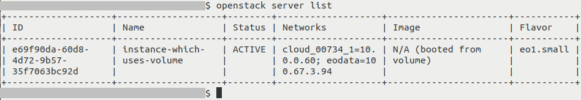

In this example, we have one virtual machine called **instance-which-uses-volume** which uses a volume as its boot drive.

If your instance in column **Status** still has **BUILD**, wait up to a couple of minutes until it has status **ACTIVE**. To refresh the list, execute **openstack server list** again.

The output above includes ID of an instance which can be used to refer to it in other commands. This ID is a string of characters which are all in one line. The OpenStack CLI client might output that as multiple lines for better legibility. If it happens, make sure to enter it as one line regardless of that.

We can view a list of volumes attached to that virtual machine by executing:

.. code::

   openstack server show -c volume_attached <instance-id or instance-name>

where **<instance-id or instance-name>** is the ID or name of your instance.

Using the instance name when referencing it in this command seems to be easier and more natural. However, if there are two or more instances with the same name, the command may return an error. Also, if a name contains special characters like spaces or dollar signs **$**, they will need to be escaped appropriately or this method might not work at all.

That is why using the instance ID is a better choice. In our case, we read that the value of column **ID** in the example above is

**e69f90da-60d8-4d72-9b57-35f7063bc92d**

and so the command to show attached volumes becomes

.. code::

   openstack server show -c volume_attached e69f90da-60d8-4d72-9b57-35f7063bc92d

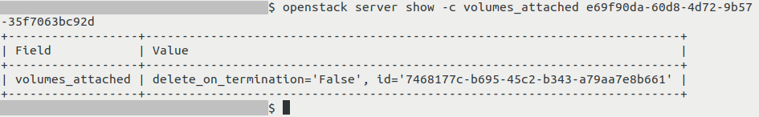

The command **openstack server show** is usually used to show detailed information about a virtual machine. In this case, we cut its output so that it only shows contents of section **volumes_attached**.

For each of the volumes, you can see whether (**True**) or not (**False**) OpenStack will remove that volume if the instance is to be removed (**delete_on_termination**). Apart from that, you will see the ID (value **id**) of that volume.

Note that in this part of output, the comma is being used between properties of one volumes and **not** between information about different volumes.

Shut down the VM
^^^^^^^^^^^^^^^^^^^^^

Shut down your instance. It is best to do it using the functions of your operating system. If, like here, the image used was **Ubuntu 22.04 LTS**, you could use the Horizon console or SSH access to execute a command such as

.. code::

   sudo shutdown now

Again, the OpenStack CLI command which you can use alternatively to shut down the instance is

.. code::

   openstack server stop <instance-id or instance-name>

where **<instance-id or instance-name>** is the ID or name of the instance.

Verify that it is shut down by executing

.. code::

   openstack server list

Value **SHUTOFF** in column **Status** denotes that the server has stopped as planned:

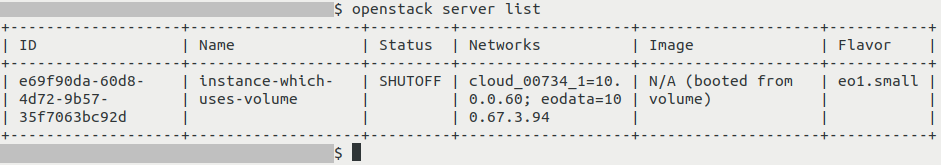

In the screenshot above, column **ID** contains the instance ID. The instance ID is a string of characters which may be wrapped across multiple lines in the OpenStack CLI output. If that happens, make sure to copy and use it as one line.

Creating the snapshot
^^^^^^^^^^^^^^^^^^^^^^^^^^^^^^

To create a snapshot of an instance, use this command:

.. code::

   openstack server image create \
     --name <snapshot-name> \
     --wait \
    <instance-id or instance-name>

Here,

 * **<snapshot-name>** is the name of the snapshot. In this example, we use **instance_persistent_snapshot**.
 * **<instance-id or instance-name>** is ID or name of the instance

Parameter **\-\-wait** should cause the OpenStack CLI to return to the command prompt only once your instance snapshot has been created.

.. note::

   Using **--name** parameter here to provide desired name for your snapshot is optional. If you don't provide it, the snapshot should have the same name as your instance. This is how this command would look like without this parameter:

   .. code::

      openstack server image create \
        --wait \
       <instance-id or instance-name>

If the operation was successful, you should get output similar to this:

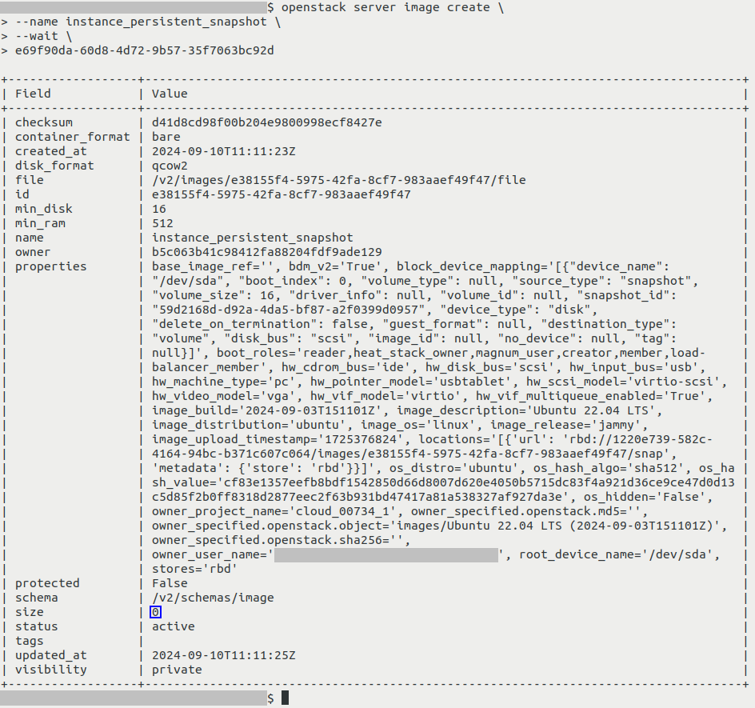

Your instance snapshot should now be visible when listing images:

.. code::

   openstack image list

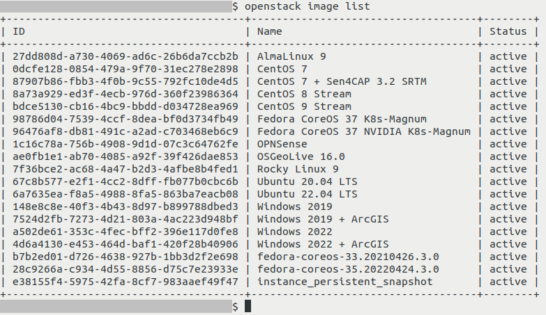

Exploring instance snapshot and volume snapshots which were created alongside it
^^^^^^^^^^^^^^^^^^^^^^^^^^^^^^^^^^^^^^^^^^^^^^^^^^^^^^^^^^^^^^^^^^^^^^^^^^^^^^^^^^^^^^^^^

The above mentioned output of **openstack server image create** contains various information about this instance snapshot.

Because this snapshot does not contain the data stored on that virtual machine, its size (on screenshot above marked with a dark blue rectangle) appears to be 0 bytes.

Within section **properties** (property **block_device_mapping**), value of key **snapshot_id** is the ID of the volume snapshot which was created while creating this instance snapshot. In example above, it is **59d2168d-d92a-4da5-bf87-a2f0399d0957**

You can check detailed information about that volume snapshot by executing the command below:

.. code::

   openstack volume snapshot show <snapshot-id or snapshot-name>

Replace **<snapshot_id>** with the ID or name of the snapshot.

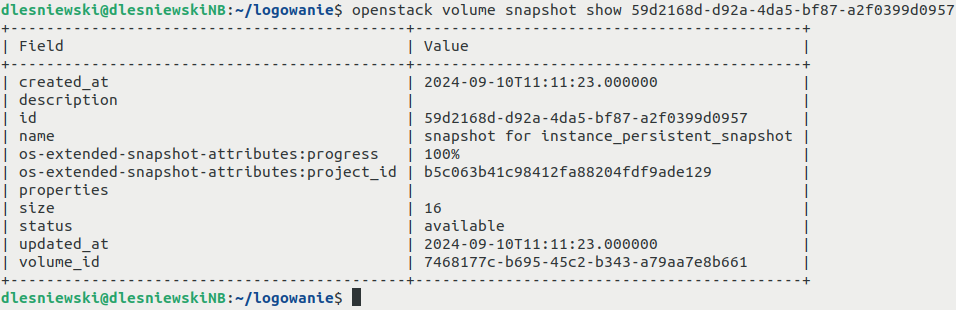

Its size should be the same as the size of original volume from which it was created.

That volume snapshot should be visible normally when listing volume snapshots with

.. code::

   openstack volume snapshot list

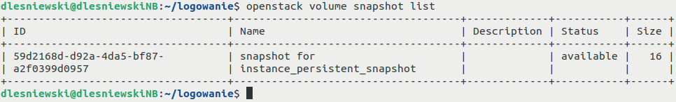

What happens if there are multiple volumes?
++++++++++++++++++++++++++++++++++++++++++++++++

If multiple volumes were connected to your instance, snapshot of each of them should be created alongside with instance snapshot. All of these volume snapshots should appear in the **properties** section of instance snapshot, property **block_device_mapping**. This is how it could look like:

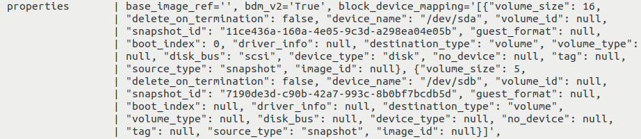

In this example, there are two volume snapshots, each created for one of the volumes of our VM:

 * one with ID of **11ce436a-160a-4e05-9c3d-a298ea04e05b** and size of 16 GB, as well as
 * another one with ID of **7190de3d-c90b-42a7-993c-8b0bf7bcdb5d** and size of 5 GB

What To Do Next
---------------

To create a new virtual machine from an instance snapshot, see:

.. jinja:: doc_links

   * :doc:`{{ start_vm_from_snapshot_horizon }}`
   * :doc:`{{ start_vm_from_snapshot_cli }}`

You can also create an instance snapshot from the Horizon dashboard:

.. jinja:: doc_links

   * :doc:`{{ instance_snapshot_horizon }}`

For discussion regarding bootable and non-bootable volumes, see:

.. jinja:: doc_links

   * :doc:`{{ bootable_vs_nonbootable_volumes }}`

.. ifconfig:: brand_name != "NSIS Cloud"

   Downloading an instance snapshot
   ^^^^^^^^^^^^^^^^^^^^^^^^^^^^^^^^

   There is something you should be aware of when using **openstack image save** to download an instance snapshot.

   .. jinja:: doc_links

      * :doc:`{{ instance_migration_cli }}`

   Ephemeral storage
      This command should work correctly for downloading snapshots of an instance which uses **ephemeral storage**.

   Persistent storage
      Executing that command to download a snapshot of an instance which uses **persistent storage** will result in downloading an empty file.

