How to install OpenStackClient GitBash for Windows on |brand-name|
=====================================================================================

In this tutorial, you start with a standard Windows installation, then install the OpenStack CLI client and end up connecting to your project on |brand-name|  cloud.

.. jinja:: doc_links

   For another way of installing OpenStack CLI on Windows, see article :doc:`{{ openstackclient_windows_wsl }}`. However:

* using Git Bash is simpler than using Windows Subsystem for Linux and
* it provides more straightforward access to your local file system.

What We Are Going To Cover
--------------------------

 * Installing the required software (Python 3, PIP, Git for Windows and the appropriate compilers)

 * Creating an isolated Python environment for installing the OpenStack CLI client

 * Installing the OpenStack CLI client

 * Authenticating the OpenStack CLI client to the cloud

 * Executing a simple command to test whether the process was successful

Prerequisites
-------------

No. 1 **Hosting**

You need a |brand-name| hosting account with Horizon interface |brand-name-site-auth-link|.

No. 2 **Computer running Microsoft Windows**

Your computer or virtual machine must be running Microsoft Windows 10 version 1909 or Windows 11. Also, Windows Server 2016, 2019 and 2022 are supported. The reason for that are the requirements of Microsoft Visual Studio.

Obtaining a valid license for Microsoft C++ Build Tools and other software mentioned here, is outside of scope of this text.

Installing Microsoft C++ Build Tools, as described in this article, might require more than 10 GiB of hard drive space. The exact amount is subject to change. During this process, make sure that you do not run out of storage.

No. 3 **Basic knowledge of the Linux terminal**

You need basic knowledge of the Linux command line.

No. 4 **RC file downloaded**

You need to download the RC file from your Horizon dashboard. To do that, follow section **How to download the RC file** in the OpenStack CLI authentication article:

.. jinja:: doc_links

   * :doc:`{{ openstack_cli_auth }}`

This file must be present on the machine on which you intend to use the OpenStack CLI client.

Step 1: Download and Install Python
---------------------------------------

There are two ways of obtaining Python on |brand-name| cloud:

 * It may come preinstalled on virtual machines that were created using one of the default Windows images.
 * You may download and install the latest version from the Internet.

The latter solution will either install Python anew or update the existing installation, so it is still a recommended step.

If you are going to use your own computer, follow the instructions below if you don't have Python installed.

Start your Internet browser and open https://www.python.org

Hover your mouse over the **Downloads** button and choose Windows from the menu that has just appeared.

Pick up the latest version for Python.

Download it and run that **.exe** file. Make sure to have options at the bottom of the window selected and click **Customize installation**.

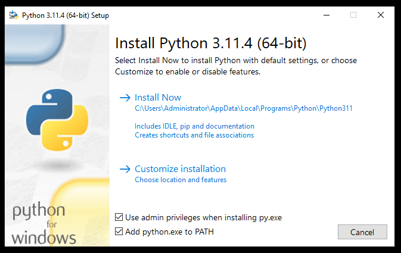

In the next screen, select all the **Optional Features**:

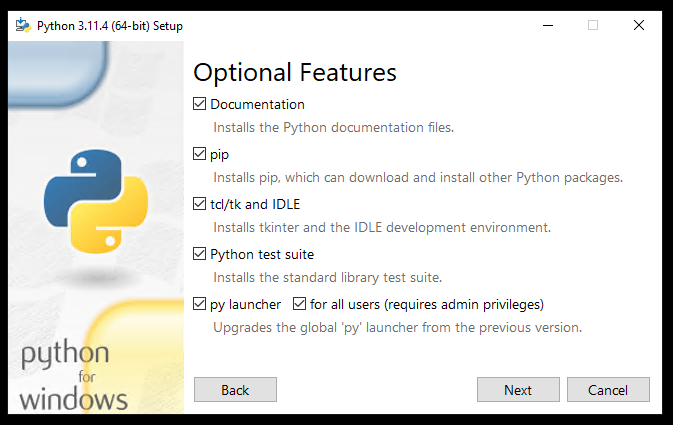

Click **Next**.

In the screen **Advanced Options**, select what is selected on the screenshot below and make sure that the installation location is in **Program Files** directory:

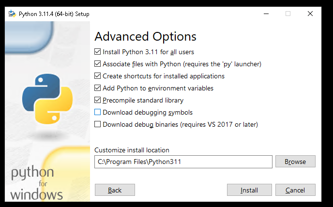

Click **Install** and wait until the installation is completed:

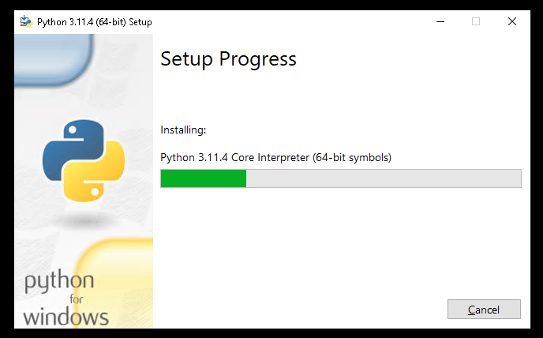

On the last screen, click option **Disable path length limit**:

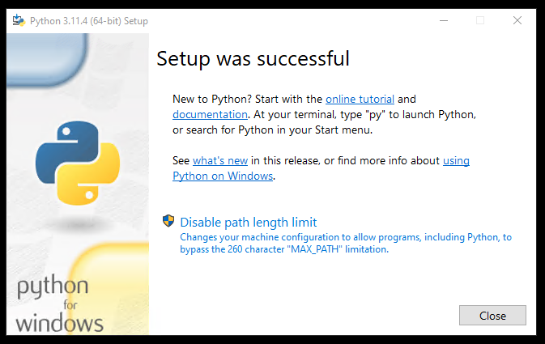

The button **Disable path length limit** should disappear. Click **Close**.

Open Windows command prompt and execute **python** command in it to check whether the installation was successful. You should see output similar to this:

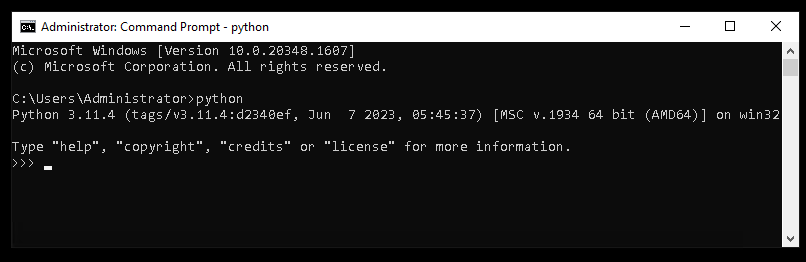

Close the command prompt.

Step 2: Install Git Bash and pip
--------------------------------------

Git Bash for Windows is a set of programs that emulates Linux terminal, allowing you to use common Linux commands **ls**, **source**, **mv** and others.

It is part of Git for Windows. Download that software from https://gitforwindows.org and execute the installer.

During the installation keep the default options selected.

After installation, a Git Bash entry should appear in Start menu:

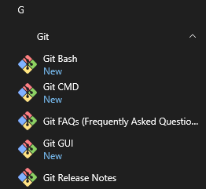

Other programs in the suite are Git CMD, Git GUI etc.

The installation of Python and its suite of programs requires you to additionally install **pip** and update the necessary PythonSSL certificates.

Step 3: Install pip and update the PythonSSL certificates
-------------------------------------------------------------------

**pip** is a tool for managing and installing Python images.

Download **get-pip.py** from https://bootstrap.pypa.io/get-pip.py. If it opens in your browser as plain text document, right click anywhere on it in the browser and use the **Save as...** or similar option to save it on your computer.

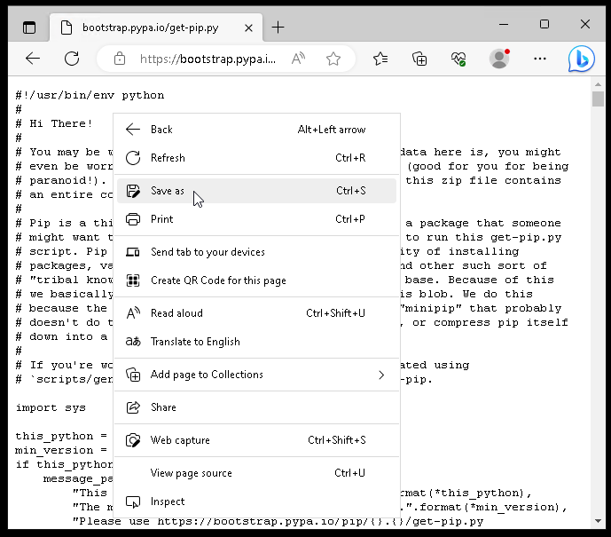

Run the script by opening it in **Python**. If **Python** is not the default piece of software used for opening **.py** files on your system, right-click the file and use the **Open with...** or similar option and choose **Python** there.

It will install **pip**. The installation process can be monitored in a terminal window.

In order to test whether the installation was successful, use **Start** menu to start **Git Bash** and type the following command:

.. code::

   pip -V

Your output should contain the version of **pip** that you have:

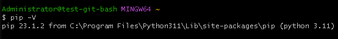

Now update PythonSSL certificates that you have on your computer:

.. code::

   pip install -U requests[security]

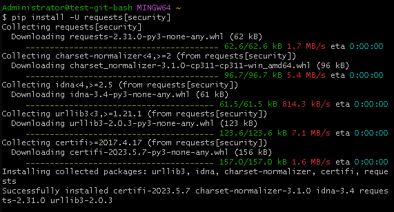

Step 4: Install Microsoft C++ Build Tools
---------------------------------------------

Microsoft C++ Build Tools are required to install the OpenStack CLI client using **pip** on Windows.

Enter the following website: https://visualstudio.microsoft.com/visual-cpp-build-tools/

Click **Download Build Tools**. Execute the downloaded **.exe** file.

During installation, choose the **Desktop development with C++** (which was a correct option at the time of writing):

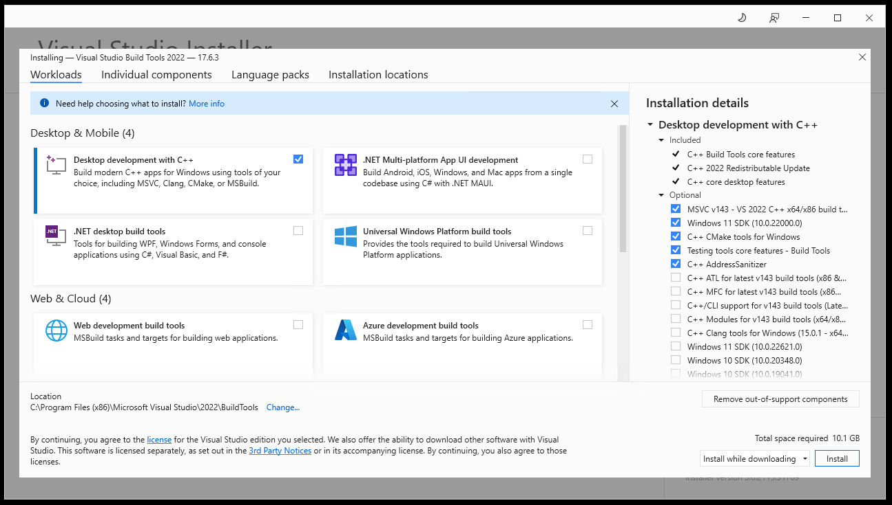

Click **Install**. Wait until the installation process is completed.

.. warning::

   The installation process might take a long time.

Reboot your computer if the installer prompts you to do so.

Step 5: Install virtualenv and the OpenStack CLI client
-----------------------------------------------------------

**virtualenv** allows you to perform Python operations in an isolated environment. In order to install it, open Git Bash if you previously closed it or rebooted your computer, and execute the following command:

.. code::

   pip install virtualenv

With **cd** command enter the directory in which you want to store the environment in which the OpenStack CLI client will be running. You will need it later on, so make it easily accessible, for example:

.. code::

   cd C:/Users/Administrator

Execute the following command to create the virtual environment **openstack_cli** which will be used for the OpenStack CLI client:

.. code::

   virtualenv openstack_cli

.. note::

   You must supply the name of the environment (here, **openstack_cli**) but what it will be is completely up to you.

A directory called **openstack_cli** should appear in the current folder. It will contain files needed for your isolated environment. In order to enter that environment, run **source** command on the **activate** file which is in the **Scripts** folder found in the folder with your virtual environment:

.. code::

   source openstack_cli/Scripts/activate

From now on, the name of your isolated environment - **openstack_cli** - will be in brackets before each command prompt, indicating that you are inside it.

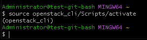

Closing the terminal and reopening will drop you from that environment.

How Git Bash terminal commands differ from those in Windows
^^^^^^^^^^^^^^^^^^^^^^^^^^^^^^^^^^^^^^^^^^^^^^^^^^^^^^^^^^^^^^^^^^^^^^^

In GitBash, there are two ways of inserting text from clipboard:

 * key combination **Shift+Ins** or

 * right-click the Git Bash window and select **Paste** from the displayed menu.

The usual Windows commands such as **CTRL+V** or **CTRL+Shift+V**, **won't work** in Git Bash window.

Git Bash emulates UNIX-based systems so while you are in it, use forward slashes and not the typical Windows backward slashes.

Step 6: Download and prepare jq
----------------------------------

To authenticate the OpenStack CLI client in the next step, a program called **jq** will be needed. It is a JSON preprocessor, running from command line. To install, navigate to https://jqlang.github.io/jq/download/ using your Internet browser.

Download the latest 64-bit executable version of **jq** for Windows.

A file with **.exe** extension should be downloaded. Rename it to simply **jq** (make sure that it still has the **.exe** extension).

Navigate to its location using the **cd** command in Git Bash. Do it in a similar way as you would on a Linux command line. Execute the following command:

.. code::

   mv jq.exe /usr/bin

This should allow you to use **jq** with the RC file easily.

Step 7: Install and configure the OpenStack CLI client
-------------------------------------------------------------

Without leaving Git Bash, while still inside the **openstack_cli** virtual environment, execute the following command:

.. code::

   pip install python-openstackclient

Wait until the process is completed. As the result, you will be able to run **openstack** command on terminal prompt. It, however, won't have access to the |brand-name| cloud, so the next step is to authenticate to the cloud.

Navigate to the location of the RC file which you downloaded while following Prerequisite No. 4 and execute the **source** command on it. It could look like this (if the name of your RC file is **main-openrc.sh**):

.. code::

   source main-openrc.sh

After that, you will receive the prompt for your password. Enter it and press **Enter** (while typing the password, no characters should appear).

If your account has two-factor authentication enabled, you will get a prompt for the six-digit code. Enter it and press **Enter**.

Here is what the two step process of authentication looks like for an RC file called **main-openrc.sh**:

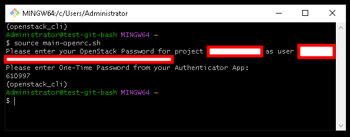

On the screenshot above, the username and project name were hidden for privacy reasons.

In order to test whether the OpenStack CLI client works, list virtual machines you currently operate. The command is:

.. code::

   openstack server list

The output should contain a table containing virtual machines from your project.

Reentering the Isolated Python Environment
----------------------------------------------

To run the OpenStack CLI client again, say, after you might have closed the Git Bash window, or have had shut down or restarted Windows, you would have to repeat the same commands you entered above (replace **C:/Users/Administrator** with the path containing your **openstack_cli** folder).

.. code::

   cd C:/Users/Administrator
   source openstack_cli/Scripts/activate

After that, execute the **source** command on your RC file in the same way as previously.

You can also create a batch file to automate reentering the Python environment.

What To Do Next
------------------------------

Other articles of interest:

.. jinja:: doc_links

   * :doc:`{{ heat_create_vms }}`

.. ifconfig:: brand_name in managed_kubernetes_with_magnum

   Using CLI interface for Kubernetes clusters:

   .. jinja:: doc_links

      * :doc:`{{ magnum_kubernetes_cli }}`
      * :doc:`{{ openstack_magnum_clients_cli }}`

Also see:

.. jinja:: doc_links

   * :doc:`{{ openstack_cli_auth }}`