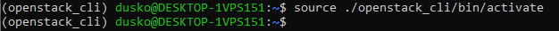
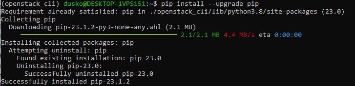
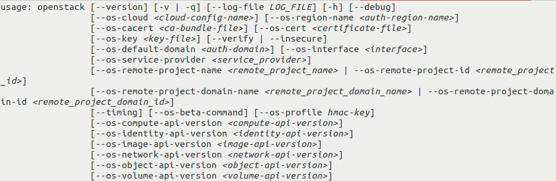
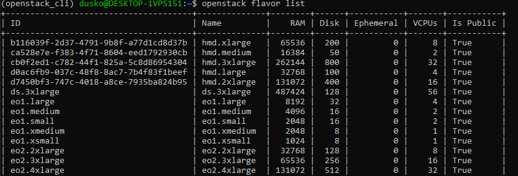

How to install OpenStackClient for Linux on |brand-name|
========================================================

The OpenStack CLI client allows you to manage OpenStack environments from the
command line. You can use it to perform tasks such as:

* creating, starting, shutting down, shelving, deleting, and rebooting virtual
  machines,
* assigning a floating IP address to a virtual machine,
* listing available resources, including volumes, virtual machines, and
  floating IP addresses,
* automating OpenStack operations with scripts.

This article covers two methods of installing OpenStackClient on Ubuntu.

The first method uses the Ubuntu package manager. It is more convenient and is
sufficient for most use cases.

The second method uses **pip** inside a Python virtual environment. It is
intended for more advanced use cases, such as:

* keeping multiple versions of OpenStackClient ready to use on the same
  computer,
* using a newer or different version than the one available from Ubuntu
  packages,
* installing OpenStackClient on a Linux distribution where the Ubuntu package
  method is not available.

Prerequisites
-------------

No. 1 **Hosting account**

You need a |brand-name| hosting account with access to the Horizon interface:
|brand-name-site-auth-link|.

No. 2 **Linux installed on your computer**

You need Linux installed on your local computer or on a virtual machine.

This article was written for Ubuntu 22.04 LTS and Python 3. Instructions for
other Linux distributions may be different.

If you choose a virtual machine hosted on |brand-name| cloud, the following
articles can help:

.. jinja:: doc_links

   * :doc:`{{ linux_vm_from_linux }}`
   * :doc:`{{ linux_vm_from_windows }}`

What we are going to do
-----------------------

* Install OpenStackClient using **apt** or **pip**
* Verify that the installation was successful
* Learn where to go next to authenticate and use OpenStack CLI commands

Step 1: Install OpenStackClient
-------------------------------

Method 1: Using the Ubuntu package manager
^^^^^^^^^^^^^^^^^^^^^^^^^^^^^^^^^^^^^^^^^^

Update Ubuntu packages:

.. code-block:: bash

   sudo apt update && sudo apt upgrade

Reboot if required.

Once the packages are updated, install the **openstack** command from the
**python3-openstackclient** package:

.. code-block:: bash

   sudo apt install python3-openstackclient

Method 2: Using pip and a Python virtual environment
^^^^^^^^^^^^^^^^^^^^^^^^^^^^^^^^^^^^^^^^^^^^^^^^^^^^

Use this method if you want to install OpenStackClient in an isolated Python
environment.

Create and activate a virtual environment
+++++++++++++++++++++++++++++++++++++++++

Open the terminal on the system where you want to install OpenStackClient.

Update system packages:

.. code-block:: bash

   sudo apt update && sudo apt upgrade

Install Python development files:

.. code-block:: bash

   sudo apt install python3-dev

Install the package used to create Python virtual environments. If Python is
not installed yet, the following command should pull it as a dependency:

.. code-block:: bash

   sudo apt install python3-venv

Create a new virtual environment called **openstack_cli**:

.. code-block:: bash

   python3 -m venv openstack_cli

Activate the environment:

.. code-block:: bash

   source openstack_cli/bin/activate

.. important::

   In the future, each time you start the terminal and want to use this
   OpenStackClient installation, you need to enter the same virtual environment
   again.

After activation, the prompt should show **(openstack_cli)** as a prefix:

Install OpenStackClient
+++++++++++++++++++++++

Before installing OpenStackClient, upgrade **pip**:

.. code-block:: bash

   pip install --upgrade pip

Install the **python-openstackclient** package:

.. code-block:: bash

   pip install python-openstackclient

This installs the **openstack** command, which allows you to interact with
OpenStack services from the command line.

You can use multiple virtual environments if you need to keep different
versions of OpenStackClient available on the same machine.

Step 2: Verify that installation was successful
-----------------------------------------------

You can verify the installation by using the built-in **--help** option. If
you can view the **openstack** help screen, the installation was successful.

.. important::

   If you installed OpenStackClient inside a virtual environment, make sure
   that your current terminal session has activated that environment before
   running the **openstack** command.

Execute:

.. code-block:: bash

   openstack --help

You should see information about using the OpenStack CLI command. The
beginning of the output should look like this:

If the command shows its output in a pager, use the arrow keys, or **vim**
keys such as **j** and **k**, to scroll through the text. Press **q** to exit.

If you can read the help screen, OpenStackClient is installed correctly.

What to do next
---------------

Authenticate before using OpenStack commands
^^^^^^^^^^^^^^^^^^^^^^^^^^^^^^^^^^^^^^^^^^^^

Before you can use OpenStack CLI to manage resources in your |brand-name|
environment, you need to authenticate.

.. jinja:: brand_names

   :doc:`{{ doc_links.openstack_cli_auth }}`

After successful authentication, you will be able to run commands such as:

.. code-block:: bash

   openstack flavor list

This command lists flavors available in your project. The output may look like
this:

Install additional OpenStack clients
^^^^^^^^^^^^^^^^^^^^^^^^^^^^^^^^^^^^

The package installed in this article provides the basic OpenStack commands.

If you want to use additional OpenStack services from CLI, such as load
balancers, DNS as a service, orchestration, or object storage, you may need
additional client packages.

Depending on the method you used to install OpenStackClient, use one of the
tabs below.

.. tabs::

   .. tab:: apt

      In the official Ubuntu **apt** repository, additional OpenStack client
      package names usually follow this syntax:

      .. code-block:: text

         python3-<project>client

      In this syntax, **<project>** is the OpenStack project name, such as
      **octavia** or **designate**.

      The following command installs several commonly used clients:

      .. code-block:: bash

         sudo apt install python3-manilaclient python3-octaviaclient python3-designateclient python3-barbicanclient python3-heatclient python3-magnumclient python3-novaclient python3-swiftclient python3-glanceclient python3-cinderclient

   .. tab:: pip

      In **pip**, additional OpenStack client package names usually follow this
      syntax:

      .. code-block:: text

         python-<project>client

      In this syntax, **<project>** is the OpenStack project name, such as
      **octavia** or **designate**.

      The following command installs several commonly used clients:

      .. code-block:: bash

         pip install python-manilaclient python-octaviaclient python-designateclient python-barbicanclient python-heatclient python-magnumclient python-novaclient python-swiftclient python-glanceclient python-cinderclient

Describing each additional client is beyond the scope of this article.

Installation on Windows
^^^^^^^^^^^^^^^^^^^^^^^

You can also install OpenStackClient on Windows by using Git Bash, Cygwin, or
Windows Subsystem for Linux.

.. jinja:: doc_links

   * :doc:`{{ openstackclient_windows }}`
   * :doc:`{{ openstackclient_windows_wsl }}`