How to install OpenStackClient on Windows using Windows Subsystem for Linux on |brand-name| OpenStack Hosting
=============================================================================================================

In this tutorial, you will control your OpenStack environment in a deeper and more precise way using the CLI (Command Line Interface). Of course, you can use the Horizon GUI (Graphical User Interface) running in your browser, but the CLI includes additional features like the ability to use scripts for more automated management of your environment.

The instructions for installing Windows Subsystem for Linux are based on the official Windows documentation found at https://learn.microsoft.com/en-us/windows/wsl/.

What We Are Going To Cover
--------------------------

 * Installing Windows Subsystem for Linux on Microsoft Windows
 * Installing the OpenStack CLI client and authenticating

Prerequisites
-------------

No. 1 **Hosting**

You need a |brand-name| hosting account with Horizon interface |brand-name-site-auth-link|.

No. 2 **Computer running Microsoft Windows**

Your computer must be running Microsoft Windows. This article is written for Windows Server 2019 version 1709 or later. The instructions for the following versions are linked in the appropriate location of this article:

 * Windows 10 version 1903 up to and excluding version 2004

 * Windows 10 version 2004 or later (Build 19041), Windows 11

 * Windows Server 2022

No. 3 **OpenStack CLI authentication method**

Before using the OpenStack CLI client, check which authentication method applies to your |brand-name| cloud account. Some accounts use only a username and password, while others also require a TOTP code generated by 2FA authentication software.

For details about the correct authentication workflow, see:

.. jinja:: doc_links

   * :doc:`{{ openstack_cli_auth }}`

Step 1: Check the version of Windows
------------------------------------

Right-click on your start menu and left-click "System".

A screen will appear in which you will see the version of your Microsoft Windows operating system. Memorize it or write it somewhere down.

Step 2: Install Ubuntu on Windows Subsystem for Linux
-----------------------------------------------------

.. note::

   The following instructions from this step are for Windows Server 2019 version 1709 or later. If you are running a different operating system, please follow the instructions found under the appropriate link and skip to Step 3:

    * Windows Server 2022 - https://learn.microsoft.com/en-us/windows/wsl/install-on-server section **Install WSL on Windows Server 2022**

    * Windows 10 version 1903 up to and excluding version 2004 - https://learn.microsoft.com/en-us/windows/wsl/install-manual

    * Windows 10 version 2004 or later (Build 19041), Windows 11 - https://learn.microsoft.com/en-us/windows/wsl/install

Enter the following website: https://learn.microsoft.com/en-us/windows/wsl/install-manual#downloading-distributions. Download Ubuntu 20.04 using the provided link. This tutorial assumes that your browser saved it in your **Downloads** directory - if that is not the case, please modify the instructions accordingly.

Locate the downloaded file:

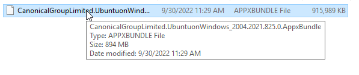

Right-click it and select the option **Rename**.

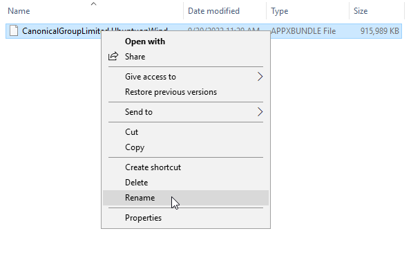

Rename the downloaded file to **Ubuntu.zip**:

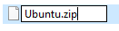

Right-click the file and select **Extract All...**.

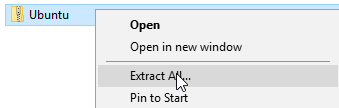

In the wizard that appeared do not change any options and click **Extract**:

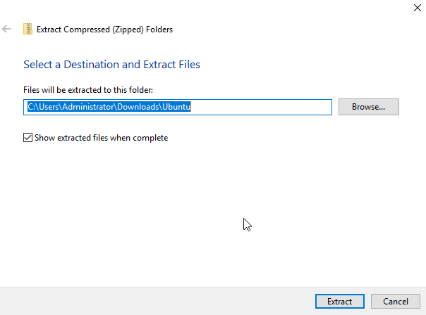

A directory called **Ubuntu** should have appeared:

Enter that folder and view its content:

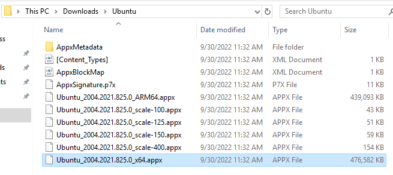

Memorize or write somewhere down the name of the **.appx** file which ends with **x64**.

Open your **Start** menu. Right-click the entry **Windows PowerShell** and select **Run as administrator**:

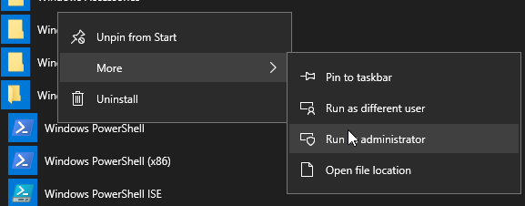

In the displayed window type the following command and press Enter:

.. code::

   Enable-WindowsOptionalFeature -Online -FeatureName Microsoft-Windows-Subsystem-Linux

The following progress bar should have appeared:

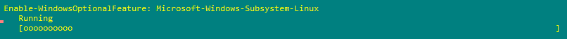

After the end of the process you will be asked if you want to restart your computer to complete the operation:

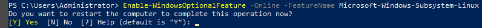

Make sure that the restart will not cause any disruptions and press **Y** to restart.

During the reboot you will see the following process message:

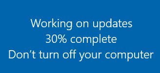

Once the reboot is completed, start the PowerShell again as described previously.

Run the following command (replace **Ubuntu.appx** with the name of your **.appx** file which you memorized or wrote somewhere down previously):

.. code::

   Add-AppxPackage.\Downloads\Ubuntu\Ubuntu.appx

During the process, you will see the status bar similar to this:

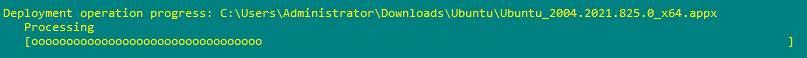

Once the process is finished, execute the following command (replace the **C:\\Users\\Administrator\\Ubuntu** path with the location of your **Ubuntu** folder):

.. code::

   $userenv = [System.Environment]::GetEnvironmentVariable("Path", "User")
   [System.Environment]::SetEnvironmentVariable("PATH", $userenv + ";C:\Users\Administrator\Ubuntu", "User")

Your newly installed Ubuntu should appear in your **Start** menu:

Run it. You will see the following message:

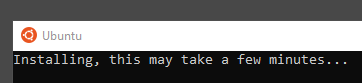

Wait until this process finishes. After that, you will get a prompt asking you for your desired username (which is to be used in the installed Ubuntu):

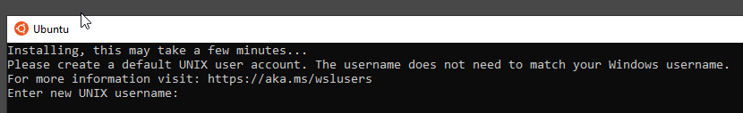

Type it and press Enter. You will now be asked to provide the password for that account:

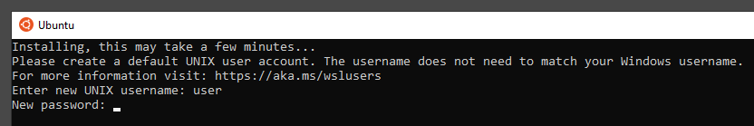

.. note::

   Your password will not be visible as you type, not even as masking characters.

Input your password and press Enter. You will then be asked to type it again:

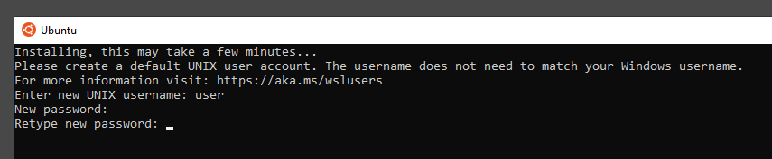

If you typed the same password twice, it will be set as the password for that account. You wil get the following message as confirmation:

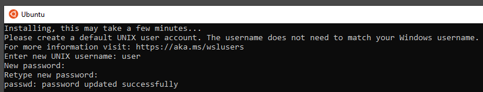

Wait for a short time. Eventually your Linux environment will be ready:

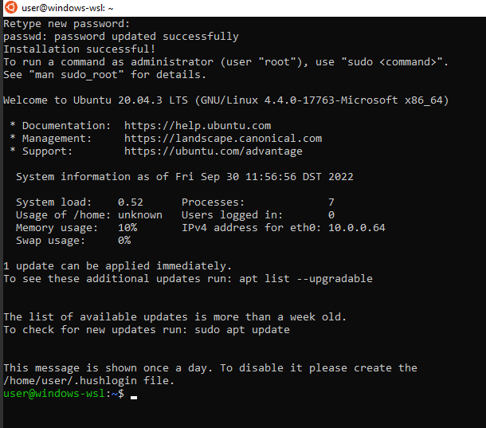

Step 3: Install OpenStack CLI in an isolated Python environment
---------------------------------------------------------------

Now that you have installed Windows Subsystem on Linux running Ubuntu on your Windows computer, it is time to install OpenStack CLI.

Update the software running on your Ubuntu:

.. code::

   sudo apt update && sudo apt upgrade

Once the process is finished, install the **python3-venv** package to create a separate Python environment:

.. code::

   sudo apt install python3-venv

Create a virtual environment in which you will have OpenStack CLI installed:

.. code::

   python3 -m venv openstack_cli

Enter your new virtual environment:

.. code::

   source openstack_cli/bin/activate

Upgrade **pip** to the latest version:

.. code::

   pip install --upgrade pip

Install the **python-openstackclient** package:

.. code::

   pip install python-openstackclient

Verify that the OpenStack CLI works by viewing its help:

.. code::

   openstack --help

If the command shows its output using a pager, you should be able to use the arrows (or vim keys - **J** and **K**) to scroll and **Q** to exit.

If everything seems to work, time to move to the next step - authentication to your user account on |brand-name|.

Step 4: Download your OpenStack RC File
---------------------------------------

Login to |brand-name| hosting account with Horizon interface |brand-name-site-auth-link|.

Click on your username in the upper right corner. You will see the following menu:

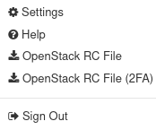

If your account has two factor authentication enabled, click the option **OpenStack RC File (2FA)**. If, however, it does not have it enabled, use the **OpenStack RC File** option.

The RC file will be downloaded. Memorize or write somewhere down the name of that file. Move this file to the root location of your **C:** drive.

Step 5: Move the RC file to your Ubuntu environment
---------------------------------------------------

Return to your **Ubuntu** window.

You will now copy your RC file to your Ubuntu environment. Since Windows Subsystem for Linux mounts the **C:** drive under **/mnt/c**, the command for copying your RC file to your Ubuntu environment is as follows (replace **main-openrc.sh** with the name of your RC file):

.. code::

   cp /mnt/c/main-openrc.sh $HOME

If your account uses two-factor authentication, you will need **jq** to activate access to your cloud environment. To install **jq**, execute:

.. code::

   sudo apt install -y jq

Now use the **source** command on this file to begin the authentication process (replace **main-rc.sh** with the name of your RC file):

.. code::

   source main-openrc.sh

You will see the prompt for password to your |brand-name| account. Type your password there and press Enter (the password is still being accepted even if you do not see the characters being typed).

If your account has two factor authentication enabled, you will also see the prompt for your six-digit code. Open software which you use for generating such codes (for example KeePassXC or FreeOTP) and find your code there, as usual. Make sure that you enter it before it expires. If you think that you will not manage to enter your current code, wait until a new one is generated.

After having entered your code, press Enter.

Now you can test whether you have successfully authenticated by listing your VMs:

.. code::

   openstack server list

How to run this environment later?
----------------------------------

If you close the window with Ubuntu and reopen it, you will see that you are no longer in the **openstack_cli** environment you created and thus no longer have access to OpenStack. You will need to reenter the **openstack_cli** environment and reauthenticate.

After reopening the Ubuntu Window, execute the **source** command on the file used for entering you **openstack_cli** environment, just like previously:

.. code::

   source openstack_cli/bin/activate

Now, reauthenticate by invoking the **source** comand on your **RC** file (replace **main-openrc.sh** with the name of your RC file):

.. code::

   source main-openrc.sh

Type your password and press Enter. You should now be able execute the OpenStack CLI commands as usual.

What To Do Next
---------------

After installing the OpenStack CLI client and activating your new RC file, you can use the following articles to perform operations in the |brand-name| cloud:

.. jinja:: doc_links

   * :doc:`{{ heat_create_vms }}`
   * :doc:`{{ terraform_keycloak_auth }}`
   * :doc:`{{ custom_image_upload_cli }}`
   * :doc:`{{ create_vm_cli }}`

   
   * :doc:`{{ magnum_kubernetes_cli }}`
   