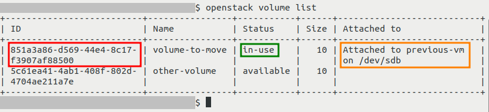
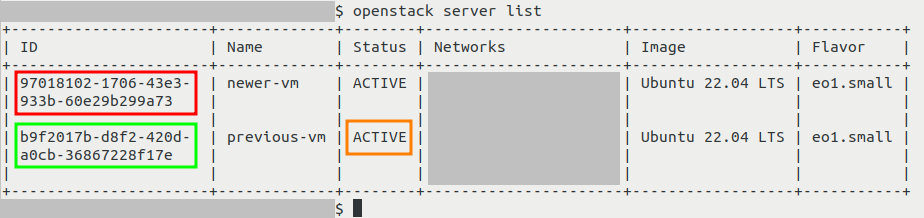
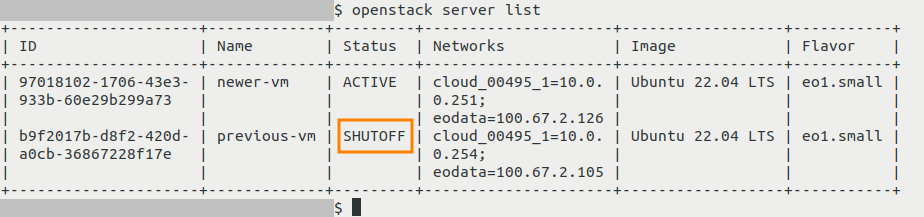
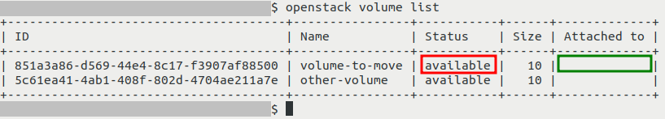
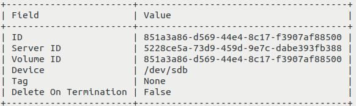
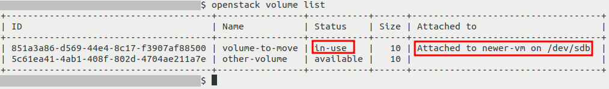

How to move data volume between VMs using OpenStack CLI on |brand-name|
=======================================================================

Volumes are used to store data and those data can be accessed from a virtual machine to which the volume is attached. To access data stored on a volume from another virtual machine, you need to disconnect that volume from virtual machine to which it is currently connected, and connect it to another instance.

This article uses OpenStack CLI client to transfer volumes between virtual machines which are in the same project.

Prerequisites
-------------

No. 1 **Hosting**

You need a |brand-name| hosting account with access to the Horizon interface: |brand-name-site-auth-link|.

No. 2 **OpenStack CLI client**

You need the OpenStack CLI client installed. Use one of the following articles, depending on your operating system:

.. jinja:: doc_links

   * :doc:`{{ openstackclient_linux }}`
   * :doc:`{{ openstackclient_windows_wsl }}`
   * :doc:`{{ openstackclient_windows }}`

To use the OpenStack CLI client to control |brand-name| cloud, authenticate first.

.. jinja:: doc_links

   * :doc:`{{ openstack_cli_auth }}`

No. 3 **Source virtual machine and volume**

We assume that you have a virtual machine (which we will call *source* virtual machine) to which a volume is attached.

No. 4 **Destination virtual machine**

We also assume that you want to access the data stored on volume mentioned in Prerequisite No. 3 from another instance which is in the same project - we will call that instance *destination* virtual machine.

What We Are Going To Cover
--------------------------

 * Ensure that the transfer is possible

   * Projects must be on the same cloud

   * Volume cannot be used for booting an operating system

   * File system compatibility

   * Making sure that the source virtual machine does not try to access the volume

   * Other volume and instance conditions for successful transfer

 * Obtaining information about the volume

 * Obtaining information about the virtual machines

 * General concerns about shutting down a virtual machine

 * Shutting down the *source* virtual machine using OpenStack CLI

 * Disconnecting volume

 * Attaching volume to the *destination* virtual machine

Some parts of some screenshots in this article are greyed out for privacy reasons.

Ensure that the transfer is possible
------------------------------------

Before the actual transfer, you have to examine the state of the volume and of the instances and conclude whether the transfer is possible right away or should you perform other operations first:

Projects must be on the same cloud
^^^^^^^^^^^^^^^^^^^^^^^^^^^^^^^^^^

If the projects are not on the same cloud, do not use this article but see one of these articles instead:

.. jinja:: doc_links

   * :doc:`{{ transfer_volume_horizon }}`
   * :doc:`{{ transfer_volume_cli }}`

Volume cannot be used for booting an operating system
^^^^^^^^^^^^^^^^^^^^^^^^^^^^^^^^^^^^^^^^^^^^^^^^^^^^^

If a volume is **not** being used to boot an operating system on a virtual machine, this requirement is fulfilled.

If, however, a volume is being used for booting an operating system, you can convert it to a regular volume.

Converting boot volume to a regular volume will save the day if the operating system on the volume starts malfunctioning and it is imperative to at least save the data; just attach the regular version of that volume to another virtual machine and copy the data.

If you have converted this volume and all other conditions listed in section **Ensure that the transfer is possible** are met, you don't have to disconnect the volume from the virtual machine and can ignore parts of the article involving this process.

File system compatibility
^^^^^^^^^^^^^^^^^^^^^^^^^

To be able to access the data, the file system on the volume must be compatible with the file system in the *destination* virtual machine.

The easiest case is when **NTFS** file system is used because both Windows and Linux can access data in that format. This is not guaranteed, so you may be required to install additional drivers for compatibility.

Also note that Windows does not support format **ext4**, which is a file system commonly used on Linux, by default.

Making sure that the source virtual machine does not try to access the volume
^^^^^^^^^^^^^^^^^^^^^^^^^^^^^^^^^^^^^^^^^^^^^^^^^^^^^^^^^^^^^^^^^^^^^^^^^^^^^

You need to make sure that the *source* virtual machine does not try to access the volume again.

The exact steps will vary between operating systems and are outside of scope of this article. They might include:

 * removing the volume from **/etc/fstab** file
 * removing the systemd **.mount** file

and so on.

Other volume and instance conditions for successful transfer
^^^^^^^^^^^^^^^^^^^^^^^^^^^^^^^^^^^^^^^^^^^^^^^^^^^^^^^^^^^^

The volume must:

 * be connected to a virtual machine,
 * have status **in-use** and not, say, **error** or another and
 * not be used by any instance to boot an operating system from it.

The instance must be:

 * either turned on or off and
 * not be in another status such as **error**, **shelved** or **paused**.

To learn more about different states in which a virtual machine can be, see:

.. jinja:: doc_links

   * :doc:`{{ vm_status_power_state_billing }}`

If all these conditions are met, here is how to transfer volume from *source* instance to the *destination* instance in the same project.

Obtaining information about the volume
--------------------------------------

Execute this command to list volumes:

.. code::

   openstack volume list

For each volume, you should see its ID, name, information to which virtual machine it is attached, and so on:

In this example, we can see that the volume which we want to move, called **volume-to-move**, is attached to a virtual machine called **previous-vm** (orange rectangle). Its ID, marked with a red rectangle, is as follows: **851a3a86-d569-44e4-8c17-f3907af88500**.

Other information shown here includes status of the volume (here marked with a green rectangle).

Write somewhere down the ID of the volume you want to move as you will need it later.

Obtaining information about the virtual machines
------------------------------------------------

Execute this command to list servers:

.. code::

   openstack server list

You should see the list of your virtual machines:

In this example, we want to move the volume from the *source* VM which is here called **previous-vm**. Its ID is **b9f2017b-d8f2-420d-a0cb-36867228f17e** - on the screenshot it is marked with a red rectangle. The *destination* VM is called **newer-vm**. Its ID is **97018102-1706-43e3-933b-60e29b299a73** and is marked using a green rectangle.

Write somewhere down the IDs of both *source* and *destination* virtual machines - you will need them later.

Check **Status** of the *source* virtual machine (in the screenshot, it is marked with an orange rectangle). If it is **SHUTOFF**, skip section **Shutting down your virtual machine** and proceed directly to section **Disconnecting a volume**.

If, however, the **Status** of the *source* virtual machine is **ACTIVE**, like on the screenshot above, proceed to section **Shutting down your virtual machine**.

General concerns about shutting down a virtual machine
------------------------------------------------------

The volume and its virtual machine are connected, so abruptly disconnecting the volume may cause data loss. To be on the safe side, shut down the *source* virtual machine first.

There are two ways to shut down a virtual machine:

Using OpenStack commands
   OpenStack will first request your virtual machine to shut down. If the virtual machine is unsuccessful at doing so, after a grace period, OpenStack will force it to power off.

Using operating system of the VM
   On rare occasions, this forced powering off may lead to data loss so the alternative is using native commands of the operating system. The technical details, however, are out of scope of this article.

.. https://docs.openstack.org/newton/config-reference/compute/config-options.html *shutdown_timeout = 60*

Shutting down the source virtual machine using OpenStack CLI
------------------------------------------------------------

Skip this section if you decided to shut down your virtual machine using the functions of operating system installed on *source* virtual machine.

The OpenStack CLI command to shut down the VM is

.. code::

   openstack server stop b9f2017b-d8f2-420d-a0cb-36867228f17e

It goes without saying that you should replace **b9f2017b-d8f2-420d-a0cb-36867228f17e** with the ID of the *source* virtual machine.

The output of this command should be empty.

After that, list the servers, possibly multiple times, until your virtual machine has the following **Status** (on screenshot below marked using orange rectangle): **SHUTOFF**.

.. code::

   openstack server list

Disconnecting volume
--------------------

To disconnect the volume, execute the **openstack server remove volume** command followed by the ID of the *source* virtual machine and the ID of the volume. Make sure to separate these values with spaces.

In this example, this command will be:

.. code::

   openstack server remove volume b9f2017b-d8f2-420d-a0cb-36867228f17e 851a3a86-d569-44e4-8c17-f3907af88500

If the operation was successful, the output should be empty. To verify, execute:

.. code::

   openstack volume list

Your volume should have the following **Status** (marked on screenshot above using red rectangle): **available**. Also, no value should be present in the **Attached to** column (this field was marked using green rectangle).

Attaching volume to the destination virtual machine
---------------------------------------------------

Execute the **openstack server add volume --disable-delete-on-termination** command followed by ID of the *destination* virtual machine and ID of the volume you want to attach. Remember to separate these values with spaces.

In this example, the command will be:

.. code::

   openstack server add volume --disable-delete-on-termination 97018102-1706-43e3-933b-60e29b299a73 851a3a86-d569-44e4-8c17-f3907af88500

If the operation was successful, you should get output similar to this:

To verify, execute the **openstack volume list** command once more:

The **Status** of the volume should now be **in-use** and the **Attached to** column should contain appropriate information regarding to which virtual machine your volume was attached.

What To Do Next
---------------

Now that volume has been connected to the *destination* virtual machine, you can allow or simplify access to it from that virtual machine. This might include:

 * assigning a drive letter to the volume (in case of Windows)
 * creating a mount point and adding the volume to **/etc/fstab** file (in case of Linux)

The volume can also be moved using the Horizon dashboard:

.. jinja:: doc_links

   * :doc:`{{ transfer_volume_horizon }}`