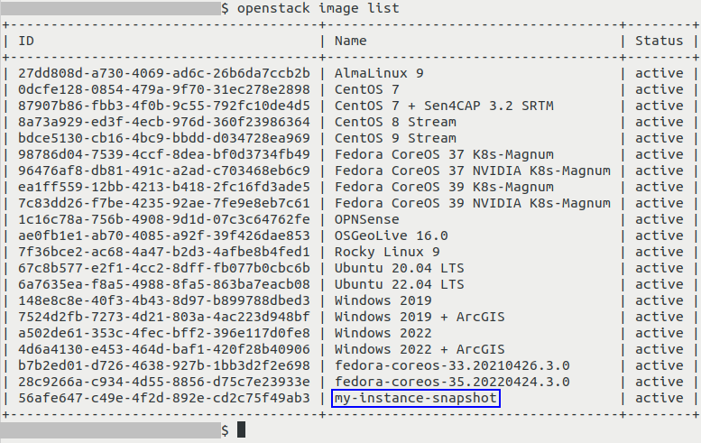
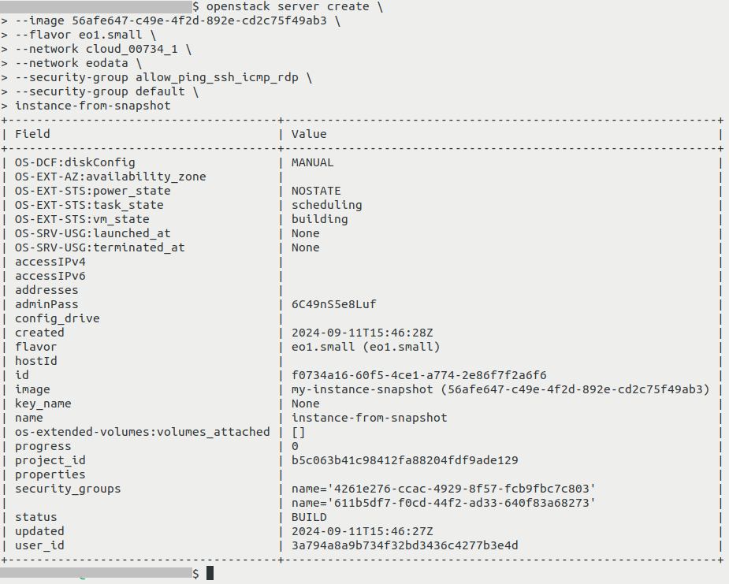
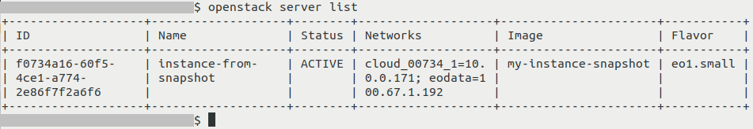
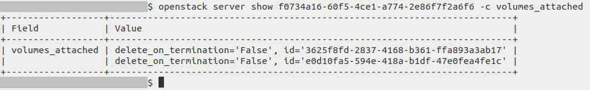
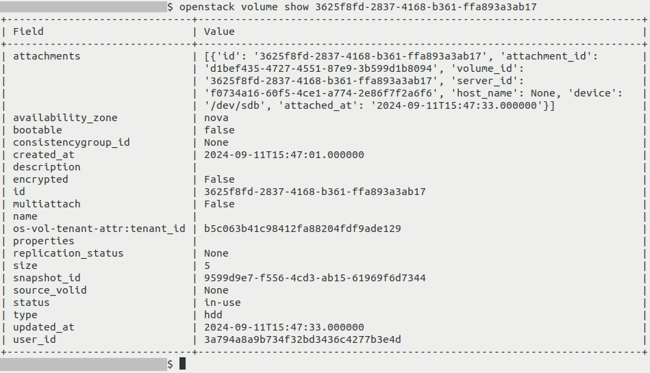

How to start a VM from instance snapshot using OpenStack CLI on |brand-name|
============================================================================

In this article, you will learn how to create a virtual machine from an instance snapshot using OpenStack CLI client.

Prerequisites
-------------
No. 1 **Account**

You need a |brand-name| hosting account with access to the Horizon interface: |brand-name-site-auth-link|.

No. 2 **OpenStack CLI client**

You need to have OpenStack CLI client installed. One of the following articles should help you:

.. jinja:: doc_links

   * :doc:`{{ openstackclient_linux }}`
   * :doc:`{{ openstackclient_windows }}`
   * :doc:`{{ openstackclient_windows_wsl }}`

   To use OpenStack CLI client to control |brand-name| cloud, you need to prove your identity: :doc:`{{ openstack_cli_auth }}`

No. 3 **Ephemeral storage vs. persistent storage**

.. jinja:: doc_links

   Please see :doc:`{{ ephemeral_vs_persistent }}` to understand the basic difference between ephemeral and persistent types of storage in OpenStack.

No. 4 **Instance snapshot**

You need to have an instance snapshot from which you are going to create your virtual machine. In this article, we will use an exemplary snapshot named **my-instance-snapshot**. This is how this instance can look like when executing **openstack image list** (here its name was marked using dark blue rectangle):

The following articles contain information on how to create such a snapshot:

.. jinja:: doc_links

   * :doc:`{{ instance_snapshot_cli }}`
   * :doc:`{{ instance_snapshot_horizon }}`

Note that the name of instance snapshot which will be used in this article is different than the names used in the above mentioned articles.

Regardless, we will cover both

 * snapshots of instances which use **ephemeral** storage, as well as
 * snapshots of instances which use **persistent** storage.

:strong:`Special rules for snapshots of instances which use persistent storage`

If your snapshot uses persistent storage, special rules apply. That instance snapshot will not have its own storage, but a metadata section, which lists volume snapshots which were created for each of the volumes.

Some or all of these volume snapshots theoretically might not exist because later they might have been, say, deleted.

Therefore:

Volume snapshot that represents boot drive is missing
   In that case, you will **not** be able to use instance snapshot to create a virtual machine.

Volume snapshot that represents boot drive is still present
   You will be able to use instance snapshot to create a virtual machine.
   If additional volumes have been connected to your VM, only the ones which still have their respective volume snapshots mentioned in metadata of instance snapshot will be recreated.

No. 5 **Access to the virtual machine being created**

There are different methods of accessing virtual machines, SSH and web console being the most popular.

For SSH, while creating a virtual machine from a volume snapshot, there may be an option of "injecting" an SSH key to the machine being created. Some operating systems are compatible with this feature, while others are not.

If it is not possible to attach an SSH key while creating new instance from a particular instance snapshot, make sure that there is another way of accessing it. Apart from SSH and web-based access, there also are RDP, VNC, API access, web-based tools (Guacamole), SFTP/FTP.

You should know how to access the instance before you start recreating it from a snapshot.

See also the following related articles:

.. jinja:: doc_links

   * :doc:`{{ add_ssh_key_horizon }}`

   * :doc:`{{ forgot_ssh_key_vm }}`

   * :doc:`{{ access_vm_console }}`

No. 6 **Following the reference article for creating a virtual machine**

.. jinja:: doc_links

   We will use :doc:`{{ create_vm_cli_cloud }}` as the *reference* article, but we will modify some of its steps.

The instance snapshot used here does not have to actually contain Linux - if this is the case, you can ignore Linux-specific parts of *reference* article.

Gathering information used to create an instance
------------------------------------------------

These steps are the same no matter whether your instance is using ephemeral or persistent storage.

In this example, we will create an instance named **instance-from-snapshot** - its source is instance snapshot named **my-instance-snapshot** that is already present in the system.

Gather information to build the **openstack server create** command as explained in the *reference* article mentioned in Prerequisite No. 6, but introduce the following modifications to your workflow

Step Choose an image
^^^^^^^^^^^^^^^^^^^^

In this article we will use an image as a source for your virtual machine. It can be one of the following:

.. jinja:: doc_links

    * Default images in the particular region you are using
    * Images which were shared with you from other projects and which you accepted
    * Images you uploaded yourself, for example, by following this article:
    * Images you uploaded yourself, for example, by following this article:
    :doc:`{{ custom_image_upload_cli }}`

For this article, your instance should be visible alongside other images, including:

 * the ones which are available on |brand-name| cloud by default and/or
 * the ones which you might have uploaded yourself.

You can recognize it using its name or ID.

Pass it to **--image** parameter in the usual manner.

In this article, our exemplary snapshot has ID of **56afe647-c49e-4f2d-892e-cd2c75f49ab3**:

so this is the parameter we will use:

.. code::

   --image 56afe647-c49e-4f2d-892e-cd2c75f49ab3

Changes to step Key Pair
^^^^^^^^^^^^^^^^^^^^^^^^

In step **Key Pair**, if your particular installation of an operating system supports "injecting" of an SSH key this way, you can perform this step just like it was done in the reference article.

If, however, it does not support this process, do not include the parameter **--key-name** or its value.

Creating an instance
--------------------

Once you have gathered all necessary information, execute appropriate **openstack server create** command, as explained in *reference* article from Prerequisite No. 6.

This is how this command will look like in our example (be sure to use your own parameters instead).

.. code::

   openstack server create \
   --image 56afe647-c49e-4f2d-892e-cd2c75f49ab3 \
   --flavor eo1.small \
   --network cloud_00734_1 \
   --network eodata \
   --security-group allow_ping_ssh_icmp_rdp \
   --security-group default \
   instance-from-snapshot

To check if the instance was created correctly, execute **openstack server list** - the output should include your instance alongside other instances, if there are any:

Its **Status** should be **ACTIVE** - your VM should then be operational. If it has another **Status** like **BUILD**, execute **openstack server list** again, possibly multiple times until the status is **ACTIVE**.

If the **Status** is **ERROR**, it means that something went wrong during creation of your instance. Investigating such an issue is outside of scope of this article.

What can go wrong when recreating instance from instance snapshot
-----------------------------------------------------------------

Wrong flavors
   If you specify flavor with insufficient resources like storage, it might not be possible to create an instance, or it might run worse than previously, or not run at all.

Incorrect or Missing Networks
   The network or subnet that you want to use may be absent, deleted, renamed or even not selected during the recreation process.

   If recreated without network connection, the instance may be inaccessible and/or it might not be able to access other resources (like for example databases) which it needs for correct operation.

Unattached volumes
   Connected volumes are usually not included with the instance snapshot. See Prerequisite No. 3 for more information.

   Without volumes, there may be no data to operate upon, or something else may be incomplete.

Loss of metadata or configuration data
   If you had custom metadata, user data scripts, special configuration settings... all these may have to be executed once the instance is restored.

   If not, the applications in that setup may behave erratically or not even start.

IP addresses changed
   The recreated instance might have a different IP address. That may result in loss of connectivity and access.

   You might recognize it as broken links, disrupted communications, failed services in case they rely on static IPs.

Improper quotas and resources
   Quotas and limits for the new instance may differ from the quotas and limits from the old instance.

   The instance will not be created until the quotas are readjusted.

Failed external services
   The instance may depend on external databases, external storage or other types of external services -- and it is possible that these are not recreated automatically with the instance.

   In that case, the services that you hope to be using the instance for, won't be available or will malfunction.

Inconsistent snapshot state
   It is advised to first shut down the instance and only then create its snapshot. If the shapshot was taken while the instance was running, some data may be lost or corrupted.

   This will lead to application errors, data loss or system instability.

Incompatible environments
    The instance might work incorrectly or even not work at all if it contains drivers and other software that is incompatible with the current environment - flavor and/or cloud.

Verifying volumes when using persistent storage
-----------------------------------------------

Skip this section if your instance uses ephemeral storage.

If instance from which snapshot was created used persistent storage, the volumes attached to it should be recreated while building an instance from this snapshot. We will now check if that was indeed the case.

Usually, **openstack server show** is used to show detailed information about an instance. Here, we will use **-c** parameter to cut out its output so that it only shows volumes attached to VM.

Execute the following command to see volumes attached to your instance (replace **f0734a16-60f5-4ce1-a774-2e86f7f2a6f6** with the ID of your instance):

.. code::

   openstack server show f0734a16-60f5-4ce1-a774-2e86f7f2a6f6 -c volumes_attached

Usually, **openstack server show** is used to show detailed information about an instance. Here, we cut its output only to volumes attached to it.

Field **volumes_attached** has two volumes separated by commas for each of the volumes.

In column Value, for each of the volumes that are attached we see two values which are separated by commas.

Binary field **delete_on_termination** means the following:

 * True: volume will be deleted alongside instance if you delete instance
 * False: if you delete instance this volume will not be automatically deleted alongside it

Field **id** contains ID of the volume.

In our case, neither of the attached volumes should be deleted because **delete_on_termination** in both cases has value of false.

If some of volumes were seemingly not recreated, it might mean that their respective volume snapshots no longer exist.

Note that in this part of output, the comma is being used between properties of one volumes and **not** between information about different volumes.

Also, you should be mindful of the fact that instance snapshot does not preserve names of volumes.

You can see detailed information regarding each of these volumes by executing this command (replace **3625f8fd-2837-4168-b361-ffa893a3ab17** with the ID of your volume):

.. code::

   openstack volume show 3625f8fd-2837-4168-b361-ffa893a3ab17

What To Do Next
---------------

.. jinja:: doc_links

   To create a virtual machine from an instance snapshot using the Horizon dashboard instead of OpenStack CLI, see :doc:`{{ start_vm_from_snapshot_horizon }}`.