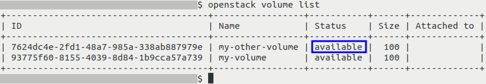
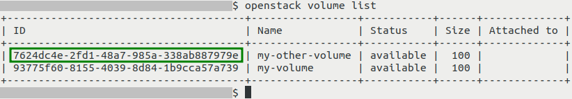
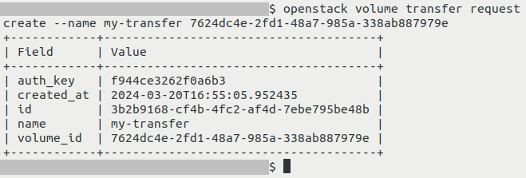
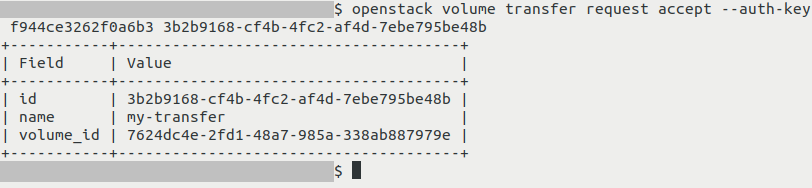
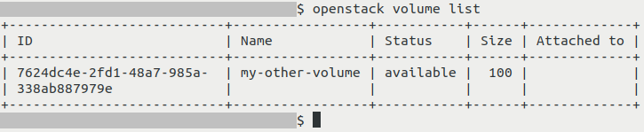
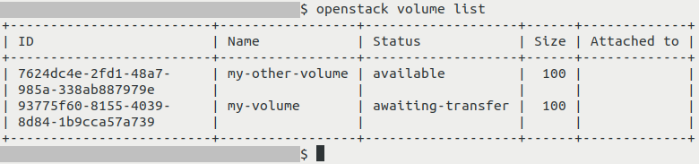
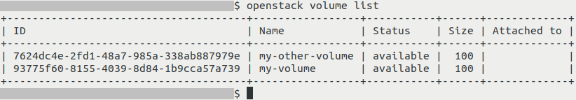

How to transfer volumes between domains and projects using OpenStack CLI client on |brand-name|
===============================================================================================

Volumes in OpenStack can be used to store data. They are visible to virtual machines like drives.

Such a volume is usually available to just the project in which it was created. Transferring data stored on it between projects might take a long time, especially if such a volume contains lots of data, like, say, hundreds or thousands of gigabytes (or even more).

This article covers changing the assignment of a volume to a project. This allows you to move a volume directly from one project (which we will call *source* project) to another (which we will call *destination* project) using the OpenStack CLI in a way that does **not** require you to physically transfer the data.

The *source* project and *destination* project must both be on the same cloud. They can (but don't have to) belong to different users from different domains and organizations.

What We Are Going To Cover
--------------------------

 * Initializing transfer of volume
 * Accepting transfer of volume
 * Cancelling transfer of volume

Prerequisites
-------------

No. 1 **Account**

You need a |brand-name| hosting account with access to the Horizon interface: |brand-name-site-auth-link|

No. 2 **OpenStack CLI Client**

To use the OpenStack CLI client, you need to have it installed. See one of these articles:

.. jinja:: doc_links

   * :doc:`{{ openstackclient_windows }}`
   * :doc:`{{ openstackclient_windows_wsl }}`
   * :doc:`{{ openstackclient_linux }}`

   After installation, authenticate before using the **openstack** command to communicate with the OpenStack cloud: :doc:`{{ openstack_cli_auth }}`

No. 3 **Volume**

You need to have a volume which you want to migrate.

Such a volume must **not** be connected to a virtual machine. It must have the following **Status**: **Available**.

You can check the status of your volume by executing the following command:

.. code::

   openstack volume list

In this example, the volume which we want to transfer is called **my-other-volume**. Its status, marked on screenshot above with a blue rectangle, is **available**.

No. 4 **Ability to perfom operations on both the source project and the destination project**

For the transfer to be successful, you need to first initiate it from the *source* project and then accept it from the *source* project.

If *source* and/or *destination* is not managed by you, you might need to get appropriate permission to perform such an operation.

To access each of these projects directly (if possible), source appropriate RC file. If you don't have direct access to any of these projects, you probably can request their members to execute commands mentioned in this article.

Step 1: Initiating transfer of volume
-------------------------------------

Perform this step in the *source* project.

Execute the following command:

.. code::

   openstack volume list

Write somewhere down the ID of the volume you want to transfer. In this example, we want to transfer volume called **my-other-volume**. Its ID, marked on the screenshot above with a green rectangle, is **7624dc4e-2fd1-48a7-985a-338ab887979e**.

Once you have obtained the ID, execute command below, but replace its parts as instructed:

.. code::

   openstack volume transfer request create --name my-transfer 7624dc4e-2fd1-48a7-985a-338ab887979e

In this command, replace:

  * **my-transfer** with the name of the transfer of your choice (make sure that it is passed to the shell correctly, watch out for any special characters like double quotes or spaces)

  * **7624dc4e-2fd1-48a7-985a-338ab887979e** with the ID of the volume you want to transfer

If the operation was successful, you should get output similar to this:

Write somewhere down the ID of the transfer (value for **id**) and the authorization key (value for **auth_key**).

In example screenshot above, that ID of the transfer is **f944ce3262f0a6b3** and the authorization key is **3b2b9168-cf4b-4fc2-af4d-7ebe795be48b**.

Note that after initializing the transfer, the volume cannot be connected to any virtual machine until the transfer is accepted or cancelled. To learn how to cancel the transfer (if you, say, accidentally chose the wrong volume), see section **Cancelling transfer of a volume** near the end of the article.

Step 2: Accepting transfer of volume
------------------------------------

Perform this step in the *destination* project.

Execute the command below. In it, replace **f944ce3262f0a6b3** with the authorization key and **3b2b9168-cf4b-4fc2-af4d-7ebe795be48b** with the ID of the transfer. These two values are to be obtained while following Step 1.

.. code::

   openstack volume transfer request accept --auth-key f944ce3262f0a6b3 3b2b9168-cf4b-4fc2-af4d-7ebe795be48b

If the operation was successful, you should get output similar to this:

To verify that the volume has indeed been moved to your new project, execute this command:

.. code::

   openstack volume list

The transferred volume should be on the list:

Cancelling transfer of volume
-----------------------------

If you, say, accidentally initiated transfer for a wrong volume and nobody accepts that transfer, it can be cancelled.

In this example, let's assume that we wanted to transfer volume called **my-volume**. However, we mistakenly initiated transfer for volume **my-other-volume**.

Checking the statuses of the volumes using **openstack volume list** will show that **my-volume** now has status **awaiting-transfer**:

Volume in such a status cannot be connected to a virtual machine.

To do cancel volume transfer, execute command below (replace **3b2b9168-cf4b-4fc2-af4d-7ebe795be48b** with ID of the transfer obtained in Step 1):

.. code::

   openstack volume transfer requested delete 3b2b9168-cf4b-4fc2-af4d-7ebe795be48b

If the operation was successful, the output should be empty.

Executing **openstack volume list** again should inform you that the volume once again has **available** status:

What To Do Next
---------------

.. jinja:: brand_names

   Now that the volume has been transferred, you might want to connect it to a virtual machine. This article includes information how to do that: :doc:`/openstackcli/How-to-move-data-volume-between-two-VMs-using-OpenStack-CLI-on-{{ brand_name_hyphen }}/How-to-move-data-volume-between-two-VMs-using-OpenStack-CLI-on-{{ brand_name_hyphen }}`

   The workflow described in this article can also be done using the Horizon dashboard. Learn more here: :doc:`/cloud/How-to-transfer-volumes-between-domains-and-projects-using-Horizon-dashboard-on-{{ brand_name_hyphen }}/How-to-transfer-volumes-between-domains-and-projects-using-Horizon-dashboard-on-{{ brand_name_hyphen }}`