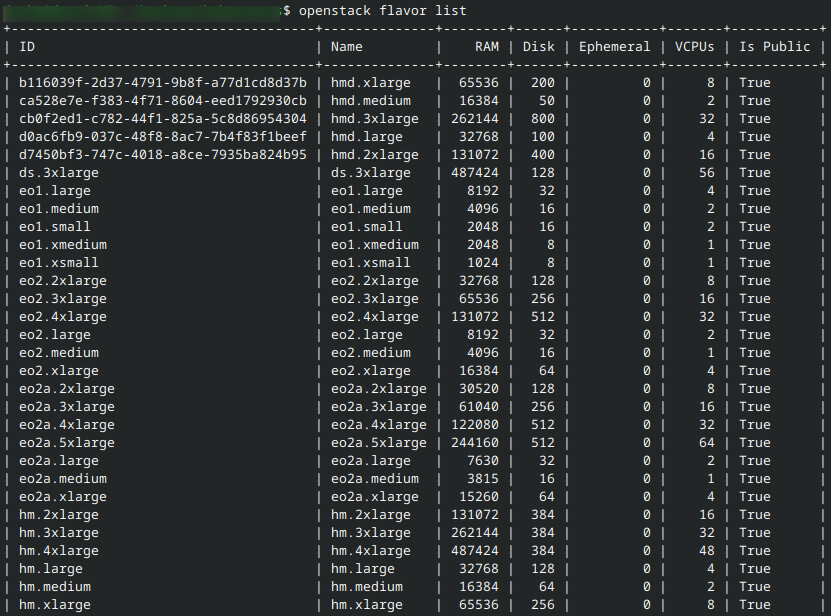
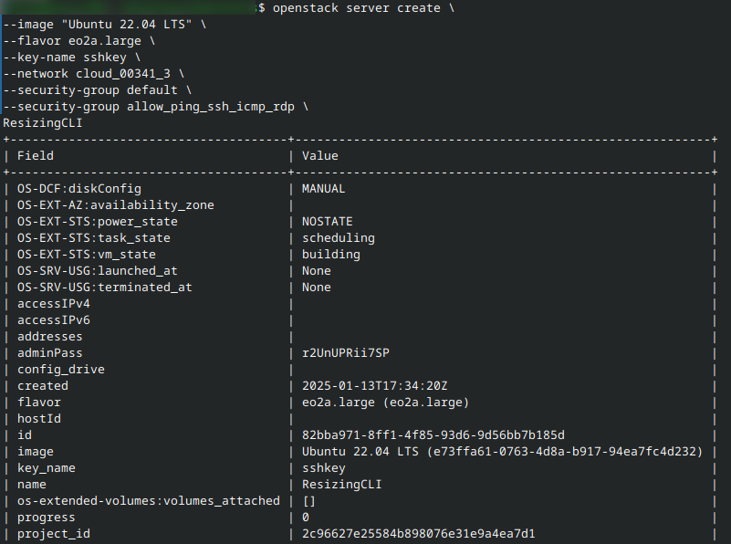
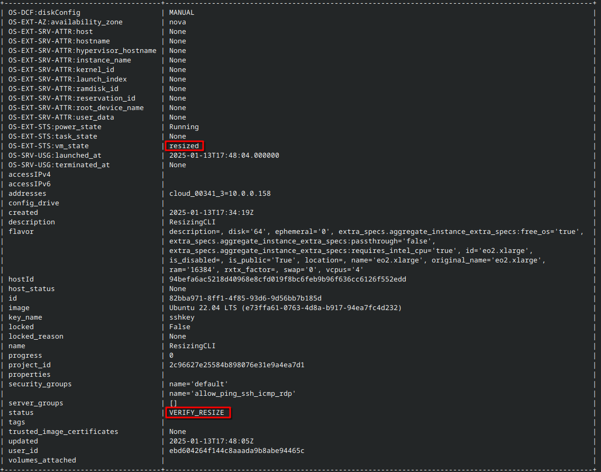

Resizing a virtual machine using OpenStack CLI on |brand-name|
==============================================================

Introduction
------------

When creating a new virtual machine under OpenStack, one of the options you choose is the *flavor*. A flavor is a predefined combination of CPU, memory and disk size and there usually is a number of such flavors for you to choose from.

After the instance is spawned, it is possible to change one flavor for another, and that process is called *resizing*. You might want to resize an already existing VM in order to:

 * increase (or decrease) the number of CPUs used,
 * use more RAM to prevent crashes or enable swapping,
 * add larger storage to avoid running out of disk space,
 * seamlessly transition from testing to production environment,
 * change application workload byt scaling the VM up or down.

In this article, we are going to resize VMs using CLI commands in OpenStack.

Prerequisites
-------------

No. 1 **Account**

You need a |brand-name| hosting account with access to the Horizon interface: |brand-name-site-auth-link|.

If you are a normal user of |brand-name| hosting, you will have all prerogatives needed to resize the VM. Make sure that the VM you are about to resize belongs to a project you have access to.

.. jinja:: brand_names

   :doc:`/cloud/How-to-create-a-VM-using-the-OpenStack-CLI-client-on-{{ brand_name_hyphen }}-cloud/How-to-create-a-VM-using-the-OpenStack-CLI-client-on-{{ brand_name_hyphen }}-cloud`

No. 2 **Awareness of existing quotas and flavors limits**

.. jinja:: brand_names

   For general introduction to quotas and flavors, see :doc:`/cloud/Dashboard-Overview-Project-Quotas-And-Flavors-Limits-on-{{ brand_name_hyphen }}/Dashboard-Overview-Project-Quotas-And-Flavors-Limits-on-{{ brand_name_hyphen }}`.

Also:

 * The VM you want to resize is in an active or shut down state.
 * A flavor with the desired resource configuration exists.
 * Adequate resources are available in your OpenStack environment to accommodate the resize.

Creating a new VM
-----------------

To illustrate the commands in this article, let us create a new VM in order to start with a clean slate. (It goes without saying that you can practice with any of the already existing VMs in your account.)

To see all flavors:

.. code::

   openstack flavor list

This is the command to create a new VM called **ResizingCLI**:

.. code::

   openstack server create \
   --image "Ubuntu 22.04 LTS" \
   --flavor eo2a.large \
   --key-name sshkey \
   --network cloud_00341_3 \
   --security-group default \
   --security-group allow_ping_ssh_icmp_rdp \
   ResizingCLI

This is the result:

The **id** for **ResizingCLI** is **82bba971-8ff1-4f85-93d6-9d56bb7b185d** and we can use it in various commands to denote this particular VM.

To see all currently available VMs, use command

.. code::

   openstack server list

Steps to Resize the VM
----------------------

To resize a VM with CLI, there is a general command

.. code::

    openstack server resize --flavor <new_flavor> <vm_name_or_id>

We need flavor ID or name as well as VM's name or id.

In this example we want to scale up the existing VM **ResizingCLI**, using **eo2.xlarge** flavor. The command will be:

.. code::

    openstack server resize --flavor eo2.xlarge ResizingCLI

To verify the resize, check the status of the VM:

.. code::

     openstack server show ResizingCLI

When the VM has **VERIFY_RESIZE** status, we are able to confirm the resize. The command is:

.. code::

    openstack server resize confirm ResizingCLI

Execute once again:

.. code::

   openstack server show ResizingCLI

to see the real state of the VM after confirmation. We will now see that the **status** is **ACTIVE**.

Reverting a resize
------------------

Reverting a resize switches the VM back to its original flavor and cleans up temporary resources allocated during the resize operation.

It is only possible to revert a resize if the status is **VERIFY_RESIZE**. The command would be:

.. code::

    openstack server resize revert ResizingCLI

If status is not **VERIFY_RESIZE**, we will get message stating that it is not possible to revert resize while it is in an active state (HTTP 409). In that case, perform the "regular" resizing with **openstack server resize**.

What To Do Next
---------------

.. jinja:: brand_names

   You can also resize the virtual machine using only OpenStack Horizon. More details here: :doc:`/cloud/Resizing-a-virtual-machine-using-OpenStack-Horizon-on-{{ brand_name_hyphen }}/Resizing-a-virtual-machine-using-OpenStack-Horizon-on-{{ brand_name_hyphen }}`