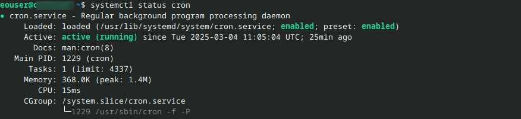
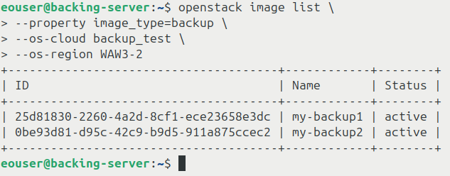
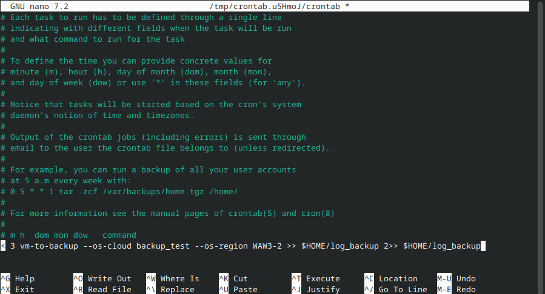

Use backup command to create rotating backups of virtual machines on |brand-name| cloud
======================================================================================

**Rotating backups** in OpenStack are a backup strategy where older backups are
automatically deleted after a predefined number of backups has been created.
This prevents storage from growing indefinitely while still keeping a selected
number of recent backups available for disaster recovery.

The rotating backup algorithm
-----------------------------

Creating rotating backups of virtual machines includes the following steps:

Define the backup period
   Usually daily, weekly, monthly, or another period that matches your recovery
   policy.

Define the rotation limit
   The number of backups to retain. This article refers to this number as
   **maxN**.

Delete older backups
   Once the limit is reached, older backups are deleted automatically, usually
   starting from the oldest one.

Backup create vs. image create
------------------------------

There are two common ways to create backups under OpenStack:

* **openstack server backup create**
* **openstack server image create**

They behave differently.

.. jinja:: caption_colors

   .. list-table:: :{{ caption }}:`Comparison of backup and image creation commands`
      :header-rows: 1

      * - :{{ header }}:`Feature`
        - :{{ header }}:`openstack server backup create`
        - :{{ header }}:`openstack server image create`
      * - Association with VM
        - Associated using the **backup**

          image property.
        - Associated using the backup name.
      * - Rotation support
        - Rotation with **--backup-type**

          and **--rotate**.
        - No built-in rotation support.
      * - Classification in Horizon
        - Marked as **image**.
        - Marked as **snapshot**.
      * - Horizon **Select Boot Source**
        - Choose **Instance Snapshot**.
        - Choose **Image**.
      * - Purpose
        - Primarily used for backups that

          can be rotated and managed.
        - Creates a single VM snapshot

          without built-in rotation.
      * - Incremental backup support
        - Yes.
        - No, creates a full snapshot.
      * - Multiple rotating schedules
        - No, only one rotating series.
        - Yes, for example daily, weekly,

          and monthly.
      * - Best usage scenario
        - Simple automated backup strategy

          with one rotation series.
        - Capturing VM state for cloning, rollback,

          or custom scripted rotation.
      * - Can be scripted?
        - Yes.
        - Yes.

In this article, you will use the **openstack server backup create** command to
create rotating backups of virtual machines.

Prerequisites
-------------

No. 1 **Account**

You need a |brand-name| hosting account with access to the Horizon interface:
|brand-name-site-auth-link|.

No. 2 **VM which will be backed up**

You need a virtual machine to back up. If you do not have one yet, you can
create it by following one of these articles:

.. jinja:: doc_links

   * :doc:`{{ linux_vm_from_windows }}`
   * :doc:`{{ linux_vm_from_linux }}`

.. ifconfig:: brand_name != 'ESA HPC'

   To learn how to create a Windows virtual machine, see this article:

   .. jinja:: doc_links

      :doc:`{{ windows_vm_horizon }}`

In this article, the virtual machine that will be backed up is called
**vm-to-backup**. Replace this name with the name of your own virtual machine
where needed.

No. 3 **Server on which the backup process will run**

You need a server from which the backup commands will be executed. This server
may be in the same region as the backed-up instance, in another region, or
outside |brand-name| cloud.

In this article, this server is called **backing-server**. It is assumed to be
an **Ubuntu 24.04 LTS** machine with SSH access.

No. 4 **OpenStackClient installed on backing-server**

You need OpenStackClient installed on **backing-server**.

.. jinja:: doc_links

   :doc:`{{ openstackclient_linux }}`

After you sign in to **backing-server** through SSH, you will use the
**openstack** command to manage backups of **vm-to-backup**.

No. 5 **Application credentials**

You may be using two-factor authentication to sign in to |brand-name| as a
user. In this article, backup creation is automated, so authentication should
also be automated.

For this purpose, use **application credentials** stored in a **clouds.yml**
file.

.. jinja:: doc_links

   Use :doc:`{{ application_credentials_cli }}` to learn how to create
   application credentials and store them in **clouds.yml**.

Copy **clouds.yml** to **backing-server**.

The **clouds.yml** file may store multiple credential profiles. To choose the
profile used by OpenStackClient, use the **--os-cloud** parameter. In this
article, the placeholder profile name is **backup_test**.

The region is selected with the **--os-region** parameter.

For the examples in this article, define the following shell variable:

.. code-block:: bash

   OS_CLOUD_NAME="backup_test"

Use the tab for the region where your virtual machine exists:

.. jinja:: regional_clouds

   .. tabs::

      
      .. tab:: {{ region.display_name }}

         .. code-block:: bash

            OS_REGION_NAME="{{ region.display_name }}"

      

.. important::

   These shell variables are valid only in the current terminal session. If
   you open a new terminal, define them again.

To test the credentials and region, list virtual machines in your project:

.. code-block:: bash

   openstack server list \
     --os-cloud "$OS_CLOUD_NAME" \
     --os-region "$OS_REGION_NAME"

No. 6 **Knowledge of cron under Linux**

`cron <https://www.linux.com/training-tutorials/scheduling-magic-intro-cron-linux/>`_
is a standard Linux tool for executing tasks according to a predefined
schedule. In this article, it is used only for basic automation.

If **cron** is installed, the following command:

.. code-block:: bash

   systemctl status cron

should produce output similar to this:

If **cron** is not installed, install and enable it:

.. code-block:: bash

   sudo apt update
   sudo apt install cron -y
   sudo systemctl enable --now cron
   systemctl status cron

The basic command to enter or modify cron jobs is:

.. code-block:: bash

   crontab -e

By default, the crontab file may open in the preinstalled editor. If you want
to use **nano**, install it first:

.. code-block:: bash

   sudo apt install nano

To open **crontab** with **nano**, use:

.. code-block:: bash

   EDITOR=nano crontab -e

No. 7 **Knowledge of openstack server backup create**

The **openstack server backup create** command creates a backup image of a
server.

.. jinja:: doc_links

   See :doc:`{{ backup_instance_download }}` for the basic syntax of the CLI
   command used to create a server backup.

Create the first backup
-----------------------

The following command manually creates a rotating backup:

.. code-block:: bash

   openstack server backup create \
     --name my-backup1 \
     --rotate 3 \
     --os-cloud "$OS_CLOUD_NAME" \
     --os-region "$OS_REGION_NAME" \
     vm-to-backup

In this command:

* **my-backup1** is the name of the backup,
* **3** is the rotation limit,
* **vm-to-backup** is the VM to back up,
* **--os-cloud** selects the application credentials profile,
* **--os-region** selects the region.

How to see the created backups
^^^^^^^^^^^^^^^^^^^^^^^^^^^^^^

Backups created by this command are images. In Horizon, they can be seen under
**Compute** -> **Images**.

To list images with CLI, run:

.. code-block:: bash

   openstack image list \
     --os-cloud "$OS_CLOUD_NAME" \
     --os-region "$OS_REGION_NAME"

By default, this command displays all images found in your project.

To show only backups created with **openstack server backup create**, filter by
the **image_type=backup** property:

.. code-block:: bash

   openstack image list \
     --property image_type=backup \
     --os-cloud "$OS_CLOUD_NAME" \
     --os-region "$OS_REGION_NAME"

Add another backup to the series
^^^^^^^^^^^^^^^^^^^^^^^^^^^^^^^^

The first backup in the rotating series has been created. To add another
backup to the same series, run the same command and change the backup name.

For example, if the first backup was named **my-backup1**, create the second
backup as **my-backup2**:

.. code-block:: bash

   openstack server backup create \
     --name my-backup2 \
     --rotate 3 \
     --os-cloud "$OS_CLOUD_NAME" \
     --os-region "$OS_REGION_NAME" \
     vm-to-backup

Keep the value of **--rotate** the same for the same backup series. Changing
this value during later runs may lead to confusing or unexpected results.

You will now have two backups of the same VM, named **my-backup1** and
**my-backup2**.

Run the command again with the name **my-backup3**. The rotation limit has now
been reached.

If you then run the command again with the name **my-backup4**, one of the
older backups should be removed automatically.

List backup images again:

.. code-block:: bash

   openstack image list \
     --property image_type=backup \
     --os-cloud "$OS_CLOUD_NAME" \
     --os-region "$OS_REGION_NAME"

There should be only three backup images left.

Problems and shortcomings of the backup command
-----------------------------------------------

The **openstack server backup create** command is useful, but it has several
limitations:

#. The procedure is manual unless you automate it with a scheduler such as
   **cron**.

#. The command cannot differentiate between separate daily, weekly, and
   monthly backup series. The **--rotate** value should remain the same every
   time you run the command for the same backup series.

#. If you use the same backup name twice, the backup may still be created, but
   OpenStackClient may return a message similar to:

   .. code-block:: text

      More than one Image exists with the name 'my-backup1'.

   During restore operations, use the backup image ID instead of the backup
   name when there is any ambiguity.

Automating through cron jobs
----------------------------

Linux **cron** can automate creation of rotating backups. For basic cron
usage, see Prerequisite No. 6.

Open the crontab file:

.. code-block:: bash

   crontab -e

Add a cron job that creates a backup of your virtual machine. For example:

.. code-block:: text

   4 3 * * * openstack server backup create --name "backup_cron_$(date +\%Y-\%m-\%d_\%H-\%M)" --rotate 3 --os-cloud backup_test --os-region FRA1-3 vm-to-backup >> $HOME/log_backup 2>> $HOME/log_backup

Replace **backup_test**, **FRA1-3**, and **vm-to-backup** with values from
your own environment.

.. note::

   Cron does not automatically know the shell variables you defined earlier in
   your interactive terminal session. For that reason, the cron example uses
   explicit values instead of **$OS_CLOUD_NAME** and **$OS_REGION_NAME**.

This is what the command may look like in the **nano** editor:

The line is long, so it is often easier to prepare it locally first and then
paste it into the crontab file.

In this example, the job uses the following parameters:

Run time
   Runs every day at **3:04 AM** in the timezone configured on the server.
   Default cloud images often use UTC.

Backup created
   Creates a backup of virtual machine **vm-to-backup**. The backup name
   starts with **backup_cron_** and then includes the current date and time in
   the following format: **Year-Month-Day_Hour-Minute**.

Number of backups kept
   **maxN** is **3**.

Cloud profile
   Authenticates with profile **backup_test** from **clouds.yml**.

Region
   Uses the region specified after **--os-region**.

Logs
   Appends standard output and standard error to file **log_backup** in the
   user's home directory.

Restoring backups
-----------------

This section describes how to restore a virtual machine to a previous state
from backup.

Rebuild an instance
^^^^^^^^^^^^^^^^^^^

Rebuilding an instance replaces the current contents of the virtual machine
disk with the contents of an image. In this process, metadata such as VM name
or ID is kept. This also includes floating IP assignments.

During this process, the virtual machine is unavailable.

.. warning::

   This operation removes data from the virtual machine on which it is
   performed. Make sure that the virtual machine does not contain any data
   that you need to keep.

List backup images:

.. code-block:: bash

   openstack image list \
     --private \
     --os-cloud "$OS_CLOUD_NAME" \
     --os-region "$OS_REGION_NAME"

Example output:

.. code-block:: text

   +--------------------------------------+------------+--------+
   | ID                                   | Name       | Status |
   +--------------------------------------+------------+--------+
   | 3efb29d5-40bb-44aa-ad4e-3b66bc4fd5a3 | my-backup1 | active |
   | 37f1510b-ff4f-4dc0-9fea-e310cf987de6 | my-backup2 | active |
   +--------------------------------------+------------+--------+

The command to restore from a backup is:

.. code-block:: bash

   openstack server rebuild \
     --image my-backup2 \
     --os-cloud "$OS_CLOUD_NAME" \
     --os-region "$OS_REGION_NAME" \
     vm-to-backup

In this command:

* **my-backup2** is the ID or name of your backup image,
* **vm-to-backup** is the ID or name of your instance.

You should get output similar to this:

.. code-block:: text

   +-------------------+----------------------------------------------------------+
   | Field             | Value                                                    |
   +-------------------+----------------------------------------------------------+
   | OS-DCF:diskConfig | MANUAL                                                   |
   | accessIPv4        |                                                          |
   | accessIPv6        |                                                          |
   | addresses         | private-network=10.0.0.56                                |
   | adminPass         | zrWv6nfof7Mn                                             |
   | created           | 2025-02-13T09:40:23Z                                     |
   | flavor            | eo1.xsmall (eo1.xsmall)                                  |
   | id                | 3a42cda7-ab72-4c6a-a6f3-11000e6e54ac                     |
   | image             | my-backup2 (37f1510b-ff4f-4dc0-9fea-e310cf987de6)        |
   | name              | vm-to-backup                                             |
   | progress          | 0                                                        |
   | status            | REBUILD                                                  |
   +-------------------+----------------------------------------------------------+

Wait until the restore operation finishes.

To check the VM status, run:

.. code-block:: bash

   openstack server show \
     -c status \
     --os-cloud "$OS_CLOUD_NAME" \
     --os-region "$OS_REGION_NAME" \
     vm-to-backup

If the status is **ACTIVE**, the VM should be ready.

What to do next
---------------

In this article, you used **openstack server backup create**. If you need
multiple rotating schedules, **openstack server image create** with a custom
script may be a better choice.

.. jinja:: doc_links

   :doc:`{{ backup_script_rotating }}`