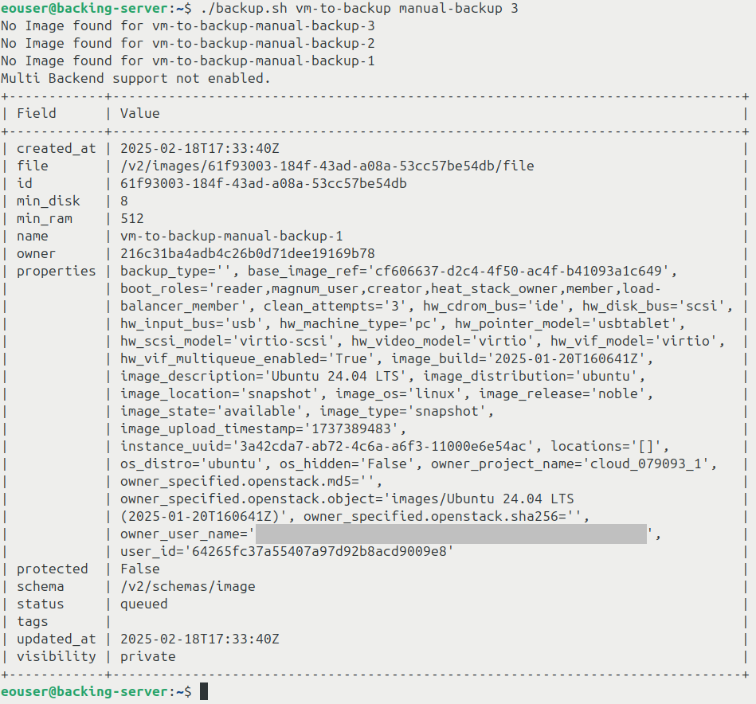
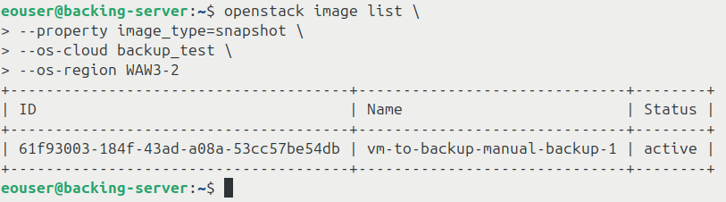
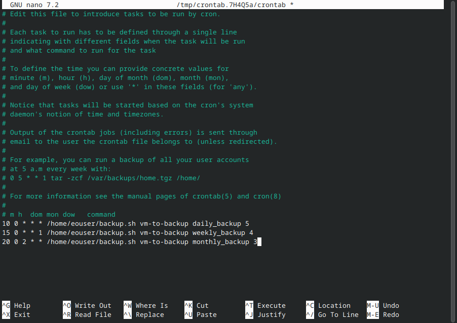
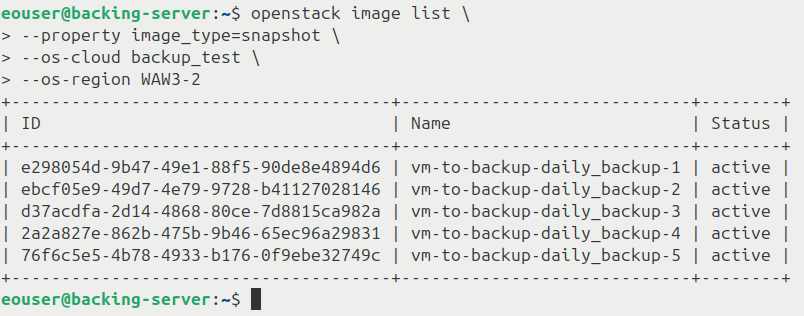
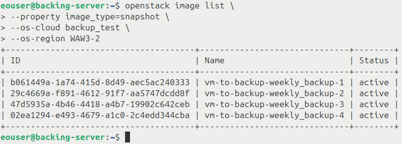
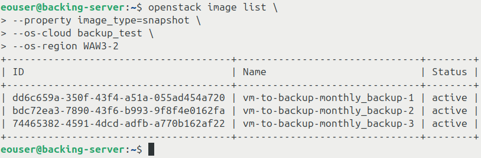
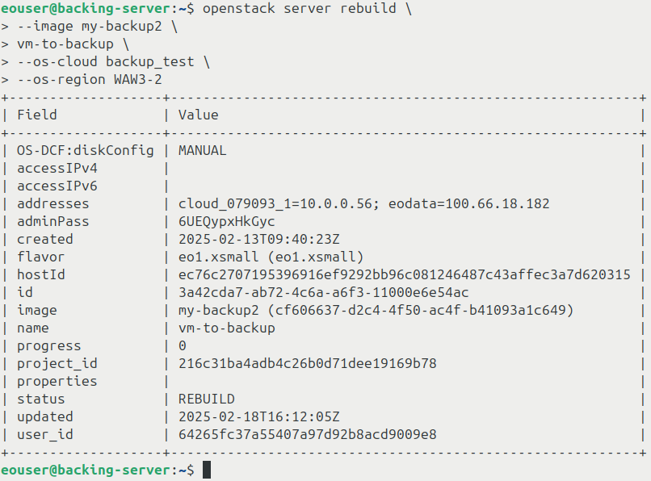
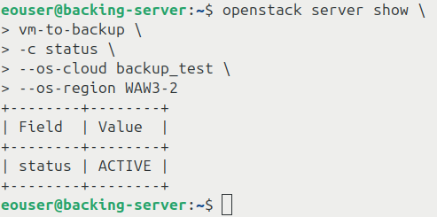
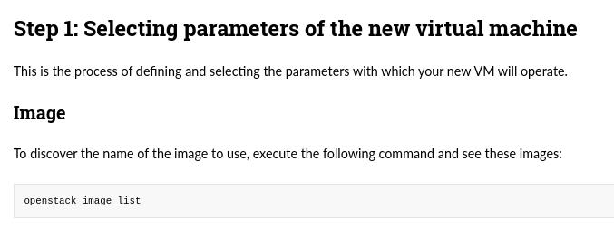

Use script to create daily, weekly, and monthly rotating backups of virtual machines on |brand-name|
===================================================================================================

**Rotating backups** in OpenStack are a backup strategy where older backups
are automatically removed after a defined number of backups is reached. This
prevents backup storage from growing indefinitely while keeping a selected
number of recent backups available for recovery.

Backup create vs. image create
------------------------------

There are two common ways to create backups under OpenStack:

* **openstack server backup create**
* **openstack server image create**

They behave differently.

.. jinja:: caption_colors

   .. list-table:: :{{ caption }}:`Comparison of backup and image creation commands`
      :header-rows: 1

      * - :{{ header }}:`Feature`
        - :{{ header }}:`openstack server backup create`
        - :{{ header }}:`openstack server image create`
      * - Association with VM
        - Associated using the **backup** image property.
        - Associated using the backup name.
      * - Rotation support
        - Rotation with **--backup-type** and incremental backups.
        - No built-in rotation support.
      * - Classification in Horizon
        - Marked as **image**.
        - Marked as **snapshot**.
      * - Horizon **Select Boot Source**
        - Choose **Instance Snapshot**.
        - Choose **Image**.
      * - Purpose
        - Primarily used for backups that can be rotated and managed.
        - Creates a single VM snapshot without rotation.
      * - Multiple rotating schedules
        - No, only one.
        - Yes, for example daily, weekly, and monthly.
      * - Incremental backup support
        - Yes.
        - No, always creates a full snapshot.
      * - Best usage scenario
        - Automated backup strategies with built-in rotation.
        - Capturing the current state of a VM for cloning or rollback.
      * - Can be scripted?
        - Yes.
        - Yes.

In this article, you will create multiple series of rotating backups with a
script that uses several OpenStackClient commands.

Prerequisites
-------------

No. 1 **Account**

You need a |brand-name| hosting account with access to the Horizon interface:
|brand-name-site-auth-link|.

No. 2 **VM which will be backed up**

You need a virtual machine to back up. If you do not have one yet, you can
create it by following one of these articles:

.. jinja:: doc_links

   * :doc:`{{ linux_vm_horizon }}`
   * :doc:`{{ linux_vm_from_windows }}`
   * :doc:`{{ linux_vm_from_linux }}`

.. ifconfig:: brand_name != 'ESA HPC'

   To learn how to create a Windows virtual machine, see this article:

   .. jinja:: doc_links

      :doc:`{{ windows_vm_horizon }}`

In this article, the virtual machine that will be backed up is called
**vm-to-backup**. Replace this name with the name of your own virtual machine
where needed.

This article covers backing up virtual machines which:

* do not have any volumes attached to them,
* use ephemeral storage, not persistent storage.

.. jinja:: doc_links

   For more information, see :doc:`{{ ephemeral_vs_persistent }}`.

No. 3 **Server or computer on which the backup process will run**

You need an environment from which the backup commands will be executed.

In this article, that environment runs **Ubuntu 24.04 LTS** and is called
**backing-server**. It can be, among others:

* a virtual machine on |brand-name| cloud,
* your own physical server,
* a virtual machine running outside |brand-name| cloud.

Make sure that this environment can connect to |brand-name| cloud.

The environment must be running whenever a new backup should be created.

No. 4 **OpenStackClient installed on backing-server**

You need OpenStackClient installed on **backing-server**.

.. jinja:: doc_links

   :doc:`{{ openstackclient_linux }}`

No. 5 **Application credentials**

You may be using two-factor authentication to sign in to |brand-name| as a
user. In this article, the backup operation is automated, so authentication
should be automated as well.

For this purpose, use **application credentials** stored in a **clouds.yml**
file.

.. jinja:: doc_links

   Follow :doc:`{{ application_credentials_cli }}` to create a **clouds.yml**
   file with your application credentials.

Copy **clouds.yml** to **backing-server**. Once installed, the **openstack**
command searches for **clouds.yml** in these locations by default:

* **$HOME/.config/openstack/clouds.yml**
* **/etc/openstack/clouds.yml**

You can place **clouds.yml** in either of them. Then you will be able to use
the credentials from any directory.

**$HOME** is the environment variable that usually points to your home
directory.

You can also place **clouds.yml** in another directory, but then you need to
run the **openstack** command from that directory or point OpenStackClient to
that file explicitly.

.. important::

   The **clouds.yml** file stores credentials in plain text. Make sure that
   the location where you store it is sufficiently protected.

The **clouds.yml** file may store multiple credential profiles. To choose the
profile used by OpenStackClient, use the **--os-cloud** parameter. In this
article, the placeholder profile name is **backup_test**.

On |brand-name|, application credentials can work across multiple regions. The
region is selected with the **--os-region** parameter.

For the examples in this article, define the following shell variables:

.. code-block:: bash

   OS_CLOUD_NAME="backup_test"

Use the tab for the region in which your virtual machine exists:

.. jinja:: regional_clouds

   .. tabs::

      
      .. tab:: {{ region.display_name }}

         .. code-block:: bash

            OS_REGION_NAME="{{ region.display_name }}"

      

.. important::

   These shell variables are valid only in the current terminal session. If
   you open a new terminal, define them again.

To test the credentials and region, list virtual machines in your project:

.. code-block:: bash

   openstack server list \
     --os-cloud "$OS_CLOUD_NAME" \
     --os-region "$OS_REGION_NAME"

No. 6 **Knowledge of cron under Linux**

`cron <https://www.linux.com/training-tutorials/scheduling-magic-intro-cron-linux/>`_
is a standard Linux tool for executing tasks according to a predefined
schedule. This article uses **cron** to automate rotating backups.

If **cron** is installed, the following command:

.. code-block:: bash

   systemctl status cron

should produce output similar to this:

.. figure:: install-cron-1.png
   :class: image-with-border

If **cron** is not installed, install and enable it:

.. code-block:: bash

   sudo apt update
   sudo apt install cron -y
   sudo systemctl enable --now cron
   systemctl status cron

No. 7 **Plain text editor installed on backing-server**

Two common terminal editors are `vim <https://www.vim.org/>`_ and
`nano <https://www.nano-editor.org/>`_.

Install **vim**:

.. code-block:: bash

   sudo apt install vim

Or install **nano**:

.. code-block:: bash

   sudo apt install nano

To choose the default text editor on Ubuntu 24.04, run:

.. code-block:: bash

   select-editor

You should be prompted to choose the editor by number, for example:

.. code-block:: text

   Select an editor.  To change later, run 'select-editor'.
     1. /bin/nano        <---- easiest
     2. /usr/bin/vim.basic
     3. /usr/bin/vim.tiny
     4. /bin/ed

   Choose 1-4 [1]:

Choose the editor you want to use and press **Enter**.

The rotating backup algorithm
-----------------------------

Before the backup script is run for the first time, define:

Backup series name
   For example **daily**, **weekly**, or **monthly**.

Rotation limit
   The number of backups to retain. This article refers to this number as
   **maxN**.

Each time the script runs, it performs these operations:

Renaming backups
   Existing backups are renamed so that their numbers show which backup is
   newest and which one is oldest. Backup number **1** is always the newest.

Deleting the oldest backup
   If the number of backups becomes greater than **maxN**, the oldest backup
   is deleted.

Creating a new backup
   A new backup with number **1** in its name is created.

Creating a backup manually without rotating
-------------------------------------------

The command **openstack server image create** creates full snapshots, but it
has no built-in parameter for rotating backups.

The simplest form of the command looks like this:

.. code-block:: bash

   openstack server image create \
     --name my-vm-backup \
     --os-cloud "$OS_CLOUD_NAME" \
     --os-region "$OS_REGION_NAME" \
     my-vm

In this command:

* **my-vm-backup** is the name of the backup,
* **my-vm** is the name of your virtual machine,
* **--os-cloud** selects the application credentials profile,
* **--os-region** selects the region.

To delete an old image, use:

.. code-block:: bash

   openstack image delete \
     --os-cloud "$OS_CLOUD_NAME" \
     --os-region "$OS_REGION_NAME" \
     my-vm-backup

Multiple rotating schedules
---------------------------

Manual backup commands are error-prone. You may forget to run them, use a
wrong VM name, or use a wrong backup name.

A script can run at predefined times and can support multiple rotating backup
series. For example, you can have separate daily, weekly, and monthly backup
series for the same virtual machine.

The script in this article uses:

* **openstack image set** to rename existing backups,
* **openstack server image create** to create a new backup,
* **openstack image delete** to delete the oldest backup.

Each backup name consists of:

* the instance name, for example **vm-to-backup**,
* a dash,
* the backup series name, for example **weekly**,
* a dash,
* the backup number from **1** to **maxN**.

For example:

.. code-block:: text

   vm-to-backup-weekly-3

Step 1: Create a script
^^^^^^^^^^^^^^^^^^^^^^^

Open your text editor, create file **backup.sh**, and enter the following
script:

.. code-block:: bash

   #!/bin/bash

   if [[ "$#" -ne 5 ]]
   then
     echo "Expecting 5 arguments: vm name, backup name, number of backups, os-cloud name, os-region name"
     exit 1
   fi

   vm_name=$1
   backup_core_name=$1"-"$2
   count=$3
   os_cloud_name=$4
   os_region_name=$5

   reifnumber='^[0-9]+$'
   if ! [[ $count =~ $reifnumber ]]
   then
     echo "Given backup count is not a number"
     exit 1
   fi

   # Rename all previous backups by adding 1 to their number.
   for i in $(seq "$count" -1 1)
   do
     openstack image set \
       --name "$backup_core_name-$((i+1))" \
       "$backup_core_name-$i" \
       --os-cloud "$os_cloud_name" \
       --os-region "$os_region_name"
   done

   # Delete the backup whose number is greater by 1 than the rotation limit.
   openstack image delete \
     "$backup_core_name-$((count+1))" \
     --os-cloud "$os_cloud_name" \
     --os-region "$os_region_name"

   # Create a new backup with number 1.
   openstack server image create \
     --name "$backup_core_name-1" \
     "$vm_name" \
     --os-cloud "$os_cloud_name" \
     --os-region "$os_region_name"

This version accepts the OpenStack cloud profile and region as arguments, so
the script does not contain hard-coded region names.

Save **backup.sh** in your home directory.

Add executable permissions:

.. code-block:: bash

   chmod +x backup.sh

Step 2: Run the script
^^^^^^^^^^^^^^^^^^^^^^

From your home directory, test the script.

The script accepts five arguments:

* the name or ID of the virtual machine, for example **vm-to-backup**,
* the name of the backup series, for example **manual-backup**,
* the number of backups to keep, for example **3**,
* the name of the OpenStack cloud profile, for example **backup_test**,
* the name of the region.

Run:

.. code-block:: bash

   ./backup.sh vm-to-backup manual-backup 3 "$OS_CLOUD_NAME" "$OS_REGION_NAME"

You should get output similar to this:

Show backup files
^^^^^^^^^^^^^^^^^

The backup files created by the script are snapshots. To list all snapshots in
the project, run:

.. code-block:: bash

   openstack image list \
     --property image_type=snapshot \
     --os-cloud "$OS_CLOUD_NAME" \
     --os-region "$OS_REGION_NAME"

Some snapshots may be backups created by this script, while others may have
been created manually or imported.

How the script behaves during repeated runs
^^^^^^^^^^^^^^^^^^^^^^^^^^^^^^^^^^^^^^^^^^^

The example below shows what happens when you run the script with the same
arguments four times in a row.

.. tabs::

   .. tab:: First run

      Before this run, there are no backups in the project.

      The script attempts to rename existing backups:

      .. jinja:: caption_colors

         .. list-table::
            :header-rows: 1
            :widths: 25 25 25

            * - :{{ header }}:`Original number`
              - :{{ header }}:`Number after rename`
              - :{{ header }}:`Outcome`
            * - 3
              - 4
              - Fail
            * - 2
              - 3
              - Fail
            * - 1
              - 2
              - Fail

      These images do not exist yet, so rename operations fail with messages
      such as **No Image found**.

      The script then attempts to delete
      **vm-to-backup-manual-backup-4**. This image does not exist yet, so the
      deletion fails.

      Finally, the script creates a new backup named
      **vm-to-backup-manual-backup-1**.

      Backups after this run:

      .. jinja:: caption_colors

         * :{{ red }}:`vm-to-backup-manual-backup-1`

   .. tab:: Second run

      Before this run, there is one backup:

      .. jinja:: caption_colors

         * :{{ red }}:`vm-to-backup-manual-backup-1`

      The script attempts to rename existing backups:

      .. jinja:: caption_colors

         .. list-table::
            :header-rows: 1
            :widths: 25 25 25

            * - :{{ header }}:`Original number`
              - :{{ header }}:`Number after rename`
              - :{{ header }}:`Outcome`
            * - 3
              - 4
              - Fail
            * - 2
              - 3
              - Fail
            * - 1
              - 2
              - Success

      Only the last rename succeeds because backup number **1** exists.

      The script then creates a new backup named
      **vm-to-backup-manual-backup-1**.

      Backups after this run:

      .. jinja:: caption_colors

         * :{{ red }}:`vm-to-backup-manual-backup-1`
         * :{{ red }}:`vm-to-backup-manual-backup-2`

   .. tab:: Third run

      Before this run, there are two backups:

      .. jinja:: caption_colors

         * :{{ red }}:`vm-to-backup-manual-backup-1`
         * :{{ red }}:`vm-to-backup-manual-backup-2`

      The script attempts to rename existing backups:

      .. jinja:: caption_colors

         .. list-table::
            :header-rows: 1
            :widths: 25 25 25

            * - :{{ header }}:`Original number`
              - :{{ header }}:`Number after rename`
              - :{{ header }}:`Outcome`
            * - 3
              - 4
              - Fail
            * - 2
              - 3
              - Success
            * - 1
              - 2
              - Success

      This time, two rename operations succeed.

      The script then creates a new backup named
      **vm-to-backup-manual-backup-1**.

      Backups after this run:

      .. jinja:: caption_colors

         * :{{ red }}:`vm-to-backup-manual-backup-1`
         * :{{ red }}:`vm-to-backup-manual-backup-2`
         * :{{ red }}:`vm-to-backup-manual-backup-3`

      The number of backups is now equal to **maxN**. During the next run, one
      image will be removed.

   .. tab:: Fourth run

      Before this run, there are three backups:

      .. jinja:: caption_colors

         * :{{ red }}:`vm-to-backup-manual-backup-1`
         * :{{ red }}:`vm-to-backup-manual-backup-2`
         * :{{ red }}:`vm-to-backup-manual-backup-3`

      The script attempts to rename existing backups:

      .. jinja:: caption_colors

         .. list-table::
            :header-rows: 1
            :widths: 25 25 25

            * - :{{ header }}:`Original number`
              - :{{ header }}:`Number after rename`
              - :{{ header }}:`Outcome`
            * - 3
              - 4
              - Success
            * - 2
              - 3
              - Success
            * - 1
              - 2
              - Success

      After renaming, the project contains:

      .. jinja:: caption_colors

         * :{{ red }}:`vm-to-backup-manual-backup-2`
         * :{{ red }}:`vm-to-backup-manual-backup-3`
         * :{{ red }}:`vm-to-backup-manual-backup-4`

      The script deletes **vm-to-backup-manual-backup-4**, because its number
      is greater than **maxN**.

      Then it creates a new backup named
      **vm-to-backup-manual-backup-1**.

      Backups after this run:

      .. jinja:: caption_colors

         * :{{ red }}:`vm-to-backup-manual-backup-1`
         * :{{ red }}:`vm-to-backup-manual-backup-2`
         * :{{ red }}:`vm-to-backup-manual-backup-3`

   .. tab:: Subsequent runs

      Later runs behave like the fourth run, assuming that you always use the
      same arguments and that no command fails unexpectedly.

Step 3: Open the crontab file
^^^^^^^^^^^^^^^^^^^^^^^^^^^^^

Use **cron** to automate the rotating backups.

Open the crontab file:

.. code-block:: bash

   crontab -e

Depending on your system, either:

* the file opens in the default text editor,
* or you are prompted to choose the default text editor.

To choose the editor only for this command, use the **EDITOR** variable.

Open crontab in **nano**:

.. code-block:: bash

   EDITOR=nano crontab -e

Open crontab in **vim**:

.. code-block:: bash

   EDITOR=vim crontab -e

Step 4: Edit the crontab file
^^^^^^^^^^^^^^^^^^^^^^^^^^^^^

Remove previous backup schedules from this file if you no longer need them.

Create cron jobs for the backup schedules you want to use.

The crontab file may look like this:

After you finish editing, save the file and exit the editor. If the jobs are
defined correctly, they will run according to their schedules.

Examples of cron jobs
+++++++++++++++++++++

**Daily**

.. code-block:: text

   10 0 * * * /home/eouser/backup.sh vm-to-backup daily_backup 5 backup_test FRA1-3

This job runs daily 10 minutes after midnight. It creates the
**daily_backup** series for VM **vm-to-backup** and keeps five backups.

Replace **backup_test** and **FRA1-3** with your actual cloud profile and
region.

After five days, the list of backups should look similar to this:

Backup number **1** is the newest and backup number **5** is the oldest.

**Weekly**

.. code-block:: text

   15 0 * * 1 /home/eouser/backup.sh vm-to-backup weekly_backup 4 backup_test FRA1-3

This job runs every Monday 15 minutes after midnight. It creates the
**weekly_backup** series and keeps four backups.

After four weeks, the list of backups should look similar to this:

**Monthly**

.. code-block:: text

   20 0 2 * * /home/eouser/backup.sh vm-to-backup monthly_backup 3 backup_test FRA1-3

This job runs every second day of the month 20 minutes after midnight. It
creates the **monthly_backup** series and keeps three backups.

After three months, the list of backups should look similar to this:

Limitations
-----------

This script illustrates one possible way to create multiple rotating backup
series.

Once you have one backup series, do not run the script for that series with a
smaller rotation limit than the number of backups that already exist.

For example, if you have a VM called **my-vm** and five weekly backups, do not
run:

.. code-block:: bash

   ./backup.sh my-vm weekly 4 "$OS_CLOUD_NAME" "$OS_REGION_NAME"

The script also does not include advanced error handling or reporting. If a
backup operation fails, for example because OpenStack API connectivity is
unavailable, the backup series may not be rotated as expected.

Do not use the same naming convention for images that you create manually
outside this script. Otherwise, the script may rename or delete images that
were not intended to be part of the rotating backup series.

How to restore backups
----------------------

Backups created by this script are snapshots. Like other OpenStack images,
they can be used to:

* create new virtual machines,
* replace the contents of an existing virtual machine disk by rebuilding the
  virtual machine.

Before restoring a backup, it is recommended to create a copy of that image.
This prevents the rotating backup series from being unexpectedly interrupted
when the original backup is later renamed or deleted by the script.

Step 1: Find the size and name or ID of the image to restore
^^^^^^^^^^^^^^^^^^^^^^^^^^^^^^^^^^^^^^^^^^^^^^^^^^^^^^^^^^^^

List snapshots in your project:

.. code-block:: bash

   openstack image list \
     --property image_type=snapshot \
     --os-cloud "$OS_CLOUD_NAME" \
     --os-region "$OS_REGION_NAME"

Choose the backup you want to restore. In this example, the chosen backup is
**my-backup2**.

Write down the name or ID of this image.

You also need the minimum disk size required by the image:

.. code-block:: bash

   openstack image show \
     -c min_disk \
     --os-cloud "$OS_CLOUD_NAME" \
     --os-region "$OS_REGION_NAME" \
     my-backup2

The output should return the value in GB:

.. code-block:: text

   +----------+-------+
   | Field    | Value |
   +----------+-------+
   | min_disk | 8     |
   +----------+-------+

Step 2: Create a volume from the image
^^^^^^^^^^^^^^^^^^^^^^^^^^^^^^^^^^^^^^

Because OpenStack does not copy an image directly in this workflow, first
create a temporary volume from the image:

.. code-block:: bash

   openstack volume create \
     --image my-backup2 \
     --size 8 \
     --os-cloud "$OS_CLOUD_NAME" \
     --os-region "$OS_REGION_NAME" \
     my-backup2-volume

Where:

* **my-backup2** is the name or ID of your image,
* **8** is the minimum volume size for your image in GB,
* **my-backup2-volume** is the name of the temporary volume.

At first, the volume will likely have status **uploading**. Wait until it
becomes **available**.

Check the status:

.. code-block:: bash

   openstack volume show \
     -c status \
     --os-cloud "$OS_CLOUD_NAME" \
     --os-region "$OS_REGION_NAME" \
     my-backup2-volume

Step 3: Create an image from the volume
^^^^^^^^^^^^^^^^^^^^^^^^^^^^^^^^^^^^^^^

Create an image from the temporary volume:

.. code-block:: bash

   openstack image create \
     --volume my-backup2-volume \
     --os-cloud "$OS_CLOUD_NAME" \
     --os-region "$OS_REGION_NAME" \
     my-backup2-copy

At first, the image will likely have status **uploading**. Wait until it
becomes **active**.

Check the status:

.. code-block:: bash

   openstack image show \
     -c status \
     --os-cloud "$OS_CLOUD_NAME" \
     --os-region "$OS_REGION_NAME" \
     my-backup2-copy

Step 4: Delete the temporary volume
^^^^^^^^^^^^^^^^^^^^^^^^^^^^^^^^^^^

After the image copy has been created, delete the temporary volume:

.. code-block:: bash

   openstack volume delete \
     --os-cloud "$OS_CLOUD_NAME" \
     --os-region "$OS_REGION_NAME" \
     my-backup2-volume

The output should be empty.

Step 5: Restore the backup
^^^^^^^^^^^^^^^^^^^^^^^^^^

You now have a copy of the backup you want to restore. The original backup can
remain part of the rotating backup series.

Choose one of the following restore methods.

Method 1: Rebuild an existing instance
++++++++++++++++++++++++++++++++++++++

Rebuilding an instance replaces the current contents of the virtual machine
disk with the contents of an image. Metadata such as VM name or ID is kept.
This also includes floating IP assignments.

During this process, the virtual machine is unavailable.

.. warning::

   This operation removes data from the virtual machine on which it is
   performed. Make sure that the virtual machine does not contain any data
   that you need to keep.

Rebuild the VM from the copied image:

.. code-block:: bash

   openstack server rebuild \
     --image my-backup2-copy \
     --os-cloud "$OS_CLOUD_NAME" \
     --os-region "$OS_REGION_NAME" \
     vm-to-backup

You should get output similar to this:

The VM status should become **REBUILD**.

Wait until restoration is complete. The virtual machine should then be turned
on and ready to use.

Check the VM status:

.. code-block:: bash

   openstack server show \
     --os-cloud "$OS_CLOUD_NAME" \
     --os-region "$OS_REGION_NAME" \
     vm-to-backup

To show only the status, add **-c status**:

.. code-block:: bash

   openstack server show \
     -c status \
     --os-cloud "$OS_CLOUD_NAME" \
     --os-region "$OS_REGION_NAME" \
     vm-to-backup

If the status is **ACTIVE**, the VM should be ready.

Method 2: Create a new virtual machine from backup
++++++++++++++++++++++++++++++++++++++++++++++++++

Images created by this workflow can also be used to create a new virtual
machine. The new VM will contain the files and operating system from the
backup. This does not affect the original virtual machine.

If the original VM had floating IP addresses and you want to reuse them, first
detach them from the original VM. The floating IPs remain in your project and
can then be assigned to the new VM.

.. jinja:: doc_links

   Follow instructions from :doc:`{{ create_vm_cli }}`.

In the **Image** section of Step 1 of that article:

use the ID of the copied backup image.

In the **Flavor** section, choose a flavor that is large enough to run the
restored system. It will often be the same flavor that was used for the
original virtual machine.

Problems and troubleshooting
----------------------------

When using:

.. code-block:: bash

   openstack image create \
     --volume my-backup2-volume \
     --os-cloud "$OS_CLOUD_NAME" \
     --os-region "$OS_REGION_NAME" \
     my-backup2-copy

you may receive a message similar to this:

.. code-block:: text

   VolumeManager.upload_to_image() got an unexpected keyword argument 'visibility' when trying to create an image from Volume

This means that the version of OpenStackClient and the version of OpenStack in
the cloud may not be fully compatible.

A practical workaround is to set **OS_VOLUME_API_VERSION** to **3.1** or a
higher supported value:

.. code-block:: bash

   export OS_VOLUME_API_VERSION=3.1

You can also use the **--os-volume-api-version** parameter with the
**openstack image create** command:

.. code-block:: bash

   openstack image create \
     --volume my-backup2-volume \
     --os-volume-api-version 3.1 \
     --os-cloud "$OS_CLOUD_NAME" \
     --os-region "$OS_REGION_NAME" \
     my-backup2-copy

What to do next
---------------

The script used in this article creates instance snapshots.

.. jinja:: doc_links

   See :doc:`{{ instance_snapshot_horizon }}` for additional information.

If you do not need multiple rotating schedules, the official
**openstack server backup create** command may be a better choice.

.. jinja:: doc_links

   :doc:`{{ backup_command_rotating }}`