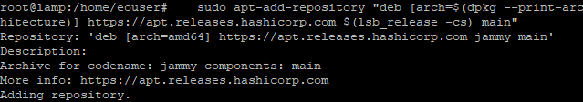
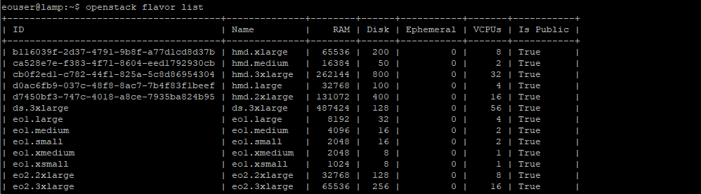
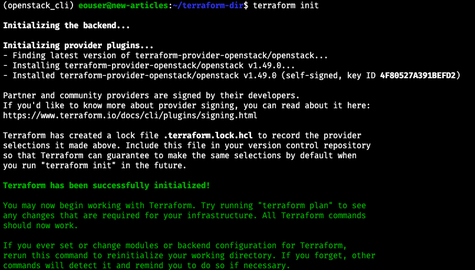
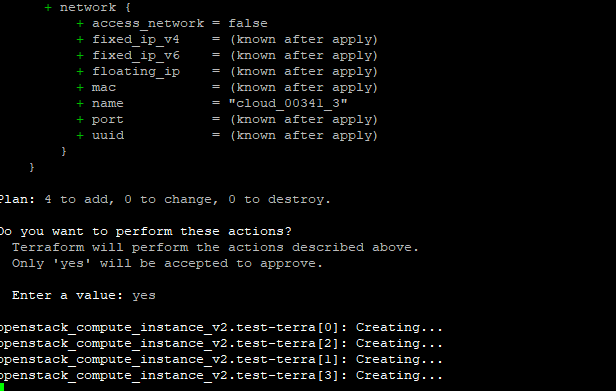
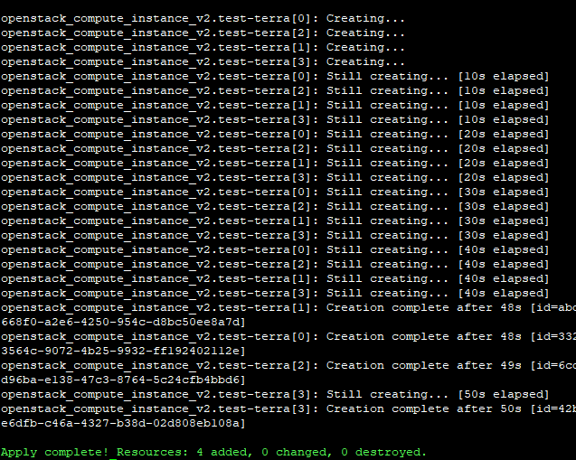
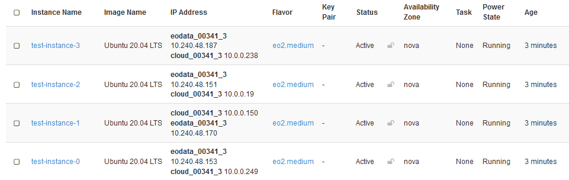

Generating and authorizing Terraform using Keycloak user on |brand-name|
========================================================================

Clicking in Horizon and entering CLI commands are two main ways of using an OpenStack system. They are well suited to interactively executing one command at a time but do not scale up easily. A tool such as `Terraform, by HashiCorp corporation, <https://www.terraform.io/>`_ provides an alternative to manual ways of introducing cascading changes. Here is how you could, say, create several instances at once:

 * Define parameters for the creation of one instance,

 * save them in a Terraform configuration file and

 * let Terraform automatically repeat it the prescribed number of times.

The plan is to install Terraform, get OpenStack token, enter it into the configuration file and execute. You will then be able to effectively use Terraform within the |brand-name| cloud. For instance, with Terraform you can

 * automate creation of a multitude of virtual machines, each with their own floating IPs, DNS and network functions or

 * automate creation of Kubernetes clusters

and so on.

What We Are Going To Do
-----------------------

 * Install Terraform as a root user

 * Reconnect to the cloud

 * Download OpenStack token

 * Set up the configuration file and initialize Terraform

 * Create Terraform code

 * Explain the meaning of the variables used

 * Execute the Terraform script

Prerequisites
-------------

No. 1 **Account**

You need a |brand-name| hosting account with access to the Horizon interface: |brand-name-site-link|. In particular, you will need the password for the account so have it ready in advance.

No. 2 **Installed version of Linux**

You can use your current Linux installation, however, in this article we shall start with a clean slate. Create a new VM with Ubuntu as defined in this article:

.. jinja:: brand_names

  :doc:`/cloud/How-to-create-a-Linux-VM-and-access-it-from-Linux-command-line-on-{{ brand_name_hyphen }}`.

No. 3 **Installed OpenStackClient for Linux**

To get token from the cloud, you will first need to enable access from the Ubuntu VM you just created:

.. jinja:: brand_names

   :doc:`/openstackcli/How-to-install-OpenStackClient-for-Linux-on-{{ brand_name_hyphen }}`

It will show you how to install Python, create and activate a virtual environment, and then connect to the cloud by downloading and activating the proper RC file from the |brand-name| cloud.

No. 4 **Connect to the cloud via an RC file**

.. jinja:: brand_names

   .. jinja:: doc_links

      Another article, :doc:`{{ openstack_cli_auth }}`, explains how to connect to the cloud using the authentication procedure enabled on your account. It also covers the main platforms: Linux, macOS, and Windows.

You will use both the Python virtual environment and the downloaded RC file **after** Terraform has been installed.

Step 1 Install Terraform as a root user
---------------------------------------

Install the required dependencies using the following command:

.. code::

   sudo apt-get install wget curl unzip software-properties-common gnupg2 -y

Download and add the HashiCorp signed *gpg* keys to your system. To perform this action, first enter *root* mode:

.. code::

   sudo su # Enter root mode
   curl -fsSL https://apt.releases.hashicorp.com/gpg | apt-key add -

Add the HashiCorp repository to the APT:

.. code::

   sudo apt-add-repository "deb [arch=$(dpkg --print-architecture)] https://apt.releases.hashicorp.com $(lsb_release -cs) main"

The following commands will update Ubuntu, install Terraform and check its version:

.. code::

   apt-get update -y #update Ubuntu
   apt-get install terraform -y # install Terraform
   terraform -v # check the version

Now exit *root* mode and become the standard **eouser** again.

.. code::

   su eouser # Exit root mode

Step 2 Reconnect to the cloud
-----------------------------

Working through Prerequisites Nos. 2 and 3, you ended up being connected up to the cloud. That connection is now lost because you have switched to **root** user and back again, to the normal **eouser** for the |brand-name| cloud. Refer to **Prerequisite No. 4 Activate the RC file** to reconnect to the cloud again. The following command will act as a test:

.. code::

   openstack flavor list

and should present a start of a list of flavors available in the system:

**You are now ready to receive token from the cloud you are working with.** The "token" is actually a very long string of characters which serves as kind of password for your code.

Step 3 Download OpenStack token
-------------------------------

Get token with the following command:

.. code::

   openstack token issue -f shell -c id

This is the result:

.. code::

   id="gAAAAABj1VTWP_CFhfKv4zWVH7avFUnHYf5J4TvuKG_Md1EdSpBIBZqTVErqVNWCnO-kYq9D7fi33aRCABadsp23-e-lrDFwyZGkfv-d83UkOTsoIuWogupmwx-3gr4wPcsikBvkAMMBD0-XMIkUONAPst6C35QnztSzZmVSeuXOJ33DaGr6yWbY-tNAOpNsk0C9c13U6ROI"

Value of variable **id** is the token you need. Copy and save it so that you can enter it into the configuration file for Terraform.

Step 4 Set up the configuration file and initialize Terraform
-------------------------------------------------------------

Create new directory where your Terraform files will be stored and switch to it:

.. code::

   mkdir terraform-dir # Name it as you want
   cd terraform-dir

Create configuration file, **yourconffile.tf**, and open it in text editor. Here we use **nano**:

.. code::

   sudo nano yourconffile.tf # Name it as you want

Paste the following into the file:

.. code::

   # Configure the OpenStack Provider
	terraform {
	  required_providers {
		openstack = {
		  source = "terraform-provider-openstack/openstack"
		}
	  }
	}

Save the file (for Nano, use **Ctrl-X** and **Y**).

These commands inform Terraform it will work with OpenStack.

Use the following command to initialize Terraform:

.. code::

   terraform init

Terraform will read **yourconffile.tf** file from the current folder. The actual name does not matter as long as it is the only **.tf** file in the folder.

You can, of course, use many other **.tf** files such as

 * *main.tf* for the main Terraform program,

 * *variable.tf* to define variables

and so on.

The screen after initialization would look like this:

Terraform has been initialized and is working properly with your OpenStack cloud. Now add code to perform some useful tasks.

.. note::

   In examples that follow, we use two networks, one with name starting with **cloud_** and the name of the other starting with **eodata_**. The former network should always be present in the account, but the latter may or may not present. If you do not have network which name starts with **eodata_**, you may create it or use any other network that you already have and want to use.

Step 5 Create Terraform code
----------------------------

Append code to the contents of the **yourconffile.tf**. It will generate four virtual machines as specified in the value of variable **count**. The entire file **yourconffile.tf** should now look like this:

.. code::

	# Configure the OpenStack Provider
	terraform {
	  required_providers {
		openstack = {
		  source = "terraform-provider-openstack/openstack"
		}
	  }
	}

	provider "openstack" {
		  user_name = "absdefr@xxyyzz23.com"
		  tenant_name = "cloud_00aaa_1"
		  auth_url = "https://keystone.cloudferro.com:5000/v3"
		  domain_name = "cloud_00aaa_1"
		  token = "gAAAAABj1VTWP_CFhfKv4zWVH7avFUnHYf5J4TvuKG_Md1EdSpBIBZqTVErqVNWCnO-kYq9D7fi33aRCABadsp23-e-lrDFwyZGkfv-d83UkOTsoIuWogupmwx-3gr4wPcsikBvkAMMBD0-XMIkUONAPst6C35QnztSzZmVSeuXOJ33DaGr6yWbY-tNAOpNsk0C9c13U6ROI"
		  }

	resource "openstack_compute_instance_v2" "test-terra" {
	count = 4
	name = "test-instance-${count.index}"
	image_id = "d7ba6aa0-d5d8-41ed-b29b-3f5336d87340"
	flavor_id = "eo2.medium"
	security_groups = [
	"default", "allow_ping_ssh_icmp_rdp"]
	network {
	name = "eodata_00aaa_3"
	}
	network {
	name = "cloud_00aaa_3"
	}
	}

Always use the latest value of image id
---------------------------------------

From time to time, the default images of operating systems in the |brand-name| cloud are upgraded to the new versions. As a consequence, their **image id** will change. Let's say that the image id for Ubuntu 20.04 LTS was **574fe1db-8099-4db4-a543-9e89526d20ae** at the time of writing of this article. While working through the article, you would normally take the **current** value of image id, and would use it to replace **574fe1db-8099-4db4-a543-9e89526d20ae** throughout the text.

Now, suppose you wanted to automate processes under OpenStack, perhaps using Heat, Terraform, Ansible or any other tool for OpenStack automation; if you use the value of **574fe1db-8099-4db4-a543-9e89526d20ae** for image id, it would remain **hardcoded** and once this value gets changed during the upgrade, the automated process may stop to execute.

.. warning::

   Make sure that your automation code is using the **current value** of an OS image id, not the hardcoded one.

The meaning of the variables used
---------------------------------

The meaning of the variables used is as follows:

**user_name**
   User name with which you log in into the |brand-name| account. You can use email address here as well.

**tenant_name**
   Starts with **cloud_00**. You can see it in the upper left corner of the Horizon window.

**domain_name**
   If you have only one project in the domain, this will be identical to the **tenant_name** from above.

**token**
   The **id** value you got from command **openstack token issue**.

**count**
   How many times to repeat the operation (in this case, four new virtual machines to create)

**name**
   The name of each VM; here it is differentiated by adding an ordinal number at the end of the name, for example, *test-instance-1*, *test-instance-0*, *test-instance-2*, *test-instance-3*.

**image_id**
   The name or **ID** code for an operating systems image you get with command **Compute** -> **Images**. For example, if you choose *Ubuntu 20.04 LTS* image, its **ID** is *d7ba6aa0-d5d8-41ed-b29b-3f5336d87340*.

**flavor_id**
   Name of the flavor that each VM will have. You get these names from command **openstack flavor list**.

**security_groups**
   Here, it is an array of two security groups -- **default** and **allow_ping_ssh_icmp_rdp**. These are the basic security groups that should be used as a start for all VMs.

**network**
   Name of the network to use. In this case, we include network **eodata_00aaa_3** for eodata and **cloud_00aaa_3** for general communication within the cloud.

Step 6 Execute the Terraform script
-----------------------------------

Here is how Terraform will create four instances of Ubuntu 20.04 LTS. Command **apply** will execute the script; when asked for confirmation to proceed, type **yes** to start the operation:

.. code::

  terraform apply

Type

.. code::

   yes

It will create four VMs as defined by variable **count**.

You should see output similar to this:

This is how you would see those virtual machines in Horizon:

If you wanted to revert the actions, that is, delete the VMs you have just created, the command would be:

.. code::

   terraform destroy

Again, type **yes** to start the operations.

What To Do Next
---------------

Of particular interest would be the following CLI commands for Terraform:

**plan**
   Shows what changes Terraform is going to apply for you to approve.

**validate**
   Check whether the configuration is valid.

**show**
   Show the current state or a saved plan.

Use command

.. code::

   terraform -help

to learn other commands Terraform can offer.

What To Do Next
---------------

.. jinja:: brand_names

   Article :doc:`/openstackcli/How-to-create-a-set-of-VMs-using-OpenStack-Heat-Orchestration-on-{{ brand_name_hyphen }}` uses orchestration capabilities of OpenStack to automate creation of virtual machines. It is a different approach compared to Terraform but both can lead to automation under OpenStack.