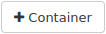
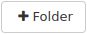
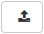
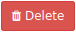
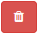

How to use object storage with Horizon FRA1-3 cloud
===================================================

.. note::

   This article applies to the **FRA1-3** cloud only.

   In R1 and R2 clouds, object storage is not available through the Horizon web interface. Use S3-compatible tools or CLI-based access methods for those clouds.

Object storage on |brand-name| FRA1-3 cloud lets you store files as objects in **containers**. You can create containers, upload files, organize objects with folder-like paths, delete objects, and optionally make a container publicly accessible.

This article shows how to perform these basic object storage operations in the Horizon web interface.

What We Are Going To Cover
--------------------------

* Create a new object storage container.
* View the contents of a container.
* Create folder-like paths in a container.
* Navigate through folders.
* Upload a file.
* Delete files and folders from a container.
* Enable or disable public access to a container.
* Use a public link to access objects.

Prerequisites
-------------

No. 1 **Account**

You need a |brand-name| hosting account with access to the Horizon interface: |brand-name-site-link|.

Create a new object storage container
-------------------------------------

Sign in to the Horizon dashboard.

Navigate to **Object Store > Containers**.

You should see the list of object storage containers. If no containers have been created yet, the list is empty:

.. jinja:: s3_images

   .. image:: {{ s3095 }}

To create a new object storage container, click the |new-container| button. The container creation form opens:

.. jinja:: s3_images

   .. image:: {{ s3096 }}

Enter the container name in the **Container Name** field.

.. note::

   In Horizon, object storage locations are shown as **containers**. In S3-compatible tools, the same type of storage is often called a **bucket**. This article uses the Horizon term **container**.

Container names should follow these rules:

* Use between **3** and **63** characters.
* Use only lowercase letters, numbers, hyphens, and periods.
* Start and end each label with a lowercase letter or number.
* Do not use uppercase letters or underscores.
* Do not format the name as an IP address.
* Do not use forward slashes (**/**).

.. warning::

   Container names must be unique in the cloud. Avoid common names such as **storage**, **backup**, **data**, or **files**.

In this example, the container is named **file-container**. Use a different, more specific name for your own container.

The **Container Access** section has two options:

**Public**
   Horizon generates a public URL for the container. Anyone with the URL can list and download objects from that container. Use this option only for data that is intended to be public.

**Not Public**
   The container remains private to your project. Users outside the project cannot access it unless additional sharing or access policies are configured outside the scope of this article.

Click **Submit**. The new container appears in the list:

.. jinja:: s3_images

   .. image:: {{ s3097 }}

You may encounter the following error:

.. jinja:: s3_images

   .. image:: {{ s3098 }}

This usually means that another container already uses the same name. Try again with a different, more specific container name.

View the container
------------------

To view the contents of a container, click its name in the container list:

.. jinja:: s3_images

   .. image:: {{ s3099 }}

The container opens. Initially, it is empty. You can now create folders and upload files to it.

Create a new folder
-------------------

To create a new folder, click the |new-folder| button. The folder creation form opens:

.. jinja:: s3_images

   .. image:: {{ s3100 }}

Enter the folder name in the **Folder Name** field.

Object storage does not use folders in the same way as a traditional filesystem. Horizon presents object prefixes as folders to make navigation easier.

For example, to create a folder called **place1** and another folder called **place2** inside it, enter:

.. code::

   place1/place2

A leading forward slash is not required. The folder-like path is created relative to the location you are currently viewing in the container.

Click **Create Folder** to confirm.

Navigate through folders
------------------------

To navigate to another folder in the container, click its name. Folder names are shown in blue, and the **Size** column shows **Folder**.

The section above the **Click here for filters or full text search** field shows the current folder path. For example:

.. jinja:: s3_images

   .. image:: {{ s3101 }}

In this example, the current folder is **another-folder**, which is inside **second-folder**, which is inside **first-folder**.

Click the folder name you want to open.

Upload a file
-------------

To upload a file to your object storage container, click the |upload-file| button. The upload window opens:

.. jinja:: s3_images

   .. image:: {{ s3102 }}

Click **Browse...** to open the file browser and select the file you want to upload. The file browser depends on your operating system and desktop environment.

After you select the file, its name appears in the **File** section, for example:

.. jinja:: s3_images

   .. image:: {{ s3103 }}

The **File Name** field controls how the object will be stored in the container:

* Leave it empty to upload the file with its original name to the current folder.
* Enter a different file name to rename the file during upload.
* Enter a path such as **first-folder/uploaded-file.txt** to upload the file into a folder-like prefix.

If the path contains a folder name that does not exist yet, Horizon creates the folder-like prefix automatically.

When ready, click **Upload File**.

If the upload is successful, Horizon shows a confirmation message:

.. jinja:: s3_images

   .. image:: {{ s3104 }}

For example, assume that you are in the root of the container and want to upload a file called **uploaded-file.txt** into the **first-folder** folder. In the **File Name** field, enter:

.. code::

   first-folder/uploaded-file.txt

The file is uploaded to that location:

.. jinja:: s3_images

   .. image:: {{ s3105 }}

.. warning::

   Do not use the same name for a file and a folder in the same location. Although object storage uses prefixes rather than real folders, duplicate or overlapping names can make the container harder to browse and manage in Horizon.

Delete files and folders from a container
-----------------------------------------

Delete one file
^^^^^^^^^^^^^^^

To delete a file from a container, open the drop-down menu next to the **Download** button:

.. jinja:: s3_images

   .. image:: {{ s3106 }}

Click **Delete**.

A confirmation dialog appears:

.. jinja:: s3_images

   .. image:: {{ s3107 }}

Click **Delete** to confirm. The file is removed from the container.

Delete one folder
^^^^^^^^^^^^^^^^^

To delete a folder and its contents, click the |delete-folder| button next to it.

A confirmation dialog appears. Click **Delete** to confirm.

Delete multiple files and folders
^^^^^^^^^^^^^^^^^^^^^^^^^^^^^^^^^

To delete multiple files or folders at the same time, select them by using the checkboxes on the left side of the list:

.. jinja:: s3_images

   .. image:: {{ s3108 }}

You can also select all files and folders on the current page by clicking the checkbox above the list:

.. jinja:: s3_images

   .. image:: {{ s3109 }}

To delete the selected items, click the |delete-selected| button next to the button used to create folders.

A confirmation dialog appears. Click **Delete** to confirm.

Manage public access to a container
-----------------------------------

When you create a container, you can choose whether it is public or private. You can also change this setting later.

In the container list, find the container whose access setting you want to change.

The container details appear on the right side of the page. If they do not appear, click the container name:

.. jinja:: s3_images

   .. image:: {{ s3110 }}

Use the **Public Access** checkbox to enable or disable public access.

If you enable **Public Access**, Horizon provides a public link to the container.

.. warning::

   Public access applies to the container. Do not enable it for containers that include private, internal, or sensitive data.

Use a public link
-----------------

After public access is enabled, copy the public link and open it in a web browser.

You should see a list of files and folders in the container, for example:

.. jinja:: s3_images

   .. image:: {{ s3111 }}

Forward slashes separate folder-like prefixes in object paths.

To download a file from the root of the container, add the file name to the public link:

.. jinja:: s3_images

   .. image:: {{ s3112 }}

In this example, Firefox is used to access the file **second-upload-file.txt** in the **file-container** container.

Do not end a file download link with a forward slash. If you do, the browser may download an empty file instead of the object.

To share a link to a file inside a folder, add the full object path to the public link:

.. jinja:: s3_images

   .. image:: {{ s3113 }}

In this example, the file **another-uploaded-file.txt** is accessed from the **second-folder** folder in the **file-container** container.

You cannot download folders by using this method.

.. warning::

   If you share a public link to one object, anyone who receives the link may be able to infer or access other object URLs in the same public container. Use public containers only for data that is intended to be public.

Operational recommendations
---------------------------

Avoid storing more than **1 000 000** files and folders in a single object storage container. Very large containers can become inefficient to list and browse.

If you need to store a large number of objects, use multiple containers and organize the data by purpose, project, or lifecycle.

What To Do Next
---------------

Now that you have created an object storage container, you can access it from other tools and operating systems.

.. jinja:: brand_names

   * :doc:`/s3/How-to-mount-object-storage-container-as-a-file-system-in-Linux-using-s3fs-on-{{ brand_name_hyphen }}/How-to-mount-object-storage-container-as-a-file-system-in-Linux-using-s3fs-on-{{ brand_name_hyphen }}`
   * :doc:`/s3/How-to-mount-object-storage-container-from-{{ brand_name_hyphen }}-as-file-system-on-local-Windows-computer/How-to-mount-object-storage-container-from-{{ brand_name_hyphen }}-as-file-system-on-local-Windows-computer`
   * :doc:`/networking/How-to-mount-object-storage-container-as-file-system-on-Windows-VM-on-{{ brand_name_hyphen }}/How-to-mount-object-storage-container-as-file-system-on-Windows-VM-on-{{ brand_name_hyphen }}`