.. meta::
   :description: How to use command line interface for Kubernetes clusterson on OpenStack Magnum 
   :keywords: |brand-name|, manila, manila network, manila user, Cloudferro, OpenStack, network, account owner, account holder, local user, shared file system, 

How To Create a Local Horizon User 
=======================================

After you register to |brand-name| site and your account becomes active, you have access as account owner or holder. You can use it as a normal user but you can also create other users, acting as an admin. The account holder has access to options such as **Domains**, **Projects**, **Users**, **Groups** and **Roles**, while the regular users do not have them in their respective main menus.
 
There will usually be only one domain per account, but the account holder can create one or more projects and users. A user has to be connected to the project and can be a member of one or more groups and can have one or more roles. A *role* in this context is permission to access or execute commands within the system. There are 23 predefined roles, and by combining them the owner can organize a team of users. Maybe there will be one user to only read the contents of the server, another will be able to both read and change those contents, yet another will be able to create, say, Kubernetes clusters and so on. 

A group can have several roles as well and all those roles will be applied to all of the users within the group, which acts as a shorthand when defining users with many roles. 

Local users cannot generate other users, that is the sole prerogative of the admin user.

What We Are Going To Cover
--------------------------

 * How to log into your |brand-name| account as the account holder

 * Explain the **Identity** option from the main menu in *Horizon*

 * How to create local user 

 * How to connect user to the project

 * How to log out as the account holder

 * What instructions to give to the new user

 * How to log in as the regular user

Prerequisites
-------------

No. 1 **Hosting**

You need an  |brand-name| hosting account with Horizon interface |brand-name-site-link|. The account should be verified and fully operational, meaning that it should contain

 * your personal email address and password,
 
 * organization data,

 * the wallet activated and activated, 

 * the root account containing access to OpenStack WAW3-1 server. 

No. 2 **Dual Factor Authentication for Account Holders**

.. jinja:: brand_names

   You need mobile phone to authenticate when logging in as the account holder. The process is described in :doc:`/accountmanagement/Dual-Factor-Authentication-for-{{ brand_name_hyphen }}-Site`.

No. 3 **Keystone Roles**

`Click here to see the most common roles for Keystone and OpenStack <https://docs.openstack.org/keystone/latest/admin/service-api-protection.html>`_. 

Article Series How To Install Shared File System on |brand-name| OpenStack
----------------------------------------------------------------------------------

No. 1 :doc:`How-To-Create-A-Local-Horizon-User` 1/5

This is the article that you are reading now. 

No. 2 :doc:`How-To-Create-Manila-Network-And-Manila-User-Role` 2/5

No. 3 :doc:`How-To-Enable-Command-Line-Interface-For-Local-Horizon-User` 3/5

No. 4 :doc:`How-To-Install-Shared-File-System-Based-On-Manila-OpenStack` 4/5

No. 5 :doc:`How-To-Increase-Security-For-Shared-File-System-Based-On-Manila-OpenStack` 5/5

Step 1 Sign in Into Your |brand-name| Account as the Account Holder  
------------------------------------------------------------------------

Click on link in Prerequisite No. 1 and select |brand-name| as an option to log in. 

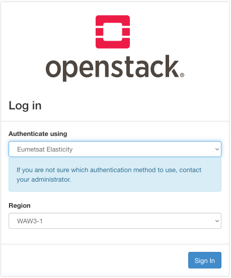

Enter the email or user data that you received from the admin. 

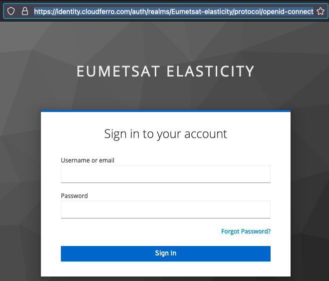

Click on the *Username or email* field and it will list all of the entries that you have previously used for this screen. 

Similarly, click on the *Password* field and the browser will list the entry that corresponds to the entry in the *Username or email* field.

The email used here must be a real email address, as you may receive communication from the admin while registering. 

Click on blue button **Sign In** and enter the Horizon dashboard:

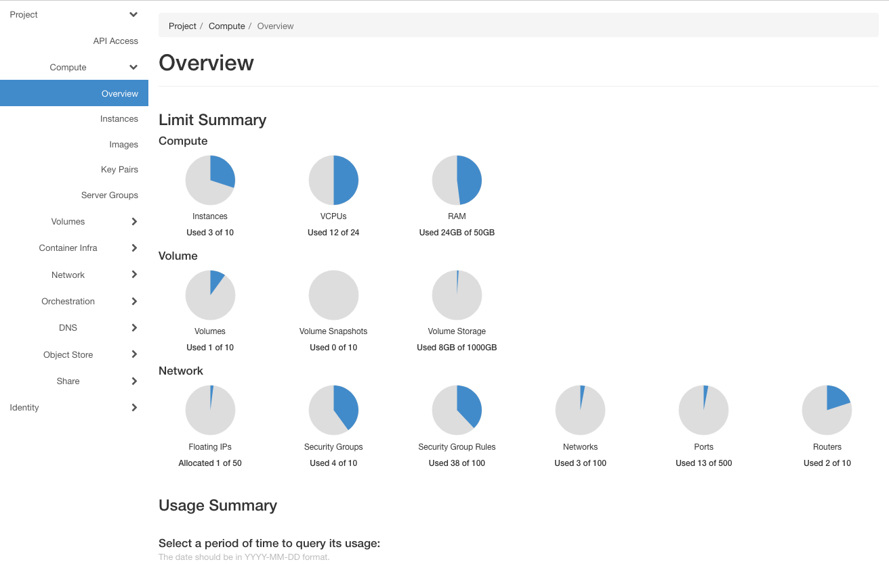

The main menu on the left is ready for you to work within one project -- create volumes, instances, networks, install Kubernetes clusters and so on. The default project is automatically created for you. If the name of your cloud is *cloud_00318*, the name of the default project is *cloud_00318_1*, as seen in the upper left corner of the dashboard screen:

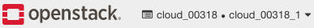

Another project would be *cloud_00318_2* and so on. 

You have now logged into the Horizon as the account holder. 

Step 2 The Identity Menu
----------------------------

In this step you will learn about the Identity menu, which offers the way to create new projects and their users. 

Now click on the main menu option **Identity** and see its options:

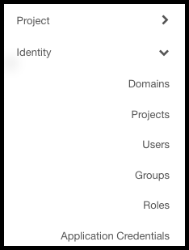

Briefly, these are the options available:

 * *Domains* -- here you will have just one domain, say, **cloud_00318**. 

 * *Projects* -- grouping of users, groups, and roles at one place. A typical project name is **cloud_00318_1** and you can also create your own projects as well. (In this article, we shall use just the default project.)
 
 * *Users* -- you act as admin and create your own users, with email, password, access rights and so on. 

 * *Groups* -- a group of users; the main benefit of using groups is that all of its members (users) automatically inherit the attributes a group has. 

 * *Roles* -- set of privileges that one particular user can have. The most frequent and important role is **member**, as it has access to most parts of the system. 

 * *Application Credentials* -- similar to roles, just for applications: what an app can or cannot do within the system. Not used in this tutorial. 

It is much safer to work as the local user and, paradoxically, it may also yield capabilities that are not available to the account holder. For instance, only local users can gain access to the shared file system. 

If you need access to different parts of the OpenStack system, just create additional local users with appropriate combinations of permissions.

Step 3 Creating a New User
------------------------------

In this step, you are going to create a new local user with role **member**. Then you will 

 * **log out** from the position of account holder and 

 * **log back in** as the user that you have just created. 

Click on **Identity** -> **Users** to get a list of existing users:

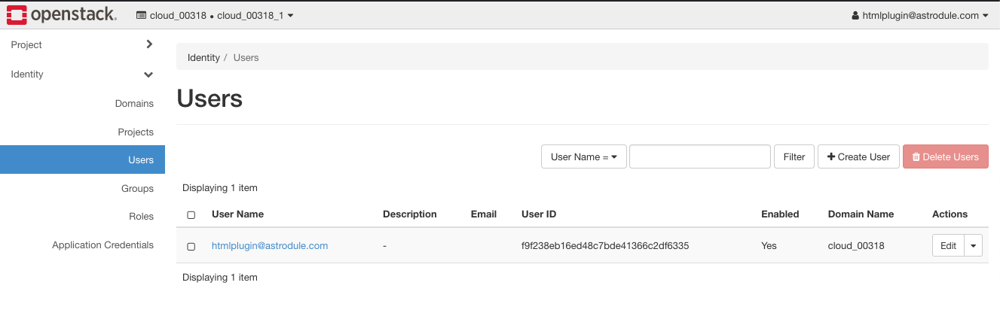

Currently, there is only the default user. Its email address is the email address that you used to log in as the account holder. 

Click on **+ Create User** button and enter the data that define the new user:

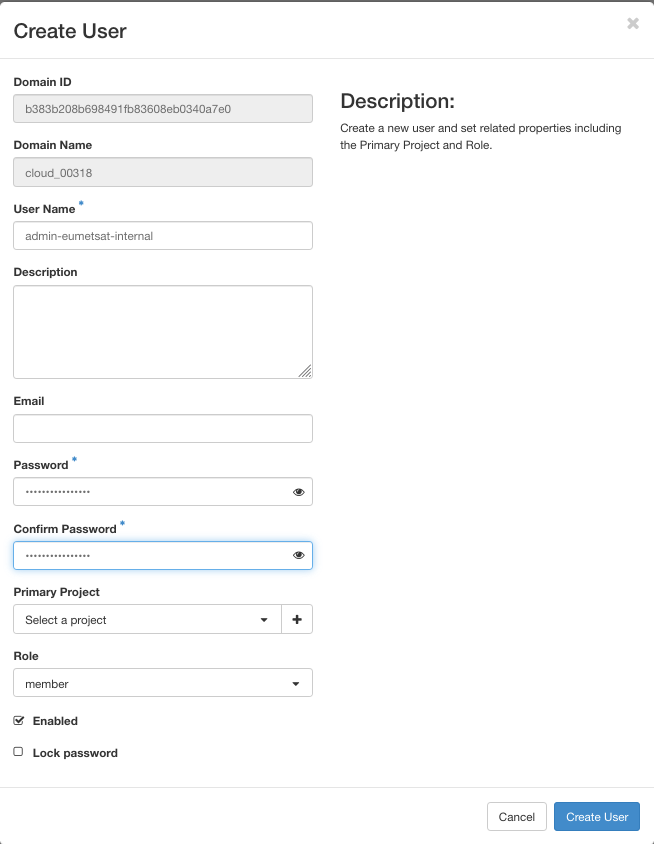

Enter user name and password. Let the name of the new user be **admin-eumetsat-internal** and a new user is created:

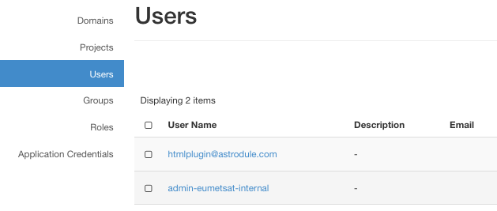

Keep note of the password as you will use it later to log back as this new user. 

In this step, you have created a new user with role of **member**. 

Step 4 Attaching New User to the Project
--------------------------------------------

Now you will attach the new user to the existing project. Click on **Identity** -> **Projects** and see that there is just the default project available:

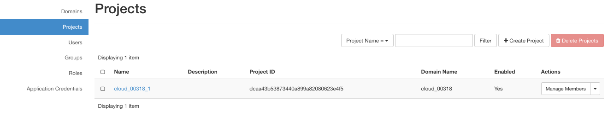

Click on the name of the project, here it is **cloud__00318_1** (in your panel, the number of the cloud and project may be different).

Clicking on the name of the project is equivalent to command **Edit Project** from the right side menu. Regardless of which one you used, you end up on this screen:

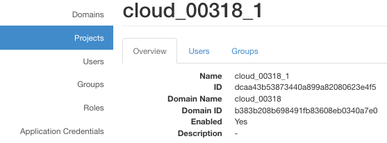

Click on *Users*. There is exactly one user in it, the default user of the account.

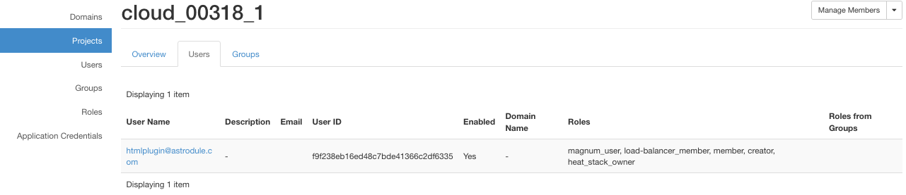

To add our second user, **admin-eumetsat-internal**, click on the **Manage Members** button in the upper right corner and get this screen:

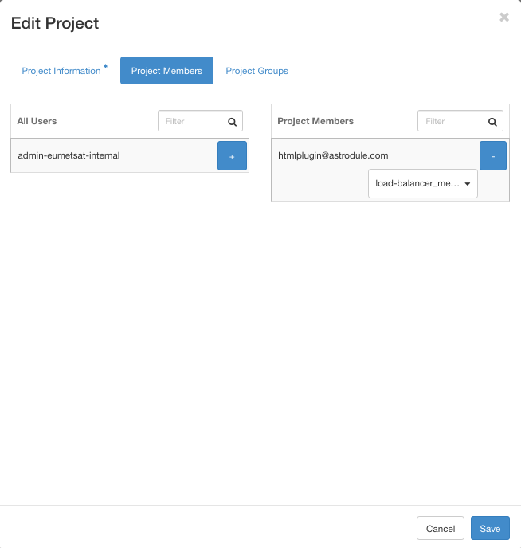

Click on blue button **plus** and move user **admin-eumetsat-internal** to the right column:

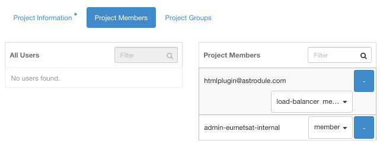

Clicking on the black triangle for the first user and scrolling down a bit, you will see which roles are active for the default user:

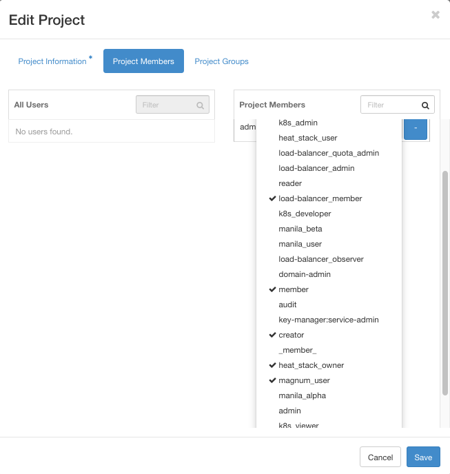

You can also assign new roles by clicking on the options of the menu. 

For the second user, **admin-eumetsat-internal**, only one role, **member**, is active. It is, however, the most versatile one so leave it that. Click on the blue **Save** button and the new user will be attached to the project. To see it in action, again click on **Identity** -> **Projects** -> **Users** and see the list of active users with their roles:

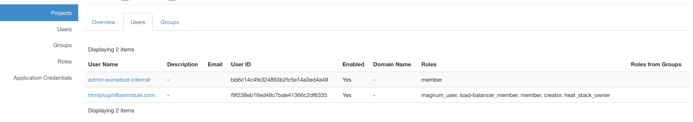

The structure of power is uneven. For example, the default user has role **magnum_user**, so can use OpenStack Magnum commands to, say, create a Kubernetes cluster; the role **load_balance_member** connects them to load balancers and so on. If, on the other hand, you want to create a new user just to do one thing, such as use shared file system, the user with only a **member** role will do just fine. 

In this step, you have attached a new **member** user to the project and the system is ready to let the new user in when they log in. 

Step 5 Create Documentation for the New User
------------------------------------------------

The account holder can see the roles assigned to the user while the user cannot see them when they log into their "part" of the system. Therefore, to enable user to use the system wisely, provide documentation for the user and the roles they will have after they log in.

First, send them technical details for logging in:

 * user name

 * password

 * cloud name (such as *cloud_318*)

 * link from Prerequisite No. 1. 

Give them a 

  * list of roles they have,

  * explanation for each role,

  * mission -- what are they supposed to be doing in the system,

  * any other information they need to know. 

If this user needs to access shared file system, please ask support to enable it. See **Prerequisite No. 3** for technical details how to do it. 

For the sake of simplicity, suppose now that you want to log out and log in as the new user. 

Step 6 OPTIONAL -- Log Out From Default User
----------------------------------------------

If you, the account holder, want to log in as the new user, then you already have all the information to do so. Log out from the default user account by clicking on the default user name in the upper right corner of the screen and select the lowest option in the menu, **Sign Out**. 

  You as the account holder can continue to use it and the new user will log in with their data at hand and start a new session. 

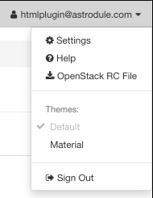

Step 6 Log In as the New Local User
-------------------------------------

Your task is to now log in as the newly created user **admin-eumetsat-internal**. You are facing the same screen for login, however, this time opt for the upper option called **Keystone Credentials**:

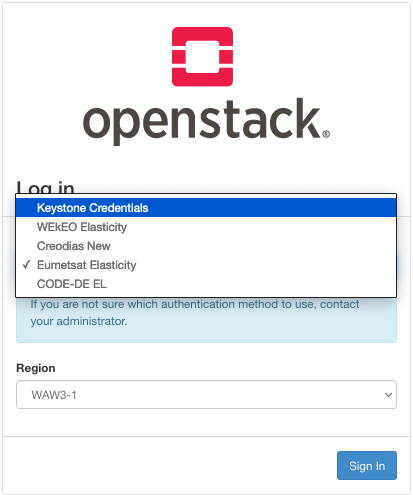

Clicking then on blue button **Sign In** leads to a different screen, with the following differences:

 * **Keystone Credentials** is at the top, in the field **Authenticate using**. 

 * Now there is field **Domain**. Enter the name of the cloud that you have been using as the default user. In our example, it is **cloud_00318**. 

 * For **User Name** enter the name of the newly createduser, **admin-eumetsat-internal**. 

 * For password, enter the password that you defined when creating a new user. 

 * The **Region** should be **WAW3-1**, as that is the name of the underlying server. 

This is what it should look like:

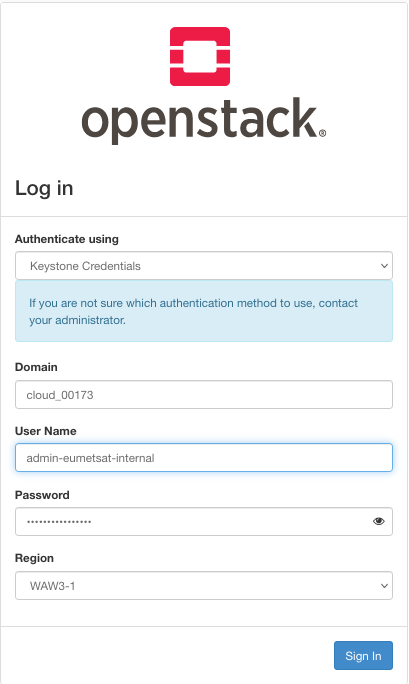

You will log into the well-known Horizon dashboard with one difference: you are now a local user.

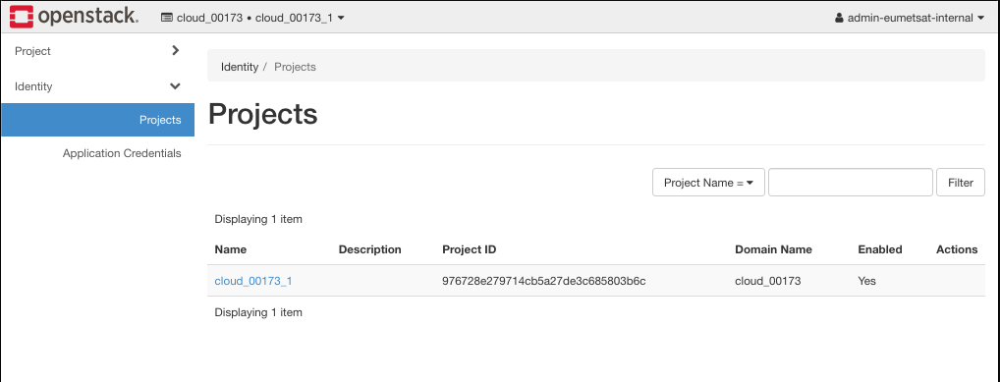

For the local user, the **Identity** option of the main menu is cut down to only **Projects** and **Application Credentials**. There are no **Roles**, **Users**, and **Groups** and even the **Projects** option is left without a **Create new project** capability. 

What To Do Next
-------------------

Default OpenStack roles are **reader**, **member** and **admin**. For other typical roles and ideas to create your own roles, see **Prerequisite No. 7**. 

There are some roles that can be allowed to the user only by the support team. Please see **Prerequisite No. 3** about how to ask support to create infrastructure for shared file system.  
