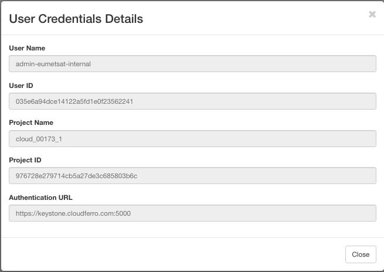
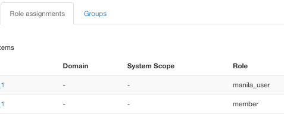
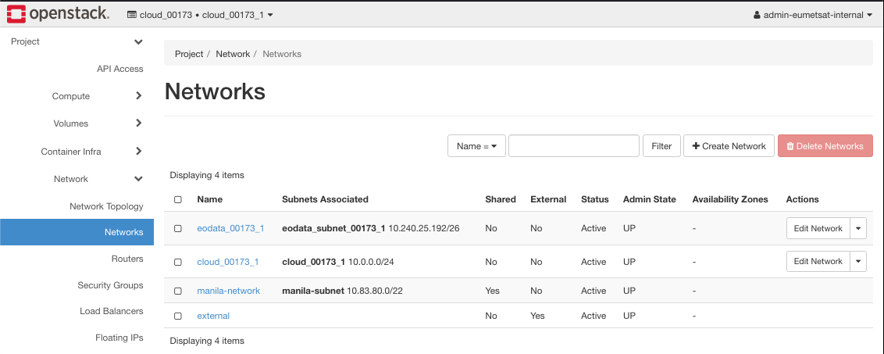
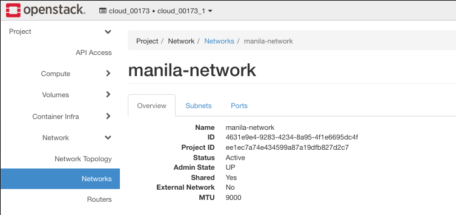
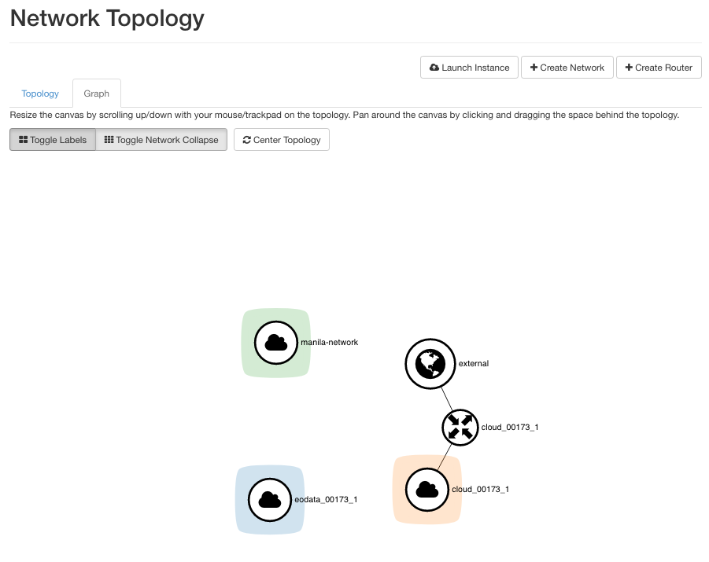

.. meta::
   :description: How to use command line interface for Kubernetes clusterson on OpenStack Magnum 
   :keywords:  |brand-name|, manila, manila network, manila user, Cloudferro, OpenStack, network, CLI, command line interface, shared file system, elastic file system

How To Create Manila Network and Manila User Role
================================================= 

*Shared file system* is a common area of large external memory to which two or more instances (virtual machines) can have access at the same time. *Manila* is an OpenStack module that provides infrastructure for that shared file system. 

Installing *Manila* under OpenStack boils down to installing 

 * a new network, predictably called the *manila-network*,

 * a new user role, predictably called the *manila-user* and then 

 * connecting them to the store in an instance. 

In this article, the local user created in **Prerequisite No. 1**, with **member** role, will write an email to user support and ask them to set up a *manila-network* and *manila-user*. The third step, creating the actual shares in the share file system, will be described in **Prerequisite No. 2**. 

What We Are Going To Cover
--------------------------

 * How to get information relevant to your user account.

 * How to recognize that the support has finished the task. 

 * What the network looks like with addition of *manila-network*.

Prerequisites
-------------

The “How To Install Shared File System Based on Manila OpenStack” Series
+++++++++++++++++++++++++++++++++++++++++++++++++++++++++++++++++++++++++++++

No. 1 :doc:`How-To-Create-A-Local-Horizon-User` 1/5

No. 2 :doc:`How-To-Create-Manila-Network-And-Manila-User-Role` 2/5

This is the article that you are reading now. 

No. 3 :doc:`How-To-Enable-Command-Line-Interface-For-Local-Horizon-User` 3/5

No. 4 :doc:`How-To-Install-Shared-File-System-Based-On-Manila-OpenStack` 4/5

No. 5 :doc:`How-To-Increase-Security-For-Shared-File-System-Based-On-Manila-OpenStack` 5/5

Step 1 **Write Email to Support to Create Manila Network and Manila User Role**
--------------------------------------------------------------------------------

To create *manila network* and *manila user* you have to send request to Cloudferro support through the following email address:

.. code::

   support@cloudferro.com

For maximum efficiency, use commands **Project** -> **API Access** -> **View Credentials** to see your user name, user ID, project name, and project ID. 

Copy those data as text to the message and send. In subject line put

.. code::

   Please create manila user and manila network

The support will create them for you and send a return message stating so. 

Step 2 **Verifying That the Request Was Granted**
-------------------------------------------------

Local user cannot see the roles, only the account holder can. If you, however, signed out from a local user and signed in again as the main user, you would have access to **Identity** -> **Users** and there you would see the roles as follows:

So user **admin-eumetsat-internal** now can access *manila* and thus get access to shared file system, but you cannot see it while you are logged in as the local user. 

However, have a look at the existing networks, using **Project** -> **Network** -> **Networks**. When you see a *manila-network* in there, you will know that both the network and new role have been created, and you will be able to proceed. 

The address of *manila-network* is **10.83.80.0/22** in this case. 

Click on that network name to see more data, in particular, take note of the ID of *manila-network* as later it will be used in the series of articles on how to install shared file system.

In this case, the manila-network ID is **4631e9e4-9283-4234-8a95-4f1e6695dc4f**. 

This is the current network topology:

In the articles that follow, you will see how to connect the *manila-network* and make it work as the part of the shared file system.

In this step, you have obtained the role of *manila-user* and got access to *manila-network*. 

What To Do Next
-----------------

The next article in this series, **Prerequisite No. 2**, will show how to enable command line interface for the local user. Once you can connect via the CLI, you will be able to execute commands that actually create the shared file system. 

