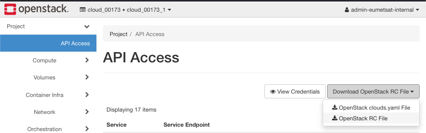
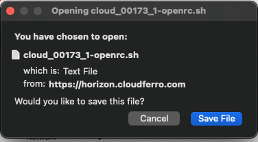
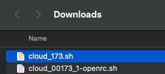
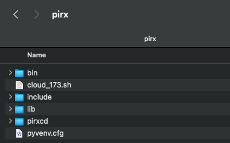
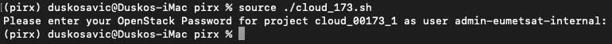
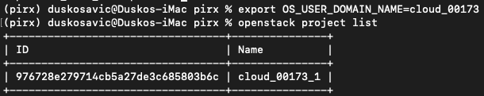

.. meta::
   :description: How to use command line interface for Kubernetes clusterson on OpenStack Magnum 
   :keywords:  |brand-name|, manila, manila network, manila user, Cloudferro, OpenStack, network, CLI, command line interface, shared file system, elastic file system

How To Enable Command Line Interface And Install Manila Client
==================================================================

OpenStack is a cloud environment which means that you access it by calling various API endpoints. Obviously, you can call an API point using web browser or *curl*, but that is neither easy nor elegant. You can communicate through Horizon, which is an OpenStack front end type of site and finally, you can communicate through commands from the command line interface, in a terminal.

Using commands from terminal is often times the only way to do something as Horizon does not implement all pf the available API calls. So, learning and using the CLI is a must for any serious user of OpenStack modules, in this case, the *manila* client. 

The **Prerequisite No. 3** shows how to connect from terminal to the cloud but then goes on using the commands for Kubernetes clusters. Here, you will connect to the cloud in a similar manner but will, in the next article (see **Prerequisite No. 4**), use CLI to create a shared file system. 

What We Are Going To Cover
--------------------------

 * How to connect to the cloud as a local user

 * Install Python and **pip** (note, you may have these already up and running)

 * Install the OpenStack and Manila clients (again, you may have OpenStack client already installed)

 * Connect to the server by sending the credentials to the cloud

 * Verify that you are connected by listing projects that exist in the system

Prerequisites
-------------

The “How To Install Shared File System Based on Manila OpenStack” Series
-------------------------------------------------------------------------
No. 1 :doc:`How-To-Create-A-Local-Horizon-User` 1/5

No. 2 :doc:`How-To-Create-Manila-Network-And-Manila-User-Role` 2/5

No. 3 :doc:`How-To-Enable-Command-Line-Interface-For-Local-Horizon-User` 3/5

This is the article that you are reading now. 

No. 4 :doc:`How-To-Install-Shared-File-System-Based-On-Manila-OpenStack` 4/5

No. 5 :doc:`How-To-Increase-Security-For-Shared-File-System-Based-On-Manila-OpenStack` 5/5

No. 6 **Manila Documentation**

`Manila Overview <https://docs.openstack.org/ocata/config-reference/shared-file-systems/overview.html>`_.

`Manila Security  <https://docs.openstack.org/security-guide/shared-file-systems.html>`_.

Step 1 **Enable Command Line Interface For Local User**
--------------------------------------------------------

In this step, you will connect local user to the server through the Command Line Interface on your desktop or virtual server. In the main menu on the left, first click on **Project** -> **API Access** and then download the OpenStack RC file from the button on the right side of the screen:

Get a prompt like this (depending on the browser):

Click on **Save File** and save it to the *Downloads* directory on your computer. The file name will be **cloud_00173_1-openrc.sh** and it is a *bash* file, that is, an executable script on MacOS and Linux computers. 

Rename the file to be **cloud_173.sh** for ease of typing later on. 

Step 2 **Install Python and pip**
----------------------------------

In this step, you will install *Python*, *pip* and the clients needed for using the shared file system. 

It may well happen that you have already installed some of these components, in which case the following commands will just update the existing installation to the latest version. 

Assuming you are on Ubuntu or Mac, the first command is to update the system:

.. code::

   $ sudo apt update

The next step, as is always the case with Python, is to define a virtual environment. Let the arbitrarily chosen name of this environment be **pirx**:

.. code::

   $ python3 -m venv pirx

It will create a folder in the current structure so move into it and execute the follow up commands over there:

.. code::

   $ cd pirx/
   $ source bin/activate

The **activate** command activates the virtual environment, meaning that all of the further steps will be available only in that environment and folder. 

Step 3 **Install the OpenStack and Manila Clients**
---------------------------------------------------

In this step you will install the clients needed to communicate with the server. 

In **pirx** environment and the eponymous folder, execute the following commands:

.. code::

   pip install --upgrade pip
   pip install python-openstackclient
   pip install python-manilaclient==2.2.0

Again, you may have already had installed the OpenStack client while following up other articles, say, for Kubernetes. If so, its version will be resfreshed, however, installing *manilaclient* is the absolute novelty. It is this client that will provide access to the shared file system and the version shown, 2.2.0 is important for compatibility reasons. 

Step 4 **Connect to the Server**
---------------------------------

In this step, you will personalize the connection to the server. First copy *bash* file from *Downloads* folder to the **pirx** folder:

.. code::

   $ cp /Users/duskosavic/Downloads/cloud_173.sh . 

Obviously, the *Downloads* folder on your system will have another address, so be sure to apply the correct address to this command. 

Here is what the **pirx** folder looks like on the inside:

Execute *bash* file **cloud_173.sh**, using the **source** command:

.. code::

   $ source ./cloud_173.sh

You will be prompted to enter the password for user **admin-eumetsat-internal**. The screen won't show that you have entered anything but if everything is ok, a new folder prompt will appear. 

Use **cat** command to show contents of the file *cloud_173.sh*:

.. code::

   $ cat cloud_173.sh

The file contains a set of parameters that are needed for communication with the server. 

.. code::

   #!/usr/bin/env bash
   # To use an OpenStack cloud you need to authenticate against the Identity
   # service named keystone, which returns a **Token** and **Service Catalog**.
   # The catalog contains the endpoints for all services the user/tenant has
   # access to - such as Compute, Image Service, Identity, Object Storage, Block
   # Storage, and Networking (code-named nova, glance, keystone, swift,
   # cinder, and neutron).
   #
   # *NOTE*: Using the 3 *Identity API* does not necessarily mean any other
   # OpenStack API is version 3. For example, your cloud provider may implement
   # Image API v1.1, Block Storage API v2, and Compute API v2.0. OS_AUTH_URL is
   # only for the Identity API served through keystone.
   unset OS_TENANT_ID
   unset OS_TENANT_NAME
   export OS_AUTH_URL=https://keystone.cloudferro.com:5000/v3
   export OS_INTERFACE=public
   export OS_IDENTITY_API_VERSION=3
   export OS_USERNAME="admin-eumetsat-internal"
   export OS_REGION_NAME="WAW3-1"
   export OS_PROJECT_NAME="cloud_00173_1"
   export OS_PROJECT_DOMAIN_ID="98ae4545b7a9400cb8e4a1b1f6d81ff0"
   if [ -z "$OS_REGION_NAME" ]; then unset OS_REGION_NAME; fi
   if [ -z "$OS_USER_DOMAIN_NAME" ]; then unset OS_USER_DOMAIN_NAME; fi
   if [ -z "$OS_PROJECT_DOMAIN_ID" ]; then unset OS_PROJECT_DOMAIN_ID; fi
   echo "Please enter your OpenStack Password for project $OS_PROJECT_NAME as user $OS_USERNAME: "
   read -sr OS_PASSWORD_INPUT
   export OS_PASSWORD=$OS_PASSWORD_INPUT
   export OS_AUTH_TYPE=password%              

One parameter is missing though, so enter it manually from the terminal command line:

.. code::

   export OS_USER_DOMAIN_NAME=cloud_00173

Use the same name and cloud number as in variable **OS_PROJECT_NAME**, here it is **cloud_00173**, without the trailing **_1**.

Verify that you are authorized to issue commands to the server by executing this command:

.. code::

   openstack project list

This is the result:

The ID of the project is **976728e279714cb5a27de3c685803b6c** and make note of it as you will use it latter articles in the series abour installing shared file system under OpenStack.

You have access to the server now, through a CLI interface on your desktop computer or server. 

**What To Do Next**
--------------------

In **Prerequisite No. 4** you will complete this installation and create a *share*, which is a shared file system in an instance (virtual machine).
