.. meta::
   :description: How to use command line interface for Kubernetes clusterson on OpenStack Magnum 
   :keywords: manila, manila-user, manila-network, manila, Cloudferro, OpenStack, network, CLI, command line interface, shared file system

How To Increase Security For Shared File System Based On Manila OpenStack 
==================================================================================

This is the fifth installment in series "How to install shared file system using manila module under OpenNetwork". At the end of the article in **Prerequisite No. 4**, you  installed one instance that had access to a shared file system (SFS) of 1000 GB in size. You manually mounted and unmounted the SFS, allowing and disallowing access to the SFS during runtime. 

Using Security Groups to Manage Security of Shared File System
--------------------------------------------------------------

**Security groups** offer a better way of managing access to the shared file system. If you unmount the SFS, then no instance will be able to access it. Security groups, however, can manage access rights for each particular instance and with them, you can create your strategy. If you end up with a group of instances, you can decide which ones will be connected to shared file system and which ones will be not. 

There are two basic security groups, called *default* and *allow_ping_ssh_icmp_rdp*, and are available with every instance of |brand-name| OpenStack. The *default* security group will bey default be present in every instance so the question really is do you want to add other security groups or not. 

In this article, adding *allow_ping_ssh_icmp_rdp* serves as basic example. The same reasoning applies to all other security groups that you might install (or that may be automatically installed for an instance, say, when creating Kubernetes clusters). 

What We Are Going To Cover
--------------------------

 * Review types of traffic enabled with security groups *default* and *allow_ping_ssh_icmp_rdp*.

 * **Scenario 1**: Creating an instance **without** *allow_ping_ssh_icmp_rdp* group. In this scenario, security level is higher as no Internet traffic to the instance will exist. 

 * **Scenario 2**: Creating an instance **with** *allow_ping_ssh_icmp_rdp* group. In this scenario, Internet traffic will be available to the instance, whish lowers the security treshhold. 

 * Show how to detach an offending security group from a *manila-network* port, using the CLI. (This can **increase** security level.)

 * Show how to attach a security group that you have previously detached from a *manila-network* port. (This can **decrease** security level if security group in question is enabling Internet traffic to the instance.)

.. Note::

   Once you become able to switch security groups on and off from ports on the *manila-network*, you will be able to **fully govern security risks** for each instance in the system.

.. Warning::

   Be aware that **other** security groups can also change access rights to the Internet which may, in turn, decrease security level for share file system access within an instance.

.. Danger::

   If you are using Kubenertes clusters in conjunction to shared file system, bear in mind that large groups of security rules are automatically connected to each Kubernetes instance you create (control plane or worker nodes). 
   Pay special attention to **Prerequisite No. 5** and use procedures exposed later in this article to check the status of *manila-network* ports for instances that should have access to the shared file system.

Prerequisites
-------------

The “How To Install Shared File System Based on Manila OpenStack” Series
-------------------------------------------------------------------------

No. 1 :doc:`How-To-Create-A-Local-Horizon-User` 1/5

This is the article that you are reading now. 

No. 2 :doc:`How-To-Create-Manila-Network-And-Manila-User-Role` 2/5

No. 3 :doc:`How-To-Enable-Command-Line-Interface-For-Local-Horizon-User` 3/5

No. 4 :doc:`How-To-Install-Shared-File-System-Based-On-Manila-OpenStack` 4/5

No. 5 :doc:`How-To-Increase-Security-For-Shared-File-System-Based-On-Manila-OpenStack` 5/5

No. 6 **Manila Documentation**

`Manila Overview <https://docs.openstack.org/ocata/config-reference/shared-file-systems/overview.html>`_.

`Manila Security  <https://docs.openstack.org/security-guide/shared-file-systems.html>`_.

Basic Security Groups in |brand-name| OpenStack
----------------------------------------------------

Here is what the *default* and *allow_ping_ssh_icmp_rdp* security groups look like in *Horizon*, after clicking on **Network** -> **Security Groups**:

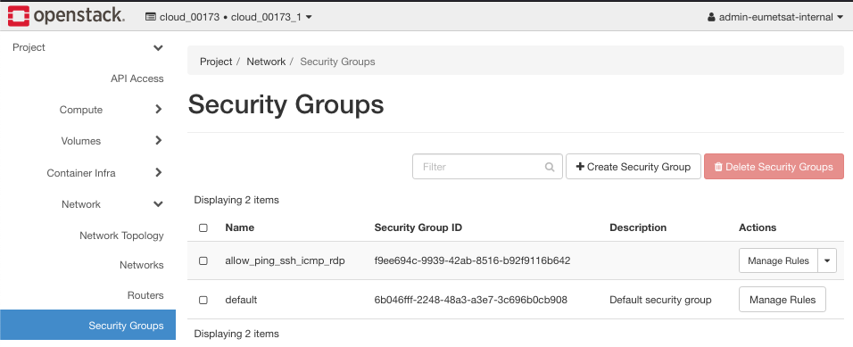

*default* Security Group
++++++++++++++++++++++++++

The *default* security group cannot be deleted, it will always exist and be applied to new instances even if you do not specify any security group when launching an instance. Here is the set of rules it brings to the table:

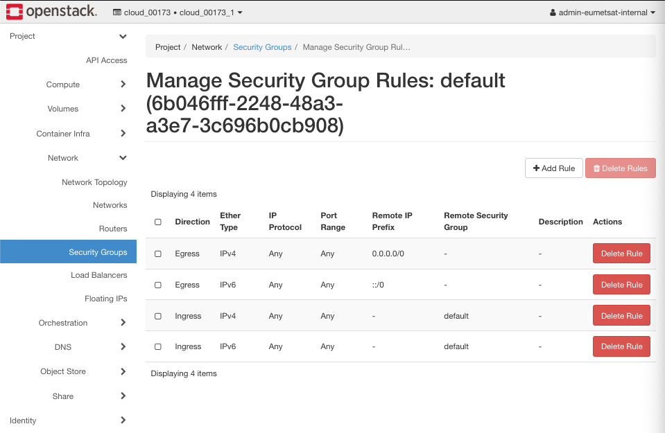

For more detailed explanation, please see **Prerequisite No. 5**.

The idea of the *default* security group is to shut down incoming Internet traffic and thus gain absolute security. You then add other rules which are more precise and granular. 

*allow_ping_ssh_icmp_rdp* Security Group
++++++++++++++++++++++++++++++++++++++++++

In many cases you will want NOT to have any traffic directly connected to the Internet, just the traffic across internal networks in the system. On the other hand, if you want "normal" Internet traffic, apply a security group like *allow_ping_ssh_icmp_rdp*. Click button **Manage Rules** on the right side of the security groups list and get its list of rules:

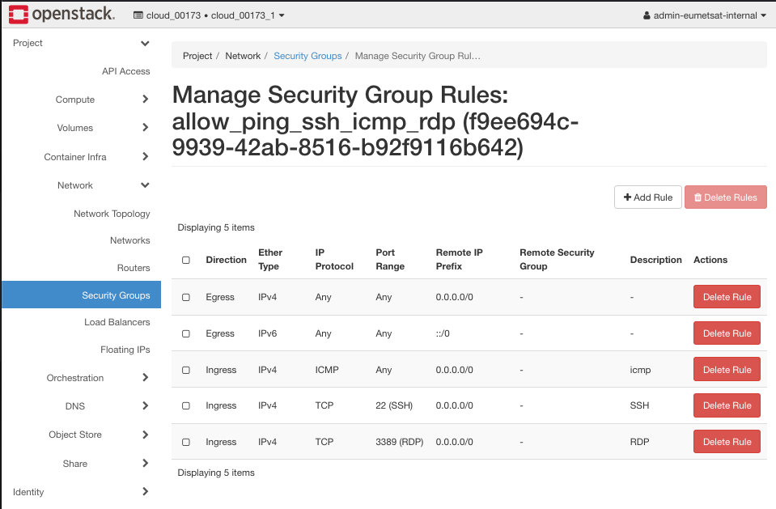

Traffic that comes to the instance is called *ingress* while the traffic that goes from the instance is called *egress*. Ingress describes inbound traffic, egress describes outbound traffic to and from the resource. In this group, *egress* traffic is not restricted so the instance can "call" an Internet address at will. The *ingress* traffic has three rules, for the following IP protocols:

**ICMP traffic**

*ping* protocol, on any port, serves to "see" whether a server is alive or not. 

**SSH traffic**

TCP traffic on port 22, serves to "get into" the operating system of the instance and work there.

**RDP traffic**

TCP on port 3389, which is used for RDP traffic and RPD is Remote Desktop Protocol used for communication between the Windows Terminal Server and the Terminal Server Client. The data carried on in this way usually is 

 * presentation data
 
 * serial device communication

 * licencing information

 * encrypted data 

and so on. 

To recap, with this security group, you will use *ping* protocol to see whether the server is down or not and you can "enter" the operating system of the instance to execute commands on the server. Without these protocols, there is not much you can remotely do with your instance. 

There other ports of interest and other types of traffic as well. For example, you can enable port 80 for HTTP traffic, port 443 for HTTPS traffic and so on. 

**How To Control Access To the Shared File System**
---------------------------------------------------

In this article, however, you want to make sure that you have **control of access to the shared file system** which, in turn, needs 

 * *manila-network* and

 * *manila-user* role

to be operational. 

If an instance is connected to an operational *manila-network*, then it can access data within the shared file system. 

Conversely, if that access is shut down, then there is no access and the shared file system is "secured" from that instance. 

.. Danger:: 

   The problem may arise because the access may exist although you never actually issued a command to that effect. OpenStack applies certain rules automatically, as in *Scenario No. 2* below.

Scenario No. 1 **Not Using allow_ping_ssh_icmp_rdp Group When Creating an Instance**
--------------------------------------------------------------------------------------------

Creating an instance **without** the *allow_ping_ssh_icmp_rdp* group, implies that  *manila-network* port also does not have access to that security group. The result is that the instance will be cut off from inbound Internet traffic. No one from the Internet will be able to penetrate the *manila* network through this instance and the data it guards will be safe unless access rules get changed. 

Scenario No. 2 **Using allow_ping_ssh_icmp_rdp Group When Creating an Instance**
--------------------------------------------------------------------------------------------

Creating an instance with *allow_ping_ssh_icmp_rdp* group automatically adds that security group to the port on *manila* network. Since it allows for various types of Internet traffic, the *manila* network will do the same; it means that an attacker has higher chance of penetrating the shared file network and possibly huge amount of data that it can hold.

.. Danger::

   Note that the security level for *manila-network* was lowered as a consequence of creating an instance in this way. 

Here are the techniques needed to gain back control of *manila-network* port and, consequently, of shared file system access. 

**Review the Existing Networks**
----------------------------------------------------

From previous articles in the series, you should have the following networks in the system (the commands to show it are **Project** -> **Network** -> **Networks**):

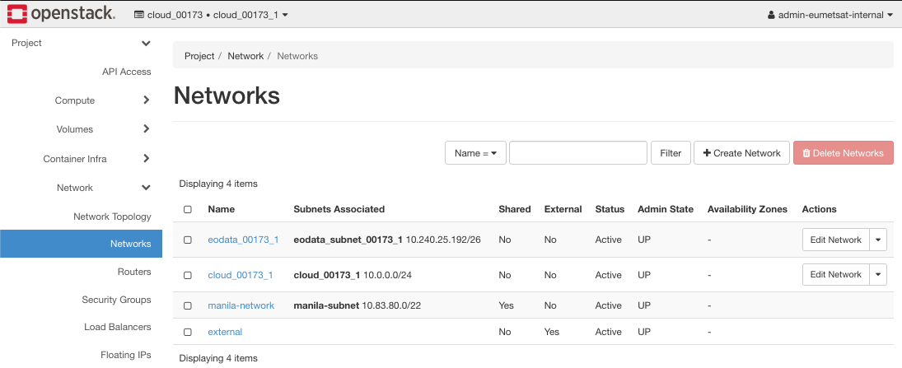

The network topology is (**Network** -> **Network Topology** -> **Toggle Labels**):

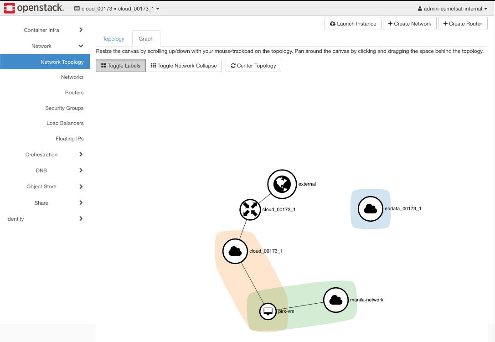

And, as you have seen, there are two basic security groups, *allow_ping_ssh_icmp_rdp* and *default*. 

There will be at least one instance, **pirx-vm**, with *manila-network* attached, from **Prerequisite No. 4**. (Command to see it is **Project** -> **Compute** -> **Instances**.)

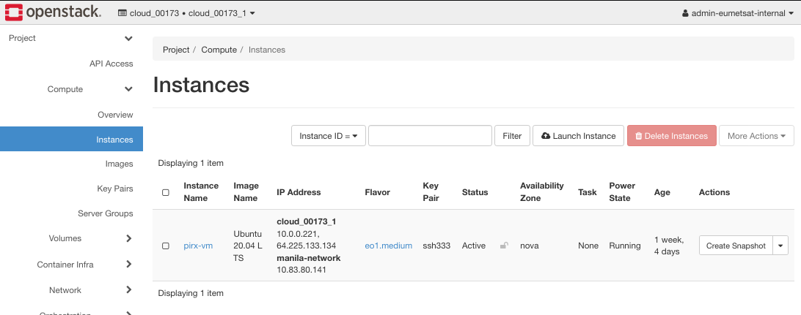

In the next step of Scenario 1, you will create a new VM, call it **vm-internal**.

Step 1 Create a VM With Only the Default Security Group Attached
---------------------------------------------------------------------

Click on button **Launch Instance** and get the following screen:

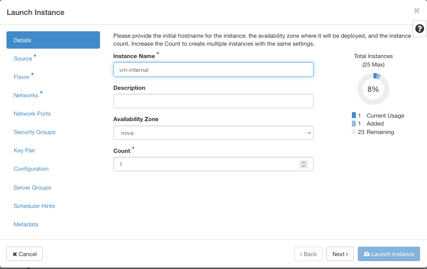

Let its name be **vm-internal**. 

Next, for **Source**, select, say, *Ubuntu 20.04 LTS* and then for **Flavor**, select *eo1.medium*. 

Then for **Networks**, select two networks out of three available, *manila-network* and *cloud_00173_1*. 

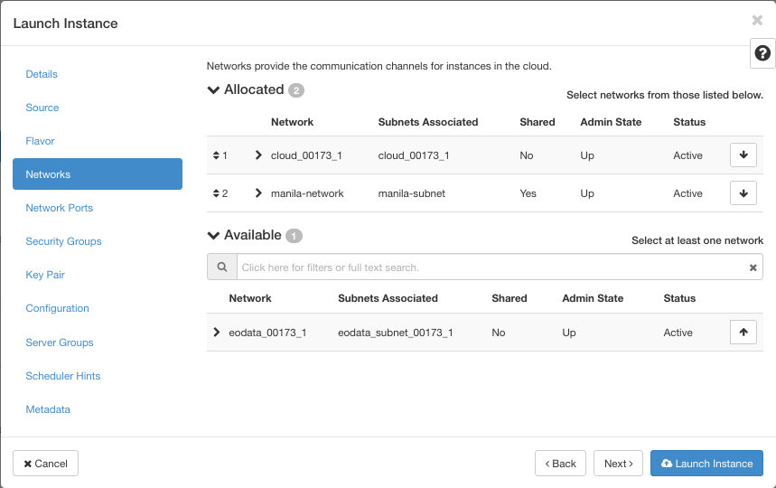

This is the situation for security groups:

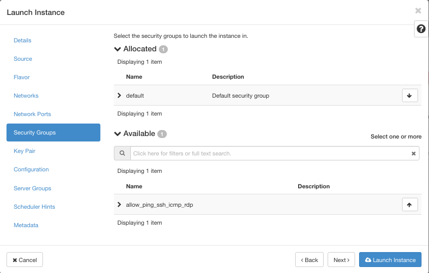

If you do nothing here, the instance will have only the *default* security group attached. Next window, for **Key Pair**, select *ssh333* and click on blue button **Launch Instance**. 

The new instance **vm-internal** will be created. 

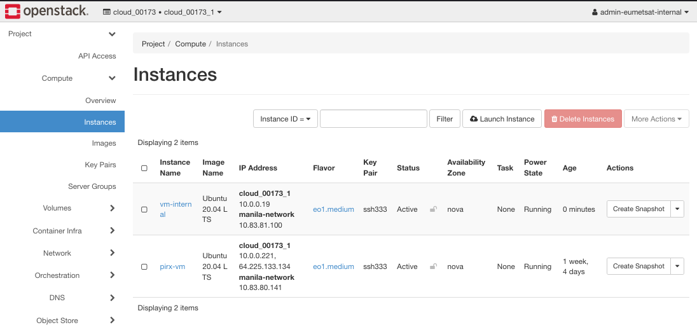

Note that its *manila-network* address is **10.83.81.100**.

Step 2 Check Which Security Groups Are Currently Attached
-----------------------------------------------------------------

Click on **Edit Instance** on the right side menu:

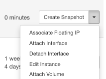

In the new window *Edit Instance* click on button **Security Groups**:

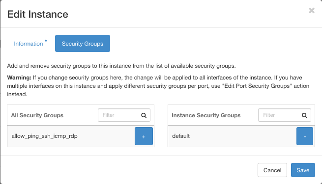

The security group *allow_ping_ssh_icmp_rdp* is on the left side, meaning it it NOT active; only the *default* group, on the right side, is active. 

In this screen you can also check blue buttons for plus and minus and that will activate and deactivate the corresponding security groups for the instance. The goal here, however, is to just check the current status of security groups, not to change it. 

Step 3 Check Manila Network Ports For Active Security Groups
-----------------------------------------------------------------

OpenStack will automatically apply all new states to all related elements so you will now check which security groups are active on *manila-network* ports. First have a look at *manila-network* by clicking on **Network** -> **Networks** -> *manila-network* -> **Ports** and search for *manila-network* internal address from Instances screen. In this example, find the port with address **10.83.81.100**.

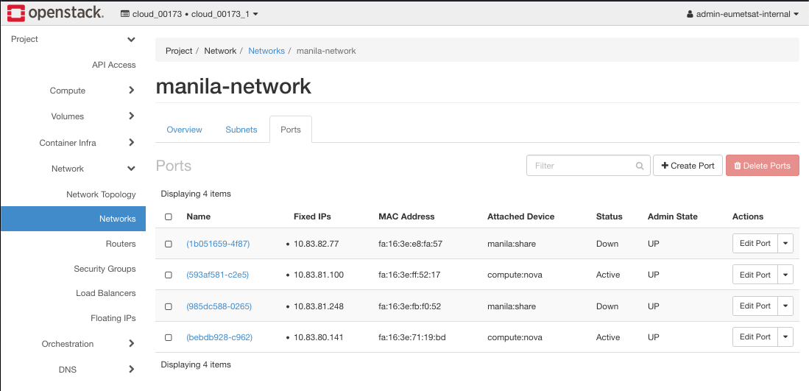

Its name here is **(593af581-c2e5)** and click on **Edit Port** on the right side. Another click on button **Security Groups** and you see this:

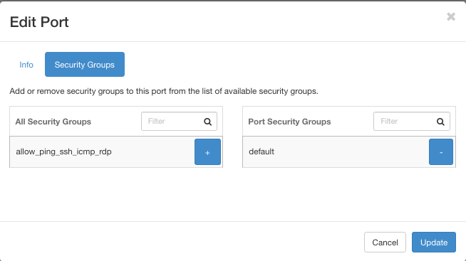

Again, the *allow_ping_ssh_icmp_rdp* security group is on the left, meaning it is not active. 

.. Note:: Net Result

   The “allow_ping_ssh_icmp_rdp” is also detached from the manila port **10.83.81.100**.

   Instance *vm-internal* has no access to the shared file system.

Scenario 2 Create an Instance With Both Basic Security Groups Attached
--------------------------------------------------------------------------

Step 4 Use Both *default* and *allow_ping_ssh_icmp_rdp* Security Groups
-------------------------------------------------------------------------------

Repeat steps from *Scenario 1* with a new name, *vm-external*. Let all other elements be identical save for **Security Groups**, where you will now select both of the existing security groups:

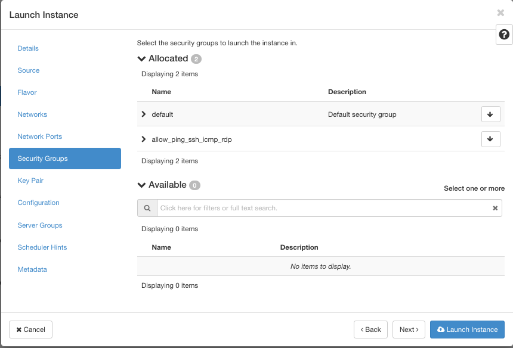

Now there will be three instances:

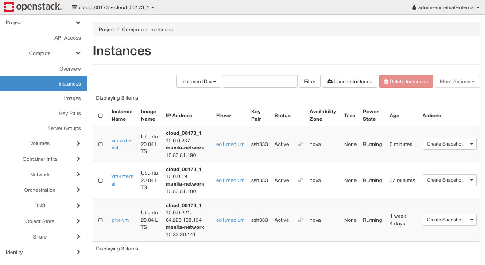

The *manila-network* address for *vm-external* is **10.83.81.190**. 

Check security groups for *vm-external*:

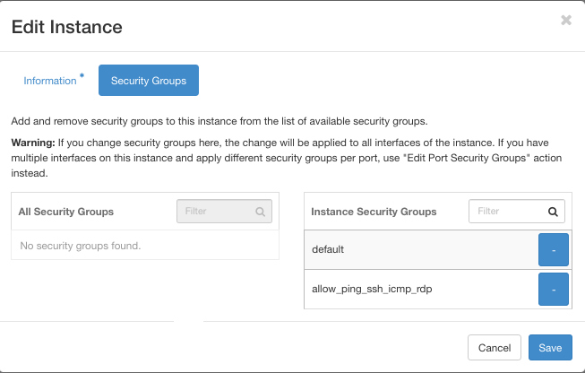

Both security groups are on the right side, under column name **Instance Security Groups**. It means that both security groups are now active. 

Step 5 Check Which Security Groups Are Currently Attached To An Instance
-----------------------------------------------------------------------------

The steps are **Network** -> **Networks** -> *manila_network*:

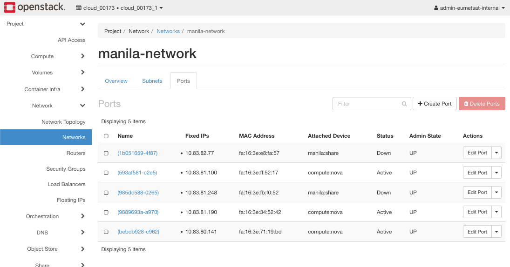

Step 6 Check Manila Network Ports For Active Security Groups
-----------------------------------------------------------------

Find port for address **10.83.81.190** and click on **Edit Port**:

**Edit Port** -> **Security Groups**:

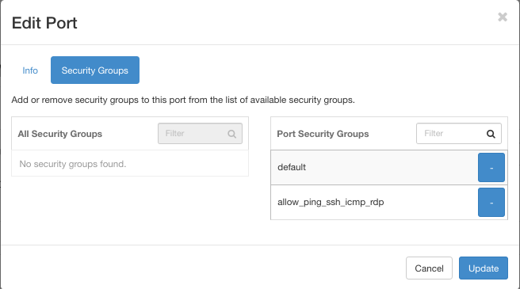

Both security groups are on the right side, which is for **Port Security Groups**. Therefore, the Internet traffic is accepted. This setting was triggered  automatically, by the very fact that you used the *allow_ping_ssh_icmp_rdp* security group on the instance. 

Step 7 How To Remove Internet Access From Manila Port
-----------------------------------------------------------

In Scenario 1, you did not give Internet access to the instance and as the result, the *manila-network* port was shut down as well. The security risks from the Internet are nill. 

In Scenario 2, you used security group *allow_ping_ssh_icmp_rdp* for standard access to the Internet, which automatically opened the *manila-network* ports as well. How to remove Internet access from *manila* port but leave it on the instance level?

One would expect that it is easy: in the **Edit Port** window, just click on the minus sign and move *allow_ping_ssh_icmp_rdo* group to the left. It turns out, though, that that action is not possible on *Horizon* level. You get an error like this:

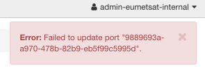

However, you can still perform this operation from CLI.

First get the ID of the manila network port by clicking on **Network** -> *manila-network* and click on port name with IP of **10.83.81.190**. 

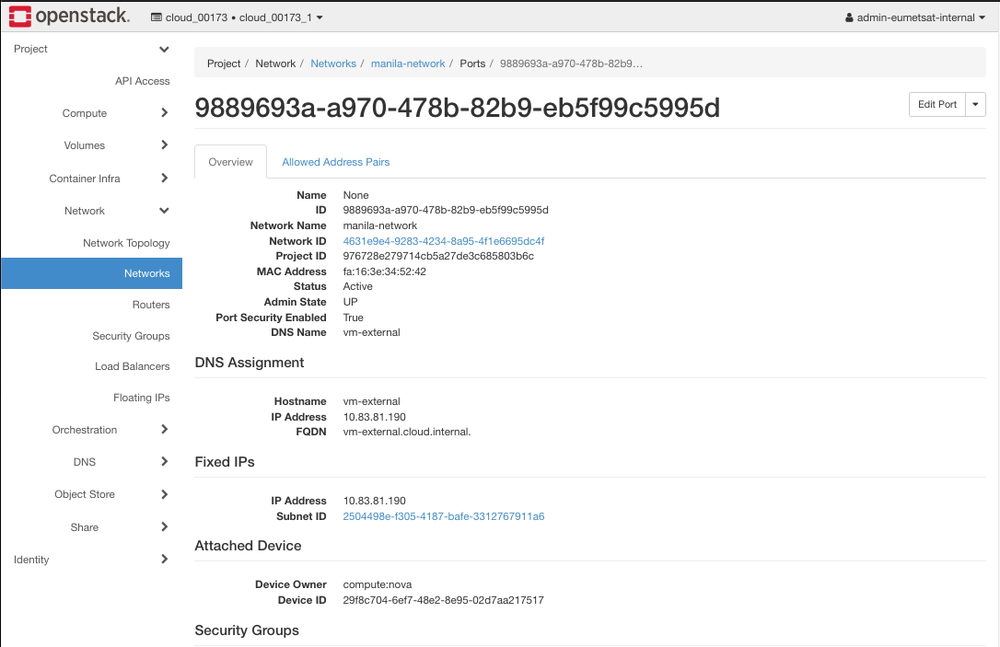

The ID you need is **9889693a-a970-478b-82b9-eb5f99c5995d**

Then open a new terminal window and authorize yourself (see **Prerequisite No. 3** if needed to refresh memory). In a nutshell, these are the commands:

.. code:: 

	cd /Users/duskosavic/CloudFerroDocs/pirx

	source bin/activate

	source cloud_173.sh

	export OS_USER_DOMAIN_NAME=cloud_00173

and this is the result:

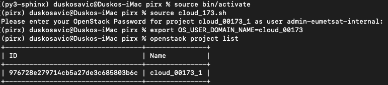

Once logged in and connected, issue this command:

.. code:: 

	openstack port show 9889693a-a970-478b-82b9-eb5f99c5995d -f json | jq '.security_group_ids'
	[
	  "6b046fff-2248-48a3-a3e7-3c696b0cb908",
	  "f9ee694c-9939-42ab-8516-b92f9116b642"
	]

This is what it looks like in the terminal:

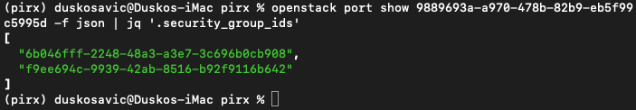

That command took out the IDs of the security groups but we still do not know which is which. Execute these commands to differentiate between the security groups:

.. code::

   openstack security group show 6b046fff-2248-48a3-a3e7-3c696b0cb908 -f json | jq -r '.name'
   default

   openstack security group show f9ee694c-9939-42ab-8516-b92f9116b642 -f json | jq -r '.name'
   allow_ping_ssh_icmp_rdp

Now, if you want to detach *allow_ping_ssh_icmp_rdp* you need to use the command:

.. code::

	openstack port unset --security-group f9ee694c-9939-42ab-8516-b92f9116b642 9889693a-a970-478b-82b9-eb5f99c5995d

This is the proof:

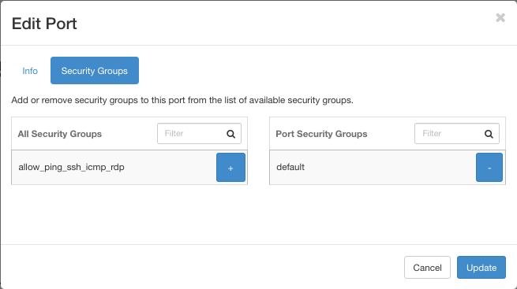

if you want to attach it again, you need to invoke:

.. code::

	openstack port set --security-group f9ee694c-9939-42ab-8516-b92f9116b642 9889693a-a970-478b-82b9-eb5f99c5995d

If you still have **Edit Port** window on your screen, you can add back the *allow_ping_ssh_icmp_rdp* security group. So you can put it back both from CLI and from Horizon, while you can remove it only through the CLI. 

What To Do Next
-------------------

See **Prerequisite No. 6** to learn more about *manila* module in OpenStack in general, and about *manila* security features in particular. 
