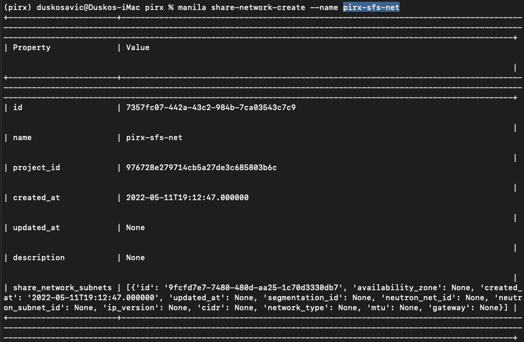
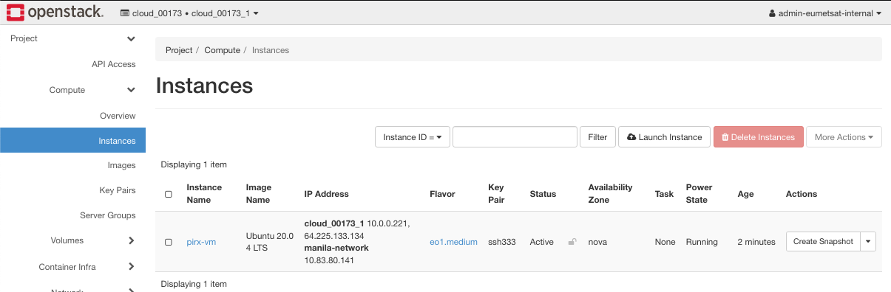
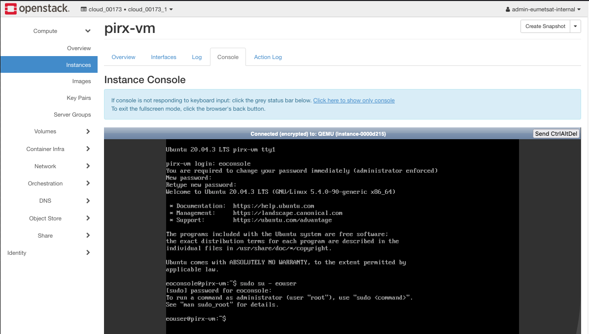
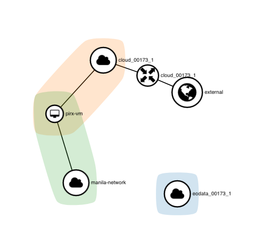

.. meta::
   :description: How to use command line interface for Kubernetes clusterson on OpenStack Magnum 
   :keywords: |brand-name|, manila, manila network, manila user, Cloudferro, OpenStack, network, CLI, command line interface, shared file system, elastic file system

How To Install Shared File System Based On Manila OpenStack
==================================================================

In previous articles in this series, you have created a 

 * local user with role **member**

 * *manila-user* role and *manila-network*

 * obtained manila-network ID

 * connected to the server via CLI

 * obtained ID of the current project.

Your goal now is to install shared file system under OpenStack and test it. 

What We Are Going To Cover
--------------------------

You are now going to

 * Create share network

 * Create instance which will act as the external memory

 * Get necessary local addresses to connect the instance with the *manila-network*

 * Create share file system within the instance and mount it

 * Create a test file and show that it persists in the mounted folder. 

Prerequisites
-------------

No. 1 **Hosting**

You need a |brand-name| hosting account with Horizon interface |brand-name-site-link|. 

No. 1 :doc:`How-To-Create-A-Local-Horizon-User` 1/5

No. 2 :doc:`How-To-Create-Manila-Network-And-Manila-User-Role` 2/5

Manila network values to use from that article:

   * manila network address **10.83.80.0/22**. 

   * manila-network ID **4631e9e4-9283-4234-8a95-4f1e6695dc4f**

No. 3 :doc:`How-To-Enable-Command-Line-Interface-For-Local-Horizon-User` 3/5

Project ID to use from that article: **976728e279714cb5a27de3c685803b6c**.

No. 4 :doc:`How-To-Install-Shared-File-System-Based-On-Manila-OpenStack` 4/5

This is the article that you are reading now. 

No. 5 :doc:`How-To-Increase-Security-For-Shared-File-System-Based-On-Manila-OpenStack` 5/5

No. 6 **Private and public keys**

.. jinja:: brand_names

   An SSH key-pair created in OpenStack dashboard. To create it, follow this article  :doc:`/{{ general }}/How-to-create-key-pair-in-OpenStack-Dashboard-on-{{ brand_name_hyphen }}`.

No. 7 **Instructions to insert SSH key into the instance**

.. jinja:: brand_names

   This article :doc:`/networking/How-to-add-SSH-key-from-Horizon-web-console-on-{{ brand_name_hyphen }}` will show you how to insert SSH keys from the console view in browser. After that, you will be able to access the contents of the virtual machine which will contain the shared files systems files. 

No. 8 **Connecting to the virtual machine with SSH from Linux**

.. jinja:: brand_names
   
   :doc:`/networking/How-to-connect-to-your-virtual-machine-via-SSH-in-Linux-on-{{ brand_name_hyphen }}`

No. 9 **Connecting to the virtual machine with SSH from Windows 10**

.. jinja:: brand_names

   Follow this article :doc:`/windows/How-to-connect-to-a-virtual-machine-via-SSH-from-Windows-10-Command-Prompt-on-{{ brand_name_hyphen }}`.

No. 10 **Create a new Linux VM in OpenStack dashboard (Horizon)**

.. jinja:: brand_names

   The article to use is :doc:`/{{ general }}/How-to-create-new-Linux-VM-in-OpenStack-Dashboard-Horizon-on-Eumetsat-Elasticity`.

No. 11 **Manila Documentation**

`Manila Overview <https://docs.openstack.org/ocata/config-reference/shared-file-systems/overview.html>`_.

`Manila Security  <https://docs.openstack.org/security-guide/shared-file-systems.html>`_.

Step 1 **Create Share Network with Specific Name**
---------------------------------------------------

In this step, you will create a share network with 1000 GB of space. 

Presume that you have just executed commands in **Prerequisite No. 4** and that the CLI is fully operational. Then the following command will create share network with the arbitrary name of *pirx-sfs-net*:

.. code::

   manila share-network-create --name pirx-sfs-net

The result in terminal looks unmanageable as this command has no prettyprinting facilities:

Fortunately, you will need only the property **id** from that output, which here is **7357fc07-442a-43c2-984b-7ca03543c7c9**. Let us call it SHARE_NETWORK_ID. 

You now have all the data to define a *share* with an amount of storage in GB. The general command would look like this:

.. code::

   openstack share create --name $SHARE_NAME$ --share-type SFS --share-network $SHARE_NETWORK_ID$ NFS $SIZE_IN_GB$

In this case, you are going to create a share of 1000 GB:

.. code::

   openstack share create --name pirx-sfs-share --share-type SFS --share-network 7357fc07-442a-43c2-984b-7ca03543c7c9 NFS 1000 -f json

The result in JSON format is:

.. code::

   {
	  "access_rules_status": "active",
	  "availability_zone": null,
	  "create_share_from_snapshot_support": false,
	  "created_at": "2022-05-11T19:27:11.000000",
	  "description": null,
	  "has_replicas": false,
	  "id": "5f682131-412a-4024-af2c-e60db0cb10a7",
	  "is_public": false,
	  "metadata": {},
	  "mount_snapshot_support": false,
	  "name": "pirx-sfs-share",
	  "progress": null,
	  "project_id": "976728e279714cb5a27de3c685803b6c",
	  "replication_type": null,
	  "revert_to_snapshot_support": false,
	  "share_group_id": null,
	  "share_network_id": "7357fc07-442a-43c2-984b-7ca03543c7c9",
	  "share_proto": "NFS",
	  "share_type": "afe43b62-1c79-41e0-bded-05cbf1ab4020",
	  "share_type_name": "SFS",
	  "size": 1000,
	  "snapshot_id": null,
	  "snapshot_support": false,
	  "source_share_group_snapshot_member_id": null,
	  "status": "creating",
	  "task_state": null,
	  "user_id": "035e6a94dce14122a5fd1e0f23562241",
	  "volume_type": "SFS"
	}

You have created a *share* in shared file system which can be accessed from relevant instances -- virtual machines. 

Keep note of **id** from the above output, here it is **5f682131-412a-4024-af2c-e60db0cb10a7** as you will need it later on.

In the next step, you are going to create an instance and connect it to the *share*. 

Step 2 **Create an Instance With Floating IP Address**
-------------------------------------------------------

Please see **Prerequisite No. 9** how to create a new instance in Horizon. 

.. warning::

   Create or have already created a key pair that you are going to use. 
   See **Prerequisite No. 4** where you will create a key pair called *sshkey*. In this text, we are using another key pair, *ssh333*.

For image use *Ubuntu 20.04 LTS*, add two networks -- *cloud_00173_1* and *manila-network*, use flavor *eo1.xmedium*, a key pair and if you do not specify it, only the *default* security group will be attached to the instance. Let its name be *pirx-vm* and use **Prerequisite No. 8** to add a floating IP address to it. The result should look like this:

The floating IP address, which is the address to use for remote access to instance, is **64.225.133.134**.

Step 3 **Gain Access to Instance**
------------------------------------

The virtual machine **pirx-vm** runs under Ubuntu and has two predefined users, 

 * **eoconsole** -- used only to gain access to Ubuntu and change the password, and

 * **eouser** -- used for remote access to the command line. 

The main disadvantage of **eoconsole** is that it does not support copy and paste. You have to enter manually each and every command, and as you see will below, that is not practical. 

One way to activate **eouser** is using the command: 

.. code::

   sudo su - eouser

and enter the password; that will change the user to **eouser** in the browser console. 

You will then use it as **eouser** but still will not be able to paste and copy in the browser console window. 

The other way to communicate via **eouser** is described in **Prerequisite Nos. 6** and **7**. Using *ssh* with a local client is, of course, the preferred way.  

In this step, you have gained acceess to the instance, via **eouser**, which will allow you to copy and paste commands from the local *ssh* client to the server. 

Step 4 **Get Address of the Shared Data in an Instance**
----------------------------------------------------------

Here is the network topology after creating the network and a new instance:

To find the local address of the instance, issue the following command in console:

.. code::

  ip a

This is the result:

.. code::

	eouser@pirx-vm:~$ ip a
	1: lo: <LOOPBACK,UP,LOWER_UP> mtu 65536 qdisc noqueue state UNKNOWN group default qlen 1000
		link/loopback 00:00:00:00:00:00 brd 00:00:00:00:00:00
		inet 127.0.0.1/8 scope host lo
		   valid_lft forever preferred_lft forever
		inet6 ::1/128 scope host 
		   valid_lft forever preferred_lft forever
	2: eth0: <BROADCAST,MULTICAST,UP,LOWER_UP> mtu 8942 qdisc mq state UP group default qlen 1000
		link/ether fa:16:3e:25:8c:e5 brd ff:ff:ff:ff:ff:ff
		inet 10.0.0.221/24 brd 10.0.0.255 scope global dynamic eth0
		   valid_lft 42583sec preferred_lft 42583sec
		inet6 fe80::f816:3eff:fe25:8ce5/64 scope link 
		   valid_lft forever preferred_lft forever
	3: eth1: <BROADCAST,MULTICAST,UP,LOWER_UP> mtu 9000 qdisc mq state UP group default qlen 1000
		link/ether fa:16:3e:71:19:bd brd ff:ff:ff:ff:ff:ff
		inet 10.83.80.141/22 brd 10.83.83.255 scope global dynamic eth1
		   valid_lft 42583sec preferred_lft 42583sec
		inet6 fe80::f816:3eff:fe71:19bd/64 scope link 
		   valid_lft forever preferred_lft forever

See where the address **10.83.80.141** is, fourth row from bottom. The address will be different in your case but you will be able to find in the same place as in this example. 

That is the address you need to access the shared file system.

Now switch to the terminal. Here is the general command to create access to a *share*:

.. code::

   openstack share access create $SHARE_ID$ ip $ADRESS_IP$

In our case, the values and the results are:

.. code::

   openstack share access create 5f682131-412a-4024-af2c-e60db0cb10a7 ip 10.83.80.141 -f json
     
	{
	  "id": "69eae250-e48e-413e-8ee7-fdbb6e6dc079",
	  "share_id": "5f682131-412a-4024-af2c-e60db0cb10a7",
	  "access_level": "rw",
	  "access_to": "10.83.80.141",
	  "access_type": "ip",
	  "state": "queued_to_apply",
	  "access_key": null,
	  "created_at": "2022-05-13T10:36:09.000000",
	  "updated_at": null,
	  "properties": ""
	}

 
From this you will need only the **share_id** value, to show the share we defined access to:

.. code::

   openstack share show 5f682131-412a-4024-af2c-e60db0cb10a7

The output will be quite verbose but you are after only the export locations and their paths:

.. code::

	+---------------------------------------+-----------------------------------------------------------------+
	| Field                                 | Value                                                           |
	+---------------------------------------+-----------------------------------------------------------------+
	| access_rules_status                   | active                                                          |
	| availability_zone                     | nova                                                            |
	| create_share_from_snapshot_support    | False                                                           |
	| created_at                            | 2022-05-11T19:27:11.000000                                      |
	| description                           | None                                                            |
	| export_locations                      |                                                                 |
	|                                       | id = f7b80bf4-31c6-46af-a4f7-7e9f6a96496f                       |
	|                                       | path = 10.83.82.77:/share_a674245a_dc72_4849_a5c8_bfcc6848957a  |
	|                                       | preferred = True                                                |
	|                                       | id = 2b27e644-d4ea-4467-9904-67e322d2d3bd                       |
	|                                       | path = 10.83.81.248:/share_a674245a_dc72_4849_a5c8_bfcc6848957a |
	|                                       | preferred = False                                               |
	| has_replicas                          | False                                                           |
	| id                                    | 5f682131-412a-4024-af2c-e60db0cb10a7                            |
	| is_public                             | False                                                           |
	| mount_snapshot_support                | False                                                           |
	| name                                  | pirx-sfs-share                                                  |
	| progress                              | 100%                                                            |
	| project_id                            | 976728e279714cb5a27de3c685803b6c                                |
	| properties                            |                                                                 |
	| replication_type                      | None                                                            |
	| revert_to_snapshot_support            | False                                                           |
	| share_group_id                        | None                                                            |
	| share_network_id                      | 7357fc07-442a-43c2-984b-7ca03543c7c9                            |
	| share_proto                           | NFS                                                             |
	| share_type                            | afe43b62-1c79-41e0-bded-05cbf1ab4020                            |
	| share_type_name                       | SFS                                                             |
	| size                                  | 1000                                                            |
	| snapshot_id                           | None                                                            |
	| snapshot_support                      | False                                                           |
	| source_share_group_snapshot_member_id | None                                                            |
	| status                                | available                                                       |
	| task_state                            | None                                                            |
	| user_id                               | 035e6a94dce14122a5fd1e0f23562241                                |
	| volume_type                           | SFS                                                             |
	+---------------------------------------+-----------------------------------------------------------------+

The path from **export_locations** you need is marked as **True**: 

.. code::

   10.83.82.77:/share_a674245a_dc72_4849_a5c8_bfcc6848957a

Step 5 **Mount the share**
---------------------------

In console, use command 

 * **mkdir** to create a folder called **share** where the shared access will be provided and then use command

 *  **ll** to list the contents of the virtual machine:

.. code::

	eouser@pirx-vm:~$ mkdir share
	eouser@pirx-vm:~$ ll
	total 32
	drwxr-xr-x 5 eouser eouser 4096 May 13 10:42 ./
	drwxr-xr-x 4 root   root   4096 May 13 09:28 ../
	-rw-r--r-- 1 eouser eouser  220 Feb 25  2020 .bash_logout
	-rw-r--r-- 1 eouser eouser 3771 Feb 25  2020 .bashrc
	drwx------ 2 eouser eouser 4096 May 13 09:29 .cache/
	-rw-r--r-- 1 eouser eouser  807 Feb 25  2020 .profile
	drwx------ 2 eouser eouser 4096 May 13 09:28 .ssh/
	drwxrwxr-x 2 eouser eouser 4096 May 13 10:42 share/

Now that the **share** folder exists, you can mount the export location:

.. code::

	eouser@pirx-vm:~$ sudo mount 10.83.82.77:/share_a674245a_dc72_4849_a5c8_bfcc6848957a /home/eouser/share

To see the effects of this command, execute

.. code::
 
   mount | grep nfs

Finally, see the space allocated on the disk with 

.. code::

   df -h

Here are all these commands combined:

.. code-blcok:: console

	eouser@pirx-vm:~$ mount | grep nfs
	10.83.82.77:/share_a674245a_dc72_4849_a5c8_bfcc6848957a on /home/eouser/share type nfs3 (rw,relatime,vers=4.0,rsize=65536,wsize=65536,namlen=255,hard,proto=tcp,timeo=600,retrans=2,sec=sys,clientaddr=10.83.80.141,local_lock=none,addr=10.83.82.77)
	eouser@pirx-vm:~$ df -h
	Filesystem                                               Size  Used Avail Use% Mounted on
	udev                                                     1.9G     0  1.9G   0% /dev
	tmpfs                                                    394M  652K  393M   1% /run
	/dev/sda1                                                 15G  2.0G   13G  14% /
	tmpfs                                                    2.0G     0  2.0G   0% /dev/shm
	tmpfs                                                    5.0M     0  5.0M   0% /run/lock
	tmpfs                                                    2.0G     0  2.0G   0% /sys/fs/cgroup
	tmpfs                                                    394M     0  394M   0% /run/user/1000
	tmpfs                                                    394M     0  394M   0% /run/user/1001
	10.83.82.77:/share_a674245a_dc72_4849_a5c8_bfcc6848957a 1000G  4.0M 1000G   1% /home/eouser/share

In this step you have defined and created share file system access to a folder **share**, sized 1000 gigabytes.

Step 6 **Create Test File And Show That it Persists in Mounted Folder**
------------------------------------------------------------------------

Move to the **share** folder and show its contents:

.. code::

    eouser@pirx-vm:~$ cd share
	eouser@pirx-vm:~/share$ ll
	total 8
	drwxr-xr-x 2 nobody 4294967294 4096 May 11 19:27 ./
	drwxr-xr-x 5 eouser eouser     4096 May 13 10:44 ../

Two users are present:

 * **nobody** -- user that has no special permissions and is to be used with NFS only,

 * **eouser** -- user that you are using to issue commands. 

To test, create an empty text file and show the contents of the folder:

.. code::

	eouser@pirx-vm:~/share$ sudo touch test.txt
	eouser@pirx-vm:~/share$ ll
	total 8
	drwxr-xr-x 2 nobody 4294967294 4096 May 13 11:06 ./
	drwxr-xr-x 6 eouser eouser     4096 May 13 11:02 ../
	-rw-r--r-- 1 nobody 4294967294    0 May 13 11:06 test.txt

To test the persistency, unmount the *share* (meaning, delete access to it):

.. code::
	
	eouser@pirx-vm:~/share$ cd ..
	eouser@pirx-vm:~$ sudo umount /home/eouser/shareeouser@pirx-vm:~$ cd share
	eouser@pirx-vm:~/share$ ll
	total 8
	drwxrwxr-x 2 eouser eouser 4096 May 13 10:42 ./
	drwxr-xr-x 6 eouser eouser 4096 May 13 11:02 ../

The *share* is missing. Now mount it again:
	
.. code:: 

	eouser@pirx-vm:~/share$ cd ..
	eouser@pirx-vm:~$ sudo mount 10.83.82.77:/share_a674245a_dc72_4849_a5c8_bfcc6848957a /home/eouser/share
	eouser@pirx-vm:~$ cd share
	eouser@pirx-vm:~/share$ ll
	total 8
	drwxr-xr-x 2 nobody 4294967294 4096 May 13 11:06 ./
	drwxr-xr-x 6 eouser eouser     4096 May 13 11:02 ../
	-rw-r--r-- 1 nobody 4294967294    0 May 13 11:06 test.txt
	
Mounted also makes it present so the files are persistent regardless of the *share* being mounted or not. 

NFSv4 StorePool Resource Information
-----------------------------------------------

Currently, there are no per-user limits defined (PerClientStorePoolThreshold: NFSv4). However, there are general per-IP limits, which allow up to 128 concurrent NFSv4 sessions per IP.

What are StorePools?
^^^^^^^^^^^^^^^^^^^^^^^^^^^^^^

Information about NFSv4+ states in memory allocations is stored in so-called **storePools**.

 * A **storePool** is a collection of memory allocations used to facilitate NFSv4/4.1 state operations.

 * There are 12 different **storePool** pairs, each serving different areas of state management.

 * Each node has its own storePool resources, stored in the Network blade (**nblade**) of the node. These resources are used by clients mounting LIFs local to that node.

 * **StorePools** are strictly for NFSv4/4.1 state work. They do not track open or locked files at the file system layer (**dblade**).

 * If a **storePool** becomes exhausted, it happens at the **nblade** layer of the node where the LIF is mounted.

How can specific Clients cause problems?
------------------------------------------------------

In certain cases, clients fail to close their OPENs (**storePool open allocations**) in the way the server expects.

 * When this occurs, the client may be unaware that an OPEN is still allocated.

 * The server will then keep the associated **OpenState** object, and the resource is never released back into the pool.

 * Over time, this behavior can lead to **storePool** exhaustion, as orphaned resources accumulate on the server.

 * Once the problematic client is restarted, its associated **storePool** resources are released and returned to the pool.

**What To Do Next**
-------------------

Shared File System with manila OpenStack offers the ame functionality Amazon Elastic File System (EFS). You can 

 * create a remote file system,

 * mount it on your instances, and

 * then read the data from it as well as write to it from of your instances (virtual machines).

It has security elements built in as well. Access rights for each instance can be changed during run time. For more on security, see article :doc:`How-To-Increase-Security-For-Shared-File-System-Based-On-Manila-OpenStack`.

